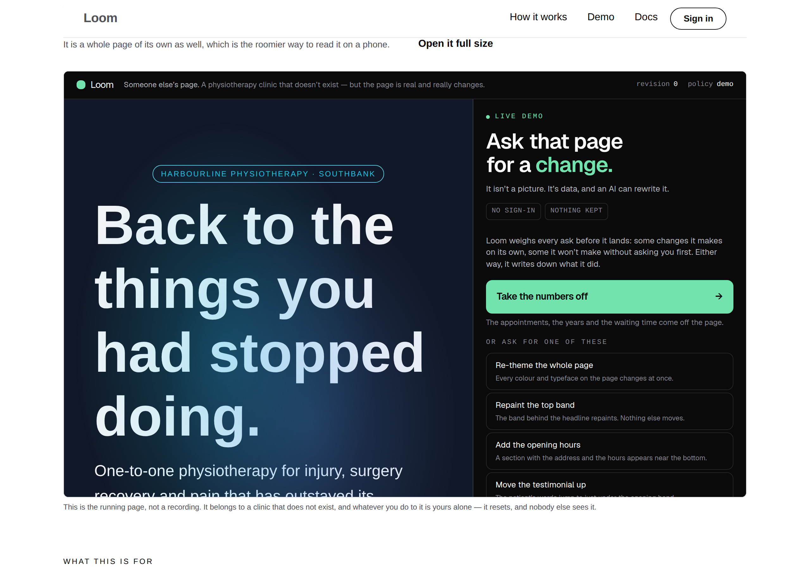

# 2026-09-27 — marketing: the origin a request arrived on

The maintainer sent a screenshot of the front door with the browser's
broken-document glyph where the framed demonstration should be, and the sentence
*"I keep seeing this error placeholder in the marketing site."*

**This lane had filed that exact symptom eight hours earlier and filed it
wrong** — as the screenshot harness's, owned by `Loom daily build`, with the
status *"nothing is wrong with the site and nothing is wrong on a deployment."*
That entry merged to `main` in #411. This branch is the fix and the correction.

| the band on a preview | the band after this |
| --- | --- |
|  |  |

---

## The cause

`siteOrigin()` answers **where does this page live**, from the environment. A
frame needs **where did this request arrive**. On a preview deployment those
are two different hosts:

| | |
| --- | --- |
| `VERCEL_URL`, so `siteOrigin()` | `loom-9kd3jf-….vercel.app` — the deployment-unique host |
| what the reader is on | `loom-git-<branch>-….vercel.app` — the branch alias |

So the frame's absolute `src` is cross-origin. A preview sits behind Vercel's
deployment protection, the framed request arrives without the reader's cookie,
and it is answered with a sign-in page that refuses to be framed.

**Reproduced** by serving a production build with `VERCEL_URL` pointed at a host
the browser was not on:

```
iframe src="https://loom-9kd3jf-jpizzolato36-6341s-projects.vercel.app/demo"
```

served to a browser at `localhost:3100` — the maintainer's screenshot, made on
this machine.

## Why the wrong reading was the comfortable one

Worth the words, because it was not carelessness and it will recur.

- The symptom was **first met through a local tool.** `pnpm shoot --serve`
  starts on an ephemeral port, so the second host was a dead port rather than a
  protected preview. *My tooling is wrong* is a smaller and more familiar story
  than *the site is wrong*, and it fit every fact in hand.
- It was **confirmed by a fix that worked.** Serving on port 3000 by hand made
  the frame render. That proves the **mechanism** — the frame's host must match
  the page's — and it was read as proving the **diagnosis**. The mechanism holds
  on any host, Vercel's included, which is exactly why the confirmation felt
  conclusive and settled nothing.
- **No instrument disagreed.** The shot exits 0, `scrollWidth` equals
  `innerWidth`, the tree is right, the seam resolves the frame as `self`, and
  the frame-origin allowlist cannot fire — the registry and the `src` are both
  built from `siteOrigin()`, so they agree with each other and are both wrong
  about the reader. The only thing that reports this is a person looking at the
  page, which is the same blind spot the band work in #411 was about, arriving
  twice in one day.

The generalisation, filed for the other surface lanes: **an environment a
routine develops in is not the environment the maintainer looks at.** A laptop
and a pinned production domain both make these two origins equal. Only a
preview separates them, and a preview is the only thing anybody reviews.

## The fix

**The tree's addresses follow the browser; the document's declared identity
stays pinned.**

| | answers | reads | used by |
| --- | --- | --- | --- |
| `servedOrigin()` | where did this request arrive | `x-forwarded-host`, `x-forwarded-proto` | the three page renders |
| `siteOrigin()` | where does this page live | `LOOM_SITE_ORIGIN`, `VERCEL_URL` | canonical, sitemap, share image, the graph |

A canonical link announcing itself under whichever host a reader happened to
reach it by would be a page telling a crawler there are three of it, so the
declared identity keeps the pinned answer. Everything the browser is going to
**re-fetch** takes the other one.

| file | what it is |
| --- | --- |
| `_lib/site.ts` | `originFromHost(host, proto)` — pure, takes strings, no `next/headers` |
| `_lib/serving.ts` | `servedOrigin()` — the header read, on its own side of that line |
| the three page routes | `renderSitePage({ origin: await servedOrigin() })`; `generateMetadata` and `StructuredData` unchanged |
| `_lib/served-origin.test.ts` | 18 cases |

**Two modules rather than one**, because `site.ts` is a pure function of an
environment object read by tests, by the sitemap, by `llms.txt` and by tooling.
Importing `next/headers` into it would make every one of those request-scoped.

### The part that is a security surface

A `Host` header is attacker-controlled on a deployment that does not pin one,
and what it reaches here is an address the visitor's own page tells their
browser to load. So the authority is **parsed rather than interpolated**:
anything that does not come back as a bare authority — a path, credentials, a
second scheme, a space, a backslash — is refused and the caller falls back to
the environment. Eight of the eighteen cases are that list. On Vercel it never
fires: the platform sets `x-forwarded-host` itself and does not pass a
client's through.

`x-forwarded-proto` is preferred over a guess, and the guess is `http` only for
loopback authorities — `next start` on a laptop sets no proto, and assuming
`https` there would aim the frame at a port serving plain HTTP, which is the
harness half of this bug spelled backwards.

### It closes the harness half, which is the evidence it is one bug

`pnpm shoot --serve` sets the `Host` header to its own ephemeral origin, so the
frame follows it and renders live. The picture at the top right of this report
is the band photographed through the harness that had never once shown it.
**No change was needed in `tools/screenshot/`, and the finding asking for one
is withdrawn.**

---

## What went to `main` wrong, and what this does about it

#411 merged at 15:55 while this fix was still being written, so `main` carries
two statements this lane now knows to be false:

| where | what it says | what this branch does |
| --- | --- | --- |
| `FINDINGS.md`, the 27 September harness entry | owned by `Loom daily build`; *"nothing is wrong on a deployment"* | **status corrected in place, body kept**, and a full entry appended |
| `reports/…-a-band-that-faces-its-answer.md` | *"Not fixed here, because it is the harness's"* | **a dated correction banner above the section, the section kept** |

**Kept rather than deleted, in both places.** `docs/routines.md` sets the
precedent with its own superseded *Commit identity* section — *"what a section
got wrong is worth reading once"* — and `reports/` has a standing rule against
overwriting. A wrong conclusion whose observations were all correct is the most
instructive kind, and erasing it would leave the next run to make it again.

---

## Tests

`pnpm verify` — **exit 0**, read out of a file written as the last thing on its
own line, on a `.next` and a `dist` deleted first.

| | |
| --- | --- |
| runtime | **3,216 passed** in 165 files — untouched |
| application | **5,425 passed** in 312 files — **18 added** |
| findings | **843**, 0 malformed |
| prerender | 114 pages, 1,300 junctions, 0 run together, 0 unserved |

Verified on the served build under a deliberately misleading `VERCEL_URL`: the
frame resolved to `http://localhost:3100/demo` while the canonical link and
every `url` in the structured-data graph stayed on
`https://loom-9kd3jf-….vercel.app`. That pair is the whole change in one
observation.

**What is still unverified, and it is the one that matters.** `*.vercel.app` is
outside this sandbox's egress allowlist, so the fix has not been loaded on a
real preview from here. Everything above is a local reproduction of the
mechanism plus a reading of how Vercel's hosts and deployment protection
interact. **If the band still shows a grey box on the preview of this pull
request, the diagnosis is still incomplete** — that is said on the pull request
as well as here, because this lane has already been confidently wrong about
this symptom once today.

## Findings

**One corrected, one filed and closed.** The harness entry is marked wrong and
kept; the entry that replaces it carries the real cause, the three reasons the
wrong reading was the comfortable one, and the question for the other surfaces:
*anything you render as an absolute same-origin URL that the browser re-fetches
has this on previews today.*
