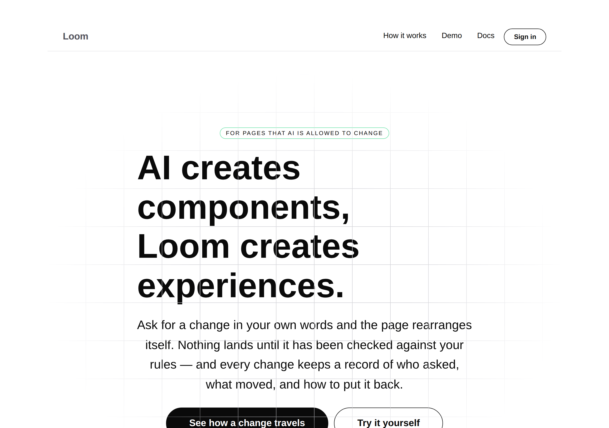
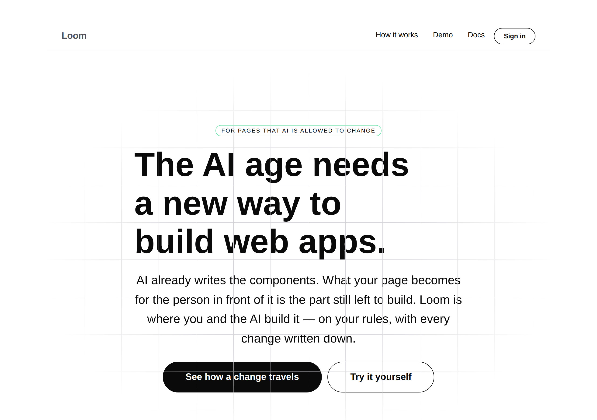
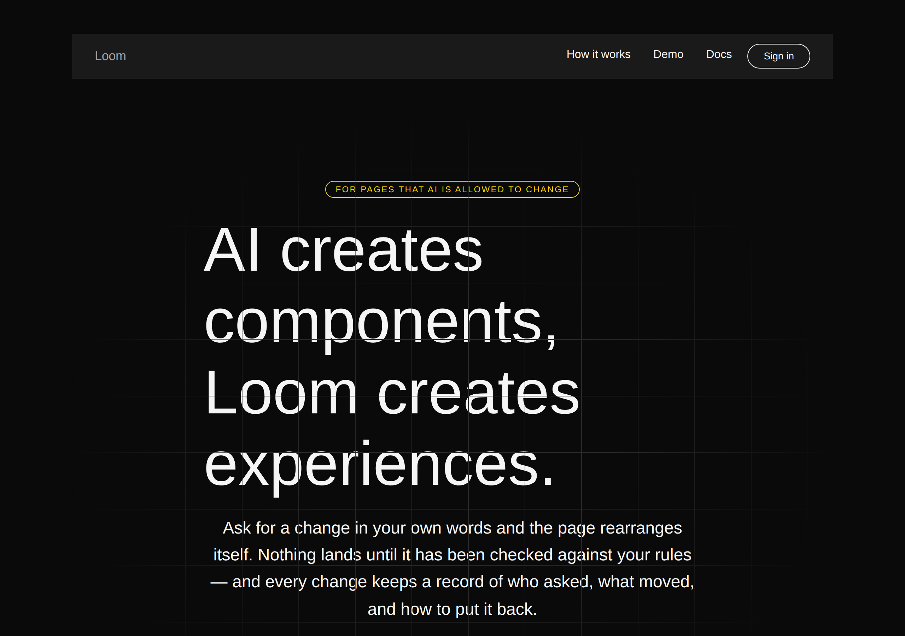
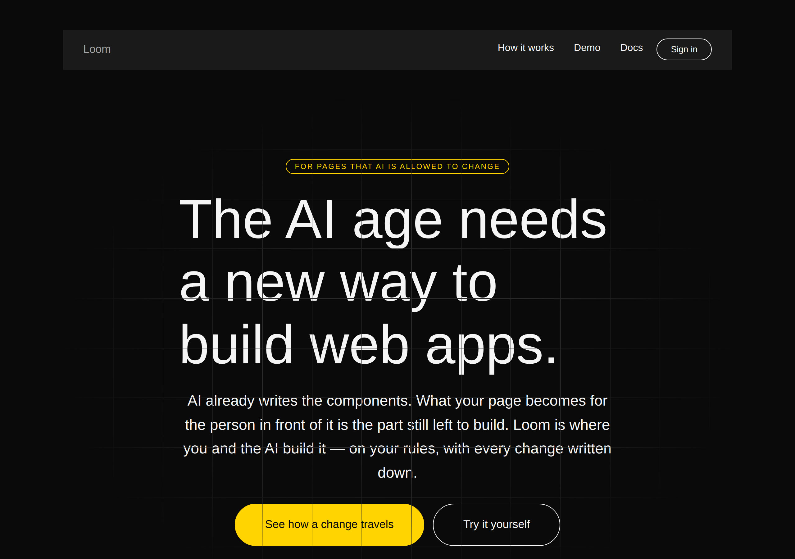
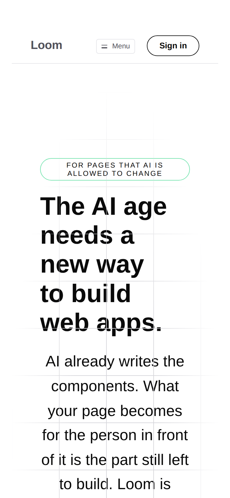

# 2026-09-27 — marketing: the reimagining

The maintainer's verdict on the front door's headline: *"I am not sold on the
hero text. I don't think it grabs you correctly."* His direction was to frame
the page as **we need to reimagine how we build web apps in the AI age**, and
then to explain why — *AI builds components now, you with AI need to build the
experience.*

| 1280, `minimal` | |
| --- | --- |
| before |  |
| after |  |

---

## What changed, and what did not

**One heading and one paragraph. Nothing else on the site moved.**

| | before | after |
| --- | --- | --- |
| H1 | *AI creates components, Loom creates experiences.* | *The AI age needs a new way to build web apps.* |
| lead | *Ask for a change in your own words and the page rearranges itself…* | *AI already writes the components. What your page becomes for the person in front of it is the part still left to build. Loom is where you and the AI build it — on your rules, with every change written down.* |

**The line that came off the headline is not gone — it is the first two
sentences of the paragraph.** That is the whole of the maintainer's direction:
the 21 August headline was the *conclusion* of an argument, and it was being
shown to people who had not been given the argument. A stranger met a contrast
between *components* and *experiences* before they had any reason to care about
either word. The reimagining goes first; the components line becomes the reason
to believe it.

### Why the paragraph is in that order

Three sentences, and the order is the argument:

1. **"AI already writes the components."** Five words, and it *concedes* what
   the reader already believes. An opening that argues with what somebody knows
   spends its credit before it has any.
2. **What that leaves**, in their terms rather than ours — *what your page
   becomes for the person in front of it*. No product noun in it.
3. **Only now, Loom**, carrying the two facts the rest of the page is about:
   the rules and the record.

## The one thing photography changed

The first draft set the second sentence's subject off with a pair of em-dashes —
*The experience — what your page becomes for the person in front of it — is the
part still left to build.* It reads fine ranged left. This band is
`align: "center"`, so **both edges are ragged**, and an interruption inside a
centred sentence costs the reader the thread exactly where the argument turns.
It also pushed the paragraph to **five lines** under a three-line headline.

Rewritten without the interruption it is four lines and reads straight through.
The surviving em-dash is at the end, where it introduces the two facts rather
than splitting a clause. This is not something a test could have said; it is
visible only in the photograph, which is the same lesson as [the band work
earlier today](2026-09-27-marketing-a-band-that-faces-its-answer.md).

### Both palettes, and the phone

| `bold` | |
| --- | --- |
| before |  |
| after |  |

**The phone is unchanged in shape and it is worth saying why that is not luck.**

| 390 | before | after |
| --- | --- | --- |
| headline | 5 lines | 5 lines |
| lead runs past the fold | yes | yes |

The new headline is ten short words where the old was six long ones, so it wraps
to the same height. Both leads run past the fold on a 390 screen, which is a
property of a centred lead paragraph in a `tall` hero and was true before this
change. **It is not made worse here and it is not fixed here** — fixing it is a
question about the hero band rather than about the words, and nobody asked for
it.

## What the copy had to clear

None of this is style preference; all four are asserted.

| rule | where |
| --- | --- |
| no reserved vocabulary anywhere on the front door | `voice.test.ts` — *component* is not on the list, *primitive* is |
| every opening sentence ≤ 30 words | `voice.test.ts`, swept over every route's hero |
| *your page* and *your rules* both present | `voice.test.ts` — the one habit from the maintainer's reference a test can hold; both are now in the hero itself |
| US spelling, no pricing language | `voice.test.ts` |

No contraction, on the house style every other line of this site follows.

## What was not touched, deliberately

**The eyebrow still reads *For pages that AI is allowed to change*,** and it is
the open question in the pull request rather than a change made here. Above a
product claim it qualified the claim sensibly. Above a manifesto it reads as a
hedge — a narrow disclaimer in small type directly over a broad statement, which
is the shape that takes the air out of an opening. **Positioning is the
maintainer's**, he said nothing about the eyebrow, and a routine that rewrote it
on its own initiative would be inventing the voice it was told not to invent.
Three alternatives are offered on the pull request.

`HOME.description` — the search snippet and the text an assistant quotes — still
leads with *Ask for a change in your own words*. Left alone on purpose: a meta
description should be concrete about what the thing does, and the headline is
where the framing belongs. Flagged rather than changed, same reason.

---

## Tests

`pnpm verify` — **exit 0**, read out of a file written as the last thing on its
own line, on a `.next` and a `dist` deleted first.

| | |
| --- | --- |
| runtime | **3,216 passed** in 165 files — untouched |
| application | **5,448 passed** in 314 files |
| findings | **849**, 0 malformed |
| prerender | 114 pages, 1,302 junctions, 0 run together, 0 unserved |
| overflow | 1280 and 390, both palettes: `scrollWidth` equals `innerWidth` |

**No test was added**, and that is a deliberate answer rather than an omission.
Every rule this copy has to satisfy is already swept over every route — the
vocabulary, the sentence ceiling, the reader-in-the-sentence habit, the spelling
and the pricing silence all fired against the new words without being touched. A
test asserting *the headline is this string* would hold the site to one person's
sentence rather than to a property, and positioning is the one thing here that is
meant to change when the maintainer says so.

## Findings

None filed and none closed.

## Open

- **The eyebrow**, above — the recommendation and two alternatives are on the
  pull request.
- **The `publisher`** in the structured-data graph, unchanged from 26 September
  and still the maintainer's.
