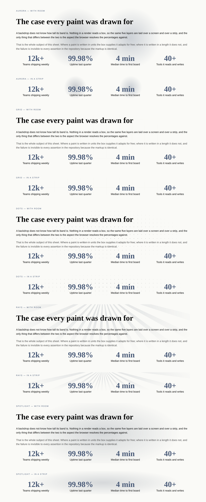
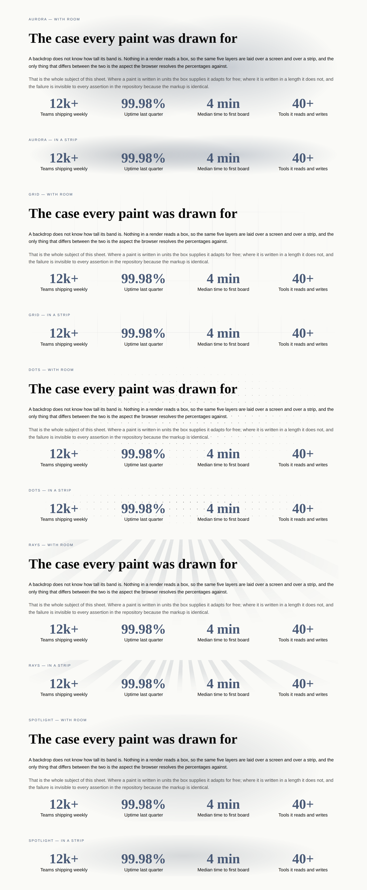
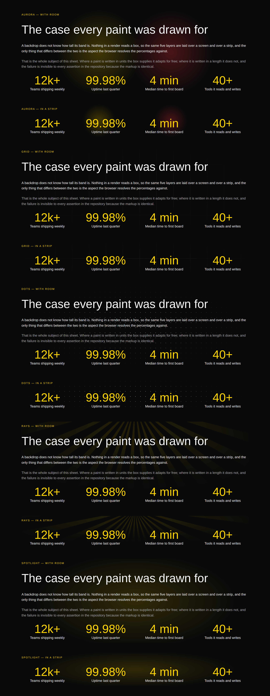
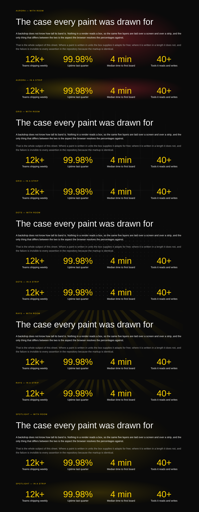

# A box that does not know its own size — the paints that could not read their band, and the figure that could not read its column

**Routine:** `Loom primitives` · **Date:** 2026-09-27 · **Branch:**
`primitives-47-a-paint-needs-area` · **Section:** §4b

## What this run chose, and why that

**The oldest open item this lane owns, and it asked for exactly this run.**

`FINDINGS.md`'s 20 September entry — *a paint needs area: every `loom.backdrop`
paint is unusable in a short band* — closes with three candidate answers in
order and the sentence *"it wants its own run and its own contact sheet."* No
run had given it one in seven days. It was picked over the breadth queue for a
reason the brief states and the gap inventory measures: the honest ceiling on
distinct primitives is 110–120, the library is at 98, and
`docs/primitive-gap-inventory.md`'s own recommendation is **hold the vocabulary
and spend the week on what a page looks like.** Atmosphere is the one thing in
this library whose entire job is *"when we demo this it really needs to pop"*,
and five paints had been filed as unusable in a fifth of the bands.

Nothing else was opened. The `copy` request that three portal reports have made
is **answered** rather than built, in `FINDINGS.md` and below.

## The instrument, which is most of the contribution

The 20 September entry is five rows of prose — *"a grey smear"*, *"the one
near-miss"*, *"nothing at all"* — and prose cannot settle a question about how
much light is on a page. Two things were built before anything was changed.

**A contact sheet.** `atmosphere-needs-area.specimen.ts` puts every paint in a
band with room and then immediately in a strip with none: same content, same
width, same palette, adjacent, under both starter palettes. It is committed.

**A control, which this lane has not used before.** The same page rendered twice
— once with the paint, once with the **identical `loom.backdrop` wrapper
painting nothing** — so that a pixel diff is the paint and nothing else. Not the
page without the wrapper: the wrapper creates a stacking context and clips, and
a control that differs in those is measuring two things. The blank control is
three lines and a rebuild and is deliberately not committed; the method is in
[0196](../decisions/0196-a-paint-is-sized-by-the-box-it-is-given-and-says-so-when-it-cannot-be.md)
so the next run reproduces it rather than re-derives it.

The metric is **ink per unit area** — coverage times mean per-channel delta —
because coverage alone is not comparable across paints: a lattice of one-pixel
points can never cover more than a third of one per cent of a band, and a pool
of light covers half of it.

## What the measurement said, and it is not what the finding said

Under `editorial` at 1280 wide, a 468-pixel band against a 135-pixel strip of
the same content:

| paint | with room | in a strip | kept | verdict |
| --- | --- | --- | --- | --- |
| `aurora` | 6.0 | 1.8 | **30%** | sized by a *side* of its box |
| `spotlight` | 6.7 | 5.9 | 88% | already written in the box's units |
| `rays` | 2.0 | 1.9 | 93% | the right amount of ink in the wrong shape |
| `dots` | 0.35 | 0.57 | — | quiet at **every** height |
| `grid` | 0.25 | 0.43 | — | quiet at **every** height |

Two rows are not what a week of reading that entry would predict.

**`spotlight` barely moves.** Its pool is `ellipse 62% 78% at 50% 50%` —
percentages of the box — so it was already the answer, and it needed nothing.
That is the rule arriving as evidence rather than as an argument.

**`grid` and `dots` are an order of magnitude quieter than everything else, at
both heights and under both palettes.** They were not failing because the band
was short. They were failing everywhere, and a strip is simply where a band has
nothing else on it to look at. The finding's own title is half wrong, and the
entry is kept rather than rewritten because being wrong in a legible way is what
made it worth measuring.

## What changed, one per paint that needed something

### `aurora` — the third option nobody tried

`backdrop.ts` argued for `circle closest-side` on the grounds that *a circle
sized by the shorter side stays a glow at any aspect the band happens to have,
where an ellipse becomes the box.* The argument is sound and the choice it names
is not: the ellipse it rejects is the **default** one, `farthest-corner`, which
does become the box. **`ellipse closest-side` is a third thing** — an ellipse
inscribed in the field, reaching zero at all four sides and transparent well
before either corner — and it is what the rule was asking for.

| before — `main` | after |
| --- | --- |
|  |  |

The defect that picture shows is not dimness. A circle in a 736-by-170 field is
a circle with the field empty either side of it, so **the light was not even
where its anchor said it was** — two blobs in the middle of a band whose fields
are pinned to opposite corners. Ink went 1.8 → 9.9 in the strip.

It is **inert where the field is square**, which is a hero at any usual width:
1280 gives a 736-by-736 field and the two keywords compute the same radii.

### `rays` — an apex that was a fraction of the wrong dimension

A percentage in a conic gradient's position resolves against the element, so the
apex sat 160 pixels above a hero and 34 above a strip. An apex that close to a
band 1280 wide fans its beams out almost horizontally.

| before — `main` | after |
| --- | --- |
|  |  |

`-10rem` **is the hero's own value** — `-20%` of the 800-pixel band these beams
were drawn in — so the designed case is unchanged to the pixel and every shorter
band now gets the hero's fan instead of a flatter one. It read as a fault under
`bold` too, where there is chroma to spare, which is what says it was geometry
rather than palette.

### `grid` and `dots` — the limit is stated instead

A stride is a length. A band 170 pixels tall holds two rules of a five-rem grid,
and two rules are not a blueprint however much contrast they are given. Sizing
the stride to the band would make the blueprint a different blueprint at every
height, which is the one thing a ruled ground may not be — what it is *for* is a
stride a reader can count.

So `loom.backdrop`'s **description** now ends *"the grid and dots need a band a
few hundred pixels tall to read as a ground; the other three work at any
height"*. The description rather than a doc comment, because the description is
the whole of what a model is told at interpretation time. A doc comment reaches
nobody.

Their separate defect was fixed in the same pass. `grid` ruled in
`border-subtle`, which on `editorial` is `#efefe9` against a `#fafaf7` canvas —
**eleven values of one channel**, a blueprint nobody has ever seen. It takes
`border-default` now: the 26 September audit's rule arriving at its first case,
*a border beside a fill may be subtle; a border that is the whole mark takes
`border-default`.* The `dots` comment had said this about itself sixteen days
earlier and nobody had read it back onto its neighbour.

The ruled mask also grew a **core**. It was `black 0%, transparent <reach>` —
fully opaque at the centre pixel and nowhere else — so the strongest line a
blueprint ever drew was three quarters of its own colour. Over a text-free
thousand-pixel square, the grid's strongest line went **11 → 21**, which is its
token's full contrast against the canvas and the most a mask can honestly give
it. The lattice takes **no** core: its points already land at 88 values, and the
same change would take a texture that is *"legible but noisy"* over a band of
figures and make it noisier.

### `spotlight` — unchanged

Named here because it is the result rather than an omission.

## No sixth paint, and that is an answer

The 20 September entry's third option implied a member designed for a strip.
Three of the five work in one now, so a sixth would have had to be told apart at
a glance from `aurora`, `spotlight` and `rays` **in exactly the band where all
three are legible** — 0130's membership test failing before a line is written.
A paint that was a quieter aurora is 0052's shades-of-one mistake in the one
place this library has room for it.

## The second half, found in the same hour

The control group overflowed and the original did not. That one line of harness
output is two things.

**A figure that could not read its column.** A `loom.stat-grid` with `columns:
"four"` on a `canvas` section is 358 pixels at a 390 viewport, which `auto-fit`
splits into two columns of about 166. `"99.98%"` at `--loom-scale-7` in
`bold-sans` is about 185 and does not break, so the grid item's automatic
minimum size pushed its own track wide.

| before — `main`, `scrollWidth 401 / innerWidth 390` | after, `390 / 390` |
| --- | --- |
|  |  |

`.loom-stat` declares `container-type: inline-size` and `.loom-stat-value` takes
`min(var(--loom-scale-7), 26cqi)`. **One declaration does both jobs**, which is
why it is not a `min-width: 0` and a cap: an element with inline-size
containment contributes nothing of its contents to track sizing, so the track
stops blowing out, *and* `cqi` starts resolving against the column. `loom.heading`
names this exact hole in its own cap comment — *what is still not held back is a
heading in a bare grid cell* — and the answer is that the child declares the
containment for itself.

It is inert above a 215-pixel column. The whole-page sheet is **unchanged in
height** under both palettes at both viewports and **byte-identical** at 1280 on
`bold`.

**An instrument gap, filed.** A `loom.backdrop` clips, so the harness's overflow
measurement cannot see through it — the wrapped tree measured 390/390 and the
identical unwrapped tree measured 401/390. Four bands in the catalogue are
rooted in one. Filed for `Loom daily build` with three candidate fixes, smallest
first.

**Two accidents hid this defect**, and neither is a mistake anybody made:
`metricsBand` uses `tone: "surface"`, whose inline padding narrows the band
enough that `auto-fit` drops to **one** column where the figure fits; and the one
specimen that photographs a stat grid on a canvas band wrapped it in a backdrop.
The class is the one this lane has now met four times from four directions: **an
absence of a failure.**

## Which fields became nodes and which stayed props

Nothing here is either, and the row that says so is the point rather than a gap:

| | became a region or node | stayed a prop |
| --- | --- | --- |
| which paint a band wears | — | `paint` — five renderings, unchanged, no node changes when it does |
| how big the light is | — | **neither.** It is the box's, read by the browser from units the paint is written in |
| where the beams come from | — | **neither.** A constant in the stylesheet, not a tunable |
| how big a figure is | — | **neither.** The type ramp, capped by the column the stat is in |

**No prop was added, removed or changed in this run**, and that is the shape of
the answer rather than a coincidence. Every defect here was a value written
against something that was not the box, and the fix for each was to write it
against the box — which a prop cannot do, because a prop is a number somebody
predicted and a box is a number the browser knows. That is the granularity
document's sharper question asked in the one place it does not apply: *does
changing this change the set of nodes?* — no, and it should not be reachable at
all.

## The whole sheet, both palettes, before and after

| | before — `main` | after |
| --- | --- | --- |
| editorial |  |  |
| bold |  |  |

Ten bands each, at 1280, `scrollWidth 1280 / innerWidth 1280` on all four, no
diagnostics. The phone sheets measure 390 against 390.

## What is now checked, and where

**Seven new tests** in `library.test.ts`, and a **nine-row defect matrix**, each
defect restored in turn against a committed baseline of 346 passing:

| defect restored | caught |
| --- | --- |
| aurora masked by a circle again | 1 |
| rays' apex back to a fraction of the band | 1 |
| the blueprint ruled in `border-subtle` again | 1 |
| the grid's core removed | 1 |
| the lattice given a core to match | 1 |
| the stat stops being its own container | **0 → 1** |
| the figure's cap removed | 1 |
| the cap written without the ramp in it | 2 |
| the height limit dropped from the description | 1 |

**The row worth reading is the one that started at zero.** `expect(stylesheet)
.toContain("container-type: inline-size")` was green with the declaration
deleted from `.loom-stat`, because **eleven other rules in that stylesheet
declare it.** The assertion now reads the declaration out of `.loom-stat`'s own
block. It was caught by restoring the defect and could not have been caught by
reading the test, which is the whole argument for running a matrix rather than
counting assertions.

The two others worth naming: **the aurora test asserts the circle is *nowhere***,
because a run that read the original comment and believed it would "restore" a
defensible-looking value and leave every other assertion green; and **the
lattice's missing core is asserted as well as the grid's core**, because the
asymmetry is the claim and a test written only about the grid would pass a run
that unified them.

**No test was weakened, none skipped, none deleted.**

## Checks

- `pnpm install && pnpm verify` **green, exit 0**, read off a file rather than a
  pipe, with the status taken from the gate itself.
- Framework **165 files / 3,207 tests**; application **310 files / 5,381 tests**;
  **835** findings, 0 malformed; 112 prerendered pages, 1,300 text junctions, 0
  run together.
- **No literal colour anywhere in the diff.** The two hex values that explain why
  `border-subtle` is invisible on `editorial` are in the finding and the record,
  not in the library, for the reason the 26 September run recorded: a hex literal
  inside the library stylesheet is indistinguishable from a hardcoded colour to
  the test that forbids one.
- **`pnpm decisions:index` regenerated.** It exits 0 with notes for numbers
  claimed on unmerged branches, which is
  [0097](../decisions/0097-a-hole-in-the-numbering-is-reported-and-a-clash-is-fatal.md)'s
  expected behaviour. 0196 is this branch's and does not clash.
- **Committed before the defect matrix was run**, which is the 26 September
  report's own lesson: a matrix restores with `git checkout`, and work that is
  not committed is not in it.
- **Nothing outside `src/primitives/`** except `decisions/`, `FINDINGS.md` and
  this report. `apps/` was not opened.

## What was filed

- **A `loom.backdrop` clips, so a band inside one is invisible to the overflow
  measurement** — for `Loom daily build`, with the two-line measurement that
  proves it and three candidate fixes.
- **The stat figure defect**, filed and closed in the same entry, because the
  reason *nothing saw it* is the part a future run needs.

## What was closed

- **The 20 September `a paint needs area` entry**, with all three of its
  questions answered one each rather than one of them chosen, and a note that
  its own title is half wrong.
- **The 26 September `copy` request**, answered rather than built — see below.

## The `copy` request, answered

Three portal reports asked for `copy` on `loom.action`, `loom.button` and
`loom.link`; the 26 September entry filed it and said the sizing was this lane's.
It is: **no**, and the premise is the part worth correcting.

*"The one thing a reviewer most wants to change — what it says — is the one
thing a change has to restructure the tree to reach."* It does not. The label is
a `text` **node**, so rewording it is a `configure` **on that node**: the
analysis reports a change to that string alone, the inverse restores that string
alone, and it is attributable. A `copy` prop would make it a `configure` on the
*action*, replacing the whole prop bag — strictly **less** addressable. These
three are the most reachable text in the library, not the least. It is
[0059](../decisions/0059-a-leaf-whose-whole-content-is-one-string-takes-it-as-a-child.md)
and 0052's third clause, and `loom.badge`'s header already names the consequence
of breaking it.

**The cost the portal is feeling is real and has a different answer.**
Authoring a CTA is two nodes, and the granularity document's named remedy is
**starting compositions, not fat primitives**: `insert` carries a subtree, so an
action with its words in it is one reviewable operation. So the open item is not
a prop — it is that the portal has no compositions of its own. Three-line
`Composition` entries would give it the one-operation CTA with the tree
unchanged. **This lane will build them on request**, and would rather the asking
lane named the three it wants than guessed at them.

## What the library still cannot express

**Unchanged by this run, and deliberately so.** Ten registered types remain
unreachable from the phrasebook — six waiting on an image source that is the
maintainer's decision, two belonging to a *site* rather than a landing page, one
to a bound region, one the page root.

What this run adds is a sharper version of the last report's closing note. The
remaining growth is not vocabulary and it is **not designs either, yet**: two
consecutive runs have now found that a band which looked thin was a *primitive*
drawing less than it claimed, and both were invisible to every assertion in the
repository. The instrument that finds them is a photograph with a control beside
it, and it costs one command and one rebuild.

**`21st.dev` re-verified blocked** from this lane's session: the proxy refuses
the CONNECT tunnel. Twenty-third consecutive check, never once reachable.
Re-verified rather than re-filed. The visual standard for this run was
`loom.hero`, `loom.feature-grid`, and the whole-page sheet beside this file.
