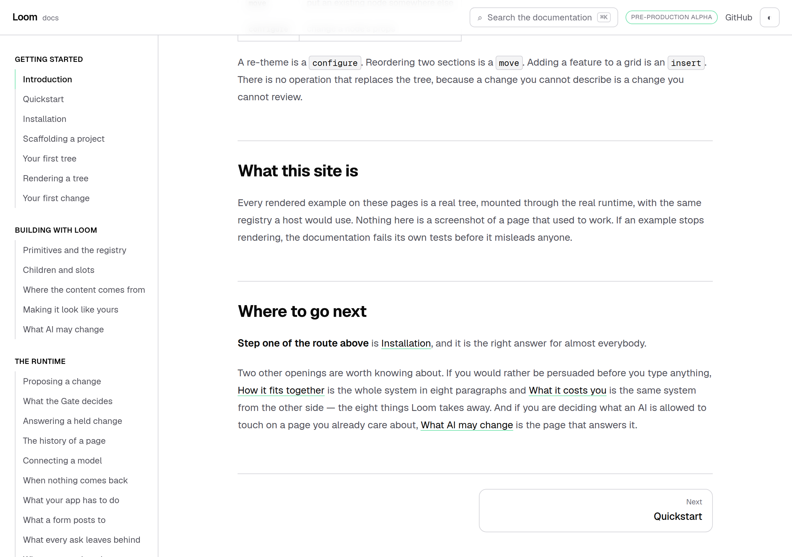
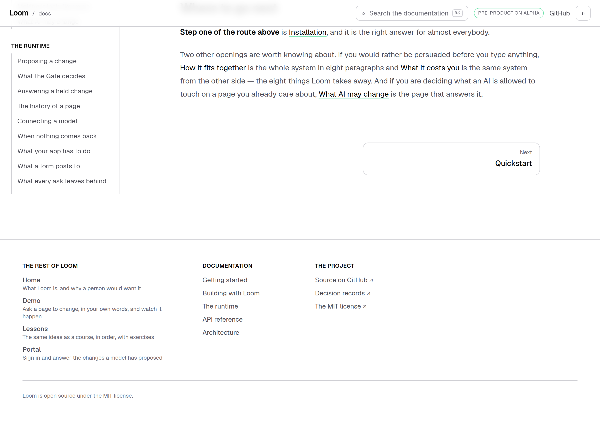
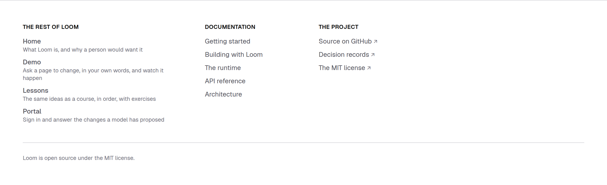
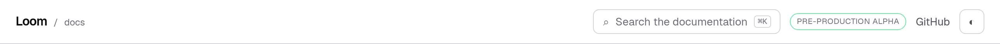
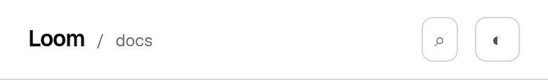
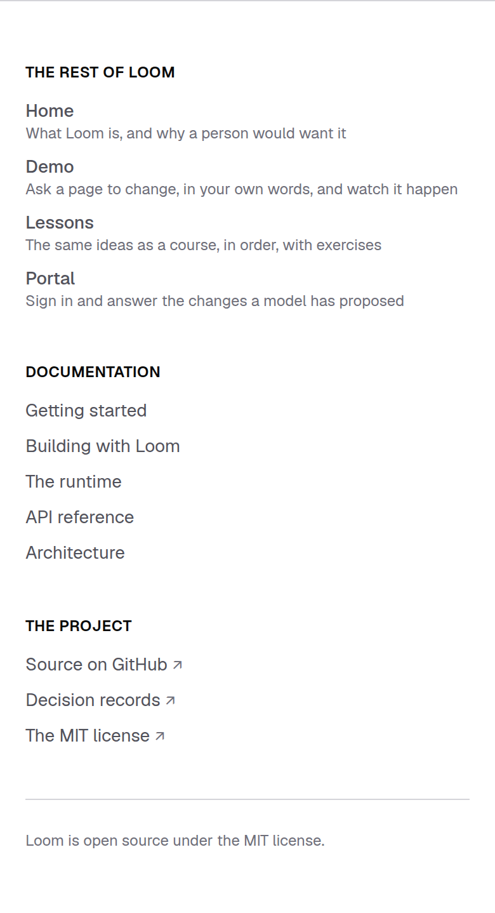

# 28 September 2026 — a way back to the front door

**Routine:** `Loom docs` · **Branch:** `docs-39-a-way-back-to-the-front-door` ·
**Section:** §4c

## What this run was

The oldest open thing this lane owned, and the only one that has survived six
consecutive reports' *what I would write next*. It was filed on 24 September by
`Loom marketing`, which found it the only way it could be found — by standing at
the front door and walking through:

| route group | links to `/` |
| --- | --- |
| `(portal)` | 1 |
| `(docs)` | **0** |
| `(demo)` | **0** |
| `(lessons)` | **0** |

The marketing site carries the way *in* four times over. There was no way back.
A visitor who followed *Docs* was, from that moment, in an application whose
front door could only be reached by editing the address bar.

That entry deliberately made no recommendation. It asked each of the three
surfaces to **decide**, rather than inherit *no way back* from a migration that
never intended it. This is this surface's decision.

*On `main`: the page ends at the pager and that is all there is. Nothing on the
screen leaves the documentation.*

*On this branch: the same scroll position, and the page now has a foot.*

## The plain version

Two things, and they answer two different readers.

**A footer, which this site did not have at all.** A reader who has finished a
page is at the bottom of it. That is where a way onward belongs, and it is where
every reference site a reader has ever used puts one. Four rows name the front
door and the three other surfaces, each with a clause saying what is there,
because *Portal* is a word this project made up and somebody four pages into the
documentation has no reason to know it means the screen where proposals are
answered.

**The wordmark is two links rather than one.** That is the part the finding
expected an argument about, and the argument turned out to be a false choice.

## The wordmark, and why the obvious answers are both wrong

The header's own comment had been carrying this question since the migration,
and it was right to refuse to answer it:

> `/docs`, not `/`. This wordmark went to the first page of the documentation
> when the docs were their own application and `/` was their redirect; `/` is
> the marketing site's now (0070), so the same href would quietly have turned
> "back to the docs" into "leave the docs". **Whether the wordmark should offer
> the front door instead is this surface's call, not the migration's.**

Both readings are real:

| pointing it at | gains | loses |
| --- | --- | --- |
| `/docs` — as it was | *back to the docs*, which is what a reference site's mark means to a reader who is lost inside one | the front door. This is the finding |
| `/` — the convention everywhere else | *back to the project* | *back to the docs*, quietly, which is the reason the migration declined |

**The mark was already two words.** `Loom` is the project and `docs` is this
site, set beside each other since the header was written, and nothing but habit
had made them one link. So each word gets the destination it already reads as,
with a slash between them — the separator every breadcrumb uses, hidden from a
screen reader, which hears two links and no punctuation.

| before | after |
| --- | --- |
|  |  |

It costs no width, which matters more than it sounds: the header is the one
piece of chrome present at every viewport, and on a phone it holds the search
box as well.

Both halves take a **full-height hit area** rather than the height of their own
text. `docs` is set at twelve pixels, and a twelve-pixel tap target in the corner
of a phone is a link only a mouse can use.

## The rule the list is written under

`_lib/surfaces.ts` knows a surface by **its front door and nothing else**. Not
that the portal has a history page, not that the course has eleven lessons — one
path each, one segment long.

A path into another lane's interior is a link that breaks the day that lane
reorganises, and **no test on this side could see it break**. The same
conclusion is already written from the other side, in
`(marketing)/_lib/chrome.ts`: *"Neither knows anything about another route group
beyond its front-door path."* Two surfaces reaching it independently is why it is
restated here rather than shared — sharing it would be one lane importing
another's module, which is the coupling the rule exists to prevent.

`surfaces.test.ts` holds the list to it: a path with two segments in it fails.

## The list is derived from the application, not from a memory of it

A footer naming four places is a way back only for as long as those four are the
places. So the test does not read `surfaces.ts` for its expected value at all:

1. read `apps/loom/app/` and take every `(…)` route group;
2. walk each one for its static routes, ignoring private directories and
   dynamic segments, neither of which is an address anybody can be sent to;
3. the shortest is that group's front door;
4. assert that set, minus this one, is exactly the list.

A **sixth route group** added tomorrow is a red test rather than a surface
nobody can reach from here. A front door that moves is the same.

This is the one thing worth taking from the run, because it is the answer to a
class this ledger has now recorded three times in two days, and it is filed as
such. The obvious test — *the footer offers every surface in `OTHER_SURFACES`* —
is **blind to the fault that matters**: delete the demo from the list and the
footer stops offering it and that test still passes, because both sides moved
together. Measured rather than reasoned; the mutation table below is where it
was measured.

The generalisation is narrower and more useful than *do not derive the
expectation from the code under test*, which is often impossible. It is: **where
a list mirrors something the repository already contains, the test reads the
original and not the mirror.** Three tests on this surface already had that shape
without anyone having written the sentence down.

## At 390 pixels

`scrollWidth 390 / innerWidth 390`, on every shot, before and after. The columns
stack; the header keeps two tap targets and the search box.

| the header | the footer |
| --- | --- |
|  |  |

## Decisions taken that were not specified

**No decision record.** 0067 made the surfaces one application and 0070 put the
front door at `/`; this is §4c doing what the 24 September entry asked of it.
Nothing here constrains another route group and no Accepted record is touched.

**The footer is markup, not a tree.** The marketing site's footer *is* a
`loom.footer` holding `loom.link-list`s, and that is right for a page whose whole
claim is that the page is data. It is wrong here on two counts: chrome is what
0067 exempts from being composed out of registered primitives, and a model has no
business proposing a change to the chrome of a reference site. A tree rebuilt on
114 prerendered pages for a result that never differs is the other half.

**It does not repeat the front door's map.** No *what Loom is* band, no palette
switcher, no counting disclosure. The marketing footer carries the whole map
because that surface's job is to say what is where; this one carries the way out
and the sections, which is what somebody at the bottom of a documentation page
wants.

**The licence sentence got a test rather than a comment.** It is the only thing
either footer says that is a claim about a **file** in this repository, and the
one a reader could act on without reading a page. `surfaces.test.ts` reads
`LICENSE` at the repository root now.

**The `GitHub` link in the header stopped being a literal.** It and the footer's
row are the same URL, and two copies of an address is a thing that drifts. One
line, in this lane's own file.

## Tests

`pnpm install && pnpm verify` at the repository root: **green, exit 0**, read out
of a file written as the last thing on its own line, on a `dist` and a `.next`
deleted first.

| | `main` at `809a970` | this branch |
| --- | --- | --- |
| `@jam-overture/loom` | 166 files / 3,238 tests | **166 / 3,238** — `src/` was not opened |
| `@loom/app` | 320 / 5,560 | **323 / 5,577** |
| findings ledger | 861 entries, 0 malformed | **863**, 0 malformed |
| prerender | 114 pages, 1,304 junctions, 0 run together | **114 / 1,304**, 0 run together, 0 unserved |

**+17 tests in three new files**, none weakened, none skipped.

Green is not evidence, so **seven mutations** were introduced one at a time,
files restored from byte-for-byte copies and `diff` clean on all seven
afterwards:

| what was broken | tests that went red |
| --- | --- |
| both halves of the wordmark point at `/docs` | 2 |
| the separator between them is announced to a screen reader | 1 |
| the demo is dropped from the surface list | **1** |
| the portal is named by an inside page (`/portal/sign-in`) | 2 |
| the footer's way-back column is removed | 3 |
| the footer lists only the first two sections | 1 |
| a surface is named without saying what it is | 1 |

Nothing survived. **The third row is the interesting one and it is why the
finding above is filed**: dropping a surface from the list killed exactly *one*
test, and it was not the footer's. The footer's own test reads the same list, so
it moved with it and stayed green. What caught it was the test that reads the
directory tree.

## Scope

`apps/loom/app/(docs)/` only, plus `FINDINGS.md`, this report and its images.
Seven files: six new (`_lib/surfaces.ts`, `_lib/surfaces.test.ts`,
`_components/wordmark.tsx`, `_components/wordmark.test.tsx`,
`_components/site-footer.tsx`, `_components/site-footer.test.tsx`) and one
touched (`layout.tsx`).

**No file in another lane was opened.** `git diff origin/main -- src/` is empty,
and so is the same diff against every other route group.

No open pull request of this lane's existed at the start of the run, so this is
a fresh branch off `main` rather than a push onto one.

## Findings

**Advanced, not closed — one.** The 24 September front-door entry. It is owned
by three lanes and one of them has now answered; `(demo)` and `(lessons)` still
link to `/` zero times, and no test on this surface can see that or should try.
The entry carries a dated note saying what was decided here and why.

**Filed — two:**

- **A test derived from the list it checks cannot see the list shrink**, with
  the remedy the mutation run demonstrated: read the original, not the mirror.
  Owned here. The open part is that nothing enforces it, so the next test
  written against `OTHER_SURFACES` alone will be green and will look right.
- **Two surfaces now state the licence in prose and only one reads the file.**
  Owned by `Loom marketing`, one line of test, nothing wrong today.

**Not re-filed:** the preview URL cannot be verified from this sandbox
(15 September); the screenshot harness photographs an address while the theme
lives in `localStorage`, so the pictures are light (14–16 September); the phone
heading break on an entry-point page (23 September).

## What I would write next

- **`@jam-overture/loom-primitives/compositions`.** The published package has a
  second subpath — 44 starting compositions, `PAGE_SEQUENCE`,
  `compositionsForPart` — and this site does not mention it anywhere. A reader
  learning the vocabulary from these pages does not learn that whole bands
  exist. It is now the oldest open thing here.
- **The `<wbr/>` at each slash in the entry-point heading**, so the four longest
  doors stop breaking mid-word on a phone.
- **A `tone: "surface"` audit of this site's four bands**, against the finding
  `Loom marketing` filed this morning: on `minimal`, that tone draws a fill the
  same colour as the page with no edge around it, so four bands here are stepped
  in for a reason a reader cannot see.
