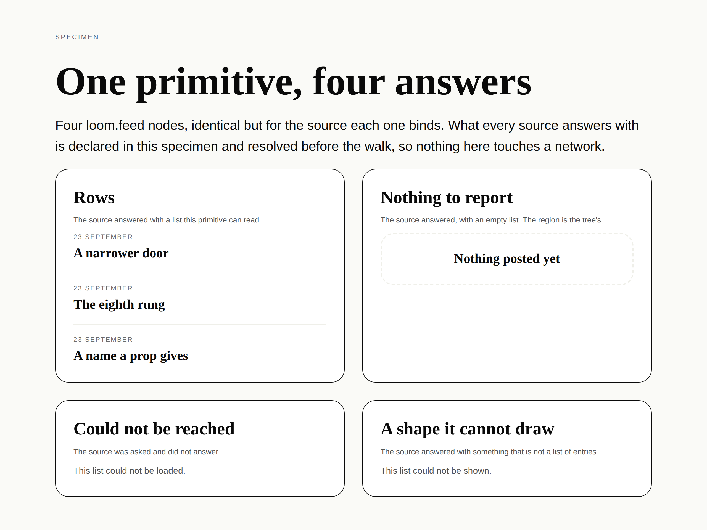

# The keys the runtime puts there — a props floor that refused its own namespace

**Routine:** `Loom daily build` (framework, `src/` except `src/primitives/`, and the application shell)
**Date:** 2026-09-28
**Section:** §2 (the Gate)
**Branch:** `framework-58-the-keys-the-runtime-puts-there` — branched off `origin/main` at `657d27e`; this lane had no open pull request of its own
**Record added:** `decisions/0203-a-props-vocabulary-is-handed-the-props-a-primitive-is-handed.md`
**Finding closed:** *the write path refuses every node the runtime's own reserved keys are on, and the render path does not* — `Loom lessons`, 28 September
**Finding filed:** *an unrecognised `loom:` key is now only a render diagnostic, and catching it at the write path is a four-lane change*

**Every node in that picture is one the Gate would not let anybody write.** It is
`tools/specimen/answers.specimen.ts`, unmodified, photographed through the render
seam at 1280 × 900. Four `loom.feed` nodes, each carrying a `loom:data` binding,
and the render path draws all four — rows, an empty region, and the two sentences
for an answer it could not read. On a deployment with 0179's props floor wired,
inserting any one of them came back `invalid-props`, **critical**, and was
refused. That is the whole of the defect in one frame: the seam that decides
whether a change may be written disagreed with the seam that decides what a
reader sees, about a page that renders perfectly.

## The migration is done, and this run did not touch it

Checked first, because three routines are waiting on the answer and a fresh
session has no memory of it. **`apps/loom` exists with all five route groups**,
`apps/` holds exactly one package, and there is no `apps/portal` or `apps/docs`.
Nothing is half-migrated, this run added nothing to it, and the tree crosses this
run boundary in one piece.

## What was completed

`Loom lessons` filed on 28 September, having found it by *executing* exercise D
of lesson 30 rather than by reading anything: a `loom.feed` carrying a correctly
spelled binding, to a registered source, with params its schema accepts, was
`invalid props: 1`, critical, and the Gate rejected it. A node with nothing
whatever wrong with it.

The message named the cause. `Unrecognized key(s) in object: 'loom:data'`.

Two seams answer *are these props acceptable*, and they were answering about
different bags.

| | what it validates | result |
| --- | --- | --- |
| `renderElement` | the node's props with `loom:` keys split off | draws the page |
| `invalidPropsIn` | `current.props`, **as they are** | `invalid-props`, critical, refused |

`propsVocabularyFor` is a one-line adapter onto `registry.validateProps` — the
same strict schema the renderer uses. So the floor refused the key the runtime
itself put there, on both deployments here that wire it: the portal
(`portalPropsVocabulary`, with `settingsAreChecked` derived off it) and
marketing's adapt path (`SITE_PROPS_VOCABULARY`).

**`invalidPropsIn` now calls `partitionReservedProps`** — the function the render
walk calls, not a second one that agrees — and the contract is stated on the
`PropsVocabulary` type rather than left to each implementation.

Three things about the fix are worth more than the one line of it.

**The split went in the walk, not in the adapter.** One line in
`propsVocabularyFor` would have fixed both deployments in this repository. It
would also have left the seam able to break: the SDK explicitly invites a host to
write its own closure, and a hand-written one would still have been handed the
runtime's keys. The guarantee belongs where the walk is.

**The code had been arguing for the defect, on a false premise.**
`invalidPropsIn` carried a paragraph justifying the omission, resting on this:

> `partitionReservedProps` lives behind the render boundary and importing it here
> would make the write path depend on the renderer's internals to answer a
> question about a tree.

It does not. It lives in `src/reserved-props.ts`, beside `json.ts`, and moved
there precisely because a reserved key is a property of a node's props rather
than of rendering. The comment was reasoning about an older shape of the tree and
nothing re-read it when the module moved. That is the part I would not have found
by reading the finding alone, and it is why the record spends a paragraph on it.

**The tests derive their rows from the namespace rather than listing it.** Both
suites read `RESERVED_KEYS` off the exports of `reserved-props.ts`. A fifth key
grows the rows with it. The reason to insist is the defect's own history: this
survived because nothing ever compared the two seams over the whole namespace,
and a hand-written list of four is a test that stops comparing them the day a
fifth arrives.

## What I decided that the finding left open

The finding named two decisions and said it had no standing to take them. Both
are taken in 0203.

**Where the split lives** — in the shared module it was already in, called by
both seams. The finding proposed a new `withoutReservedProps`; that would have
been a third name for a function that exists, so the existing one is used.

**Whether a reserved key on the wrong node should still be refusable at the
write path** — **not here, and this is a deliberate narrowing rather than an
oversight.** It costs something real and I want to be plain about it: before
this, a node carrying `loom:nonesuch` was refused at the Gate, by accident, as
`invalid-props`, attributed to the primitive. It now passes and reaches the
reader as `reserved-prop-unrecognised` — which is where every deployment without
a props vocabulary has always met it, so nothing regressed against documented
behaviour, but a check that existed by accident is gone.

Catching it properly needs a stake factor of its own, because `invalid-props`'
English on two surfaces says *"it would set a part up in a way that part itself
refuses"* and the part is not the thing refusing. A new `StakeFactorCode` breaks
an exhaustive `Record<StakeFactorCode, string>` in
`apps/loom/app/(portal)/_lib/vocabulary.ts` and another in
`apps/loom/app/(marketing)/_lib/adapt/record.ts` — two other lanes' files. That
is a four-lane diff to catch a fault the renderer already reports by name, so it
is **filed with the two files named and a recommended sequencing**, not taken.

`loom:theme` on a non-root has a second obstacle beyond that cost, recorded
because it is not obvious: `invalidPropsIn` walks a *subtree* and cannot tell the
tree's root from an inserted subtree's root. *Is this node the root* is knowledge
`analyzeDelta` holds and the walk does not, so catching a misplaced theme here is
a different signature, not a stricter check.

## The cross-lane edit, declared

**`lessons/30-rendezvous.md` changed, and it is `Loom lessons`'.** Exercise D's
output block is pinned by `(lessons)/_lib/transcripts.test.ts`, which executes
the exercise and compares — and the exercise printed the defect, so the fix
turned the suite red. Four output lines and the tense of the prose around them
were updated; nothing else, and no code in `(lessons)` was touched.

The lesson is **more** internally consistent afterwards, which is worth saying
because a cross-lane edit that degrades the other lane's work would not be
acceptable at any size. Its own debrief tells a reader:

> a system with a rule ladder, a stakes model, a props floor and a
> registered-type floor can still accept a change whose only fault is a string
> that had to match another string

The second block used to contradict that, because the props floor did refuse it —
for the wrong reason. Both blocks now agree, and the lesson's answer to Predict
1(d) holds under both wirings.

## Verification

`pnpm install && pnpm verify` — **green, exit 0**.

| suite | files | tests |
| --- | --- | --- |
| `@jam-overture/loom` | 166 | **3,267** (3,250 on `main`) |
| `@loom/app` | 323 | 5,588 — unchanged |

872 findings, 0 malformed (871 on `main`) · 116 prerendered pages, 1,304 text
junctions, 0 run together · 3 metadata conventions, 0 unserved.

**17 tests added, none weakened, none skipped.** 14 of the 17 were verified
failing on the unfixed walk rather than asserted to be new; the other three are
guards over behaviour this change must *not* move, and they pass either way,
which is what a guard is for.

- `src/runtime/vocabulary.test.ts` 17 → 24. The namespace derivation itself, the
  four keys at the seam, a node carrying a reserved key *and* an invented one
  (the guard against stripping too much), and the vocabulary asserted to receive
  exactly what `partitionReservedProps` produces.
- `src/sdk/vocabulary.test.ts` 8 → 18. The finding's own scenario through a real
  strict registry and `analyzeDelta`: insert and configure, four keys each, plus
  the refusal that must survive and the two seams asserted against each other.

**Checked by reverting the one line and re-running the two suites together:
`14 failed | 28 passed (42)`.** Six in the seam suite — the four keys, the
guard that a reserved key must not hide an invented one beside it, and the
assertion that the vocabulary receives exactly what `partitionReservedProps`
produces — and eight in the SDK suite, an insert and a configure for each of the
four keys, which is exactly the grid the finding tabulated.

The picture is a local `pnpm specimen` run against
`tools/specimen/answers.specimen.ts`, unmodified. No lane has ever photographed a
deployment: `*.vercel.app` is denied by the sandbox's egress policy, which is a
finding of its own from 27 September.

## Open questions

**Is an unrecognised `loom:` key staying a render diagnostic the right answer
permanently?** It is defensible — the key is the runtime's, the renderer names
it, and no reader meets a hole. If it is, the finding above closes with no code.
If it is not, the four-lane sequencing in that finding is what I would build.

**Nothing else was surveyed.** Refinement inside finished sections is reactive,
and this run opened on a finding and closed on it.
