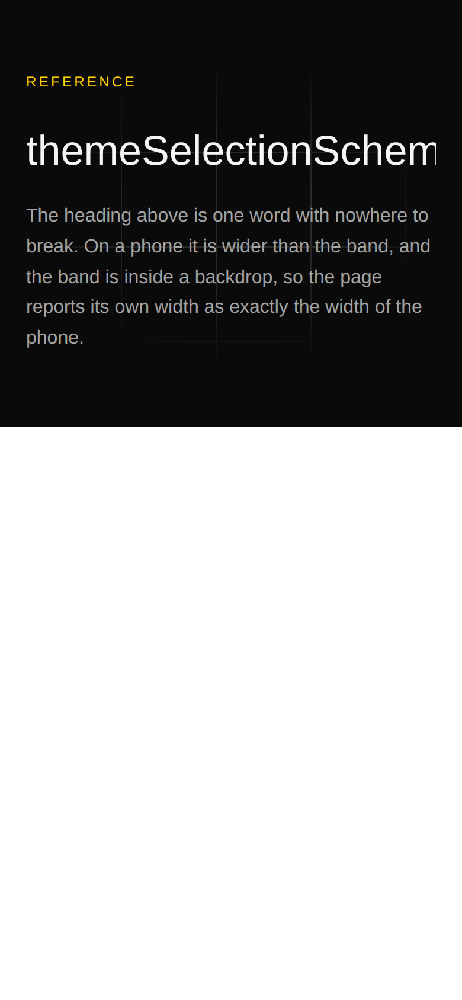

# The overflow a clip hides — the second measurement every shot now takes

**Routine:** `Loom daily build` (framework, `src/` except `src/primitives/`, and the application shell)
**Date:** 2026-09-28
**Section:** §1 (process)
**Branch:** `framework-58-the-overflow-a-clip-hides` — branched off `origin/main` at `809a970`; this lane had no open pull request of its own. `Loom merge` brought `main` in at 15:32 and regenerated the decisions index, which is its documented behaviour; everything measured below was re-taken afterwards
**Record added:** [0202](../decisions/0202-the-harness-measures-the-content-a-clip-hides-and-it-is-not-scrollwidth.md)

> **This correction arrived a second time, and the reason is worth one line.**
> The code landed in #433. These re-taken numbers were pushed four minutes
> before that merge and missed it, because `Loom merge` had already read the
> head — so the report and 0202 landed on `main` quoting the tree they were
> first measured on rather than the tree that shipped. Nothing in the code
> differs. The finding at the foot of this run's entries says what the race is
> and how a lane avoids it.



*390 × 844, `bold` + `bold-sans` + `airy-modern`. The document measurement on
this page is `scrollWidth 390 / innerWidth 390` — clean, and it has been clean
all along. The word is cut off at the phone's edge because the band is inside a
`loom.backdrop`, and a backdrop clips.*

## What was completed

`Loom primitives` filed on 27 September that **the one automated visual check in
this repository cannot see through a clip**, and measured it on one tree
rendered twice at 390 under `bold`:

| | document measurement |
| --- | --- |
| wrapped in a `loom.backdrop` | **390 / 390** |
| the identical content, unwrapped | **401 / 390 ← overflows** |

Same nodes, same props, same palette. `loom.backdrop` sets `overflow: hidden`
and has to — its paints reach the element's edges and one that did not clip
would paint over the band beside it — so the harness reported the wrapped page
as clean because the defect was being clipped rather than fixed. Four bands in
the starter catalogue are rooted in a backdrop, and a page a model proposes one
onto is the product working as designed, so the reach is *any page, silently,
with nothing red.*

**Every shot now takes a second measurement**, and nothing has to ask for it. No
shot list changes, no specimen changes, both entry points get it:

```
a-clip-hides-an-overflow-bold-phone  390x844@2x  scrollWidth 390 / innerWidth 390  ← 1 clipping box hides content
    div > div > div  "ReferencethemeSelectionSchemaThe heading above …"  content reaches 370 in 346
a-clip-hides-an-overflow-bold-wide  1280x900@2x  scrollWidth 1280 / innerWidth 1280
```

One indented line per box, worst first, five and then a count. Each names the
box — its path, and its first words, because on a tree of registered primitives
every element is a `div` with inline styles and no class, and `div > div > div`
gives a lane nothing to search for.

## The decision that was not specified: it is not `scrollWidth`

The finding's own first suggestion was `scrollWidth` against `clientWidth` per
clipping box. That is one property access, it is the obvious reading, and it is
what was built first. **It was wrong twice, and both times the thing it accused
was the library working correctly.** Both were found by running it, not by
thinking about it.

| what it reported | what it actually was |
| --- | --- |
| `the-whole-page` and `catches-the-eye`, four pixels each, under both palettes | a `loom.halo` — an absolutely positioned rim drawn four pixels outside its box **on purpose**, clipped by the backdrop **on purpose** |
| `/docs/getting-started/quickstart`, *content reaches 905 in 348* | a `loom.code` block scrolling sideways, which is the feature |
| the documentation site's skip link, *reaches 142 in 24* | `sr-only` — `width: 1px` with `px-3 py-2` put back on top of it |

So what ships walks the content instead. From the clipping box's children: count
the child's own rectangle, **stop if it handles its own overflow**, measure the
**ink of its text** with a range, then descend. Anything `absolute` or `fixed` is
skipped, because decoration that is clipped is decoration working.

The text measurement is not an embellishment and it is the case the picture
above is. A heading is a block: its box is the width it was given, and one long
word painting past that edge is invisible to every rectangle on the way down.
Without the range the instrument found the halo rim and missed the cut-off word
— exactly backwards.

The skip link is excluded by a different rule: a box with less than two pixels of
**content box** in either direction is being hidden rather than clipping.
`clientWidth` says 24 and the content box says 1, and only the second says what
the element is.

## The numbers this rests on

Everything below was run against this branch, on a production build, with the
harness starting the application itself.

**Taken three times, against three trees, and unchanged across all of them.**
`Loom merge` ran twice while this work was open, each time bringing a different
`main` underneath it, and each time the numbers were taken again rather than
left standing on a tree that no longer existed:

| taken on | what had changed underneath | build |
| --- | --- | --- |
| the branch as written | — | 09:18 |
| after the first merge | **#432** — `loom.hero`'s two measures, and a band's content lifted above its own paint | 15:45 |
| after the second merge | **#434, #435, #436** — six bands back on the left rule, a site-wide footer, a new lesson | 16:46 |

The second of those is the one worth naming: #432 changes the corner of the
library this instrument is most about. The third changes pages rather than
primitives, which is the other half of the table.

| subject | shots | clipping boxes reported |
| --- | --- | --- |
| four surfaces — 16 public pages at `phone` and `wide` | 32 | **0** |
| every committed specimen in `src/primitives/` (19) and `tools/specimen/` (4) | 94 | **0** |
| `a-clip-hides-an-overflow`, written to be found | 2 | **1**, at `phone` only, unchanged at `content reaches 370 in 346` |

The corpus grew by six shots between the first and second runs, because #432
committed a specimen of its own, and did not change again. Nothing else moved:
zero every time, with the hero's measures, the left rule and a new footer
changed underneath.

**The zeroes are the number that matters.** An instrument that fires on a
healthy tree is an instrument that gets ignored, and the first three builds of
this one did exactly that. The one subject that reports a box is the finding's
own tree, committed at
`tools/specimen/a-clip-hides-an-overflow.specimen.ts` so it can be pointed at
again — and photographed at `wide` as well, where the content fits and the line
is clean, which is the control.

`pnpm verify` green on every head this run produced. The last of them, at 16:46:
**3250 + 5579 tests** (166 + 323 files), 868 findings 0 malformed, 114
prerendered pages, 1304 text junctions 0 run together. It was 3248 + 5560 and
862 findings on the branch as written; everything between those two readings and
these belongs to the four pull requests that merged underneath, except **eight
framework tests and two findings**, which are this run's.

Quoted as *the last head this run produced* rather than as a fact about `main`,
deliberately. A count in a dated report that is worded as a standing claim has
to be chased every time anything merges, which is a treadmill and was already
half a lap in when this sentence was rewritten.

## The exit code, left alone deliberately

`pnpm shoot` and `pnpm specimen` still exit non-zero on a document wider than
its viewport, **and only on that**. A clipped box is printed, loudly, and does
not fail a run.

The reason is narrow rather than principled, and it is in 0202 so that whoever
revisits it knows it was a choice: promoting a measurement one day old to the
merge gate for four surfaces, in the same change that first makes it visible, is
how an instrument gets switched off instead of fixed. One class of false positive
was already found and fixed inside seven pages. Nothing on the site trips it
today, so the promotion would cost nothing today either — which is the argument
for doing it, and it is the maintainer's.

## A trap worth the sentence, met from the other direction

`page.evaluate` serialises a function with `toString`, and the compiler wraps
every **named inner function** in a `__name` call that exists in this process
and not in the page. The first run of the new measurement died with
`ReferenceError: __name is not defined`, thrown from a line number in generated
source. `start-state.ts` already states this for a start script, which is why a
start state is injected as source; the two sibling functions in `playwright.ts`
happen to have no inner functions to lose. The measurement is written as a flat
loop for that reason and the comment says so, because the next person to tidy it
into three helpers will get the same error and no clue.

## Records and findings

- **Added** [0202](../decisions/0202-the-harness-measures-the-content-a-clip-hides-and-it-is-not-scrollwidth.md),
  *The harness measures the content a clip hides, and it is not `scrollWidth`*.
  Nothing superseded. Index regenerated.
- **Closed** the 27 September instrument-gap entry, naming the branch and the
  correction the entry could not have known.
- **Filed**, for `Loom primitives`: a `loom.halo` inside a `loom.backdrop` has
  four pixels of its rim cut off, and `loom.halo.ts`'s comment — *"there is no
  clip"* — is true of a halo alone and not of a halo inside one. Four pixels of
  soft rim on two specimens; nothing is blocked and the instrument now excludes
  it by design. Filed for the sentence, not the number.

## Open questions

1. **Should a clipped box fail the run?** Recommended, but not in this change.
   Nothing on any surface trips it today, so the cost of promoting it is zero
   today and rises with every page written between now and then.
2. **Text directly inside a clipping box, with no element around it, is not
   measured** — only the text of its element children is. Every tree the render
   seam produces wraps its text in a primitive, so it cannot arise from a Loom
   tree; it can arise in a surface's own JSX. Stated in 0202 as a limit rather
   than fixed, because fixing it means walking child nodes at every level for a
   case nothing here produces.
3. **Vertical clipping is not measured.** A band that cuts the bottom off its
   own content is the same defect turned ninety degrees, and no lane has asked
   for it. Not built.

## What was not done, and why

Nothing in this run touched `src/primitives/`, a route group, or the
application shell. The migration named at the top of this lane's brief as its
next unit **is already complete** — `apps/loom` exists with all five route
groups, `apps/portal` and `apps/docs` are retired, and `docs/routines.md`
records it as of 19 August. No part of the tree is half-migrated.

The brief also names the demo as this lane's. `docs/routines.md` records `Loom
demo` as a separate routine owning `apps/loom/app/(demo)/` since 20 August, and
that lane filed and reported as recently as 27 September, so the demo was left
alone. Saying so here because the brief and the file disagree and the brief is
meant to win: if the demo is this lane's again, the file needs correcting.
