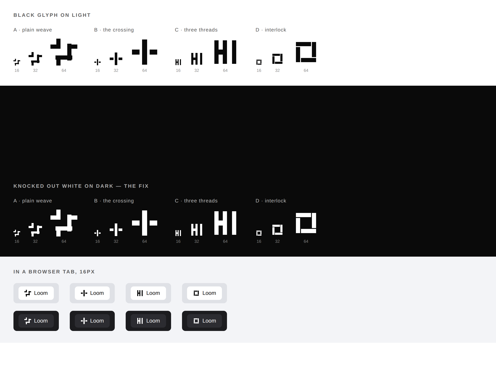
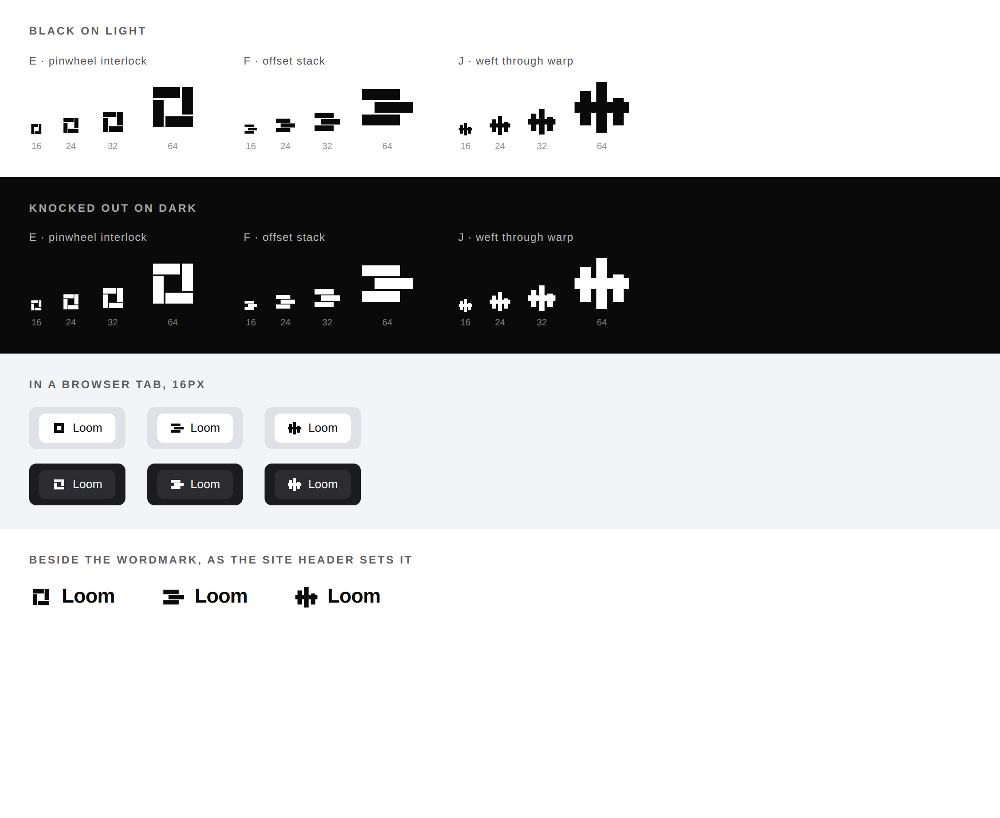
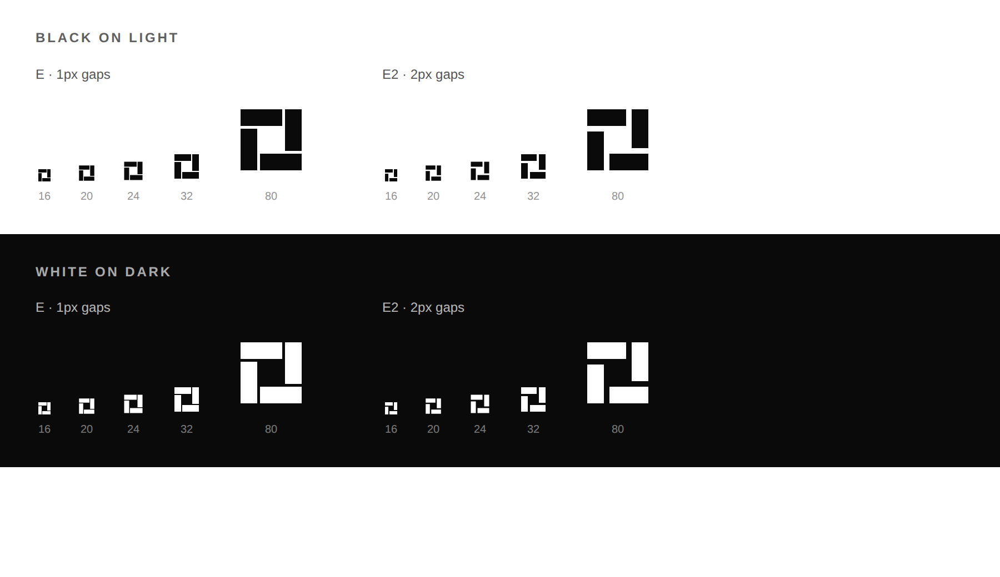

# 2026-09-28 — marketing: a mark of its own

The maintainer asked to pick a favicon from some we had been exploring. **We had
not been exploring any** — there was no favicon, no logo image and no icon file
anywhere in the repository, and no favicon work in any report, decision, finding
or commit on any branch. Said so rather than inventing a mark he had never seen,
and asked two questions. His answer:

> *I would lean toward a simple glyph with black color.*

So this is the glyph, chosen from seven drawn across two rounds, and the
browser-tab icon it became.

```
    ▀▀▀▀▀▀▀▄▄
    ▄▄     ██
    ██     ▀▀
    ▀▀▄▄▄▄▄▄▄
```

---

## The gap it fills

`tools/prerender/metadata.ts` has supported Next's `icon` convention since it
was written, and nothing ever filled it. **Every tab showing any of the four
surfaces has carried the browser's blank-page glyph.** A marketing site with a
blank tab is a visible miss; the other three surfaces inherit the fix for free,
because one application has one icon.

## Two rounds, and what the first one got wrong

Four marks were drawn first and **all four were rejected**. They are kept here
because the failures are more instructive than the survivor.



| | why it failed |
| --- | --- |
| A · plain weave | reads as scattered blocks. The over-under is invisible below 32px |
| B · the crossing | a generic plus sign. Nothing about it is this product |
| **C · three threads** | **reads as the letters "HI"**, unmistakably, at every size |
| D · interlock | closest, but a small square with a nick out of it |

**C is the one worth recording.** Three full-height vertical bars with a
crossbar is a weave in the designer's head and a pair of letterforms on the
screen. Nothing in the construction hinted at it; it was visible in the first
second of looking at the contact sheet and invisible in the SVG source.

The lesson generalises past this run: **a glyph has to be photographed at the
size it is used at, in the place it is used.** That is the same instrument the
half-empty bands and the em-dash in the hero both needed — a person looking at
a picture — arriving for the third time in two days.

## The second round



| | |
| --- | --- |
| **E · pinwheel interlock** | **chosen.** Four arms woven into a ring. Distinctive silhouette, no letterform collision, holds at 16px |
| F · offset stack | rejected — in a tab at 16px it is a **hamburger menu icon** |
| J · weft through warp | rejected — no longer reads as letters, but busy and tall; the silhouette says nothing |

### The refinement that mattered

E's arms were separated by 1px gaps in a 32-unit field. **At 16px those halve to
half a pixel and close up**, and the interlace — the whole of what the mark
says — turns into a solid spiral. Widening them to 2px costs nothing at large
sizes and is the difference between a mark and a smudge at small ones:



## What shipped

**One file, four rectangles.**

| file | what it is |
| --- | --- |
| `apps/loom/app/icon.svg` | the mark, as Next's `icon` convention |
| `_lib/mark.test.ts` | 4 cases |

### Literal colour, on the one surface whose rule is that there is none

`pages.test.ts` sweeps every served page for a hex value and fails on one,
because a tree is themed at render and a literal would survive the theming.

**A favicon is drawn by the browser's chrome, outside the page.** No custom
property reaches it and there is no theme to read, so a literal is not a
shortcut here — it is the only thing available.

What *is* available is to stop the literal being arbitrary. Both values are read
out of the registered palettes by the test rather than restated:

| | value | where it comes from |
| --- | --- | --- |
| light | `#0a0a0a` | `minimal`'s `fg-default` — and also `bold`'s `bg-canvas` |
| dark | `#f5f5f5` | `bold`'s `fg-default` |

One value doing both jobs is why the mark reads as **the site's black** rather
than as a black somebody picked. If a palette moves, the test goes red.

### Black, and still visible on a dark tab bar

The maintainer asked for black. A black glyph on a transparent ground
**disappears into dark browser chrome**, and a tab icon cannot report its own
absence. So black is the default — outside any media query, so a browser that
reports no preference and a renderer that ignores the query still get it — and
`prefers-color-scheme: dark` swaps in `bold`'s ink.

### Verified served, not assumed

```
<link rel="icon" href="/icon.svg?icon.20x47v9b-td4_.svg" sizes="any" type="image/svg+xml"/>
```

Present on `/` **and** on `/portal/sign-in`, and `/icon.svg` answers `200
image/svg+xml`. The prerender check still reports **3 metadata conventions, 0
unserved** — an `.svg` is a static file rather than a module, so it is not a
convention the scanner counts, and nothing about the count changed.

## What was asked for and not built

**The glyph beside the wordmark in the header. It cannot be done, and that is a
finding rather than a fix.**

`chrome.ts`'s wordmark is a `loom.logo`, which takes an optional `image` — and
`stylesheet.ts` puts every `.loom-mark` behind `filter: grayscale(1)` at 72%
opacity until hover. That is correct for the primitive's stated job, which is
**somebody else's** marks on a wall; a deployment's own mark in its own bar is
the one logo on the page that should be at full strength. `surface: "card"`
plates it and does not un-grey it.

So the header still renders the wordmark as text, which `loom.logo`'s own
comment calls *"a perfectly good logo"*. Filed for `Loom primitives` with the
two shapes that would close it, and with the note that **whether the bar should
carry a glyph at all is the maintainer's and he has not been asked.**

## Tests

`pnpm verify` — **exit 0**, read out of a file written as the last thing on its
own line, on a `.next` and a `dist` deleted first.

| | |
| --- | --- |
| runtime | **3,223 passed** in 165 files — untouched |
| application | **5,559 passed** — 4 added |
| findings | **858**, 0 malformed |
| prerender | 114 pages, 1,302 junctions, 0 run together, **0 unserved** |

## Findings

**One filed, none closed.** `loom.logo`'s image is a wall mark, so a deployment
cannot render its own.

## Open

- **The header glyph**, above — blocked on the library, and a question for the
  maintainer before it is worth building.
- **An `apple-icon`.** Not shipped: a touch icon wants a filled ground rather
  than a transparent one, which is a second mark rather than the same file, and
  nobody asked for one.
- **The `publisher`** in the structured-data graph, unchanged since
  26 September.
