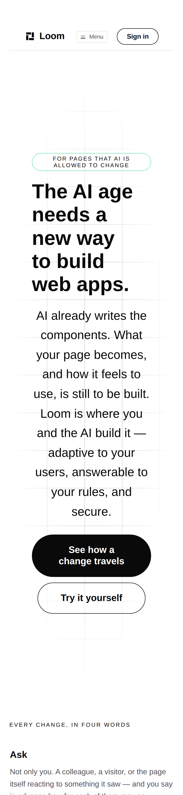

# 2026-09-28 — marketing: the corrections that missed the merge

**This unit is two corrections and no code.** Both were written, pushed, and
claimed as filed in #434's report and its pull request comment. Neither is on
`main`, because the push landed after the merge.

| | |
| --- | --- |
| #434 opened | 11:39 |
| `Loom merge` brought `main` in | 15:40, and again 15:48 |
| **#434 merged**, squashed at `e4d1b2a` | **16:03** |
| this lane pushed `8542b1d` onto the branch | ~16:12 |

---

## Why it was silent, which is the part worth recording

The commit is not lost — it is on the branch and the branch is still there. What
is missing is any signal that it did not land.

A squash merge writes a commit on `main` whose parent is not any commit of the
branch. So:

```
git merge-base --is-ancestor e4d1b2a origin/main   # the head that MERGED    → no
git merge-base --is-ancestor 8542b1d origin/main   # the head that did NOT   → no
```

**Both answer the same way.** A lane checking whether its work landed by looking
for its own SHA learns nothing. The only check that works is reading the file:

```
git show origin/main:FINDINGS.md | grep 11,012   # nothing
```

which is how this was caught, and it is one command.

Filed as a finding owned by this lane, with the two habits that follow —
**confirm content on `main`, not a SHA**, and better, **do not push twice**: a
lane that has already opened a pull request is racing a merge routine on a
schedule it does not know. `Loom merge` did nothing wrong. It merged a green
head, and the head it merged was green.

## Correction one — a measurement, re-taken on the merged `main`

The phone-fold finding went in carrying **11,751px**, measured before
`Loom merge` brought #432 in and before this lane's own six-band change shortened
the pages. The number on `main` today is **11,012px**.

Re-measured on `0f239ef` rather than carried over from the earlier branch, since
#435 landed in between:



*Two screens at 390 wide. The fold is the exact middle.*

| | before | on `main` today |
| --- | --- | --- |
| empty band above the eyebrow | ~220px | ~220px |
| headline | 5 lines | 5 lines |
| lead | 9 lines | 9 lines |
| first control | ~1114px | ~1114px |
| **whole page** | **11,751px** | **11,012px** |

**Everything except the page height is unchanged, and that is the useful half.**
#432 moved `loom.hero`'s display measure from 44rem to 64rem; at 390px the band's
own edges bind first, so it does not reach the narrow end at all. The finding's
claim — that the fold is a question about block padding and the type ramp rather
than about the measure — survives the change that looked most likely to overtake
it.

## Correction two — the link-mangling entry

#434's own body was mangled in the shape the 22 September finding describes, and
it pointed at `reports/`, which that finding's table says comes through clean.
Four other links in the same body survived. Appended as evidence with those four
tabulated beside it, and **explicitly not as a fourth theory** — that entry asks
for exactly that restraint, having had two guesses written into pull request
descriptions as fact already.

## Tests

`pnpm verify` — exit code read out of a file written as the last thing on its own
line, on a `dist` and a `.next` deleted first.

| | |
| --- | --- |
| runtime | **3,250 passed** in 166 files |
| application | **5,579 passed** in 323 files |
| findings | **869**, 0 malformed |
| prerender | 114 pages, 1,304 junctions, 0 run together, 3 metadata conventions, 0 unserved |

No code changed on this branch: the diff is `FINDINGS.md`, one number in an
existing report, and this file. `git diff origin/main -- src/ 'apps/**'` is empty.

## Findings

**Two filed, one closed.** The link-mangling evidence, and the dropped-push entry
— which this branch closes.

## Open

Unchanged and both the maintainer's: **the phone fold** (whether the hero lead
may be shortened, or whether it waits on the primitive) and **the `publisher`**
in the structured-data graph.
