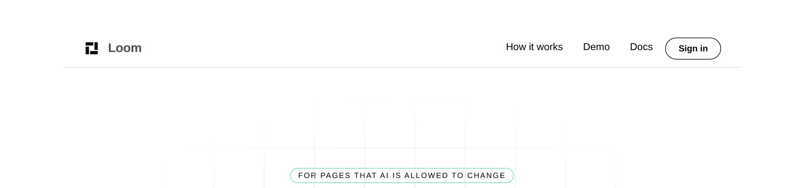
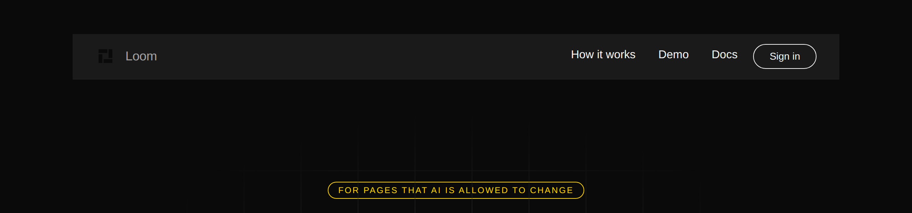
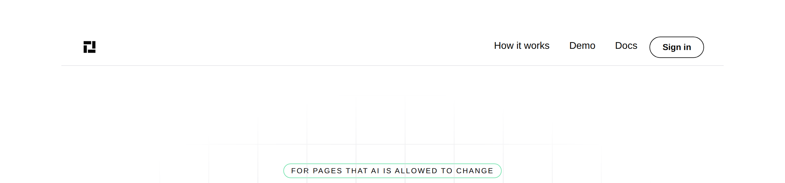

# 2026-09-28 — marketing: the mark the library cannot draw

The maintainer asked for the mark that shipped in #429 to go in the top bar.

**This unit ships no code.** The bar was built as a throwaway spike,
photographed, and thrown away. What the spike found is the deliverable: three
limits in `src/primitives/`, one of which makes the other two dangerous to fix
alone.

| the spike, `minimal` | |
| --- | --- |
|  | |
| **the same spike, `bold`** | |
|  | |

The first is what was asked for. The second is why it is not shipping.

---

## Why a spike and not a pull request

Two earlier answers were available and both were worse.

**Guessing** — I had already filed a finding on 28 September saying the bar
glyph was blocked on `loom.logo` greying its image. That finding named one
limit and was **wrong about the size of the problem**: fixing only the greying
produces the `bold` screenshot above, which is worse than today.

**Refusing on lane grounds** — `src/` is the one boundary this lane's brief
names as never-cross, so the reflex is to file and stop. But filing without
building means filing a description of the first obstacle, which is exactly
what the 28 September entry was. **The obstacle you can see from outside is
rarely the one that decides the design.**

So: build it locally, look at it, throw it away, and file what is actually
true. Nothing was committed and `src/` is untouched on this branch.

## What the spike found

### 1. `loom.logo` renders its image *instead of* its name

```ts
given.image === undefined ? createElement("span", …, given.name) : createElement("img", …)
```

One or the other; `name` becomes the `alt`. **There is no mark-beside-wordmark
shape in the library at all** — pointing the existing wordmark at the icon does
not add a glyph, it *replaces* the word:



The spike composed around it with two `loom.logo` nodes in a row. It renders,
and it is a hack: two logos where there is one brand, and the accessible name
is now "Loom" twice.

### 2. `.loom-mark` greys every image, wherever it sits

`filter: grayscale(1); opacity: 0.72` until hover. The earlier entry's finding,
still true.

**One fact worth having before anybody changes it**, measured rather than
assumed: **no production tree in this repository passes `image` to
`loom.logo`.** The only three call sites are in `library.test.ts`. The marketing
header, the demo's wall and four starter compositions are all text wordmarks. So
the rule today greys nothing that anybody renders, and scoping it to
`.loom-logo-cloud .loom-mark` would change no existing pixel.

### 3. The decisive one: an `` cannot follow the Loom palette

The spike pointed the mark at `/icon.svg` — the tab icon from #429, which
carries its own colour and swaps it on `prefers-color-scheme`, **the operating
system's setting**.

A Loom palette is a different axis entirely. `bold` is dark on a machine in
light mode, so the mark rendered `#0a0a0a` on `#1a1a1a`.

**An image is opaque to the cascade.** No custom property reaches inside one, so
a mark delivered as a file is blind to the only thing that decides what colour
it should be on the page. The favicon gets away with it because a browser tab
*is* the OS axis; the bar is not.

### Why 1 and 2 must not be fixed alone

Un-grey the image, let it sit beside the word, and you get the right bar on two
palettes and an invisible one on the third. **That is worse than today**,
because today's wordmark is a theme token and is correct on all of them.

## What was filed

One entry, three numbered limits, owned by `Loom primitives`. It supersedes the
morning's entry, which is kept with its status corrected — its reading of what
`.loom-mark` is *for* was right and only its scope was wrong.

The shape is offered rather than specified: **a way to render the deployment's
own mark as themed vector**, either a `loom.logo` mode that draws rather than
fetches, or a small primitive whose whole job is *this site, in this bar*, with
the word and the mark as one node and one accessible name. Either closes 1 and 3
together, after which 2 is a two-line scope change with no rendered pixel behind
it.

## The workaround, and why it is not offered as one

Two colour variants of the mark, picked per palette in `chrome.ts`. In this
lane, shippable today — and it hard-codes a palette-to-file mapping that breaks
the next time a palette is registered, **and it still needs 1 and 2 fixed**, so
it unblocks nothing. Named here so the next run does not rediscover it and think
it is a find.

## Tests

`pnpm verify` — **exit 0**. No code changed, so the numbers are `main`'s:

| | |
| --- | --- |
| runtime | **3,223 passed** in 165 files |
| application | **5,559 passed** |
| findings | **861**, 0 malformed |
| prerender | 114 pages, 1,304 junctions, 0 run together, 0 unserved |

`git diff origin/main -- src/ 'apps/**'` is **empty**.

## Findings

**One filed, one superseded.** No code, and the bar is unchanged — the wordmark
it renders today is correct on every palette, which is the reason there is no
hurry.
