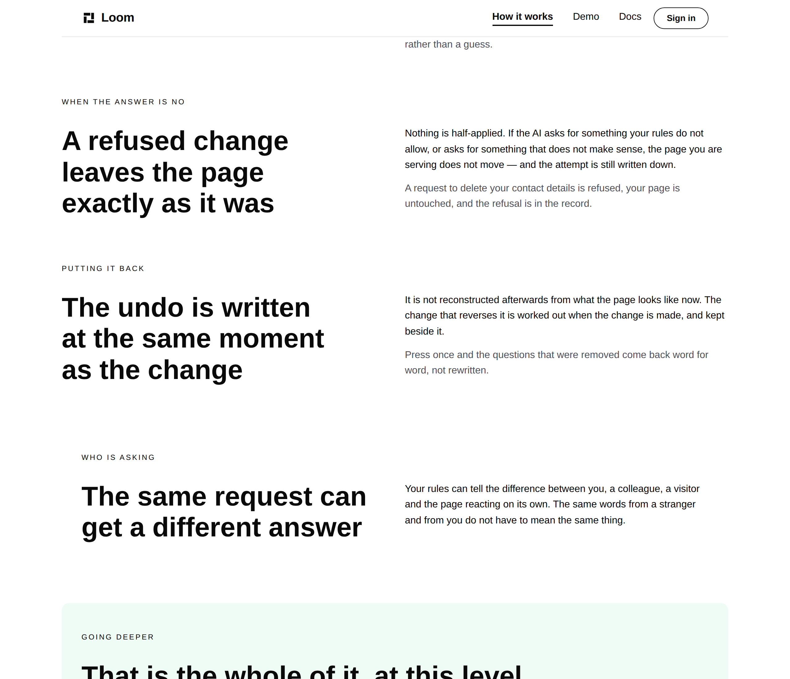
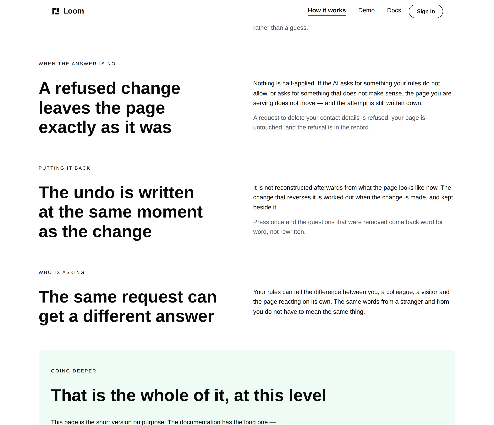


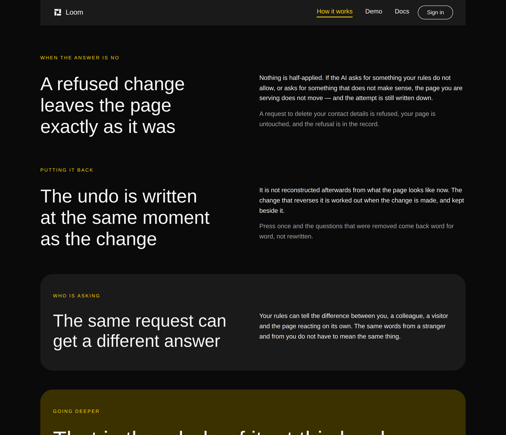
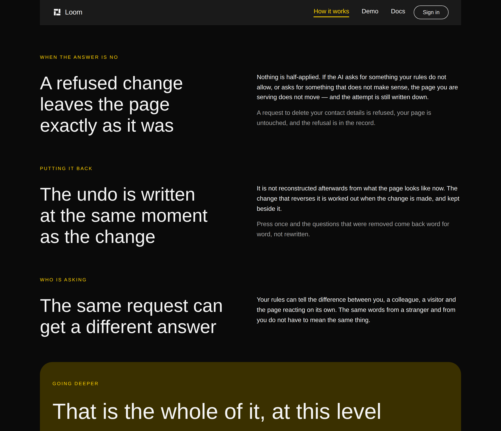
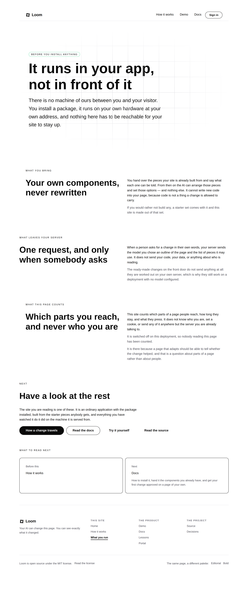
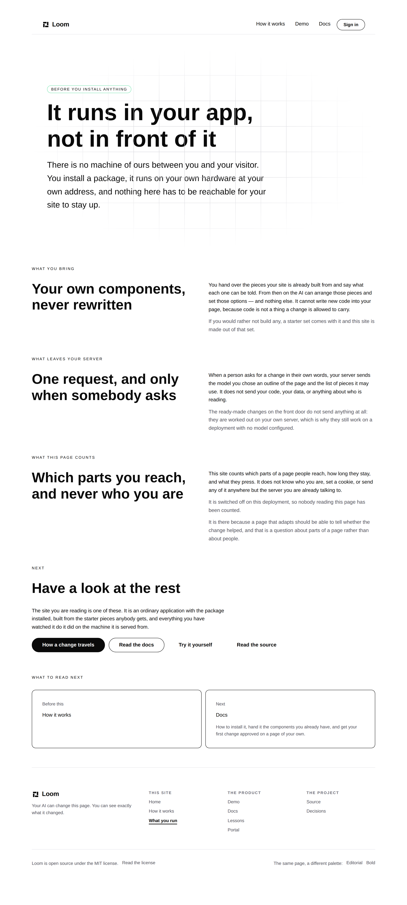
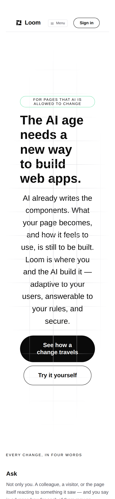

# 2026-09-28 — marketing: the plate the house theme cannot draw

Six bands of this site asked `loom.section` for a `tone: "surface"` plate. On
the palette a visitor arrives on, that tone draws **a fill the same colour as
the page, a radius that clips nothing, and thirty-two pixels of padding with no
edge around it.**

So the site had a left margin that stepped in and back out down the length of
every page, for a reason a reader cannot see, because there is nothing there to
see.

| `/how-it-works`, `minimal`, 1280 | |
| --- | --- |
| before |  |
| after |  |

*Three bands of the same kind. In the first picture the third one is stepped in
and nothing is drawn around it. In the second the only inset band on the page is
the green one below, which has a plate a reader can see.*

---

## How it was found, and why nothing had caught it

By looking at a **thumbnail** of the three pages. It is not a test failure and it
could not be: every band's props are valid, every colour is a token, the contrast
checks pass, and `scrollWidth` is clean at both viewports. It is also completely
correct-looking on `bold` and `editorial`, where the fill *is* a change of
colour — which is the trap, because a run that photographs one palette and moves
on sees a deliberate plate.

This is the same instrument the em-dash in the hero and the half-empty bands
needed: a person looking at a picture. Fourth time in three days.

## The cause, which is two primitives disagreeing about one word

Both carry a tone called `surface` and both read the same palette slot:

| | `loom.card` | `loom.section` |
| --- | --- | --- |
| fill | `bg-surface` | `bg-surface` |
| outline | `1px solid border-subtle` | **nothing** |
| radius | `radius("lg")` | `radius("lg")` |
| padding | yes | yes |

`minimal` sets `bg-surface` to `#ffffff` — **exactly its own `bg-canvas`** — and
does it on purpose. Its comment in `src/theme/library.ts` says so in as many
words: components there are *"defined by its border instead of by a change of
background"*, and the palette pays for that by making `border-subtle` a step
darker than a fill-backed palette needs.

**A card collects on that bargain. A section cannot**, because it never reads a
border token at all.

So this is not a palette bug and not a composition bug in origin. It is one
primitive honouring a contract the other one has never heard of, on the one
palette where the contract is load-bearing.

## What shipped, and it is a retreat rather than a fix

`src/` is not this lane's, so the outline is **[a finding for `Loom
primitives`](../FINDINGS.md)**, filed today with the table above and the three
other route groups that are presumably showing the same inset.

What this lane could do is stop asking for a plate the house theme cannot draw.
All six bands are now plain:

| file | band |
| --- | --- |
| `pages/home.ts` | *Built in the open* |
| `pages/home.ts` | *Where to go from here* |
| `pages/see-it-happen.ts` | *Ask this page to rearrange itself* |
| `pages/how-it-works.ts` | *Who is asking* |
| `pages/what-you-run.ts` | *What you bring* |
| `pages/what-you-run.ts` | *What this page counts* |

Two of those were independently wrong whatever the primitive does, and the
comments say so at the call site. *Who is asking* is the **fifth of five** short
answers in the same shape, and plating the last item in a run of five says *this
one is different* about the one band on the page that is not. `/what-you-run`
plated its first and third answers and not its second, which is a left margin
stepping in, out and in again with no argument behind any of the three.

## The cost, photographed rather than assumed

The plates were doing real work on `bold`, so the question was whether removing
them flattens it. It does not:

| the front door, `bold` | |
| --- | --- |
| before |  |
| after |  |

Three charcoal plates are gone and the page still reads as a page, because the
things that were carrying its structure are still there and draw their own
edges: the demonstration's record card, the four destination cards, the mosaic,
and the olive `accent` band that closes it. `accent` is unaffected —
`accent-subtle` is `#effbf5` on `minimal`, so that one is a plate on every
palette, which is why *Going deeper* is the only indented band left on
`/how-it-works` and why it looks deliberate.

| `/how-it-works`, `bold` | |
| --- | --- |
| before |  |
| after |  |

`/what-you-run` on the house theme, whole, is the clearest single picture of
what changed — every eyebrow, every heading, the hero and the footer now on one
left rule:

| | |
| --- | --- |
| before |  |
| after |  |

## The test, and why it is a guard rather than a preference

`pages.test.ts` walks every band of every route and fails if one asks for the
tone. It is worth having rather than trusting six call sites, because
`tone: "surface"` is the obvious thing to reach for the next time a band wants
to look like a region — it is named for exactly that, it is right on two
palettes out of three, and the one it is wrong on is the one nobody
re-photographs after a copy change.

Confirmed to fail against the unfixed code rather than asserted:

```
AssertionError: expected [ 'Where it is today' ] to deeply equal []
```

The test and the comment on `section` in `nodes.ts` both name the finding, so
**putting a tone back is a line of code and a line of test rather than an
argument.** When the outline lands, the three bands that genuinely are a
different kind of thing — the figures, the four ways on, and the stage the
demonstration runs in — are the ones to give it back to first.

## Also measured, also filed, and not fixed

The front door on a phone. Photographed at 390 × 844 while looking for this:



*Two screens. The fold is the exact middle of that picture.*

| | |
| --- | --- |
| empty band above the eyebrow | ~220px — `loom.hero`'s `paddingBlock`, a constant |
| headline | 5 lines |
| lead | 9 lines, 4 of them above the fold |
| **the first control** | **~1114px down — 270px below the fold** |
| the whole page | 11,751px, **thirteen phone screens** |

A stranger on a phone gets a badge, a headline and half a paragraph. Checked for
a composition answer and there is not one: `stature: "tall"` sets a 78vh floor
that ~1100px of content already clears, `align` does not change height, and the
padding and the type ramp are both constants in `src/`. **And the words are not
available** — the headline and both added clauses in the lead are the
maintainer's own of 27 September, so buying back a fold by cutting them would be
this lane editing positioning.

Filed with the measurement for `Loom primitives`, and named here rather than
quietly carried, because the 27 September report noticed it in passing and did
not file it.

## Tests

`pnpm verify` — exit code read out of a file written as the last thing on its own
line, on a `dist` and a `.next` deleted first.

| | |
| --- | --- |
| runtime | **3,238 passed** in 166 files — untouched by this diff |
| application | **5,562 passed** in 320 files — 2 added |
| findings | **863**, 0 malformed |
| prerender | 114 pages, 1,304 junctions, 0 run together, 3 metadata conventions, 0 unserved |

Nothing weakened, nothing skipped. `git diff origin/main -- src/` is empty.

## Findings

**Two filed, none closed.**

1. `loom.section` plates without an outline — `Loom primitives`.
2. The phone fold on the front door — `Loom primitives`.

## Open

- **The `publisher`** in the structured-data graph, unchanged since 26 September
  and still the maintainer's.
- **The stale reading order in `_lib/site.ts`.** Its comment on `SITE_ROUTES`
  still describes the ten-page argument — `/the-rules`, `/who-can-ask`,
  `/putting-it-back`, `/what-readers-do` — that the 26 September cut retired, and
  `chrome.ts` still says *"three of this site's five pages"*. Nothing a reader of
  the site can see; noted so the next run of this lane can clear it rather than
  rediscover it. Kept out of this diff to keep the change one thing.
