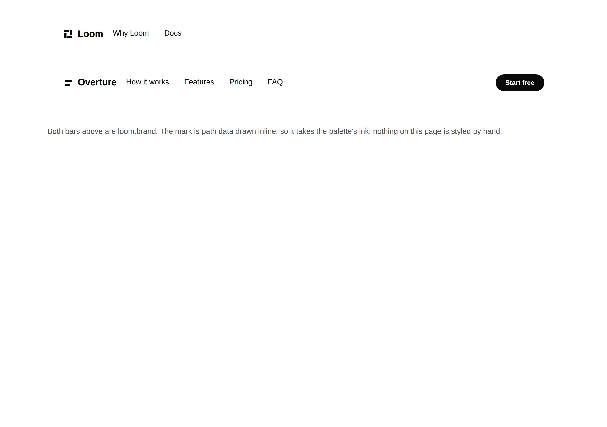
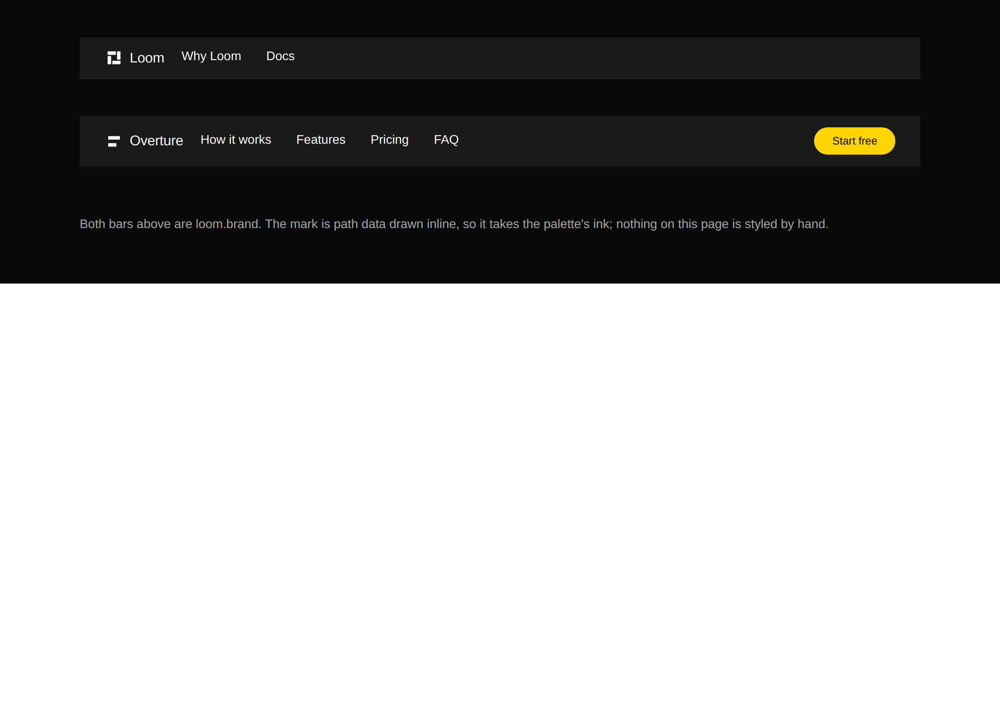

# 2026-09-28 — a mark that themes

The maintainer asked for the glyph from #429 in the top bar. The earlier run
built that as a spike, photographed it, threw it away and filed three limits,
because a `` in the bar renders `#0a0a0a` on `bold`'s `#1a1a1a`. He then
said, twice:

> *I think we need to file all three as proper primitives, like you said.*
>
> *I thought we were creating a primitive with an SVG so it can render correctly
> with dark themes.*

So this is the primitive. **It crosses into `src/`, which this lane's brief names
as never-cross** — see *The lane* at the foot.

| `minimal` | `bold` |
| --- | --- |
|  |  |

Same tree, same path data, no second file and no palette-to-asset mapping. That
is the whole claim and it is the one an image cannot make.

---

## What `loom.brand` is

A site's own mark and its own name, as one node.

```ts
{ type: "loom.brand", props: { name: "Loom", mark: "M5 5h14v6H5z …", href: "/" } }
```

`mark` is **SVG path data**, drawn inline as a `<path fill="currentColor">`. The
colour is set once, on the container, as `colour("fg-default")`; the word and the
mark cannot drift apart because there is only one value and the path inherits it.

### Why not `loom.logo`

`loom.logo` is one mark in a **wall** of them. Its own comment is about twelve
brand palettes fighting each other; its image is greyed to 72% until hover; and it
renders the image *instead of* the name, because on a wall one company is one
mark. All three are right there and wrong here. A site's own name in its own bar
appears once, is never dimmed, and is a mark **beside** a word.

### Why the mark is a path and not a URL

The obvious shape is `image: <url>`, which is what `loom.logo` has, and it cannot
work here for a reason that is not visible until you photograph it.

**An image is opaque to the cascade.** No custom property reaches inside one. A
file can carry `prefers-color-scheme` — but that is the *operating system's* axis,
and a Loom palette is a different axis entirely. `bold` is a dark palette on a
machine in light mode. That is the `#0a0a0a`-on-`#1a1a1a` bar the spike produced.

**And a path is inert, which is the security half.** Every other address in this
library reaches something: a `src` fetches (0053), an `iframe src` is a whole
document with a script host in it (0095). Geometry reaches nothing — no origin to
allowlist, no request to make, no document to sandbox. A mark authored by a model
is a shape that may be ugly and can never be a fetch.

That is left provable rather than argued. `markPath` narrows `mark` to the
characters path data is made of:

```
/^[MmLlHhVvCcSsQqTtAaZz0-9,.\-+eE\s]+$/
```

Five refusals are tested by name — a `url(…)`, a `<script`, an entity, a quote
break, a `data:` URI — alongside a real path with decimals, exponents, commas and
an arc, so the schema is not merely strict. `viewBox` is four numbers for the same
reason. `href` goes through `linkUrlSchema` like every other link in the library.

### Why the library ships no mark of its own

This is the starter library, and a `loom.brand` that drew a pinwheel would put
**Loom's** logo in every site built with it. The geometry is the host's, passed in
like any other content — the same bargain `loom.logo` already makes with `name`.
`nav-band` therefore carries a deliberately plain two-bar `PLACEHOLDER_MARK`,
which reads as a placeholder at a glance.

## The third limit, closed with no pixel behind it

`.loom-mark` greyed **every** image wherever it sat. Scoped to
`.loom-logo-cloud .loom-mark`.

Measured before the change and worth keeping: **no production tree in this
repository passes `image` to `loom.logo`** — the only three call sites are in
`library.test.ts`. So the rule greyed nothing anybody rendered and scoping it
changed no existing pixel. The test asserts the new selector *and* that the bare
one is gone.

## The lesson that went red, and why it is not a defect

Registering a 99th primitive rippled into counts in lessons 22, 23 and 24, the
generated API reference, and the library's own registration-order lists. All
mechanical. One was not.

Lesson 29 sweeps the library for **declared props nothing reads**, and its
exercise C transcript is the one block in the course that is deliberately a second
copy of a fact about `src/primitives/`. `loom.brand` joined the set:

```
  primitives with a declared prop nothing read: 5
    loom.brand       viewBox
```

`viewBox` is the field a mark is drawn in, so it is read only where there is a
mark to draw; `mark` is an open string the probe cannot invent. That is
`loom.recording`'s `artwork`/`shape` pattern under another name — the lesson's own
exercise E. Nothing is wrong with the primitive, so the row is **explained in the
lesson rather than absorbed into it**, with the observation the lesson could not
make for itself: this one was written by somebody who had not read the lesson,
which is the nearest thing available to evidence that the pattern is ordinary
rather than a peculiarity of the three primitives that happened to be in the
library the day the sweep was written.

## What shipped

| file | |
| --- | --- |
| `src/primitives/loom.brand.ts` | the primitive |
| `src/primitives/brand.test.ts` | 15 cases |
| `src/primitives/stylesheet.ts` | greying scoped to the cloud |
| `src/primitives/compositions/nav-band.ts` | now a `loom.brand` |
| `tools/specimen/brand.specimen.ts` | the two pictures above, reproducible |
| `apps/loom/app/(marketing)/_lib/chrome.ts` | the site's bar, with `MARK_PATH` |
| `lessons/29-readership.md` | above; 22, 23, 24 counts |

`mark.test.ts` gains a drift guard: the bar's `MARK_PATH` is derived from
`icon.svg`'s own `<rect>`s and compared as a set of arms, so the tab mark and the
bar mark cannot silently become different shapes. It has already earned its keep —
one arm was spelled `h-6z` where the derivation says `H21z`, an identical shape
and a failed test, which is the right outcome for a guard whose whole job is that
two copies do not drift.

## Tests

`pnpm verify` — **exit 0**, read out of a file written as the last thing on its
own line, on a `.next` and a `dist` deleted first.

| | |
| --- | --- |
| runtime | **3,238 passed** in 166 files — 15 added |
| application | **5,560 passed** — 1 added |
| findings | **861**, 0 malformed |
| prerender | 114 pages, 1,304 junctions, 0 run together, 0 unserved |

## The lane

This lane owns `apps/loom/app/(marketing)/` and its brief says `src/` is
never-cross. **Most of this diff is in `src/`**, plus `tools/` and `lessons/`.

That is deliberate and it is the maintainer's call, made twice, after the earlier
run filed the finding and stopped. Recorded here rather than asked again. The
reviewable consequence: `loom.brand` is a starter-library primitive now, and the
next site built with Loom gets it, which is why it ships with no mark of its own
and with the schema argued above rather than assumed.

## Open

- **The duplicate `portal · alpha` label** now the under-construction banner says
  the same thing in more words.
- **An `apple-icon`.** A touch icon wants a filled ground, which is a second mark
  rather than the same file.
- **The `publisher`** in the structured-data graph — recommendation `jam-overture`,
  unchanged since 26 September.
