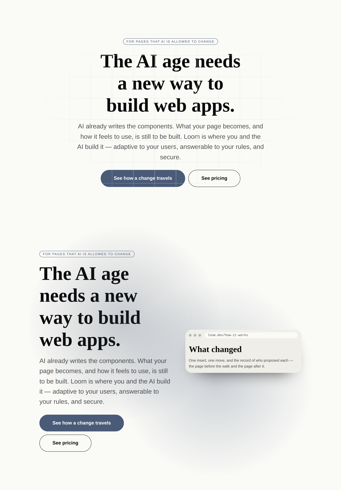
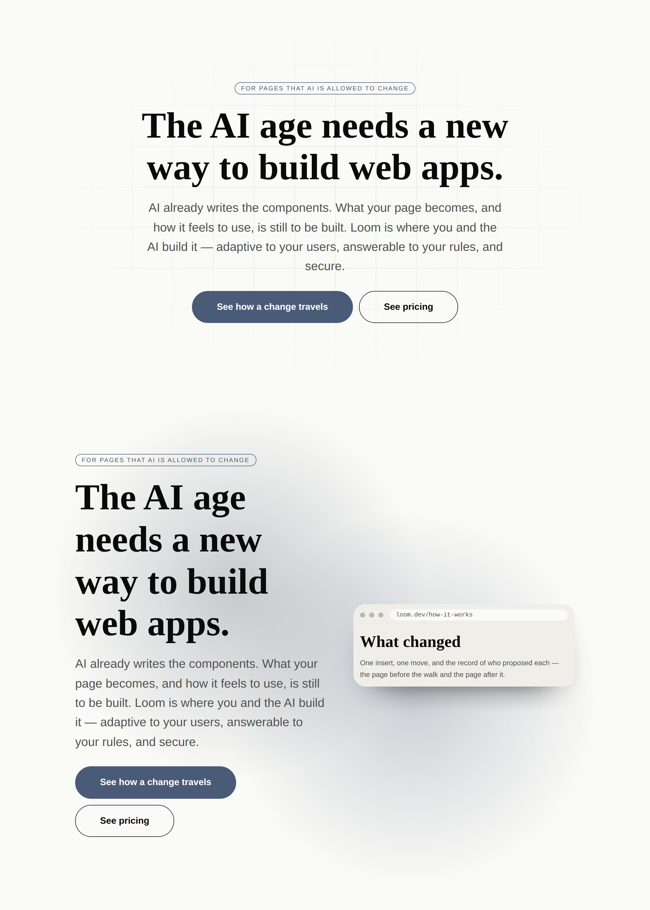
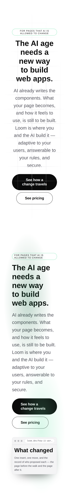
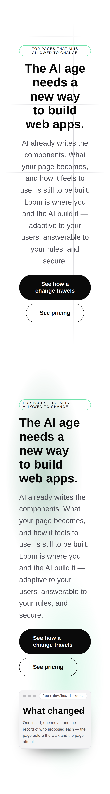
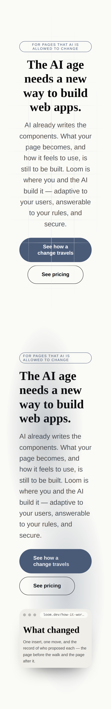
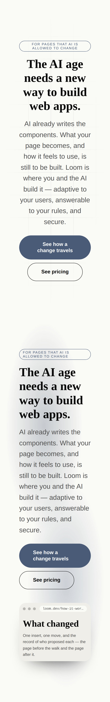
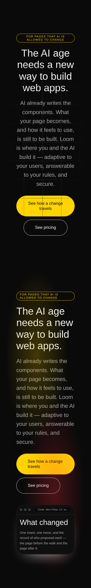
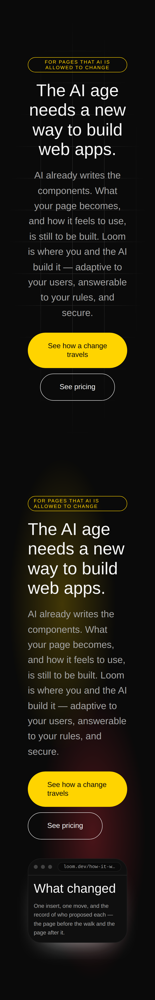

# 2026-09-28 — the hero's two measures, and the paint that crossed the words

Two findings against `loom.hero` were filed by `Loom marketing` on 20 September,
re-filed by reference on 26 September, and were **eight days open** at the start
of this run. Both are on the primitive this lane's brief names as its quality
floor, and both are on the first screen a stranger meets.

> Recorded only so the age is visible: the first screen a stranger meets has had
> no action on it for six days, and it is the single most expensive thing on this
> surface that this lane cannot reach.
>
> — the 26 September re-filing

That is the whole of why this run is not a breadth run. `FINDINGS.md` is on the
brief's *read before choosing work* list, and what it said was that the thing a
demo has to open on had been visibly wrong for a week.

---

## What shipped

| | |
| --- | --- |
| `loom.hero` | two measures where there was one, and its content lifted above its own paint |
| `loom.backdrop`, `loom.halo` | the same lift, taken from one place, and two wrong comments corrected |
| `backdrop.ts` | `ABOVE_BACKDROP` — the lift, beside the layers it orders |
| [0201](../decisions/0201-a-display-line-and-a-reading-line-are-two-measures.md) | a display line and a reading line are two measures |
| `library.test.ts` | two tests, both confirmed to fail against the unfixed code |
| `the-heros-two-measures.specimen.ts` | the front door's hero and a split hero, three palettes, two viewports |

No primitive was added. The library is at ninety-nine and the brief's breadth
mandate is real; it is not more urgent than a headline with a rule drawn
through it on the page the demo opens on.

---

## One — the paint that crossed the words

`grid`'s 1px rules ran straight through a 72px headline and through the primary
button. The marketing entry diagnosed it exactly, down to the one-line fix and
the sibling primitive that already carried it, and this run found two things it
could not have known.

**The comment on that sibling line is wrong.** `loom.backdrop` and `loom.halo`
each worked the lift out privately and each wrote the same note — source order
*"stops being enough the moment a child positions itself"*. Source order never
held a positioned layer back at all. A positioned element paints after its
static siblings however the document is ordered, so the wrapper was load-bearing
from the day it was written rather than a precaution against a future child.
Left standing, that comment is a reason for the fourth caller to skip the line
too — which is exactly what `loom.hero`, the band these paints were *written
for*, had already done for three weeks.

So the fix is not one line in one file. `ABOVE_BACKDROP` lives in `backdrop.ts`
beside the layers it orders, all three callers take it from there, and the
correction is written where the wrong note was. `loom.hero` needs it twice
rather than once: its text column and its media region are flex siblings, and a
wrapper around the pair would collapse the two-column layout the primitive
exists to lay out.

**The audit that bounded it.** Six other primitives position something
absolutely — `loom.before-after`, `loom.frame`, `loom.meter`, `loom.orbit`,
`loom.rating`, `loom.waiting-state`. Every one of them is a layer that is
*meant* to be on top: a corner label over a wipe, a notch over a screen, a
readout over a dial, a lit run over an unlit one, a visually-hidden
announcement. `loom.hero` was the only place in the library where a decorative
layer painted over content that had to be above it.

---

## Two — one measure for two kinds of line

```ts
const TEXT_MEASURE = "44rem"

rise(1, loom.slots["heading"], { maxWidth: TEXT_MEASURE })
rise(2, children,              { maxWidth: TEXT_MEASURE, … })
```

The comment defending that constant is about reading, and it is right. What it
does not say is that the number is in **pixels**, and that the two things it
caps are set at wildly different sizes. 704px is about 52 characters of a 20px
lead and **nineteen** characters of a 72px headline.

**The evidence that the number was load-bearing is that another lane paid for
it.** `minimal-sans` caps its ramp's top step at 72px and says why in its own
comment: *"`loom.hero` holds its text to a 44rem measure, so an ambitious top
step does not produce a bigger headline — it produces the same headline on four
lines."* A font pack in `src/theme/` was tuned around a layout constant in
`src/primitives/`. Filed for that pack's owner; see below.

### Why `64rem` and not the `58rem` the finding's table points at

The marketing entry measured three candidates and `58rem` is where the front
door's headline stopped breaking mid-phrase. This run went wider, and the reason
is the **shape** of the number rather than its size.

Measured against the render, at 1280×900, on the front door's own tree:

| `DISPLAY_MEASURE` | `minimal` 72px | `editorial` 72px | `bold` 88px | is the cap the constraint? |
| --- | --- | --- | --- | --- |
| `44rem` (was) | 3 lines | 3 lines | 3 lines | yes, on all three |
| `56rem` | 2 | 2 | **3** | yes, still, for `bold` |
| `60rem` | 2 | 2 | 2 | yes, marginally |
| **`64rem`** | **2** | **2** | **2** | **no — the band's edges arrive first** |

`56rem` fixes the two 72px packs and leaves `bold-sans` on three lines, which is
the old defect with a better value in it. `64rem` is 1024px against the ~980px a
`wide` page actually gives the band, so on the page this library is designed
around the band's own edges decide and the constant decides nothing. It bites on
a `width: "full"` page and on a viewport wider than the wide page — the two
places a display line genuinely runs away — where 1024px is about 28 characters
of a 72px headline.

**A measure should stop being the thing that decides, not decide differently.**

### The second suggestion, answered rather than declined

The finding also asked that `stature` govern block padding, on the grounds that
`stature: "tall"` was a no-op — the content was taller than the 78vh floor, so
the floor never bound. That was true, and it stopped being true:

| | hero height before | after | floor |
| --- | --- | --- | --- |
| `minimal` | 797px | **714px** | 702px |
| `editorial` | 750px | **702px** | 702px |
| `bold` | 815px | **714px** | 702px |

`tall` was a no-op *because the content overflowed it*, and the content
overflowed it because of the measure. The floor now binds exactly on `editorial`
and within 12px on the other two, so `stature: "tall"` is the thing setting the
height, which is what the prop claims to do. Adding padding on top would hand
back the fold this run just bought.

### What the reading measure did, and why it did not change

`44rem` stayed. It is 52 to 56 characters of a lead across the three starter
packs, which is inside the range a reading measure wants — the one constant was
accidentally correct for the one of its two jobs nobody complained about. The
unit is still wrong in principle; `ch` is the unit that means *characters*, and
`READABLE_MEASURE` in `tokens.ts` is already written that way. Re-expressing it
here would narrow the lead by about 120px under `minimal-sans` and move pixels
on every page in the repository to fix nothing that is wrong. Noted in 0201
rather than changed.

---

## Which Hermes fields became nodes, and which stayed props

**None, either way** — no Hermes block was ported this run. The report section
the brief asks for is answered by the one granularity judgement this run did
make, which is the same question in a different place:

**`DISPLAY_MEASURE` and `READING_MEASURE` are constants, not props, and that is
[0052](../decisions/0052-a-repeated-item-is-a-node-and-a-fixed-field-is-a-prop.md)'s
test rather than a convenience.** Ask the sharper question — *does changing this
change the set of nodes?* No: a measure moves where a line breaks, and no delta
reorders glyphs. They are `align`'s row in the granularity table, not
`imagePosition`'s. And they are not props either, on the rule `loom.frame`
already cites this primitive for: no palette or preset would ever vary them, so
a prop would be a lever nobody has a reason to pull, costing grammar budget
([0014](../decisions/0014-the-reply-schema-must-fit-a-grammar-budget.md)) on
every hero in every projection.

---

## The pictures

The front door's hero verbatim — its props, its headline, its lead, its two
actions — because the second finding is a claim about a **fold**, and a fold is a
property of one viewport height and one stack of real content. A reduced hero
with a three-word headline has no fold to fall below and would have photographed
as fixed before anything was.

### 1280×900

| | before | after |
| --- | --- | --- |
| `minimal` |  |  |
| `editorial` |  |  |
| `bold` |  |  |

The rules crossing *build web apps.* and crossing the primary button are the
first finding. The three lines becoming two, and the buttons rising, are the
second.

### 390×844

| | before | after |
| --- | --- | --- |
| `minimal` |  |  |
| `editorial` |  |  |
| `bold` |  |  |

The phone is the control. `64rem` does not bite at 390px, so the measure changes
nothing there and the only difference is the paint going behind the words —
which is what these shots are for. `loom.heading`'s `11cqi` cap is what holds the
headline on a phone, and it is untouched.

---

## What the tests hold, and how that was checked

Both new tests were run against the **unfixed** code before being kept, because
a test that passes either way is documentation with an assertion in it:

| test | against the old code |
| --- | --- |
| *lifts a band's own words above the paint behind them* | `expected '<div style="--loom-bg-canvas:#fafaf7;…' to contain 'z-index:1'` |
| *caps a hero's headline and its prose with two different measures* | `expected 44 to be greater than 44` |

The first is over all three painting bands under all three starter palettes, and
it reads the **content** rather than the layers — an assertion on the layers
would pass for a band that lifts nothing, which is precisely the state being
tested against. The second asserts the two caps **differ** rather than their
values: the numbers will be tuned again, and the one thing that must not come
back is one number.

---

## What the library still cannot express

- **A display measure in the headline's own characters.** The right unit is
  `ch`; the cap sits on a wrapper around the `heading` slot, whose content is any
  node at all and whose size is `loom.heading`'s business, so `ch` there would be
  the *body* font's character. Moving the cap onto the heading element — where
  `ch` would be true — puts a `max-width` on every heading in the library,
  including the ones correctly governed by a `loom.section` or a `loom.card`.
  Named in 0201 and not ruled out by it.
- **A measure the font pack supplies.** The most correct answer is a display
  measure declared beside `scaleRamp`, since the pack is what knows how wide its
  own characters are. It is a schema three registered packs depend on, so it is
  `src/theme/`'s, and it would not have closed this finding faster — the number
  still has to be chosen against a render.
- **`border-subtle` under `bold` is still unaudited.** This lane's own 26
  September finding asks for a sheet drawing every primitive that uses that token
  under the bold palette, on the rule *a border beside a fill may be subtle; a
  border that is the whole mark takes `border-default`.* Two were found and fixed
  then; the rest of the library has not been photographed. Not started this run.
- **`loom.link-pager` still cannot be a previous/next pair.** Open since 22
  September and it needs a judgement this lane was told it does not have.

## Filed

**`src/theme/`** — `minimal-sans`'s top step is capped at 72px with a comment
naming `loom.hero`'s `44rem` measure as the reason. That premise is gone. Not a
request to raise the step; a request to re-decide it on the pack's own terms and
rewrite the comment, for which leaving the number exactly where it is would be a
complete answer.
