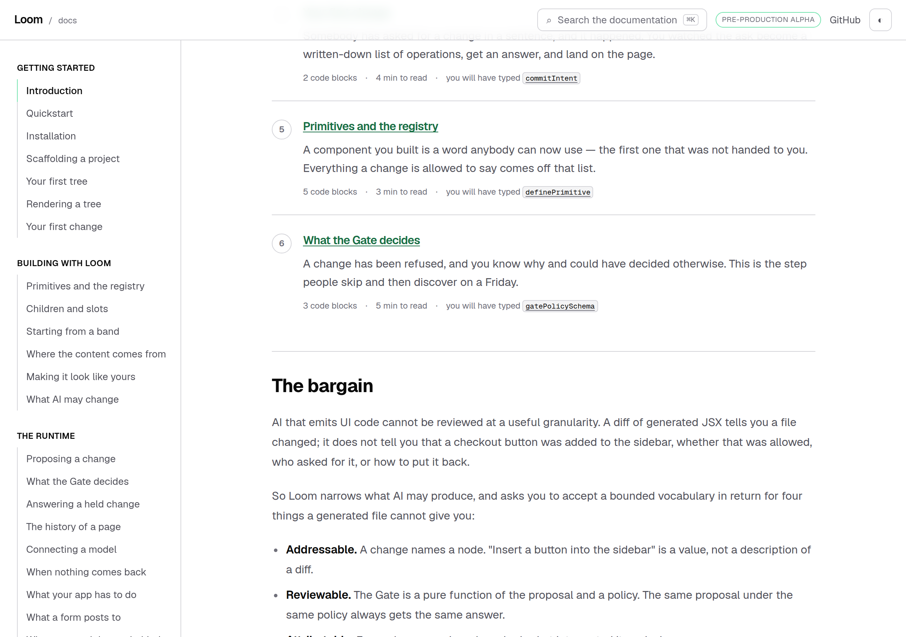
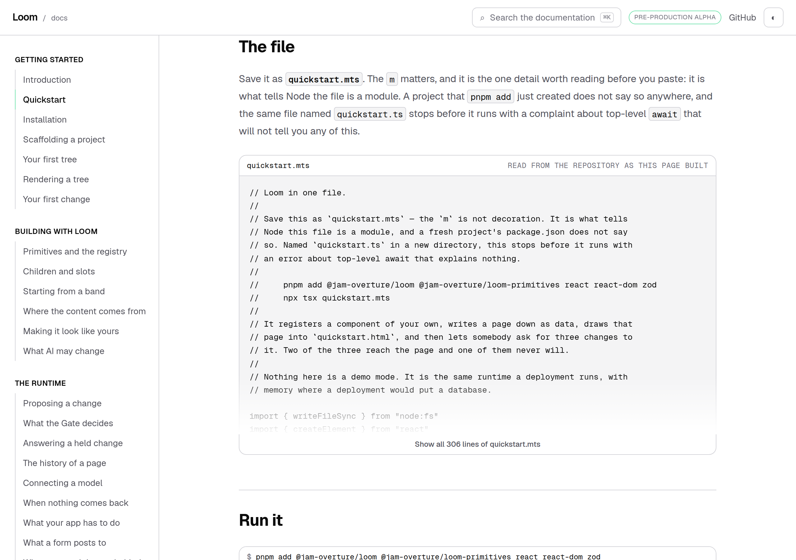
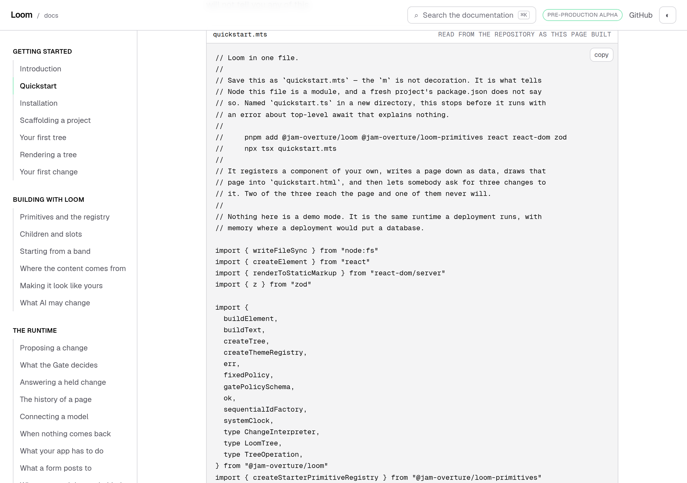
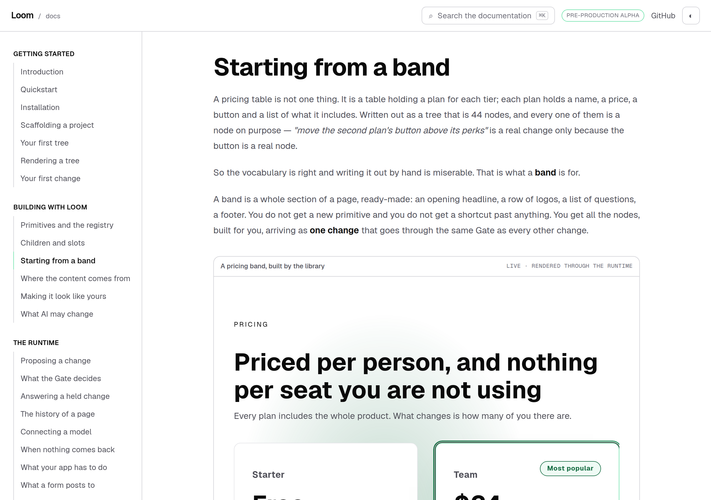
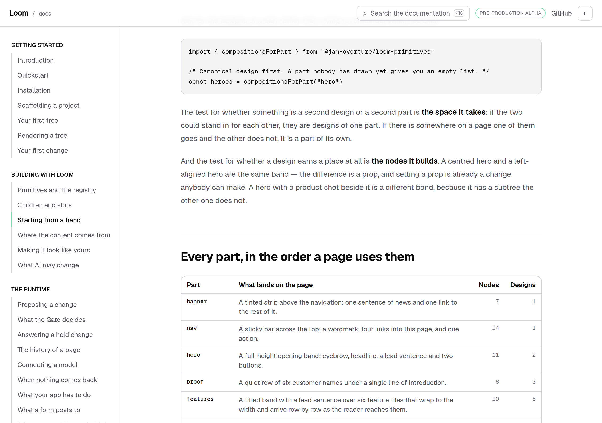
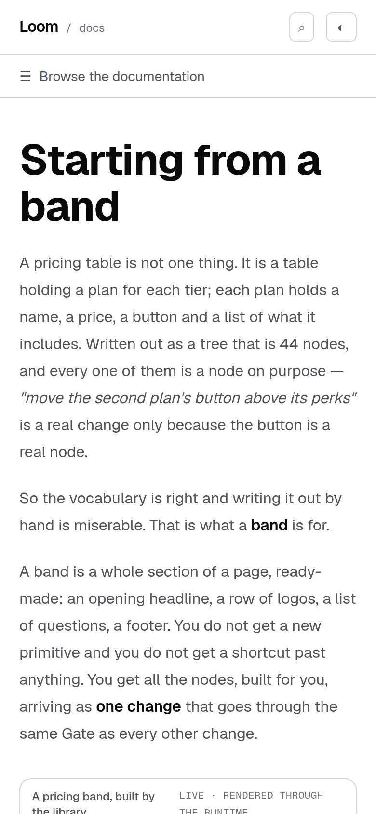
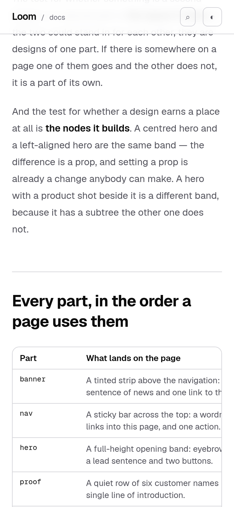

# 29 September 2026 — starting from a band

**Routine:** `Loom docs` · **Branch:** `docs-40-starting-from-a-band` ·
**Section:** §4c

## Maintainer instructions first

Four arrived during the run, and they are the first four sections below. The
planned unit follows them.

### 1 — the summary under the arrival route is gone

> *"This section is unnecessary and can be removed from the Docs."*

The footer under the six steps on *Introduction* — *"6 pages of the 27 on this
site, 20 code blocks, about 21 minutes of reading"*, the paragraph about the
typechecker, and the link past the first three steps — together with the
sentence below it, *"Nothing below is needed to start."* The screenshot framed
all of it from the rule downward, so all of it went.

*Step six, and then straight into the argument.*

**The totals themselves stay**, and this is the one thing worth reading twice:
`ARRIVAL_TOTALS` is what holds the route to the hour the heading above it
promises, and it does that at **import time** — the module throws if the six
pages add up to more than sixty minutes. Deleting the paragraph deletes the
place it was printed, not the check. `ARRIVAL_SHORTCUT_HREF` did go: it existed
for the one link in that paragraph, and an exported constant nothing renders,
with a test asserting it resolves, is the second copy this repository keeps
filing findings about.

Three tests in `arrival-route.test.tsx` and one in `arrival.test.ts` are gone
with it. They asserted the content of a thing that no longer exists; nothing was
weakened to keep a number green.

### 2 — US spelling, across this lane

> *"Behaviour = Behavior · Colour = Color · Anything that ends in "ise", when it
> should be "ize""*

**52 files**, all inside `app/(docs)/`. `behaviour`/`colour` are substring swaps
because neither is ever part of another word; the third rule is a **list rather
than a rule**, deliberately, because `promise`, `exercise`, `precise`, `premise`,
`surprise`, `supervise`, `likewise` and `otherwise` all end in `-ise` and none of
them is a `-ize` word. What was converted: `normalise`, `canonicalise`,
`capitalise`, `generalise`, `internalise`, `itemise`, `optimisation`,
`recognise`, `reorganise`, `serialise`, `summarise`, `synthesise`,
`unrecognised`, `vandalise` and their inflections.

`_components/brand-colour.tsx` is now `brand-color.tsx`, exporting `BrandColor`.

**What was deliberately not touched, and why it matters.** Ten names in the
**published API of both packages** are British — `colour`, `colourDifference`,
`ColourPairing`, `ColourVerdict`, `probeColourPairings`, `BehaviourName`,
`BehaviourResolver`, `isBehaviourName`, `isBehaviourResolver`,
`resolveBehaviours`. They live in `src/theme/`, `src/sdk/`, `src/render/` and
`src/primitives/`, which are not this lane's, and renaming them is a **breaking
change to two published packages** — the open 27 September finding, which
recommends doing it deliberately at the next minor. No hand-written page on this
site names any of them; they appear only in `reference.generated.json`, which is
generated from `src/` and was not edited. So this lane is now internally
consistent and the site will print British spelling in the generated reference
until that finding is answered. That is the honest state and it is a reason to
answer the finding rather than a reason to reach into another lane.

### 3 — the quickstart file opens and closes

> *"This embedded code quickstart.mts takes up way too much of the UI. It should
> have a show more / show less feature."*

| collapsed | expanded |
| --- | --- |
|  |  |

306 lines, clamped to 26rem with a fade and a button that says how many lines it
is holding back. **Clamped, never truncated** — and that is the whole design.
The complete file is in the markup at every moment, so the copy button still
takes the whole of it, find-in-page still matches below the fold, and the search
index is unaffected. A version that rendered forty lines and fetched the rest on
a click would look identical in this screenshot and would break all three.

Collapsed is the **initial** state rather than a correction applied after
hydration, so nothing jumps on load. The cost is the one every interactive thing
on this site already has: the button needs JavaScript.

`LongCode` is docs-site chrome, which 0067 exempts from being composed out of
registered primitives. It is general — `lines`, `label` and the clamped height
are props — but it has exactly one caller today and is not offered to MDX.

### 4 — the alpha callout on the quickstart is gone

> *"Take this error message out."*

The `CAREFUL / Pre-production alpha…` banner above *The file*. Removed.

**Two neighbours, and one of them was false.** The same banner appears on
*Installation* and on *Scaffolding a project*. The installation one says
something different and longer — which parts of the two packages are stable
before 1.0 — and is left alone; say the word and it goes too. The scaffolding
one said *"the package is not on a public registry yet, so there is no `npx` to
run it with"*, which stopped being true on 27 September when both packages
published. A false sentence on a page in this lane is this lane's to fix, so it
is now a note carrying only the half that is still true (the in-repository
command), and it does not claim anything about `npx` that this sandbox cannot
verify.

## What this run was

The oldest open thing this lane owned, named as *what I would write next* in
yesterday's report and true since 27 September:

> **`@jam-overture/loom-primitives/compositions`.** The published package has a
> second subpath — 44 starting compositions, `PAGE_SEQUENCE`,
> `compositionsForPart` — and this site does not mention it anywhere. A reader
> learning the vocabulary from these pages does not learn that whole bands
> exist.

No maintainer comments were open on the lane's pull requests at the start of the
run — #435 merged yesterday — so the planned work came off the findings queue.
The four instructions above arrived while it was being built.

*The new page, and the thing it is about: the pricing band rendered live, built
by the library rather than by this repository.*

## The plain version

The starter library can build a whole **section** of a page — an opening
headline, a price list, a list of questions, a footer — and drop it in as a
single change. Forty-four of them ship. The site had never said so.

The page is *Starting from a band*, the third page of **Building with Loom**,
after *Children and slots*. It opens on the concrete case and names the general
rule after it: a pricing table is a tree of 44 nodes and writing it out by hand
is miserable, so here is the thing that writes it out for you — and here is why
it is not a shortcut past anything.

It is placed where it is because it only makes sense after a reader knows what a
primitive is and how one holds another. A band is composition done for you, and
*done for you* is not a first lesson.

## Two examples, and the property that makes them worth having

The site's rule is that an example is a real `LoomTree` mounted through the
runtime. These two go one step further: **their subtrees are not written in this
repository at all.** The catalogue calls `compositionById(part)?.build(ids)` and
puts back whatever comes out.

| | what it shows |
| --- | --- |
| `a-band-dropped-in-whole` | the `pricing` band, 44 nodes, one insert |
| `a-page-that-started-from-bands` | `hero`, `features` and `cta` in page-sequence order, in a frame that scrolls |

So a band that stops building, or starts building a type the registry no longer
has, takes the documentation red — the same guarantee every other example has,
reaching one level further out into the library.

## The page states no number of its own

Every count on the page — how many bands, how many parts, how big the pricing
band is, how big the largest band is, the catalogue's reach against the whole
library — is read from the library at build time through `_lib/compositions.ts`
and rendered by a component.

That is not tidiness. A digit typed into prose is the one kind of staleness
nothing on this site can see, because prose does not fail. So there is a test
whose whole job is that the page contains none of them, and it derives its
forbidden set from the counts themselves — **as digits and as English words**,
because *forty-four* is what the first draft of this page actually said.

*Twenty-two rows, filled in by the library: each part's canonical design's own
sentence about what lands on the page, how many nodes that is, and how many ways
the library draws it.*

## The finding this run is really about

**`@jam-overture/loom-primitives` publishes two doors and this site knew about
one.** The second is `./compositions`, where the 44 bands live under their own
names — `heroBand`, `pricingBand`, `footerBand` — none of which the library's
root door re-exports.

It had been on the registry for two days, named nowhere on this site, and
**every check was green**, including the one whose title is `names exactly what
a reader can import`. That test reads the framework's `package.json`. A second
package is not in it.

This is the fourth instance of one class in three days, and the first where the
uncovered thing was a whole package:

| | the check | what it could not see |
| --- | --- | --- |
| 27 Sep | *imports only what the install line installs* | it collapsed a subpath to its package before comparing |
| 28 Sep | the footer offers every surface in `OTHER_SURFACES` | it read the same list the footer read |
| 28 Sep | the front-door list is complete | derived from the mirror, not the original |
| **29 Sep** | *names exactly what a reader can import* | **derived from one of the two manifests** |

The tell is the one already written down: **name a defect the check would not
survive.** Here it takes one sentence — *the library publishes a second door and
nothing mentions it.*

`teaches.test.ts` now reads `tools/package/manifest.ts`, brace-matches its
`exports` map, and asserts every door in it is named somewhere the site shows.
Read as text rather than imported, which is the convention `packages.test.ts`
already set for that file: it is another lane's and outside this application's
compilation.

## What I could not do, and said so on the page instead

**This repository cannot import `@jam-overture/loom-primitives/compositions`.**
The framework's `exports` has `./primitives` and nothing under it, so
`@jam-overture/loom/primitives/compositions` does not resolve, and the fence
pipeline — which rewrites a reader's package name to the door that resolves here
— has nothing to rewrite the subpath to.

So the page teaches the catalogue door in every block it compiles, and names the
subpath **in prose only**, under a callout that says it is the one import here
nothing checks. That is documenting what is true rather than what I wish were
true, and it is the worse of the two outcomes: the import a reader is most
likely to get wrong is the one this site cannot execute.

It is filed for `Loom daily build` with the remedy, which is one line in the root
manifest and nothing published changing — `"./primitives/compositions"` in
`exports`, withheld from `publishConfig.exports` exactly as `./primitives`
already is. The second consequence is the one worth reading: `entry-points.test.ts`
maps every withheld door through `publishedSpecifier`, so that line would also
oblige the door to have a generated API reference page, which today it neither
has nor is asked for. The docs side is four small edits and I will take it the
same day.

**No decision record.** Nothing here touches the tree schema, the delta model or
an Accepted record. 0194 already decides how the library ships; this is a page
about what is inside it.

## At 390 pixels

`scrollWidth 390 / innerWidth 390` on every shot.

The parts table has four columns and a sentence in one of them, and the first
version of it set that sentence **one word to a line** — which passed every
measurement this repository takes, because the page was still 390 wide. It has a
`min-w-[36rem]` now, so the table keeps its shape and the container scrolls
sideways; `Nodes` and `Designs` are a horizontal scroll away rather than
shredded. Worth naming as a limit of the instrument: an inner scroll is
invisible to both the overflow measurement and the camera.

| the page | the parts table |
| --- | --- |
|  |  |

## Tests

`pnpm install && pnpm verify` at the repository root: **green, exit 0**, on a
`dist` and a `.next` deleted first, with the status written to a file as the last
thing on its own line and read in a separate command.

Measured twice: once on the branch alone, and again after `main` moved under it
(four pull requests landed while this was being built) and was merged in. The
second reading is the one that matters and is what the pull request quotes.

| | branched from `657d27e` | after merging `main` at `bab2de2` |
| --- | --- | --- |
| `@jam-overture/loom` | 166 files / 3,250 tests | **167 / 3,280** — `src/` was not opened by this branch; both numbers moved because `main` did |
| `@loom/app` | 325 / 5,619 | **335 / 5,809** |
| findings ledger | 873 entries, 0 malformed | **889**, 0 malformed |
| prerender | 117 pages, 1,371 junctions | **119 / 1,371**, 0 run together, 0 unserved |

The merge was clean — no conflicted file, `FINDINGS.md` auto-merged — and the
gate was re-run from a deleted `dist` and `.next` on the merged head rather than
relayed from the reading before it.

**+35 tests added, 4 removed, none weakened, none skipped.** Two new files:
`compositions.test.ts` (22) and `long-code.test.tsx` (7). `teaches.test.ts`
gains 4; `catalogue.test.tsx` gains 2, because it has one test per registered
example and there are two more. The four removed are the three in
`arrival-route.test.tsx` and the one in `arrival.test.ts` that asserted the
content of the section the maintainer had removed — a deleted claim rather than
a weakened one. The `main` column for the app is arithmetic on this branch's
reading and agrees with #444's and #445's independent readings of the same
commit.

Green is not evidence, so **nine mutations** were introduced one at a time, files
restored from byte-for-byte copies and `diff` clean on all three afterwards:

| what was broken | tests that went red |
| --- | --- |
| the page stops naming the compositions door | 1 |
| a part is dropped from the parts table | **3** |
| the page types a count as a digit | 1 |
| the page types a count as a word | 1 |
| node counting stops counting slots | 1 |
| every part's designs come from `hero` | 3 |
| an example is hand-built instead of built by the library | **0, then 1** |
| the three-band example loses its middle band | 1 |
| the page drops one of its two examples | 1 |

**The seventh row is the one that changed the diff.** On the first run it was
caught by nothing: replacing the library's band with a hand-built tree of the
same shape rendered, produced no diagnostics, kept its id, and left the caption
saying the library built it. The page's whole claim is that the screen below it
came out of `@jam-overture/loom-primitives`, and nothing compared the two.

So a test was added that does, and it is exact rather than approximate: both
examples build from a deterministic id factory and the band's nodes are minted
before the page root that holds them, so rebuilding the same bands from a fresh
factory of the same name gives back a subtree equal **node for node, ids
included**. A drifting band is red, a substituted one is red, and a band whose
ids stop being deterministic is red — which matters, because the propose-a-change
box beside the example addresses nodes by id.

## Scope

`apps/loom/app/(docs)/` only, plus `FINDINGS.md`, this report and its images.

The planned unit is eight files: four new (`_lib/compositions.ts`,
`_lib/compositions.test.ts`, `_components/bands.tsx`, the page), one generated
(`_lib/fences/compiled/building-with-loom--starting-from-a-band.ts`, by
`pnpm docs:fences`) and three touched (`_lib/nav.ts`,
`_lib/examples/catalogue.ts`, `_lib/teaches.test.ts`).

The maintainer's four add two new files (`_components/long-code.tsx` and its
test), one rename (`brand-colour.tsx` → `brand-color.tsx`) and edits to the
arrival route, the quickstart component, three pages, and the 52 files the
spelling sweep touched.

**No file in another lane was opened.** `git diff origin/main -- src/` is empty,
and so is the same diff against every other route group and against `tools/` —
including under the spelling sweep, which is the one change on this branch that
had a reason to reach outside. No open pull request of this lane's existed at
the start of the run.

## Findings

**Filed — two:**

- **The second package's second door cannot be imported here**, so 44 named
  bands can be documented and never executed. Owned by `Loom daily build`, one
  line in the root `exports` map, nothing published changing, and it unblocks the
  door's reference page as well as the page's code blocks.
- **A check derived from one of two manifests is silent about the other.**
  Filed and closed in the same run; what stays open is that being *named* is not
  being *documented*, and the sweep added here would pass on a site that mentions
  the door once.

**Advanced, not closed — one.** The 27 September entry on British spellings in
the published API. This lane's prose and its own identifiers are converted; the
ten exported names are not, for the reason that entry gives. A dated note says
so, so the next run does not re-measure it.

**Not re-filed:** the preview URL cannot be verified from this sandbox
(15 September); the screenshot harness photographs an address while the theme
lives in `localStorage`, so the pictures are light (14–16 September); the phone
heading break on an entry-point page (23 September).

## What I would write next

- **`themeStyle` and `themeGround`.** The 27 September entry, still open and
  owned here: the theming page never names the function a host calls to mount a
  theme, and as of #410 there are two of them. It is now the oldest open thing
  this lane owns.
- **A `tone: "surface"` audit of this site's four bands**, against the finding
  `Loom marketing` filed on 28 September.
- **The `<wbr/>` at each slash in the entry-point heading**, so the four longest
  doors stop breaking mid-word on a phone.
