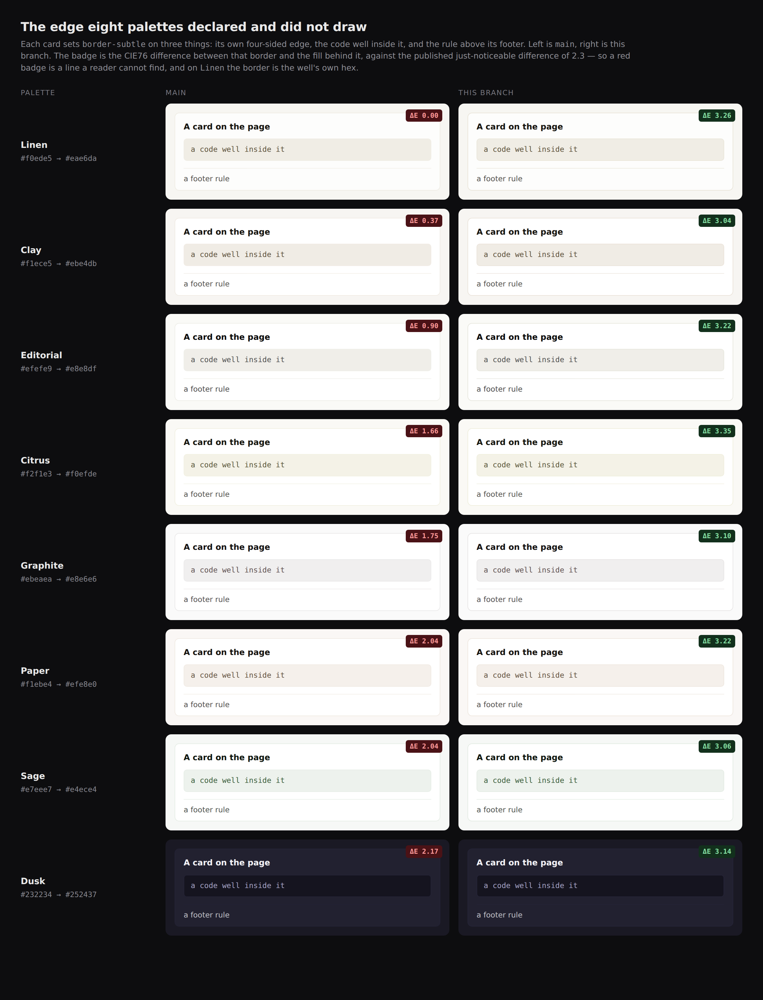

# A line against the ground it is drawn on — the instrument had one question and the palettes needed the other one

**Routine:** `Loom daily build` (framework, `src/` except `src/primitives/`, and the application shell)
**Date:** 2026-09-29
**Section:** §4b (theme and palettes), on 0204's filed half
**Branch:** `framework-59-a-line-against-the-ground-it-is-drawn-on`, cut from `origin/main` at `8db2cfb`
**Records added:** [0205](../decisions/0205-a-line-the-library-declares-is-measured-against-every-ground-it-is-drawn-on.md) — Accepted, §4b. None superseded
**Finding closed:** the second half of *`border-subtle` is under the visibility floor on four of the eight starter palettes* — `Loom primitives`, 29 September
**Finding filed:** *0204 and `hairline()` both count the starter set as eight palettes, and it is twenty-one* — for `Loom primitives`

*The eight palettes this run corrected, `main` on the left and this branch on the
right. Each card sets `border-subtle` on three things — its own four-sided edge,
the code well inside it, and the rule above its footer — and the badge is the
CIE76 difference between that border and the fill behind it. On `Linen` the
border is the well's own hex, so the well has no edge and the footer has no rule;
on `Clay` and `Editorial` you have to look for them. Drawn from the palette
literals at the two commits, 1180×1545@2×.*

## The migration is done, and this run did not touch it

Checked first, because three routines are waiting on the answer and a fresh
session has no memory of it. **`apps/loom` exists with all five route groups** —
`(marketing)`, `(docs)`, `(lessons)`, `(portal)`, `(demo)` — `apps/` holds
exactly one package, and there is no `apps/portal` or `apps/docs`. Nothing is
half-migrated, this run added nothing to it, and the tree crosses this run
boundary in one piece.

## What was completed, in plain language

`separation.ts` is the module that asks whether two colours a reader is meant to
tell apart are far enough apart. It has been right about that question since
23 August. **It could not ask a second question that looks like the same one and
is not: whether a line the library declares can be seen at all.**

The difference matters because of how a mark is treated. A pairing may say *these
two fills are allowed to be equal, because a border separates them* — and then
the border is measured only when the fills have collapsed. On a palette whose two
fills differ, nothing ever looks at the border. So a card could declare an edge,
a palette could draw that edge in the fill's own colour, and every test in the
repository stayed green.

**Eight of the twenty-one starter palettes were doing exactly that.** `linen`
drew the edge of every card, badge, tier and code well in the well's own hex —
ΔE 0.00, the same six characters — and `clay` at 0.37, `editorial` at 0.90.

Three things now exist that did not:

1. **`PALETTE_MARK_GROUNDINGS`** — each border tier, the grounds the library
   draws it against, and where. Declared, not derived, for the reason the peer
   list is: a stylesheet rule can say a border is *set*, and only a person can
   say it is meant to be *seen*.
2. **`auditMarkGroundings`** — measures every declared mark against every one of
   its grounds and reports the ones under the floor. A colour it cannot measure
   counts as a line it cannot find.
3. **`solveMarkLightness`** in `derive.ts` — the derivation used to put
   `border-subtle` at a fixed lightness two points from the muted well, which is
   why seven of the eight were derived rather than typed. It now searches for the
   lightness *nearest* the one it was given that clears the target on every
   ground.

And the eight palettes are corrected: one hex each, nothing else in any palette
moved.

## The decision that was not obvious

**The finding asked for one line and it would have been the wrong line.** Its
words were that adding `border-subtle`/`bg-surface-muted` to `PEER_PAIRINGS` as a
`colour-only` peer *"would have failed on `editorial` the day `paper` and `sage`
were registered."* True, and it declares something the library does not claim: a
card's edge is not something a reader is meant to tell apart from the fill inside
it. 0204 is explicit that the fill is what reads as the card and the edge only
has to stop it. Encoding *this line should be findable* as *these two things mean
different things* makes the pairing list mean two things, and the first casualty
would be its rule that nothing in it may be demoted.

So the shape is a second declaration and a second function rather than a row.
The full argument, and the three other routes rejected, are in 0205.

## Two things left alone on purpose

**`bold` at 2.49 and `harbour` at 2.69 were not repainted.** They clear the floor
the audit asserts. The derivation aims at 3.0 — the published 2.3 plus a margin,
so a later nudge to a background does not silently drop a slot under the bar,
which is the same split `TARGET = TEXT_CONTRAST_MINIMUM + MARGIN` already makes
for ink — but a margin is what a *new* palette starts with, not a reason to
change a shipped one that works.

**`border-default` and `border-strong` are still picked rather than solved.**
Both measure 4 to 15 and 74 to 98 from every ground at every hue the derivation
produces, so solving them would change eighteen palettes to land on the values
they already have. The docstring on the solved slot names the function to reach
for if that stops being true.

## What it cost, said plainly

**The subtle-to-default gap narrowed on two palettes.** On `clay` and `linen`,
`border-subtle` had collapsed onto the muted well, and the direction that gains
separation from the well is toward `border-default`. The gap between the two
tiers goes from about 5.9 to **2.97** on `clay` and **2.70** on `linen`.

Both still clear the just-noticeable difference, and a test now holds the whole
ramp to it. It is a real narrowing and not a win: on those two palettes a card's
edge and a table's row rule are now closer in colour than they were. The case for
paying it is that they were never adjacent — a box edge and a rule between rows
are in different places on a page, and each is judged against its own ground —
where a border a reader cannot find is wrong wherever it is.

## Tests

`pnpm install && pnpm verify` — **green, exit 0**, written to a file as the last
thing on its own line and read in a separate command.

| | `main` at `8db2cfb` | this branch |
| --- | --- | --- |
| `@jam-overture/loom` | 167 files / 3,280 | 167 / **3,294** |
| `@loom/app` | 328 / 5,684 | 328 / 5,684 — untouched |

**14 tests added, none weakened, none skipped.** Eight in
`separation.test.ts`, six in `derive.test.ts`.

### The defect matrix — nine rows, nine caught, first pass

Each defect was restored in the source, the suite was run, and the file was put
back.

| defect restored | caught |
| --- | --- |
| `linen`'s `border-subtle` put back onto its muted well (ΔE 0.00) | 1 test |
| the derivation picks the subtle tier's lightness instead of solving it | 1 test |
| a border whose colour cannot be measured counts as a line that is there | 1 test |
| the audit measures a mark against one ground instead of every ground | 3 tests |
| the derivation aims at the published floor with no margin | 1 test |
| the solver drags the line as far as the target allows rather than the least it can | 2 tests |
| `linen`'s `border-default` moved onto its `border-subtle` | 1 test |
| a grounding names a ground the library's stylesheet never reads | 1 test |
| a mark declared as a ground for itself | 4 tests |

The sharpest row is the third from the top, because it is the one the old code
would have failed: a `MeasuredMark` whose difference is `undefined` must count as
invisible, and the reason is the same one `MeasuredPeer` already gives for a mark
it cannot read — *a defence that cannot be measured is not counted as one*.

There is a tenth check that is not a row, because it is the blind spot itself
rather than a defect: a test plants a palette whose fills plainly differ and
whose border is the well's own colour, then asserts that `auditSeparation`
**passes** it and `auditMarkGroundings` does not. That is the shape of what eight
palettes were doing, pinned so the disjunction cannot quietly come back.

## One file outside this lane

`apps/loom/app/(docs)/_lib/api/reference.generated.json`, regenerated with
`pnpm --filter @loom/app docs:api` — the command its own failing test names.
Eight names are added to the published surface and that file is the generated
ledger of them; every line of the diff is one of the eight. No hand-written
documentation-lane file was touched.

## Open questions

**The border tier's shape, which is the half of the finding that stays open.**
`subtle` is ΔE 0.9 to 9 from its grounds, `default` 4 to 15, `strong` 74 to 98 —
and there is nothing between 15 and 74. A rule that should be *seen* rather than
merely *not missed* has `border-default` and then a cliff. No primitive wants
that value today, so nothing is blocked; whether the tier should offer one is the
palette author's call, and the measurements above are what it would be taken
against.

**Whether `minimal` should be in the mark list at all.** It is the palette all
four surfaces wear and the one palette whose card is *defined* by its border —
`bg-surface` is deliberately `bg-canvas`. It passes comfortably (5.06 at worst),
so nothing was decided. If a future palette wants the `minimal` bargain, the
mark's floor is the thing that stops it being taken carelessly.

## The link that mangled, measured

The pull request body carried three links on the same short commit SHA. Read
back through the API after posting, **one of the three came back wrapped in
double backticks**: the 0205 record at 143 characters, against the figure at 118
and the report at 107, both clean.

143 is under the 149-clean/150-mangled pair #389 established, which had been the
tightest bound in `FINDINGS.md`, and fifteen under the 23 September entry's
*"158 characters or more does not survive."* A fixed per-link threshold cannot
hold both this and #389's clean 149; the 27 September reading — that the limit
is the tail of a budget the whole body spends — explains both. Filed as its own
entry with what it does and does not settle.

It cost one de-linked reference and no rewrite, because the body was read back
before anything else was done with it. That is the step, and it is one call.

**Nothing failed and nothing was skipped in this run.**
