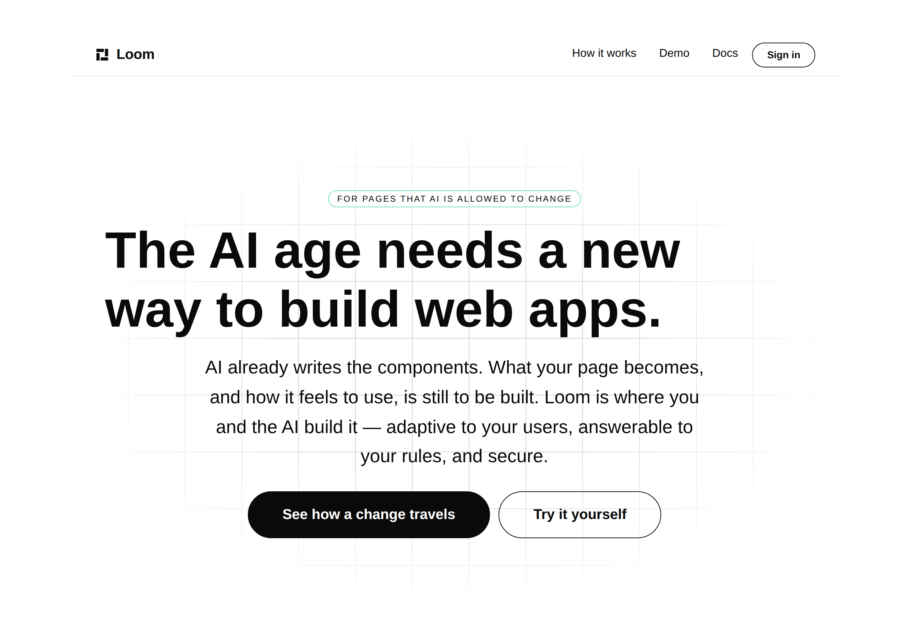
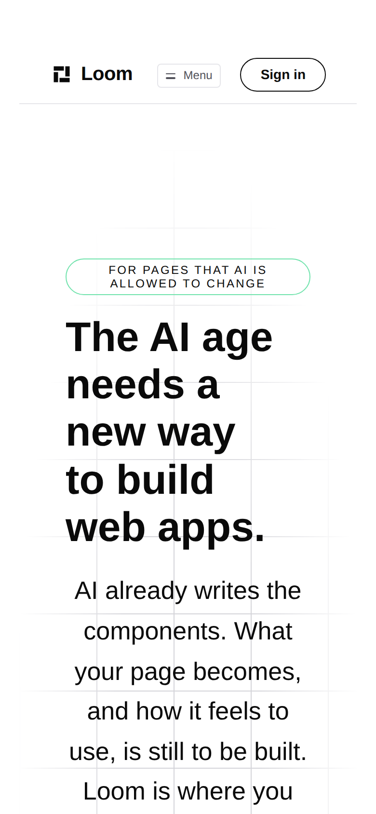
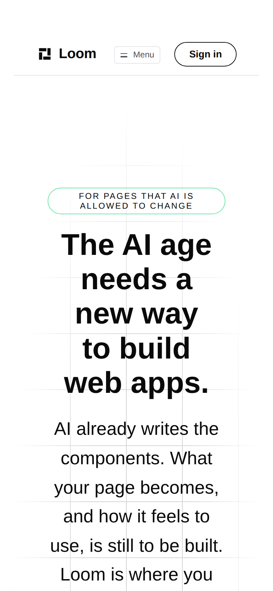
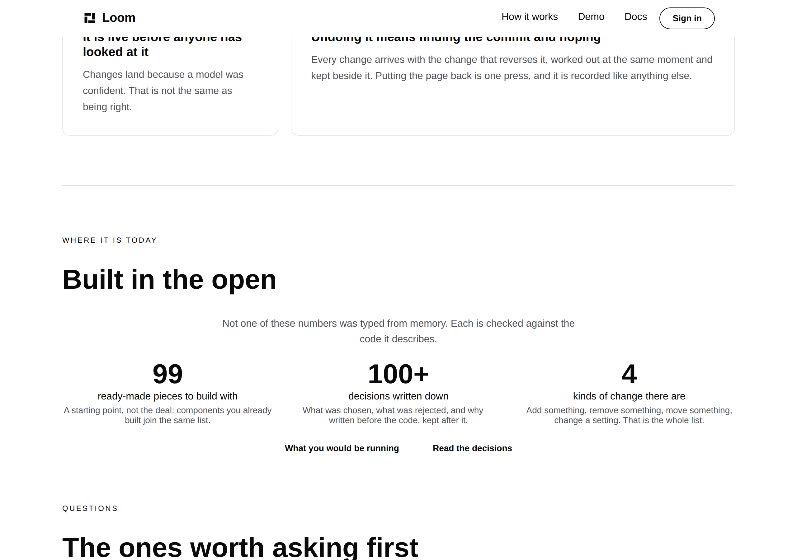
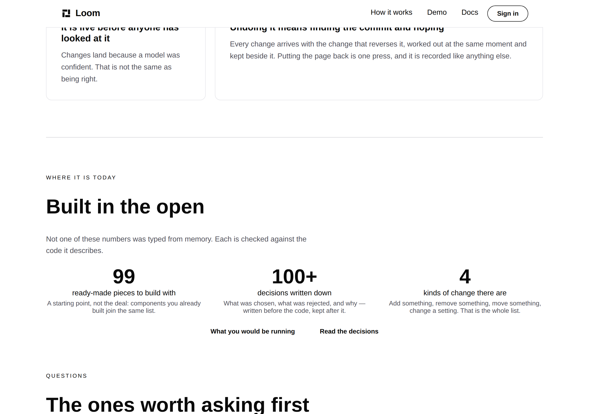

# 2026-09-29 — marketing: the headline in the centred band, and the second one the check found on its way past

The front door's opening band is declared `align: "center"`. Its eyebrow is
centred, its paragraph is centred, its two buttons are centred, and **the
headline was not** — because `loom.hero`'s `align` centres each child's box and
the text inside a box is ranged left until the node holding it says otherwise.

It is the largest type on the most-loaded page this project has, and the one
thing on a stranger's first screen that did not line up.

| the front door, 1280 × 900 | |
| --- | --- |
| before — `main` at `657d27e` |  |
| after — this branch |  |

On a phone it is not subtle at all:

| 390 × 844 | |
| --- | --- |
| before |  |
| after |  |

---

## The measurement, which is the argument

Read off a production `next build` served by `next start`, not from the source.

| | headline `text-align` | headline box | everything else in the band |
| --- | --- | --- | --- |
| 1280 × 900, before | `start` | 984px wide from x=148 — optical centre **139px left of the page's** | centred |
| 390 × 844, before | `start` | five hard-left lines in a **254px** column | centred |
| both, after | `center` | unchanged | unchanged |

Nothing else moved. The headline is the same words, the same measure, the same
two lines at 1280 and five at 390, in the same place on the page — the only
change is which edge they are ragged on.

---

## What shipped

**Two props and a sweep.** No primitive was added, nothing under `src/` was
opened, no component was written, and nothing outside `app/(marketing)/`,
`FINDINGS.md` and `reports/` is in the diff.

| file | what changed |
| --- | --- |
| `_lib/pages/home.ts` | `align: "center"` on the front door's `loom.heading`; the *Built in the open* caption ranged left |
| `_lib/alignment.test.ts` | new — the rule, over every route and every palette |

### The rule, and why it is not a fix to one page

One prop is not a unit. What makes this worth a run is that the same class of
mistake is invisible to every instrument in this repository, so the deliverable
is the invariant rather than the prop:

> **A band and the words in it stand in the same place.**

Stated over the tree, and read off `SITE_ROUTES` and `SITE_THEME_NAMES` rather
than off the three pages this site has today — so a fourth page with a centred
band is checked the day it is added. For a `loom.hero`, the band's own `align`
is the authority; for a `loom.section`, which has no `align`, the band's heading
is. Direct children only: a `loom.prose` inside a card is aligned by the card,
and a rule reaching into those would be asserting something false.

It carries one assertion whose only job is that it cannot pass vacuously — the
front door still **has** a centred band. Without it, deleting the site's last
one would turn the whole sweep green and silent.

### The second one it found

`alignment.test.ts` came back red on a band nobody was looking at, a minute
after it first ran. The front door's *Built in the open* band was a left eyebrow
and a left heading over a **centred** caption and a centred stat row: the
heading hard against the left edge with 700px of nothing beside it, and the
sentence belonging to it floating in the middle of the band.

| *Built in the open*, 1280 | |
| --- | --- |
| before |  |
| after |  |

**It is ranged left rather than centred, and that is forced rather than
preferred.** `loom.section` has no `align`, and it renders its own eyebrow with
no `textAlign` — so `WHERE IT IS TODAY` stays left whatever the nodes inside the
band say. Centring the heading would have swapped one disagreement for a
worse-looking one. Filed; the closing band on the same page is fully centred and
works, and the whole of the difference is that it has no eyebrow.

The three stats keep their own `align: "center"` and the rule does not touch
them, deliberately: a stat centred inside its column is one of three marks laid
out across a row, not a line of the band's running text.

### Both palettes

The fix is a `textAlign`, so a re-theme cannot reach it — and saying so is only
worth anything if it was photographed. `bold`, after:

---

## Findings

**Three filed, one of them closed by this branch.**

- **`loom.hero`'s `align: "center"` centres the boxes and not the words.** For
  `Loom primitives`, with the measurement above. Either the prop emits
  `textAlign` too, or it is named for the axis it actually governs — a judgement
  about a published prop's meaning, and theirs to make. The composition's half
  is correct whichever way it goes.
- **A `loom.section` with an eyebrow cannot be centred at all.** For
  `Loom primitives`. The eyebrow is a string prop the primitive renders itself,
  with no `textAlign` and no prop that moves it.
- **A prop with a safe default is invisible to everything here except a
  camera** — this lane's own, closed here, recorded because it is now **three in
  five days**: `wrap` on the 25th, `anchor` on the 26th, `align` today. All
  three are an optional prop with a sensible default, unset; all three render,
  validate, emit no diagnostic and measure no overflow; all three were found by
  looking at a photograph of a green build. The remedy that generalises is the
  one this run used — **when a camera finds an unset prop, ship the invariant
  rather than the prop.**

Nothing was closed that this lane does not own.

---

## Open questions for the maintainer

Unchanged from the last several runs, and none of them is blocking:

- **The licence line**, still this site's one placeholder, at the foot of every
  page.
- **Positioning, audience and pricing.** Untouched, as always. The headline and
  the paragraph under it are his of 27 September and were not edited here.
- **Whether preview deployments should be `noindex`.** Still filed against the
  shell.

One new one, and it is a design question rather than a positioning one: **should
the front door's opening band be centred at all?** It is the only centred band
on the site; the other two pages' heroes are `align: "start"`. Centring it is
what the band already claimed and this run made true rather than a new decision
— but the alternative, ranging the whole opening band left like every other
band, is one prop away and would also be internally consistent. Worth a word on
the PR either way.

---

## Tests

`pnpm install && pnpm verify` — status written to a file by the gate script as
its own command and read separately, on a `dist` and a `.next` deleted first.

| suite | files | tests |
| --- | --- | --- |
| `@jam-overture/loom` | 166 | 3,250 — untouched |
| `@loom/app` | **324** (323 on `main`) | **5,601** (5,588 on `main`) |

| | |
| --- | --- |
| `pnpm verify` | **green, exit 0** |
| `alignment.test.ts` | **13**, in one new file |
| findings | **874**, 0 malformed (871 on `main`) |
| prerender | 116 pages, 1,304 text junctions, 0 run together; 3 metadata conventions, 0 unserved |

**13 tests added, none weakened, none skipped, no existing assertion rewritten.**
Both fixes were confirmed necessary rather than assumed: reverting the heading's
`align` alone turns 4 of the 13 red, and reverting the caption alone turns the
same 4 red for the other reason. The file was green before either revert and
green after both were restored.

No decision record. `align` is a prop the library already offers, being set;
nothing here touches the tree schema, the delta model or an `Accepted` record.

---

## One thing about the run itself

**The working tree was two days stale for the first half of this run**, and
every measurement taken in that half was of a page that no longer exists. The
site had gone from ten pages to three on 26 September and the headline had been
replaced on the 27th; the first build, the first screenshots and the first
audit — ten heroes, nine of them `align: "start"` — were all of the old tree,
and all internally consistent, which is why nothing looked wrong about them.

What caught it was `git show HEAD:<file> | grep`, after a `sed` of the working
copy printed something the earlier read had not. The discipline that generalises
is the one already in this repository's findings for a different reason: **ask
the file, not your notes.** A measurement is only as current as the last thing
that proved the file under it had not moved, and a page count is a cheap thing
to re-prove — the audit that had to be redone was twenty minutes, and the report
that would have described nine heroes that no longer exist would have been worse
than wasted.
