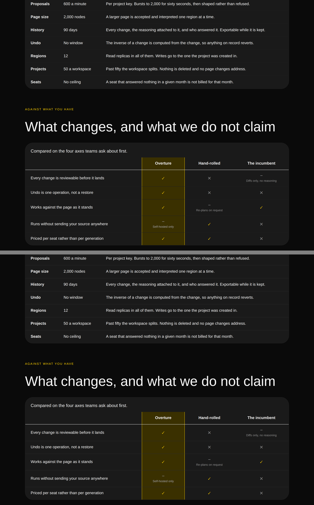
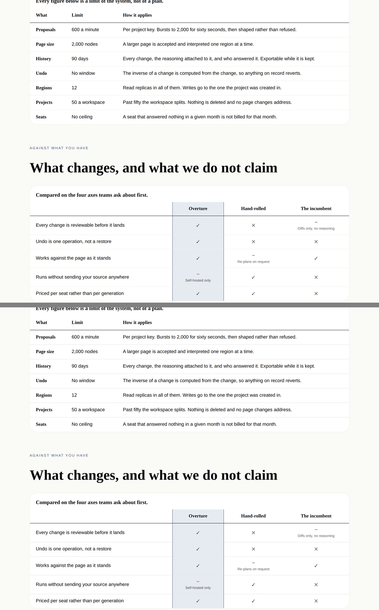
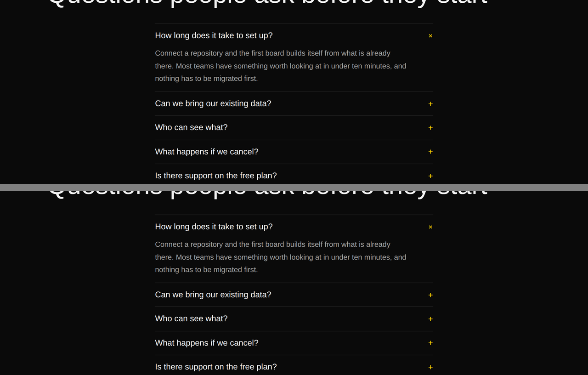

# 2026-09-29 — the lines that were not there, and the instrument that said they were fine

The 26 September entry in `FINDINGS.md` asked for one thing and named the only
thing that could deliver it:

> **What would close it**: a sheet that draws every primitive using
> `border-subtle` under `bold`, and whatever it shows.

It had been open three days, it is this lane's own, and `FINDINGS.md` is on the
brief's *read before choosing work* list. This run built the sheet.

**It is not a breadth run, and the reason is a measurement rather than a
preference.** `docs/primitive-gap-inventory.md` puts the honest ceiling on
distinct primitives at 110–120, the library is at **99**, and of the eleven-odd
that remain, **nine are Tier B** — tabs, tooltip, dialog, lightbox, a pricing
toggle, a segmented control — which that document says *"arrive together or not
at all, because they are one framework decision rather than nine"*, and which are
explicitly not this lane's to work around. The tenth is a radio group, blocked on
a seam `loom.field`'s own docstring lays out: a container cannot tell a child
which element to be, so a choice cannot render as an `<option>` inside a
`<select>` and an `<input>` inside a group. That leaves roughly one.

The catalogue is in the same state. `CATALOGUE_TYPES` now reaches **89 of the 99**
registered primitives, up from 63 of 96 on 19 September; of the ten it does not
reach, five need an image source the catalogue deliberately ships none of, two
are states belonging to a bound region, one is the page root, and one —
`loom.link-trail` — is drawn inside a page for the first time on this run's
sheet.

So the breadth mandate is at its measured ceiling with one framework decision in
front of it, and the quality mandate had a three-day-old audit outstanding on the
token that draws a third of the library's lines. That is what this run did.

---

## What shipped

| | |
| --- | --- |
| `tokens.ts` | `hairline()` — the token a standalone rule takes, with the measurement as its docstring |
| eleven primitives | eighteen lines moved off `border-subtle`, via that one function |
| `stylesheet.ts` | the same, for the nine rules that live in CSS — and **fifty-four duplicated lines removed** |
| [0204](../decisions/0204-a-rule-with-no-fill-beside-it-is-measured-in-delta-e.md) | a rule with no fill beside it is measured in ΔE, not in contrast ratio |
| `library.test.ts` | four tests, three of them confirmed to fail against the unfixed library |
| `the-lines-that-were-not-there.specimen.ts` | the sheet the finding asked for: twelve bands, two palettes, two viewports |

No primitive was added. The library is still at ninety-nine.

---

## One — the audit, and the instrument that nearly stopped it

The finding's own diagnosis was in contrast-ratio terms: on `bold`, a
`border-subtle` hairline is `#1f1f1f` on `#1a1a1a`, *"five points of luminance"*.
Measured properly against the ground each line actually sits on, WCAG contrast
ratio says this:

| | `border-subtle` | `border-default` |
| --- | --- | --- |
| editorial · `bg-surface` | 1.154 | 1.260 |
| editorial · `bg-surface-muted` | 1.005 | 1.086 |
| bold · `bg-surface` | 1.056 | 1.213 |
| bold · `bg-canvas` | 1.201 | 1.379 |

Every cell is within 1.4 of 1.0, which is the ratio of a colour with itself.
**Read literally, that table says the 26 September fix bought nothing and this
audit should propose `border-strong` or give up** — and for about twenty minutes
of this run, that is what it appeared to say.

It is the wrong instrument, and the repository had already written down why.
`src/theme/separation.ts` exists for this exact class of mistake: a contrast
ratio *"compares luminance, and two slots can differ in hue while matching in
luminance"*, so asking WCAG's question about a pair a reader is merely meant to
**distinguish** — rather than to read text off — is the wrong question. It
measures CIE76 ΔE against a **published** just-noticeable difference of 2.3
rather than a number chosen to fit these palettes. The same four rows:

| | `border-subtle` | `border-default` |
| --- | --- | --- |
| editorial · `bg-surface` | 6.48 | 9.06 |
| editorial · `bg-surface-muted` | **0.90** | 4.15 |
| bold · `bg-surface` | **2.49** | 7.80 |
| bold · `bg-canvas` | 9.02 | 14.32 |

A three- to fourfold increase in separation, not a rounding error. **The
26 September remedy was right and the reason given for it was not**, which is
worth more than the fix: the entry framed this as a thing the `bold` palette
does, and the ΔE table says the worst pair in the starter set is `editorial`'s
**0.90 — below the floor, on a light palette** — with `paper` and `sage` also
under it on their muted ground. Four of eight, and the one that got named is the
one that clears the floor.

### What that made visible in the render

The probe walks the rendered page and reports every element with a one- or
two-sided border, its colour, the effective ground behind it, and the separation
between them. Two rows came back at ΔE **0.90** on `editorial`:
`loom.frame`'s chrome bar and `.loom-frame-pins`. A device frame's window chrome,
drawn on the `bg-surface-muted` panel the frame sits on, in a colour a reader
cannot distinguish from it — on the *light* palette, where nobody was looking.

Every changed line, measured before and after:

| | palette | before | after |
| --- | --- | --- | --- |
| `loom.frame` chrome + pins | editorial | **0.90** | 4.15 |
| nav, tables, comparison, event divider, banner, code bar | bold | 2.49 | 7.80 |
| faq separators, milestone rail | editorial | 4.20 | 7.42 |
| nav, tables, comparison, event divider, banner, code bar | editorial | 6.48 | 9.06 |
| `loom.frame` chrome + pins | bold | 7.44 | 12.75 |
| faq separators, milestone rail | bold | 9.02 | 14.32 |

Three marks are invisible to that probe — the breadcrumb chevron is a
`::before`, and the milestone rail and the `diamond` divider's flanks are
`background` rather than `border` — so those three were confirmed separately, by
reading their computed colour out of the browser. All three are `#2a2a2a` on
`bold` and `#e5e5e5` on `editorial`, which is `border-default`.

### Which lines changed, and which deliberately did not

The distinction is not in the source and a grep cannot make it: `border-subtle`
is correct in most of its seventy-odd uses. What **is** in the source is the
shape of the property. A four-sided `border` is a box, and a box is read by the
fill inside it. A `border-block-start`, a `border-inline-end` or a
`scrollbar-color` is a single mark with nothing beside it.

**Changed (18):** the rules between `loom.table` and `loom.comparison-table`
rows, `loom.table-grid`'s cell rules, the separator between `loom.faq` questions
and under a `loom.faq-list`, a ruled `loom.feed`'s row rules, `loom.milestone`'s
rail, `loom.link-trail`'s chevron, `loom.divider`'s `diamond` flanks, the rules
under `loom.nav` and `loom.banner` and over `loom.footer` (twice), `loom.card`'s
footer rule, `loom.code`'s bar, `loom.frame`'s chrome and pin strip, the event
time divider, and two scrollbar thumbs.

**Left alone:** every four-sided `border` — `loom.card`, `loom.badge`,
`loom.icon`, `loom.tier`, `loom.product`, `loom.listing`, `loom.offering`,
`loom.book`, `loom.article`, `loom.quote`, `loom.credential`, `loom.recording`,
`loom.message`, `loom.empty-state`, `loom.embed`, `loom.pin`, `loom.hero`,
`loom.event`, `loom.feature` — and `.loom-pager`'s hover border, which arrives in
the same declaration as a `background-color`. That is about two thirds of the
token's uses and it is the half the rule is protecting.

`border-strong` was not the answer anywhere: it measures 82–98, near-black on a
light palette. `loom.table` keeps it for the one rule under its header and takes
`border-default` between rows, and a test now asserts that pair, because
collapsing the two loses the hierarchy in whichever direction it collapses.

---

## Two — fifty-four lines the sheet was carrying twice

Before editing the chevron's colour, this run counted the sheet's rule blocks.
`.loom-trail-crumb`, the four `.loom-trail-*` separator rules, five
`.loom-carousel*` rules and two `.loom-meter-*` rules were all in the emitted CSS
**twice, byte for byte** — and inside `@media (prefers-reduced-motion: reduce)`,
`.loom-carousel` and `.loom-recording`'s play button twice more.

Nothing rendered differently for it. Every copy set every property its twin set,
to the same value.

**It would have cost this run its own fix.** `.loom-trail-chevron`'s `::before` is
one of the duplicated blocks, and it is one of the eighteen lines. Editing the
first copy changes nothing a browser applies — the second is later at equal
specificity and wins — and every conclusion available from watching a correct fix
fail to appear is a wrong one. It was found by counting before editing.

The guard that now holds it walks **into** at-rules rather than stopping at the
top level, and that is not incidental: the first draft filtered at-rules out,
reported three duplicated blocks, and passed. Removing the filter found the two
in `prefers-reduced-motion`.

---

## Which Hermes fields became nodes, and which stayed props

**None, either way** — no Hermes block was ported. The brief's question has a
real answer here anyway, in the one granularity judgement the run did make.

**`hairline()` is a function, not a prop, and not a palette slot.** Run 0052's
sharper test — *does changing this change the set of nodes?* No: a rule's colour
moves no node, so it is not a delta in disguise. Then run the second test, the
one `loom.frame` cites `loom.hero` for: would any tree, palette or preset ever
want it varied? Also no — a line is the whole mark or it is beside a fill, and
which of those it is, is a fact about the primitive rather than about the page.
So it is neither a node nor a prop, and putting it in either would cost grammar
budget ([0014](../decisions/0014-the-reply-schema-must-fit-a-grammar-budget.md))
on a lever nobody has a reason to pull.

Where it goes instead is the part worth recording. It is not a palette slot
either — that would be a schema change eight registered palettes have to answer,
for a gap `border-default` already fills — so it is a function in `tokens.ts`
beside `monospace()`, which is the same shape: a named helper that carries a
decision and a fallback the raw token cannot.

---

## The pictures

The full sheet is twelve bands at 1280×900 and 390×844 under both starter
palettes, before and after, in this folder. The three pairs below are the ones
that carry the argument; in each, **before is above and after is below**.

### `bold` — the tables



This is the finding, photographed. In the upper half the specification table's
rows run together as one dark block and the comparison table has no grid at all —
and *"What changes, and what we do not claim"* is a band whose entire argument
**is** the grid. In the lower half every row rule is there, and the heavier rule
under each header is still plainly heavier, which is the hierarchy `border-strong`
would have destroyed.

### `editorial` — the same two tables



**The control, and it is meant to look like nothing happened.** 6.48 → 9.06 is a
real change in the measurement and very nearly no change to the eye, which is the
correct outcome: the fix should be large where the line was invisible and
imperceptible where it was already doing its job. Nothing got heavier.

### `bold` — the FAQ separators



The middle case, and the one that argues for measuring rather than eyeballing.
This band sits on `bg-canvas` where `border-subtle` scores 9.02 — comfortably
above the floor — so the rules were *already visible* before. They are firmer
after. A photograph alone would have found nothing to fix here; the table says
why it changed anyway, and the table is also why the run did not go further and
reach for `border-strong`.

---

## What the tests hold, and how that was checked

Three of the four new tests were run against the **unfixed** library before being
kept. The sweep's failure output is the useful artefact:

```
- []
+ [
+   ".loom-scroll-x { scrollbar-color: var(--loom-border-subtle) transparent }",
+   ".loom-compare tbody > tr + tr > * { border-block-start: … }",
+   ".loom-table tbody > tr + tr > * { border-block-start: … }",
+   ".loom-table-grid tr > * + * { border-inline-start: … }",
+   "@container (min-width: 40rem) { border-inline-end: … }",
+   ".loom-trail-chevron > … ::before { … }",
+   ".loom-carousel { scrollbar-color: … }",
+   ".loom-frame-pins { border-block-start: … }",
+   ".loom-trail-chevron > … ::before { … }",     <- the duplicate, visible
+   ".loom-carousel { scrollbar-color: … }",      <- and again
+ ]
```

It **names** the offenders rather than counting them, because a count tells the
next person how many there were and a selector tells them which line on which
band. The `@container` row in that output is the first draft's bug, fixed before
the test was kept: a rule nested in a container query was being reported by the
at-rule that held it, so the failure message named the width at which a line was
wrong instead of naming the line.

**The fourth test exists because two of the others passed vacuously.** The helper
that fetches the emitted stylesheet renders a page and splits the sheet out of
it, and the first draft rendered a `loom.divider` — which asks for no stylesheet.
`libraryCss()` returned `""`, a sweep for offenders in an empty string finds
none, and two tests went green against nothing at all. It was caught because the
third test asserted `toContain` on a specific selector and reported
`expected '' to contain …`. So there is now a test whose only job is that the
sheet is longer than 10,000 characters and parses to more than 200 rules, and it
is named after what it prevents.

| test | against the unfixed library |
| --- | --- |
| *draws no standalone rule in `border-subtle`* | 10 offenders, two of them the duplicate seen twice |
| *keeps a table's row rules separable from the header rule* | `--loom-border-subtle` where `--loom-border-default` is asserted |
| *emits each of its rule blocks once* | 13 duplicated blocks, 2 of them inside a media query |
| *reads a stylesheet that is actually there* | passes either way — it guards the other three |

**Two existing tests were updated and neither was weakened.** One asserts a card
footer has a rule on its top edge and one counts code panels by the bar each one
draws; in both the token was incidental to the claim and the claim is unchanged.
No test was skipped, deleted, or loosened.

---

## The cross-lane edit, declared

`apps/loom/app/(docs)/_lib/api/reference.generated.json` is `Loom daily build`'s
and is regenerated here. This lane's brief names `apps/` as never-cross, so the
reason is worth stating rather than leaving in a diff.

`hairline()` is a **public** export. `src/primitives/index.ts` re-exports
`tokens.ts` wholesale, so it joins `colour`, `space`, `radius` and `monospace` on
the `@jam-overture/loom-primitives` door — which is right, because a host writing
its own primitive against this library needs it for exactly the reason it needs
`colour`. Two checks in the docs app noticed, and both were correct to:

```
the runtime's published surface has moved.
  packageNames: 1083 -> 1084
@jam-overture/loom-primitives hands back a function called hairline
  and no page on this site mentions it. Something is published that
  a reader has no way to find.
```

The fix is the command the first check's own message names —
`pnpm --filter @loom/app docs:api` — and the diff is a regenerated snapshot, not
a hand edit: one new entry and the export count. **No prose page, no component
and no test in `apps/` was touched.** Had the generated file been left stale the
gate would be red, and the alternative — making `hairline` private to the library
— would mean a host cannot draw a rule the way the library draws one, which is
the opposite of what the helper is for.

---

## Gate

`pnpm install && pnpm verify` — **green, exit 0**, on a `dist` and a `.next`
deleted first, with the status written to a file as the last thing on its own
line and read in a separate command.

| suite | files | tests |
| --- | --- | --- |
| `@jam-overture/loom` | 166 | **3,254** (3,250 on `main`) |
| `@loom/app` | 323 | 5,588 — unchanged |

873 findings, 0 malformed (871 on `main`) · 116 prerendered pages, 1,304 text
junctions, 0 run together · 3 metadata conventions, 0 unserved.

**Four tests added, two updated, none weakened, none skipped, none deleted.**

**The first run of the gate came back red and the file is how that was known.**
`verify.exit` said `EXIT=1` while the session's own notification said the command
exited 0 — the compound-line trap `docs/routines.md` documents, arriving in its
third spelling: the status reported for the wrapper is the subshell's, not the
gate's. Both failures were the docs app's two checks on the published surface,
both were correct, and both are the cross-lane edit declared below.

---

## What the library still cannot express

- **A rule that is meant to be *seen*.** The border tier is `subtle` (ΔE 0.9–9),
  `default` (4–15), `strong` (82–98), and nothing between 15 and 82. Nothing
  wants that value today, which is why it is a filed measurement rather than a
  proposal.
- **A radio group, still.** The tenth `loom.field` type and the last unblocked
  row of Tier A, and it is not unblocked: a container cannot tell a child which
  element to be. Unchanged since 14 September and named again here only because
  choosing this run's work meant re-confirming it.
- **Tier B, still.** Nine primitives behind one framework decision on the
  behaviour vocabulary. The breadth mandate cannot clear 110 without it, and
  building a `<details>` here and a CSS-only tab strip there is how a library ends
  up with nine different answers to one question.
- **`21st.dev` is still `EGRESS_BLOCKED`**, re-verified on this run — the
  fifteenth time. Not re-filed; the maintainer answered it on 16 August (*"I can
  add it"*) and the standing instruction until the allowlist lands is to work to
  `loom.hero` and `loom.feature-grid` plus the Hermes content models on disk,
  which is what this run did. The date is appended to the existing entry rather
  than opening a sixteenth.

## Filed

**`src/theme/`** — two things, one entry. The palette measurement above, and a
smaller one that is probably the more useful: `PEER_PAIRINGS` in
`separation.ts` declares the pairs a reader is meant to tell apart, and **not one
of them is a border against the ground it is drawn on**. The instrument that
would have caught this whole audit by itself has existed since 23 August and was
never told about the pair. It lives in `src/theme/` and its `where` fields name
primitives, so it is theme-owned code carrying this lane's knowledge — which is
the likeliest reason nobody owned the gap.
