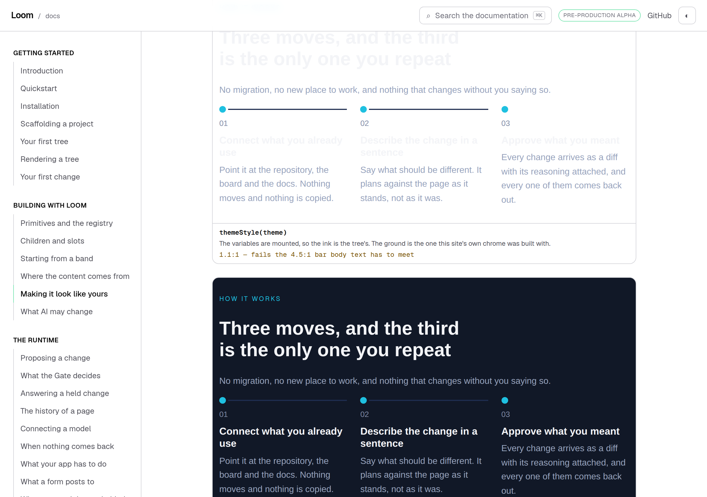
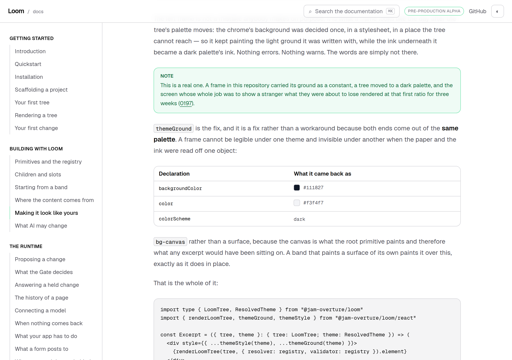
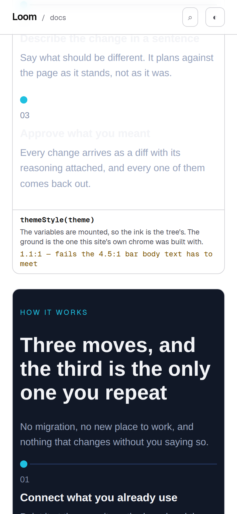

# 30 September 2026 — putting it on a page

**Routine:** `Loom docs` · **Branch:** `docs-40-starting-from-a-band` (pushed
onto the open pull request, #453) · **Section:** §4c

## What this run was

The oldest open thing this lane owned, filed by `Loom daily build` on
27 September and named as *what I would write next* in the last two reports:

> *Searching every `.md` and `.mdx` in the repository for `themeStyle` returns
> records, reports, this file, and nothing else. **Zero documentation pages.***

*Making it look like yours* ran from *The three ids, and where they go* through
*Registering your own* to *What a model gets shown*, and never named the function
a host calls to put a theme on anything. A reader could finish it knowing what a
palette is, what all seventeen slots mean and whether it can be read — and not
know how to mount one.

There is now a section between *Registering your own* and *What a model gets
shown* called **Putting it on a page**.



*The same band, rendered once and placed in two frames. Both call `themeStyle`,
so the ink is the tree's in both. The top one kept the ground its own chrome was
built with.*

## The plain version

The section answers one question — *what do I actually call?* — and the answer
has two halves, which is why it is a section rather than a sentence.

**Drawing a whole page: nothing.** The root primitive mounts the theme on its own
element and everything below inherits it. This is the ordinary case and the page
already implied it; it had never said it, so a reader had no way to know they
were done.

**Drawing part of a tree: two functions.** An excerpt — one band, in your own
layout — has no root primitive above it, so the two jobs that primitive was
quietly doing become yours.

| you call | it hands you | you need it |
| --- | --- | --- |
| `themeStyle(theme)` | every `--loom-*` property, as a React `style` object | around **any** excerpt |
| `themeGround(theme)` | the paper: a background color, a text color, a `color-scheme` | only when your frame **stands in for the page** |

The last line of the section is the part a reader most needs and the part a
reference entry cannot give them: *if you are drawing whole pages you will never
need the second one.* A pair of functions with no stated division of labour is
two ways to do one thing, and a reader will pick the wrong one half the time.

## The demonstration is a reproduction

The two frames are not an illustration of a failure. They are the failure, staged
out of two registered palettes so it comes back identical on every build:

- the frame paints the ground **this site's own chrome was built with** — the
  `minimal` palette's canvas, read from the registry rather than typed;
- the excerpt wears **`midnight`**, a dark palette;
- both frames carry `themeStyle`, so the ink is the tree's in both.

`contrastRatio` — the same function behind the palette audit further up the same
page — is asked what that costs. **1.1:1** against **16.1:1**, printed under each
frame, against the 4.5:1 bar.

That first number is not chosen for effect. It is the ratio
[0197](../decisions/0197-a-host-may-ask-which-way-round-a-palette-is-and-a-frame-standing-in-for-the-page-is-handed-both-ends.md)
records from the demo surface, where a stylesheet held a ground as a constant,
`DEMO_STARTING_THEME` moved to a dark palette, and the screen whose whole job was
to show a stranger what they were about to lose rendered like the top frame for
three weeks. Nothing errored. The page states neither figure in prose — there is
a test whose only job is that it does not.



*Three rows, read off the returned object rather than typed, so a fourth
declaration on `ThemeGround` appears here and a renamed one cannot leave a stale
row behind.*

## The band is the library's, and the comparison is one render

Two things make the section evidence rather than decoration, and both are tested
because neither is visible:

- **The excerpt is `compositionById("steps")`**, built by the starter library.
  `mounting.test.ts` compares it to a second build of the same composition node
  for node, ids included — the check the bands page learned to write on
  28 September, after a hand-built stand-in of the same shape passed everything.
- **The tree is rendered once and placed twice.** If the two frames ever held
  different markup, every sentence about *the same band* would be false and
  nothing else here would notice. `theme-mount.test.tsx` compares their
  `innerHTML`.

A diagnostic from that render throws at module scope rather than being displayed.
An `<Example>` shows its diagnostics because a reader may change the tree; this
is a measurement, and a measurement whose subject did not render as asked is not
one.

## The mistake this run made, and the only thing that caught it

The first band chosen was `proof` — the logo wall. Short, wide, fits two frames
side by side, no `tone` of its own. Every test above passed on it.

**It sets none of its words in `fg-default`.** Six customer names and a line of
introduction, all `fg-muted`, which is lighter and clears the host's light ground
comfortably. The page rendered six names anybody could read, under a caption
saying — truthfully — *1.1:1, fails the 4.5:1 bar*.

Every assertion was correct, of the right quantity, computed the right way. What
was wrong was the relationship between the number and the picture beside it, and
neither half was defective. **It was caught by looking at the screenshot**, and
there was no other way it could have been.

This is a different class from the three already in the ledger, which are all
*a check derived from the thing it checks cannot see it shrink*. It is filed as
its own entry with the narrow remedy the fix demonstrates — *a figure printed
under a picture has to be about something visible in that picture* — and an
honest note that the general version is real work nobody has done.

The frames are stacked rather than side by side for the same reason the band
changed: two bands in half-columns is a band laid out for a phone and
photographed on a desktop, and the first version cropped.

## At 390 pixels

`scrollWidth 390 / innerWidth 390` on all three shots. The frames stack, the band
lays out as it does on a phone, and the caption under each keeps its ratio on one
line at font size.



## The code block compiles

The section ends with the four lines a reader copies, and it is a `tsx` fence, so
the fence pipeline put it into the page's program and `tsc` read it:

```tsx
const Excerpt = ({ tree, theme }: { tree: LoomTree; theme: ResolvedTheme }) => (
  <div style={{ ...themeStyle(theme), ...themeGround(theme) }}>
    {renderLoomTree(tree, { resolver: registry, validator: registry }).element}
  </div>
)
```

`registry` is the story's and is declared in the page's context file;
`LoomTree`, `ResolvedTheme`, `themeStyle`, `themeGround` and `renderLoomTree` are
the runtime's and are imported in the block, which is the rule that keeps a
context file from being a place to invent an API. The page's program changed
extension from `.ts` to `.tsx` when this block arrived, which
`pnpm --filter @loom/app docs:fences` handles by emptying the directory first.

## Decisions taken that were not specified

**No decision record.** Nothing here touches the tree schema, the delta model or
an Accepted record. 0121 and 0197 already decided what these two functions are
for; this documents them.

**A dark palette for the excerpt, and it is load-bearing.** Everything on this
site is `minimal`, which is light. Under two light palettes a frame painting the
wrong ground looks very nearly right — which is how the original defect survived
three weeks — so the demonstration would have demonstrated nothing.

**The house ground is read from the registry rather than written as a hex.** It
is still a constant in the sense that matters, which is that it was decided
somewhere the tree's palette cannot reach. Typing the hex would have been more
literal and would have broken this lane's own rule that nothing here names a
color.

**The section goes after *Registering your own*, not after *The three ids*.**
Both are places a host is writing code, and this one is the sequel to the other:
you registered it, you passed it to the render — now where does it get mounted.
Putting it earlier would have split the three-ids section's argument in half.

## Tests

`pnpm install && pnpm verify` at the repository root: **green, exit 0**, on a
`dist` and a `.next` deleted first, with the status written to a file as the last
thing on its own line and read in a separate command.

| | PR head before this run | this run |
| --- | --- | --- |
| `@jam-overture/loom` | 167 files / 3,280 tests | **167 / 3,280** — `src/` was not opened |
| `@loom/app` | 335 / 5,809 | **337 / 5,836** |
| findings ledger | 889 entries, 0 malformed | **890**, 0 malformed |
| prerender | 119 pages, 1,371 junctions | **119 / 1,385**, 0 run together, 0 unserved |

**+27 tests in two new files**, none weakened, none skipped.

Green is not evidence, so **nine mutations** were introduced one at a time
against the final code, files restored from byte-for-byte copies and `diff` clean
on all three afterwards:

| what was broken | tests that went red |
| --- | --- |
| the fixed frame stops calling `themeGround` and keeps the house ground | 2 |
| the broken frame quietly gets the theme's ground too | 2 |
| the excerpt wears a light palette, so the comparison stops comparing | **3** |
| the band is swapped for a tree of the same shape with one prop changed | 1 |
| only one frame gets the variables | 1 |
| the ground table drops its last row | 1 |
| a measured ratio is typed into the page's prose | 1 |
| the excerpt is a band that paints its own surface | 1 |
| both captions print the ratio that reads better | 2 |

Nothing survived. The third row is the one the section exists for: a light
palette leaves both frames looking fine and every *shape* test green, and what
goes red is the pair asserting that one side still fails the bar and the other
still clears it — a demonstration is allowed to stop demonstrating only over a
red test.

## Scope

`apps/loom/app/(docs)/` only, plus `FINDINGS.md`, this report and its three
images. Six files: four new (`_lib/mounting.ts`, `_lib/mounting.test.ts`,
`_components/theme-mount.tsx`, `_components/theme-mount.test.tsx`) and two
touched (the theming page, and its fence context file). The page's generated
program is regenerated rather than edited.

**No file in another lane was opened.** `git diff origin/main -- src/ tools/` is
empty, and so is the same diff against every other route group.

This lane already had an open pull request, so this is a push onto
`docs-40-starting-from-a-band` rather than a second branch.

## Findings

**Closed — one.** The 27 September `themeStyle` entry, with a note recording why
the *the API reference is the right home* answer it offered was not taken: these
two functions are not a signature a reader looks up, they are the step the page
never mentioned, and a reference entry nobody has a reason to look for does not
supply a missing step.

**Filed — one.** *A demonstration can measure one ink and show a different one,
and every check stays green* — the logo-wall mistake above, with the narrow
remedy and an honest note that the general version is unbuilt.

**Not re-filed:** the preview URL cannot be verified from this sandbox
(15 September); the screenshot harness photographs an address while the theme
lives in `localStorage`, so the pictures are light (14–16 September); the phone
heading break on an entry-point page (23 September); the ten British names in the
published API (27 September, advanced yesterday and awaiting the maintainer's
answer on #453).

## What I would write next

- **A `tone: "surface"` audit of this site's four bands**, against the finding
  `Loom marketing` filed on 28 September. It is now the oldest open thing here,
  and this run brushed against it — `metrics` was rejected as the excerpt because
  its `tone: "surface"` would have painted over the ground the section is about.
- **The `<wbr/>` at each slash in the entry-point heading**, so the four longest
  doors stop breaking mid-word on a phone.
- **`paletteScheme`**, the other export #410 added. The section now uses its
  result — `colorScheme` in the ground table is what it returns — without naming
  it, which is the right call for that section and leaves the function itself
  undocumented outside the generated reference.
