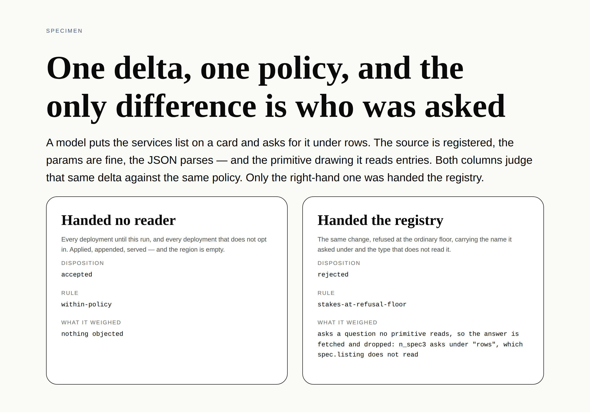

# A name nothing reads — the fourth way a binding can be wrong, refused before it is written

**Routine:** `Loom daily build` (framework, `src/` except `src/primitives/`, and the application shell)
**Date:** 2026-09-30
**Section:** §2 (the write path), completing 0181
**Branch:** `framework-60-a-name-nothing-reads`, off `main` at `f4eca0d`. This lane had **no** open pull request, so this is a new one rather than a push onto an old one
**Records added:** [0208](../decisions/0208-a-question-nothing-reads-is-refused-before-it-is-written.md). **None superseded**; 0198's two counts maintained, with a dated note saying so
**Findings closed:** one. **Filed:** four

*`tools/specimen/unread-binding.specimen.ts`, 1280×900@2×, `editorial` + `editorial-serif` + `comfortable`. **Neither column is typed into the specimen.** Both call `assessChange` and `gate` — the two functions the composition runtime calls — on the same tree, the same delta, the same proposal and the same `defaultGatePolicy`, and draw what comes back. The only difference between them is the sixth argument. The `rows` and the `spec.listing` in the right-hand panel are the runtime's own detail line, which is the whole claim: the refusal carries the string a repairer rewrites.*

## First, the two things a fresh session needs to know

**The migration is done and this run did not touch it.** Checked before anything
else, because a session has no memory of it and three routines were waiting on
the answer: `apps/loom` exists with five route groups — `(marketing)`, `(docs)`,
`(lessons)`, `(portal)`, `(demo)` — `apps/` holds exactly one package, and there
is no `apps/portal` or `apps/docs`. Nothing is half-migrated, and the tree
crosses this run boundary in one piece. The brief's "⚠ your next unit" section is
describing work that landed before 30 September.

**There were no maintainer comments to address.** Three pull requests are open —
#456 `Loom lessons`, #457 `Loom portal`, #458 `Loom demo` — and none of them is
this lane's. Nothing was outstanding.

## What was completed, in plain language

A binding is a question the tree asks under a **name**. There are four ways that
can be wrong, and by this morning three of them were refused before a delta ever
landed: an unregistered source, a param the source did not declare, and a
`loom:data` that does not parse.

The fourth one is the one that *works*. A model asks `catalogue.services` under
`rows`. The source is registered. The params are fine. The JSON parses. The
answer comes back — and the primitive drawing that node looks under `entries`.

So the page renders, nothing is missing from the markup, the region shows its
empty state, and the deployment pays a round trip to its own data on every
request for an answer nobody opens. The only party told is whoever is reading
render diagnostics.

**That is now a refusal**, on any deployment that asks for it. `loom.feed` reads
`entries`, this node asked under `rows`, and the change does not commit.

### Why today and not a month from now

The 22 September entry that asked for this also said when it should be built,
and the sentence is worth quoting because it is the whole reason this run chose
it over anything else in the queue:

> a refusal built before any primitive declares would refuse nothing, and a
> refusal built after several declare is one that starts refusing changes that
> used to commit. It belongs in the same run as the second or third
> declaration, not the tenth.

0179 is on `main`. `loom.feed` and `loom.tally` are the **second** declaration.
The window is open now and closes a little further every time a primitive
declares `reads`.

### The four pieces

| | |
| --- | --- |
| `unreadBindingsIn(node, reads)` | every element in a subtree asking under a name its own primitive says it does not read |
| `ChangeAnalysis.unreadBindings` | the ones the delta **introduced**, measured between the two trees |
| `unread-binding` | a `critical` stake factor naming each node, the name, and the type that does not read it |
| `CompositionRuntime.bindingReader` | optional, absent by default |

## Decisions taken that nothing specified

**The vocabulary is the renderer's own `BindingReader`, not a fourth shape.**
The move 0203 made with `PropsVerdict`, for its reason: what the walk reports as
`data-unread` is then *by construction* what the write path declines to write,
rather than two implementations somebody reads side by side and agrees look
alike. Four tests run both seams over one tree and one registry and require the
answers to match.

It also means there is nothing to wire. An SDK registry satisfies
`BindingReader` structurally, so a host hands the **same object** to both seams.
There is deliberately no `bindingReaderFor(registry)` beside `propsVocabularyFor`
— a registry already *is* one, and a helper wrapping it would only be somewhere
for the two to disagree.

**Measured on the declaration, where the renderer measures on the answers.** The
one place the two walks differ, and it is forced rather than chosen: at the write
path there are no answers, nothing has been asked, and no source has run. It
turns out to be the stronger reading anyway — a name nothing reads is wrong
whether or not the source behind it happens to be up.

**Keyed by node *and* name, where `invalidProps` keys by node alone.** That
factor's argument is that a page has one hole at a node however many ways its
props are wrong, so a node already failing counts as inherited whatever changes
about it. This harm does not aggregate: a node asking three questions nothing
reads is three round trips, and the change that adds the third is answerable for
the third. `repointing.ts` keys the same pair the same way.

**`critical`, and not for the reason the two floors beside it are.**
`unknown-primitive` and `invalid-props` are critical because `renderElement`
returns `null` and a reader meets a hole. **This change draws.** It is ranked
with them because of the *available answer*: the repair is one string, the
declaration holds the correct name, and confirmation would put a change to a
person whose only sensible answer is no and tell them nothing about what to do
instead. That is an inconsistency with how every other factor in `stakes.ts` is
levelled, it is deliberate, and 0208 argues it at length rather than filing it
under a family resemblance.

**No new Gate rung, and `UNDRAWABLE` was not extended.** `critical` plus the
default refusal floor is the whole mechanism. The portal's `UNDRAWABLE` list is
"the two factors that describe a change nobody can carry out" — this change is
carried out fine; what is wrong is that it buys nothing.

**Silent unless a host asked, twice over.** `NOTHING_DECLARED` answers
`undefined` for every type, which is 0181's own bargain rather than a second
judgement, and a primitive whose author declared nothing is reported on by
nothing even on a host that did opt in.

## The other thing in this branch, which is one byte

`src/data/plan.ts` held a **literal NUL** as the separator in its request key.
The key is correct and lesson 18 teaches why it is — a byte that can occur in
neither half. But git calls a file binary when it finds one, so every change
to that module has printed as a pair of byte counts in place of a diff — this
one as `Bin 4378 -> 5050 bytes` — for as long as the file has existed.

It is `"\u0000"` now, behind a named constant with the reason on it, and
`.gitattributes` says the repository's `.ts`, `.tsx` and `.md` are text — the
escape fixes the file and the attribute fixes the class. `Loom lessons` found the
same defect in its own `record.ts` on this same day; that entry did not name this
file, and nobody but this lane owns it.

**This is in the diff and it did not have to be.** It is one line of behaviourless
change in a module this unit does not otherwise touch, and the honest reason it
is here is that it makes this branch's own `plan.ts` diff readable for the first
time. Said plainly rather than folded in.

## Tests

`pnpm install && pnpm verify` — **green, exit 0**, on a deleted `dist` and
`.next`, with the status written to a file as the last thing on its own line and
read in a separate command.

| | `main` at `f4eca0d` | this branch |
| --- | --- | --- |
| `@jam-overture/loom` | 169 files / 3,327 | **169 / 3,362** |
| `@loom/app` | 339 / 5,850 | **339 / 5,851** |
| findings ledger | 900 entries, 0 malformed | **901, 0 malformed** |

119 prerendered pages, 1,385 text junctions, 0 run together; 3 metadata
conventions, 0 unserved.

Both baselines are **measured, not inferred** — `origin/main` at `f4eca0d` in a
separate worktree, installed and built from clean, both suites run. The library's
3,327 is the number every other lane's pull request quotes; the app's 5,850 was
not published anywhere and the arithmetic would have been wrong.

**The app gains one test and this lane added none, which is worth explaining
rather than waving at.** `adapt.test.ts` holds `it.each(RECORD_VOCABULARY)` —
*"every sentence the record can print, held to the register on its own"* — so the
marketing clause this unit had to add became a case, and that case passes: the
sentence uses none of the reserved vocabulary the marketing site refuses to put
in front of a visitor. A test in another lane vetted the wording this lane wrote
into their file, which is more than the finding filed for it can do.

**+35 tests, in five existing files, none weakened, skipped or deleted.** No new
test file: every one of the five modules this unit touches already had a suite
whose subject this belongs to, and a sixth file named after the feature would
have split `analyzeDelta`'s tests across two places.

| where | added | what it holds |
| --- | --- | --- |
| `src/runtime/vocabulary.test.ts` | 13 | the walk, the default, both declaration forms, a malformed `loom:data` |
| `src/runtime/analysis.test.ts` | 9 | introduced versus inherited, the two `configure` routes, the per-name key |
| `src/runtime/pipeline.test.ts` | 6 | the refusal end to end, and the confirmation path recomputing it the same way |
| `src/render/reads.test.ts` | 4 | **the two seams, over one tree** |
| `src/runtime/stakes.test.ts` | 3 | the level, and the detail line word for word |

### It was red three times, and all three were this repository's own checks catching it

| what was red | why |
| --- | --- |
| `src/record-claims.test.ts` | record 0198 says the stake codes are *"one of thirteen fixed strings"*, and there are now fourteen. **The mechanism working**: the test exists to fail until the arithmetic in the prose agrees with the list in `src/`. 0198 now says fourteen, with a dated note; `NUMBER_WORDS` gained an entry, because it stopped at thirteen |
| `app/(lessons)/_lib/transcripts.test.ts` | lesson 7 prints a serialised `ChangeAnalysis` twice, and the record gained a field |
| `app/(lessons)/_lib/declarations.test.ts` | lesson 5 prints `CompositionRuntime` and is held to printing the **whole** type |

### The defect matrix

Each defect restored on the finished implementation, one at a time, files
restored from byte-for-byte copies between runs, and `git diff` clean over the
three of them afterwards. **Run against `src/runtime` and `src/render/reads.test.ts`
rather than the whole suite** — 439 tests across 21 files, which holds every one of the 35 new ones —
because the full 3,362 takes three minutes and nothing outside those two
directories can see this seam. Baseline for the matrix is 0 failures.

| defect restored | caught by |
| --- | --- |
| the fact is never computed — the old behaviour | **7** |
| the factor is not raised at all | **6** |
| an undeclared type is treated as declaring none | **5** |
| the level drifts from `critical` to `high` | **4** |
| `NOTHING_DECLARED` answers `[]` rather than `undefined` | **3** |
| the node's props are withheld, so 0184's form cannot resolve | **3** |
| measured on the resulting tree alone, so inherited counts | **2** |
| the detail drops the name and keeps the node id | **2** |
| a malformed `loom:data` is reported as unread | **1** |
| **keyed by node alone, like `invalidProps`** | **1** |

**Two of those rows are held by one test each, and that is thin enough to say
rather than round off.** The per-name key and the silence on a malformed
`loom:data` are each one assertion away from being unmeasured. Both are
deliberate readings the record argues for at length, which makes a single test a
poor guard for them; neither is thinly *covered* by accident — there is simply
one situation each describes. Named here so the next run that touches this seam
knows which two claims are cheapest to break.

## Findings

**Closed — one.** *A binding name nothing reads is reported and still not
refused* (this lane, 22 September), by this branch and 0208. The closure says
plainly that the level is `critical` for a different reason than the entry's
sibling factors are, which the entry did not anticipate.

**Filed — four.**

1. **For `Loom lessons`:** two lesson files edited from outside the lane. One is a
   number read off an actual run; the other **rewrote a paragraph**, because
   lesson 5's argument about the optional fields was a two-way sort that happened
   to have one field on each side, and now has two on one. I think the new
   sentence is better and it is still theirs to overrule.
2. **For `Loom portal` and `Loom marketing`:** one clause each in their
   plain-language tables, unavoidable because `StakeFactorCode` is a closed set
   and both tables are `Record`s over it. Filed with the three things worth
   knowing before rewording either — chiefly that every other clause in both
   tables is about something a reader would *see* go wrong and this one is not.
3. **For this lane, as a stated limit:** `analyzeDelta` now takes four optional
   trailing vocabularies and is at the end of that shape. Collecting them is a
   breaking change to a published function that lesson 22's transcript calls by
   hand, so it belongs in a run that can rewrite the transcript too.
4. **Nothing for `Loom primitives`.** The `loom.feed` declaration filed on 30
   September is still open and still theirs; this unit needed no primitive to
   change.

## Open questions

**Should a deployment be able to say *warn rather than refuse*?** Today the seam
is binary: hand a reader and get refusals, hand none and get nothing. The case
that argues for a middle setting is a node left asking ahead of a primitive that
will read it next week, which 0208 answers by saying that change is honestly
refusable — the round trip is real now and the reader nobody wrote is not. That
answer is right and it is not obviously *complete*, because a deployment
mid-rollout may have a week of such nodes. Not built, because the shape of the
middle setting is a policy question and 0002's answer to an unbuilt knob is the
default.

**Should `stakes.ts` say out loud that one of its levels is a disposition rather
than a damage?** Every factor in that module is levelled by harm, and this one is
levelled by what a person could usefully answer. The record argues it; the module
carries the argument in a doc comment; nothing in the code marks the distinction.
If a third factor ever wants the same move, the module needs a way to say so.

**Is a `BindingReader` the right thing for a host to hand, or should the seam take
the registry?** Three of the four vocabularies now arrive from the same object.
`primitiveVocabularyFor`, `propsVocabularyFor` and now the registry itself are
three different ways of asking one thing for three facts about itself. Listed
rather than decided: collapsing them is the same unit as collecting the trailing
parameters, and wants the same run.

## Scope

**In this lane.** `src/runtime/vocabulary.ts`, `analysis.ts`, `stakes.ts`,
`assessment.ts`, `pipeline.ts` and their four suites, plus `src/render/reads.test.ts`
for the two-seams check. `src/data/plan.ts` for the NUL, `.gitattributes` for its
class, and `src/record-claims.test.ts` for the fourteenth number word. **Nothing
in `src/primitives/` was opened.**

**Outside this lane — six files, each forced, each filed or generated.**

| file | why |
| --- | --- |
| `app/(portal)/_lib/vocabulary.ts` | `Record<StakeFactorCode, string>`; filed |
| `app/(marketing)/_lib/adapt/record.ts` | the same; filed |
| `lessons/07-measuring-a-change.md` | prints a serialised `ChangeAnalysis`; filed |
| `lessons/05-purity-at-the-seams.md` | prints `CompositionRuntime` **whole**; filed, and the one paragraph rewritten is called out in that entry |
| `app/(lessons)/_lib/declarations.test.ts` | the census entry beside it, 7 members to 8 |
| `app/(docs)/_lib/api/reference.generated.json` | regenerated with `pnpm --filter @loom/app docs:api`, the command its own failing test names |

`decisions/0198-…md` had two counts maintained rather than superseded, with a
dated note under its header saying which and why.
`tools/specimen/unread-binding.specimen.ts` is new and is in `tools/`, which
`docs/routines.md` is explicit belongs to no surface lane.

Nothing escalated. Neither the tree schema nor the delta model moves, no built
code migrates, and a deployment that hands no reader keeps the behaviour it has
byte for byte.
