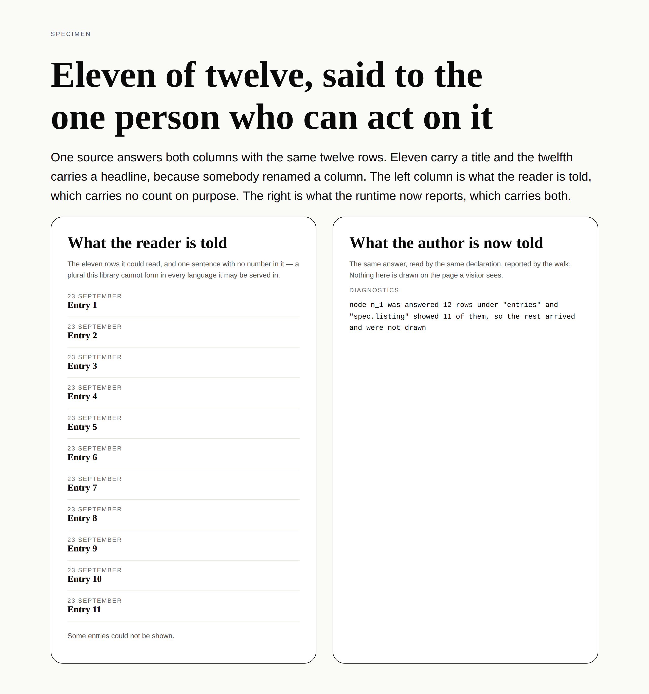

# Eleven of twelve — the one thing a primitive knew and had nowhere to say

**Routine:** `Loom daily build` (framework, `src/` except `src/primitives/`, and the application shell)
**Date:** 2026-09-30
**Section:** §3 (the data seam), on 0181's declaration
**Branch:** `framework-59-a-line-against-the-ground-it-is-drawn-on` — **this lane already had an open pull request (#451) and this work was pushed onto it** rather than opening a second one, per step 3 of `docs/routines.md`
**Records added:** [0206](../decisions/0206-a-primitive-declares-what-it-could-not-show-and-the-runtime-decides-whether-to-say-so.md). None superseded
**Findings closed:** two. **Filed:** three

*`tools/specimen/unshown.specimen.ts`, 1280×900@2×, `editorial` + `editorial-serif` + `comfortable`. One source answers both columns with the same twelve rows; eleven carry a `title` and the twelfth carries `headline`, because somebody renamed a column. **The line in the right-hand card is not typed into the specimen** — it is drawn by calling `readUnshown`, `unshownRows` and `describeRenderDiagnostic`, the three functions the walk calls, on the same answer. It agrees character for character with what the harness printed from the walk's own diagnostics: `node n_1 was answered 12 rows under "entries" and "spec.listing" showed 11 of them, so the rest arrived and were not drawn`.*

## First, the two things a fresh session needs to know

**The migration is done and this run did not touch it.** Checked before anything
else, because three routines are waiting on the answer and a session has no
memory of it: `apps/loom` exists with all five route groups — `(marketing)`,
`(docs)`, `(lessons)`, `(portal)`, `(demo)` — `apps/` holds exactly one package,
and there is no `apps/portal` or `apps/docs`. Nothing is half-migrated and the
tree crosses this run boundary in one piece.

**There were no maintainer comments to address.** #451 carried two comments and
both are this project's own: Vercel's deployment bot, and the
`@jonathanbravecredit` summary the previous run posted. Nothing was outstanding.

## What was completed

### The merge conflict on #451, first

GitHub reported #451 `dirty` against a `main` that had moved four commits since
the branch was opened. Merged `origin/main` into the branch — **it resolved with
no conflicting hunks** — and re-ran the gate before touching anything else:
green, 167 files / 3,294 tests and 333 / 5,778. Pushed as `7a880d4`. The rest of
this run sits on top of that merge.

### The unit: a primitive can now say what it could not show

`Loom primitives` filed on 22 September that **a primitive cannot raise a render
diagnostic**, found by writing the sentence `loom.feed` shows when it has skipped
a row.

Three of the four ways a binding can be wrong are visible from outside the
primitive, and the walk reports all three — `data-unavailable`,
`data-misdeclared`, `data-unread`. The fourth is not. A source can answer
perfectly, under a name the primitive reads, with rows the primitive then
declines one at a time, because each row has a shape only the primitive knows.

It does tell somebody. 0175 has a listing skip the row it cannot read and name
it, and the feed draws *"Some entries could not be shown."*, deliberately without
a count, because a number there is a plural this library cannot form in every
language it may be served in.

**The count is useful to exactly one person and it is not the reader.** It is the
author whose source started returning a column under a new name, who wants to
know that eleven of twelve rows stopped reading. There was nowhere for them to be
told.

What shipped, in four pieces:

| | |
| --- | --- |
| **`unshown`** on a primitive's definition | `(props, data) => readonly UnshownReading[]`, where a reading is `{ name, given, shown }` |
| **`unshownBy(type)`** on the registry | structural, detected the way `BindingReader` and `FrameResolver` are |
| **`data-unshown`** | node, type, binding name, `given`, `shown`. Collected where `shown < given` |
| **`unshown-unreadable`** | for a declaration that threw or returned a reading that cannot describe an answer |

### The decision that was not the one the finding asked for

The finding named the smallest thing that could work — *a read-only `report` on
the context* — and named the reason to think twice: it lets a registered
component write into the walk's output.

**That shape does not work, and not for the reason given.** A component body runs
**after** `renderLoomTree` has returned its diagnostics. React calls it at
`renderToStaticMarkup`, at mount, twice under `StrictMode`, or never. Every
caller in this repository reads `diagnostics` off that return value and some read
it before rendering the element at all, so a diagnostic pushed from a component
lands in an array its reader may have finished with. It is also a side effect in
render, which React asks components not to do.

So: **the primitive returns a reading and the runtime decides whether to report
it.** Called once, inside the walk, before anybody sees the array. Nothing hands
a component a way to write into the walk's output, and the thing the finding said
to think twice about does not have to happen at all.

### Decisions taken that nothing specified

**A function, where every other declaration on a definition is data.** `reads` is
a list of names and a name is data — which is exactly why 0184 could answer the
prop-named case with a `{ fromProp, default }` form instead of a callback. How
many rows survived a shape is not data about a primitive; it is the primitive
reading an answer, and it already contains that code, because it had to decide
what to skip in order to skip it. There is no data form of it that is not a
number somebody maintains beside the code that makes it true.

**It is handed exactly what the component is handed** of the same two things, so
it can be *the same function the component calls*. That is the only construction
under which the page and the log cannot disagree, and it is available for free.

**Both counts, never the rows.** `given` and `shown` rather than the difference,
because the sentence an author needs is *eleven of twelve* and a lone `11` cannot
say it. Never the row values: a diagnostic is logged and a row is the host's
data, which is the line `data-unavailable` already holds.

**The primitive reports every answer; the runtime reports the ones that differ.**
An answer read whole is the ordinary case and reporting it would be one line per
bound region in every log on every page. Put in the runtime because a rule each
of ninety-nine authors implements separately is a rule that holds ninety-eight
times.

**The declaration is guarded, and the whole batch is refused.** A throw becomes
`unshown-unreadable` and the node renders exactly as it would have — a page lost
to a primitive's bookkeeping would be the worst trade in the package. A reading
that says more rows were shown than arrived is refused rather than clamped,
because *thirteen of twelve* sends its reader hunting a defect that is in the
thing telling them about it. And the batch rather than the bad reading, because a
declaration that miscounted one answer has not earned belief about the others.

**Absence is not emptiness, again.** A primitive whose author has declared nothing
is reported on by nothing, which is what lets this ship additively. Unlike `copy`
and `reads` there is no `[]` to distinguish from absence — a reading is made per
answer at render time — so the registry answers `undefined` for both, and the
record says so.

## Tests

`pnpm install && pnpm verify` — **green, exit 0**, written to a file as the last
thing on its own line and read in a separate command.

| | `main` at `bab2de2` | this branch |
| --- | --- | --- |
| `@jam-overture/loom` | 167 files / 3,294 | **168 / 3,316** |
| `@loom/app` | 333 / 5,778 | 333 / 5,778 — untouched |

**22 tests added, none weakened, none skipped.** The app's numbers are the
post-merge baseline; nothing in this unit changes a surface.

Three earlier runs of the gate were red and are worth writing down rather than
rounding off, because two of them were this lane's own rules catching it:

| what was red | why |
| --- | --- |
| `src/documentation.test.ts` | doc comments naming `0175`, `0184` and `0206` **grammatically** rather than as a lifted parenthetical. The maintainer's rule on the API reference; reworded, and one was reworded twice so the sentence still reads after the citation is lifted out |
| `app/(docs)/_lib/api/extract.test.ts` | the generated reference regenerated **before** those comments were reworded. Regenerated again |
| `tools/specimen/unshown.specimen.ts` | `family("mono")`, which is not in the vocabulary. It is `monospace()` |

### The defect matrix — eleven rows, eleven caught, and one row that found dead code

Each defect was restored on the real implementation and the suite re-run.

| defect restored | caught by |
| --- | --- |
| the walk never calls the declaration | 7 tests |
| the reader is not detected off the registry | 7 tests |
| a declaration that throws takes the page down | 2 tests |
| more rows shown than given is clamped rather than refused | 2 tests |
| a count that is not a whole number of rows is believed | 1 test |
| a reading that names no binding is believed | 1 test |
| a declaration returning no array at all is believed | 1 test |
| an answer read whole is reported too | 2 tests |
| the readings are reported in the declaration's order | 1 test |
| a bad reading is dropped instead of refusing the batch | 4 tests |
| **the sort reorders the declaration's own array** | **nothing** |

**The last row is the useful one.** `unshownRows` had a `.slice()` before its
`.sort()`, guarding the caller's array from being reordered under it. Restoring
that defect failed nothing — because `.filter()` above it already returns a new
array, so the `.slice()` could never have been reached by any input. It was dead
code defending against something already impossible, and it is gone. The test
that asserts the property stays, with a line saying which call makes it true.

## Findings

**Closed — two.**

1. *a primitive cannot raise a render diagnostic* (`Loom primitives`, 22
   September), by this branch and 0206, with the closure stating plainly that the
   shape shipped is **not** the one the entry proposed and why a `report` on the
   context could not have worked.
2. *the stale `.next` is not a stale checkout* (`Loom primitives`, 27 September),
   which was **already fixed and never marked**. Verified on `main`:
   `apps/loom`'s `verify` reads `pnpm build && pnpm typecheck && pnpm test`, and
   `git log -S` names #408 as the commit that put it in that order. Three
   framework runs have carried it open, this one included until it was checked.

**Filed — three.**

1. **For `Loom merge`:** `0205` is claimed by **two** open pull requests — #451,
   this lane's, and #454, `Loom primitives`'. Mechanical, and your renumbering
   rule covers it; filed because neither branch can see the other and both
   bodies say `0205` in prose, so the second to merge needs its description and
   its report corrected as well as its filename. This run took **`0206`**, which
   is free everywhere, so the renumbered one wants `0207`.
2. **For `Loom primitives`:** `loom.feed`'s half of the seam, which is one
   declaration. `readAnswer` already computes both numbers at the line that
   returns `skipped`; the entry has the sketch, and the three things worth
   knowing before writing it.
3. **For this lane, as a stated limit:** a declaration that returns
   `{ given: 12, shown: 12 }` while the component draws eleven is believed, and
   nothing here can catch it without rendering the node twice and counting
   elements — which would be the walk deciding what a primitive draws. What makes
   it unlikely is the construction rather than a check. The same exposure `copy`,
   `interactive` and `submits` carry, and the cheapest of the four.

## Open questions

**Should the primitive be handed its own reading back on the context?** The row
parse happens twice today — once in the declaration, once in the component — and
a context field would make it once. Attractive, and deliberately not decided
here: it would put a value on the render context whose *shape* is the primitive's
rather than the runtime's, which is a different kind of thing from everything
`LoomRenderContext` carries now. The saving is a second parse of rows the page is
about to draw. Listed in 0206's alternatives as a separate question rather than
folded into this one.

**Is `unshown-unreadable` worth its own code, or should it be a fault on
`data-unshown`?** Shipped as its own because it is the one member of
`RenderDiagnostic` that neither a tree nor a deployment can cause — it is
addressed to whoever wrote the component, and every other code in the union is
addressed to whoever runs the deployment. If that distinction turns out not to
matter to anything that reads diagnostics, the two collapse cleanly and cost one
record.

## One file outside this lane

`apps/loom/app/(docs)/_lib/api/reference.generated.json`, regenerated with
`pnpm --filter @loom/app docs:api` — the command its own failing test names.
Eight names are added to the published surface and every line of that diff is one
of the eight or the two diagnostic codes inside `RenderDiagnostic`'s signature.
No hand-written documentation-lane file was touched.

`tools/specimen/unshown.specimen.ts` is new and is in `tools/`, which
`docs/routines.md` is explicit belongs to no surface lane: *"Put it beside the
code it photographs. Nothing in this directory is any lane's content."*
