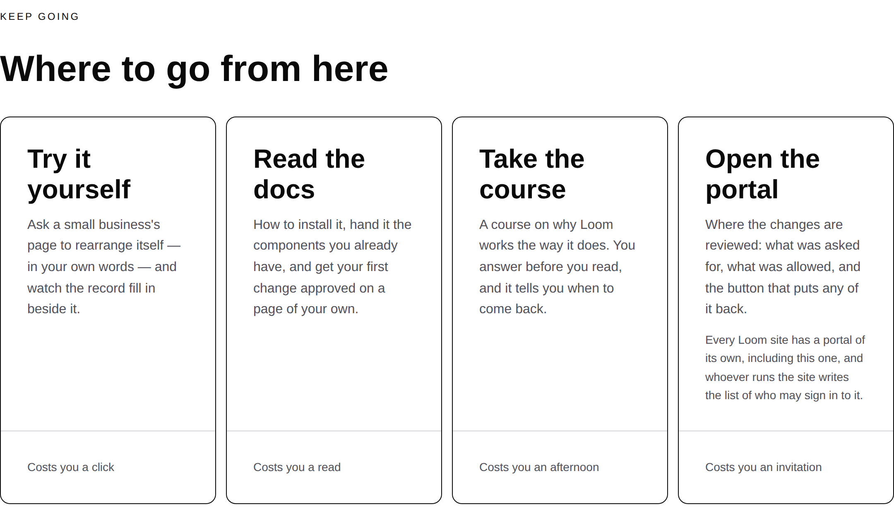
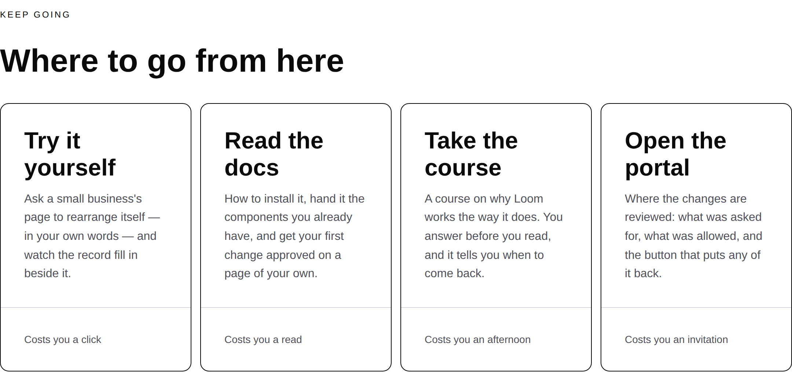
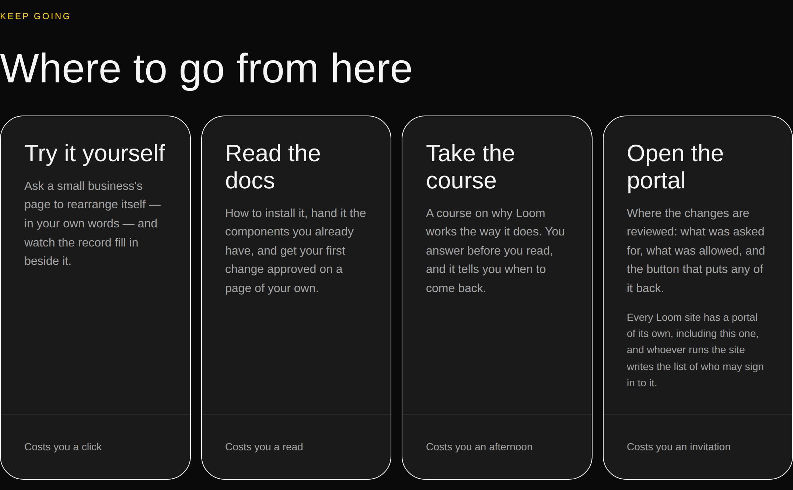
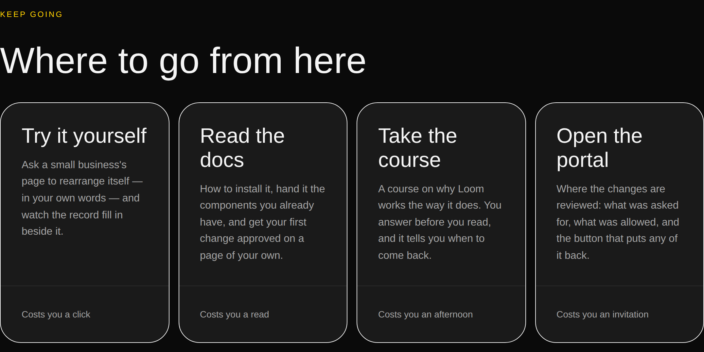
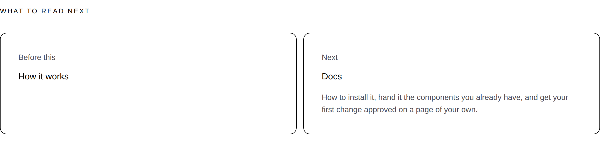
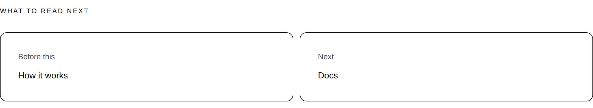

# 2026-09-30 — marketing: the space under the shorter sentence, and the number that can see it

The front door's last content band is four cards: the demonstration, the
documentation, the course and the portal. It is the only band on the page whose
job is to send a visitor somewhere.

One of the four said twice what the other three said. A grid stretches every
cell to the tallest, so the other three carried the difference as **166px of
nothing** under their last line — taller than the sentence above it.

| *Keep going*, 1280 × 900 | |
| --- | --- |
| before — `main` at `bab2de2` |  |
| after — this branch |  |

**It is a wide-viewport defect and only a wide-viewport one**, which is worth
saying because this lane ships a phone shot in most reports and there is none
here. At 390 the four cards stack into one column, so each sizes to its own
content and there is no tallest sibling to be stretched to. Nothing about the
phone changed and nothing about it was wrong.

On `bold`, where a card has an edge you can see, it is three tall empty boxes:

| `bold`, 1280 | |
| --- | --- |
| before |  |
| after |  |

---

## The measurement, which is the argument

Read off a production `next build` served by `next start`, through the
elements' own boxes rather than off the source.

| card | says | body ends | footer starts | empty |
| --- | --- | --- | --- | --- |
| Try it yourself | 22 words | 247px | 413px | **166px** |
| Read the docs | 23 words | 247px | 413px | **166px** |
| Take the course | 23 words | 247px | 413px | **166px** |
| Open the portal | 21 + 27 words | 348px | 413px | 65px |

Every card was 469px tall and 261px wide. The 65px under the fourth is the
card's own bottom padding — what a full card looks like. The 166px under the
other three is the defect, and it is 35% of the card.

Nothing was red and nothing could have been: four valid trees, every link
resolving, no overflow measured, no diagnostic raised. A page is well-formed
whatever the sentences in it weigh.

---

## The band's own note had ruled this out, in writing, five weeks earlier

`waysIn` in `_lib/pages/home.ts` has carried this since 25 August:

> Evening the sentences up would have been treating the symptom, and it does not
> survive the next surface anyway. `loom.card`'s `footer` is *pinned to the
> bottom and ruled off* — the region exists for exactly this: a row of cards of
> unequal length still has its footers on one line. So the sentence may be
> whatever length it honestly needs to be.

Every clause of that is true and the conclusion does not follow. **A pinned
footer puts the four costs on one line; it cannot put anything above them.** The
run that wrote it fixed the footers, checked the footers, and inferred the band.
The band was never photographed.

The second half of the objection — that hand-tuning four strings does not
survive a fifth surface — is fair, and it is what the test below is for rather
than a reason to leave the band as it was.

---

## What shipped

**Two paragraphs removed and one rule written.** No primitive was added, nothing
under `src/` was opened, no component was written, and nothing outside
`app/(marketing)/`, `FINDINGS.md` and `reports/` is in the diff.

| file | what changed |
| --- | --- |
| `_lib/pages/home.ts` | the portal card's second paragraph comes off; the note rewritten with the measurement |
| `_lib/chrome.ts` | the hand-off card in *What to read next* names the surface and stops |
| `_lib/site.ts` | `doorOf` removed — its one production caller was the card; `GuardedSurface.door` is unchanged and still required by the type |
| `_lib/questions.ts`, `_lib/chrome.ts` | three comments that named the card as a place the door sentence is rendered |
| `_lib/balance.test.ts` | **new** — the rule, over every route |
| `_lib/pages/pages.test.ts`, `_lib/site.test.ts` | the two assertions that pinned what was removed |

### What a reader loses, said plainly

`PORTAL.door` — *"Every Loom site has a portal of its own, including this one,
and whoever runs the site writes the list of who may sign in to it"* — is no
longer in the body of the *Open the portal* card.

It is still on the page. The questions band, two bands above, answers **Do I
need an account to use this?** with that sentence inside it, and the card still
says the same fact in the four words built for it: *Costs you an invitation*,
on the one line a reader compares the four destinations along, held there by
`site.test.ts`. That cost word is what closed the 10 September fault where the
card described the door wrongly; it did not go away.

**The trade is real and it is the maintainer's to overrule.** A reader decides
at the card, and the full sentence at the card is one wasted click saved. It is
one line to put back and the PR comment says which.

The same judgement, made the same way, took the docs' blurb off the *What to
read next* hand-off card — see below.

---

## The second one it found

`balance.test.ts` came back red a minute after it first had a threshold in it,
on a band this run was not looking at: *What to read next*, which is chrome, so
it is at the foot of every page but the front door.

| *What to read next*, `/what-you-run`, 1280 | |
| --- | --- |
| before |  |
| after |  |

Two cards. One held *Before this · How it works* — two words — beside one
holding the documentation's twenty-five-word blurb. Its own note also defended
the asymmetry in writing:

> Only the hand-off carries one, and the asymmetry is the point: a reader who
> meets a card saying *Docs* has been handed a fourth navigation link; the same
> card saying what is behind the door has been handed the next thing to do.

That reasoning is about content and it is good. A grid does not care about it.
**Two bands, two written-down arguments, both about the right thing, both
reasoning about a row without looking at one** — which is the shape, and it is
why the deliverable is the rule rather than either fix.

---

## The statistic, which is the part that generalises

The obvious rule is *the wordiest card says no more than twice the leanest*. It
is wrong twice over:

- a row of four-word cards at three times has no empty space in it at all;
- **this defect measured 1.96.** A ratio rule at two would have passed on the
  exact band it was written for.

What makes a hole is **lines**, and lines are a difference rather than a
quotient. So the rule is a difference:

> **A row of cards may differ by at most twelve words between its wordiest cell
> and its leanest.**

Twelve is two lines of the narrowest column this site lays out: a card in a
four-column band at 1280 is 261px wide and sets about five and a half words to
the line, rounded up to six so the rule is never stricter than the measurement
under it.

The margins are measured rather than asserted. The widest spread the site has
today is **9**; the two defects this caught were **27** and **22**.

### What it reads, and the two lists it keeps

A row is any container element with two or more sibling elements of one type,
found by walking the tree — no page builder declares one. Words are counted
from text nodes **and** from string props containing a space, because
`loom.card` is given its lines as `loom.prose` children while `loom.feature`,
`loom.stat` and `loom.milestone` are given theirs as props the primitive renders
itself (0052). A count reading only text nodes scores every one of those rows
zero and passes on all of them.

Four container types are measured — `loom.grid`, `loom.feature-grid`,
`loom.stat-grid`, `loom.milestone-row` — and eight are exempt with a reason
each about the layout rather than about the failure being inconvenient.
`loom.mosaic` is the interesting exemption: its cells are *deliberately* unequal
and `pages.test.ts` already holds the opposite ratio, which is the right rule
for that band.

Two clauses keep it honest:

- **It cannot pass vacuously.** Deleting the *Keep going* band would turn every
  other assertion here green and silent, so the site is held to still having a
  row of at least three cards saying enough between them that a two-line
  difference is a thing that could happen.
- **The exemptions cannot go stale.** Every container the site actually renders
  must be on one of the two lists; a grid primitive nobody here has used yet is
  red until somebody classifies it. That is the expensive failure this guards —
  a check that quietly does not apply to a page that looks covered.

The palettes are deliberately **not** swept, unlike `alignment.test.ts`: a theme
can change colour and type, neither of which is a word, so three palettes here
would triple the assertions and could not fail differently in any of them. Both
deployment states *are* swept, because `/what-you-run` says a different sentence
on a deployment that is counting its readers.

---

## Findings

**One filed and closed by this branch; one closed that another lane had filed
against this one.**

- **A row of cards carries its disparity as empty space, and a ratio is the one
  statistic that cannot see it.** This lane's, closed here, recorded because the
  fix is one paragraph and the thing worth keeping is which number to measure.
  It is not this lane's alone: `(docs)`, `(lessons)`, `(demo)` and `(portal)`
  all lay cards out in grids and none of them has a rule of this kind. The check
  is ten lines over a tree and needs no camera once it exists — which is the
  point, because finding it needed one.

- **Two surfaces state the licence and only one reads the file**, filed by
  `Loom docs` on 28 September against this lane. **Closed as already true when
  it was filed** — `_lib/license.test.ts` has read `LICENSE` at the repository
  root since `b1e3117` on 27 September, and holds three things rather than one:
  the root manifest's `license` field, the file at the end of the link, and the
  `license` in the structured-data graph. Verified by changing the `LICENSE`
  file's first line to `Apache License` on this branch: the assertion that reads
  the file goes red, 1 of that file's 4 — the other three read the manifest and
  the graph, which is why there are four. What is worth
  keeping is not the licence — a lane saw no file named for the thing it was
  looking for and filed against another lane's directory. **Grep the behaviour,
  not the filename.**

Nothing was closed that this lane does not own.

---

## Open questions for the maintainer

- **The door sentence on the portal card.** Above, and the one thing in this
  diff that is a judgement rather than a measurement.
- **The licence line** is no longer a placeholder and has not been since
  27 September; **positioning, audience and pricing** remain untouched, as
  always.
- **Whether preview deployments should be `noindex`.** Still filed against the
  shell, still not this lane's to switch on.
- Standing from #452 and unanswered: the *Using it* band's four dots do not draw
  the two-and-two split its heading promises. Nothing in this run touched it.

---

## Tests

`pnpm install && pnpm verify` — **green, exit 0**, status written to a file as
the last thing on its own line and read in a separate command, on a `dist` and a
`.next` deleted first.

| suite | files | tests |
| --- | --- | --- |
| `@jam-overture/loom` | 167 | 3,280 — untouched |
| `@loom/app` | **335** | **5,792** |

888 findings, 0 malformed · 118 prerendered pages, 1,304 text junctions, 0 run
together · 3 metadata conventions, 0 unserved.

**6 tests added in one new file, none weakened, none skipped, none deleted.**
Two existing assertions changed, and both are a deleted claim rather than a
relaxed one: `pages.test.ts` asserted that the hand-off card carried the
surface's blurb and now asserts it names the surface, and `site.test.ts` read
the door through `doorOf`, which no longer exists, and reads it off the narrowed
surface instead. Neither loosened what it holds.

**Both fixes were confirmed necessary rather than assumed.** Restoring the
portal card's paragraph turns 2 of the 6 red on `[29, 30, 30, 55]`; restoring
the hand-off blurb turns 1 red on `[5, 25]`. The vacuity clause was confirmed by
emptying the measured list, and the staleness clause by deleting one exemption —
each names exactly what it was written to name.

No decision record. Nothing here touches the tree schema, the delta model or an
`Accepted` record: two paragraphs come off two compositions, and a test states a
rule about rows.
