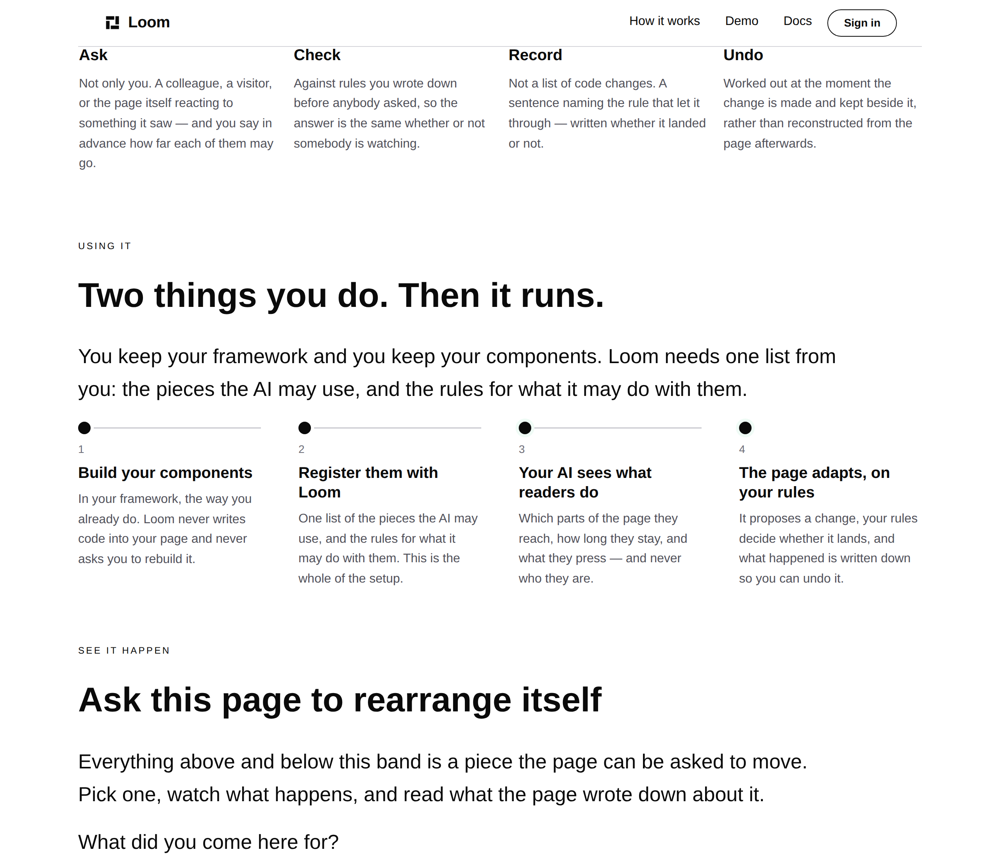

# 2026-09-30 — marketing: two things you do, then it runs

The maintainer, on 30 September:

> *"I just really think we are missing the mark and not telling people plainly
> how they should be using Loom."*

He is right, and the audit is short. Here is every band the front door had, in
order, and what each one is about:

| band | what it is about |
| --- | --- |
| the opening | a claim about the world |
| *Every change, in four words* | the vocabulary |
| *See it happen* | the product changing itself, live |
| *Your turn* | the demonstration, framed |
| *What this is for* | four things that go wrong without it |
| *Where it is today* | numbers |
| *Questions* | five answers |
| *Keep going* | four destinations |
| the closing | this page was built this way |

**Not one of them says what you would do.** The page argues *why* at length and
proves *that it works* twice, and a visitor could watch the demonstration run
and still not know whether adopting it means rewriting their components. The
one page that looks like an answer, `/how-it-works`, is not: it is the five
steps **one change** takes at runtime, in milliseconds. Nothing anywhere was
about the reader's own afternoon.

---

## What shipped

One band, from the maintainer's own sketch of four beats.

| file | what changed |
| --- | --- |
| `_lib/bands.ts` | `BAND.usingIt` — *Using it* |
| `_lib/pages/home.ts` | `USING_IT`, the four beats as data, and the band that draws them |
| `_lib/pages/using-it.test.ts` | new — 8 assertions about the claims rather than the markup |
| `_lib/adapt/adapt.test.ts` | `milestonesIn(page, eyebrow)` — two sweeps scoped to the band they were named for |
| `_lib/pages/how-it-works.ts` | `MECHANISM_JOURNEY_EYEBROW`, exported so the sweep can find the band |

No primitive was added, nothing under `src/` was opened, no component was
written, and nothing outside `app/(marketing)/` and `reports/` is in the diff
except the one exported constant the test needs.

### The shape is the argument, and it is not four equal steps

The four beats divide two and two, and the division is the sell. **One and two
are things you do once. Three and four are what happens afterwards, on every
visit, without you.** A row of four identical boxes would read as four chores;
the heading carries the split instead, so what a reader takes away is that
*the work stops at two*.

### The fourth beat carries the record, and that is deliberate

The sketch ended at *"your AI adapts your page based on your user
interactions"*. Ending there sells the half a competitor can also claim.
`docs/rollout.md` has the positioning on record — **the differentiator is not
adaptation, it is the record** — so the fourth beat is the change *and* what is
kept about it: *"your rules decide whether it lands, and what happened is
written down so you can undo it."* That is also what turns the last step back
toward the reader instead of trailing off the edge of the band.

### *Monitor* is not used, though it is the word in the sketch

To a stranger it means uptime and dashboards. What actually happens is that the
page reports which of its parts a reader reached, how long they stayed and what
they pressed — and never who they are (0146). *Your AI watches your users* is
the sentence in this band most likely to alarm somebody, so the disclaimer is
in the step rather than a page away.

Nothing in the band says `TreeDelta`, `disposition`, `the Gate`, `primitive` or
`registry`, and a test holds it to that.

### Placement is the maintainer's, and it is better than the one this run chose

It went directly under the opening first. He moved it below *Every change, in
four words*, and that is the right call: the four words say what a change **is**,
this says what **you** do about it, and the demonstration below then asks
somebody to watch — so the page answers *what is this*, *how would I use it*,
*show me*, in that order.

### `loom.milestone-row`, used for the first time

Its own docstring is exact about why it exists rather than the vertical rail on
`/how-it-works`: *"a roadmap is read down because time runs that way, and three
steps are read across because they are meant to be taken in at once."* This band
is the second kind. It is the only primitive in the starter library this site
had never composed.

---

## What is not solved, and is the one thing worth a second look

**`state` does not draw the two-and-two split.** `done` and `current` differ by
a `boxShadow` halo of `accent-subtle` on the dot, and at this size on `minimal`
the four dots are indistinguishable. The grouping is carried entirely by the
heading.

That is not wrong — the heading is doing real work, and every reader reads it
before the dots — but the graphic itself says *four steps* where the copy says
*two, then two*. Three ways out, in order of cost, and the choice is the
maintainer's:

1. **Leave it.** The heading says it and the bodies say it.
2. **Two rows with their own labels** — *You, once* and *Then, every visit* —
   which says the split structurally and costs a band twice the height.
3. **A finding for `Loom primitives`**: a marker that can say *this one repeats*.
   `marker` is a free string up to 32 characters, so a composition can already
   put `↻` there — but a glyph a reader has to infer is exactly what
   `chrome.ts` refused for its own directions, and for the same reason.

Filed as a question on the pull request rather than decided here.

---

## Two tests that were measuring the wrong thing, and were right to fail

`adapt.test.ts` collected `loom.milestone` by type across the whole tree, twice
— once to assert that the waiting panel *claims nothing* before a visitor asks
(no body, every rung `planned`), and once to hold the panel's step count
against `/how-it-works`.

Both were correct proxies for exactly as long as the panel was the only thing
on the front door built out of milestones. This band is the second, and it is
four steps that are deliberately titled, bodied and not `planned` — so an
unscoped sweep made the suite assert that a band whose whole job is to say
something must say nothing.

**Neither assertion was relaxed.** They were scoped to the bands their own
docstrings name — *the waiting panel*, *the steps the mechanism page names* —
by one shared helper, `milestonesIn(page, eyebrow)`. What is checked is still
every rung of the panel, and it is now checked against the panel instead of
against whatever else the page happens to build out of the same primitive. A
third run of milestones can be added without either test silently starting to
measure it.

---

## Tests

`pnpm install && pnpm verify` — status written to a file by the gate script as
its own command and read separately, on a `dist` and a `.next` deleted first.

| suite | files | tests |
| --- | --- | --- |
| `@jam-overture/loom` | 167 | 3,280 — untouched |
| `@loom/app` | 329 | 5,692 |

**8 tests added in one new file, none weakened, none skipped.** They assert the
claims rather than the markup, because the band renders and the page is green
whatever the steps say: that the markers are `1,2,3,4` in order; that the states
are `done, done, current, current`, which is the two-and-two shape the heading
promises; that every step has both a title and a body, which is what separates
this band from the waiting panel; that step one still says Loom *never writes
code*; that step four still ends on the undo rather than on the adaptation; that
none of the five words a stranger would not know appears anywhere in it; and
that it says the same thing under all three palettes.

No decision record. The band composes registered primitives, sets no new prop,
and touches neither the tree schema, the delta model nor an `Accepted` record.

---

## Open for the maintainer

- **The `state` question above** — leave it, split it in two, or file it.
- **Two four-column bands now sit on top of each other.** *Every change, in four
  words* is a four-up feature grid and this is a four-up milestone row. They are
  distinguished by the numerals and the rail, and the repetition arguably rhymes
  rather than drags — but it is worth an eye on the preview, because it is the
  kind of thing that is invisible in a diff.
- **Positioning, audience and pricing** remain his. The four beats here are his
  sketch, worded; the one thing this run added on its own is the record in the
  fourth, and it is added because `docs/rollout.md` says to.
- **The licence line** is still this site's one placeholder.
