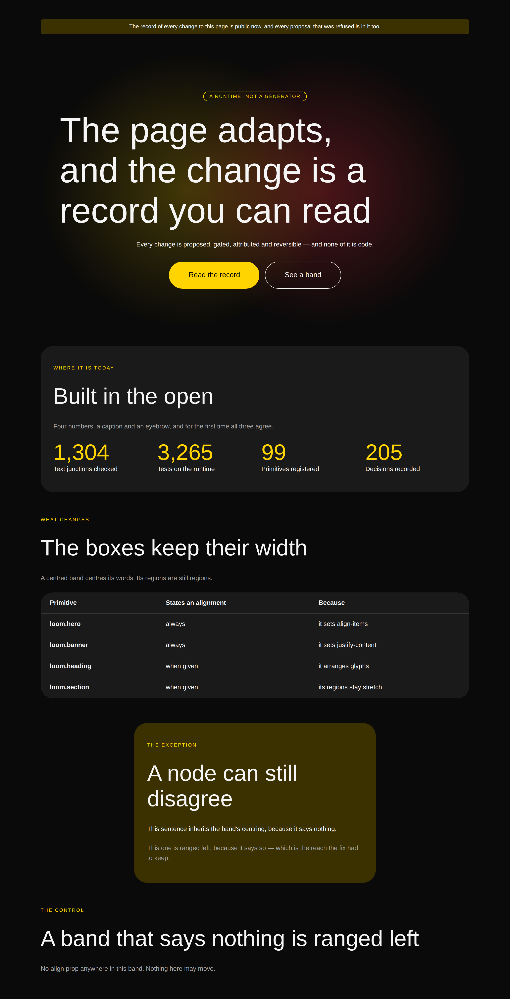
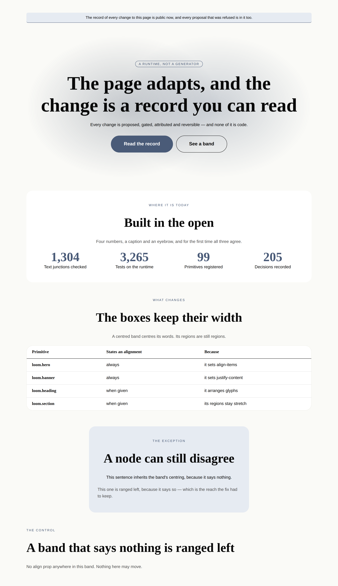
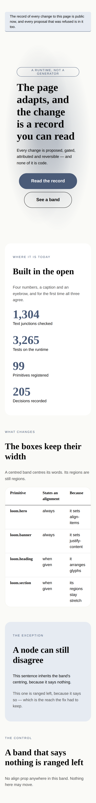

# 2026-09-30 — the band that said centre, and the two nodes that did not hear it

Two findings were open against this lane, both filed by `Loom marketing` on
29 September, both about a band that declares itself centred and is not. Both
are closed by this run, and one of them is closed by disagreeing with it.

This is a **quality run, not a breadth run**, and the reason is the same
measurement the 29 September run made and this run re-checked rather than
inherited: `docs/primitive-gap-inventory.md` puts the honest ceiling at 110–120
distinct primitives, the library is at **99**, Tier A is closed, and of the
remaining eleven, nine are Tier B — tabs, tooltip, dialog, lightbox, a pricing
toggle, a segmented control — which that document says *"arrive together or not
at all, because they are one framework decision rather than nine"*. The tenth is
a radio group, blocked on a seam `loom.field`'s own docstring lays out. **That
leaves roughly one**, and against it sat two open findings on `loom.hero` and
`loom.section` — the two primitives this lane's brief names as the quality floor,
on the most-loaded page the project has.

---

## What shipped

| | |
| --- | --- |
| `loom.heading`, `loom.prose`, `loom.stat-grid` | `align` unset now means **inherit**, not `start` |
| `loom.section` | an `align` prop — the first way to move an eyebrow, which is a field and not a node |
| `loom.banner` | states the text alignment its `justify-content` implies — a third instance, found by audit |
| [0205](../decisions/0205-a-primitive-that-arranges-only-glyphs-inherits-its-alignment.md) | a primitive that arranges only glyphs inherits its alignment |
| `alignment.test.ts` | 11 tests, **8 of them confirmed to fail** against the unfixed library |
| `the-band-that-said-centre.specimen.ts` | six bands, two palettes, two viewports, before and after |

No primitive was added. The library is still at ninety-nine.

---

## One — the finding is right about the page and wrong about the file

The first finding says `loom.hero`'s `align: "center"` *"centres the boxes and
not the words"*, and quotes the primitive spending the prop on `alignItems`
alone. Its remedy is that `align: "center"` should *"also emit `textAlign:
"center"` on the band, so the enum means what its name says and children inherit
unless they override."*

**That was shipped on 26 September**, in #403, three days before the finding, and
the headline was still ranged left on a production build. The quoted code block
is missing the line.

What is actually wrong is one level down, and it is the second half of the
finding's own sentence: the children **do not** inherit unless they override.
They override unconditionally.

```ts
textAlign: given.align ?? "start"   // loom.heading, loom.prose, loom.stat-grid
```

An inline `start` is not a default. It is an override of every ancestor that had
an opinion. Rendered, a centred hero prints the contradiction inside one column:

```html
<div style="…align-items:center;text-align:center;…">
  <span style="…text-transform:uppercase;color:var(--loom-accent)">EYEBROW</span>
  <h1 style="…color:var(--loom-fg-default);text-align:start">The headline</h1>
```

The eyebrow is centred and the headline is not, in the same column, under the
same declaration. The only difference between them is that the eyebrow is a
string the hero renders itself — so it states no alignment and inherits — while
the headline arrived as a node carrying a hardcoded one.

**The tell was inside the finding's own evidence.** Its table records the
eyebrow as centred and the headline as `text-align: start` and reads that as two
symptoms of one cause; they are the cause and the control. Worth keeping,
because the entry is otherwise a model of how to file one: it measured a
production build at two viewports and got every number right. It read the wrong
line of the file afterwards.

## Two — the rule, and where the line is drawn

> **A primitive states a text alignment exactly when it arranged boxes on the
> inline axis. Otherwise it states none and inherits.**

| | states it | why |
| --- | --- | --- |
| `loom.hero`, `loom.empty-state`, `loom.person`, `loom.overlay`, `loom.banner` | **always, both branches** | they set `align-items` or `justify-content`, which do not inherit. A centred box holding ranged-left words is the same defect from the other side |
| `loom.heading`, `loom.prose`, `loom.stat-grid`, `loom.section` | **only when given** | they arrange no boxes on the inline axis, so they have nothing for an alignment to agree with |

`loom.stack`, `loom.grid` and `loom.split` also carry an `align` and are
deliberately **not** changed. Theirs is named for and documented as the CSS
box-alignment property; its values include `stretch`, which is not a text
alignment at all, and on a `row` stack it governs the block axis where
`text-align` means nothing. The test that settles it is the granularity doc's,
and it is reachability rather than taste: with the leaves inheriting, a
composition that wants a stack's words centred says so on the heading and the
paragraph, and that works today. Nothing is unreachable through a stack. What
*was* unreachable was a section's eyebrow, and that is what gained a prop.

## Three — which Hermes fields became nodes, and which stayed props

No Hermes block was ported, so the brief's question has no port to answer. It
has a real answer anyway, in the one granularity judgement this run made, and it
is the judgement 0052 is usually invoked to prevent.

**`align` on `loom.section` is a prop, and the eyebrow it governs stays a prop.**
Run 0052's sharper test first: *does changing this prop change the set of nodes?*
No — no operation reorders glyphs, and the granularity doc lists `align:
"start" | "center"` in its own table as the worked example of a real prop. Then
the near-miss test, which is the one that has to be run out loud here, because
the *reason* this prop is needed is that a region of the band is not addressable:
the eyebrow is a `string` the primitive renders itself.

The tempting move is to decompose it — make the eyebrow a node, and the
alignment problem dissolves into the node's own `align`. **That is the wrong
answer and 0052 says why.** An eyebrow is a fixed field: one per band, never
repeated, no interesting interior, and a `remove` of it is a `configure` that
clears the string. Promoting it would buy a model one more node to place on
every band in the library, cost grammar budget
([0014](../decisions/0014-the-reply-schema-must-fit-a-grammar-budget.md)) on a
lever nobody has a reason to pull, and still not centre the heading region or
the children — which the one prop does, by inheritance, for free.

So: the field stays a prop, and it gains a band-level prop that reaches it.
**A fixed field a composition cannot reach is a reason to give the band a prop,
not a reason to promote the field to a node.**

The second judgement is that the prop governs **the words and not the boxes**,
and that one was decided against the render rather than in the abstract. An
`align-items: center` on a section — matching `loom.hero`, which is the obvious
symmetry — shrink-wraps every full-width region in the band to its content: a
`loom.comparison-table` becomes as wide as its longest row and the band's `width`
prop stops meaning anything. The hero centres boxes because its content *is* a
text column. A section's is not. The fourth band on the sheet exists to
photograph exactly this.

## Four — how far it reaches, measured rather than assumed

Rendering all 44 starter compositions and sweeping the emitted markup finds
**106 declarations** of `text-align:start` that no box arrangement earns, on each
palette. That number is the size of the invariant, and it is *not* the size of
the change.

The elements whose appearance actually moves — parsed out of the DOM, an element
with no alignment of its own under an ancestor that states one — number **two**:

```
center <- p  :: Connected to the marketing site. Every change is pro…
center <- h3 :: Nothing published yet
```

The reason the other 104 do not move is the most useful thing this run measured.
**Fifteen of the forty-four compositions already set `align: "center"` on their
children by hand.** That is the defect being worked around fifteen times rather
than fixed once — a library making every composition author remember a thing,
and two of them forgetting. A grep for `align: "center"` in
`src/primitives/compositions/` is the shape of a missing default:

```
banner-band 1 · cta-band 3 · cta-signup-band 2 · faq-grid-band 2
features-alternating-band 2 · feed-band 1 · hero-band 3 · integrations-band 2
integrations-grid-band 2 · metrics-band 1 · metrics-live-band 1 · proof-band 1
proof-faces-band 3 · proof-story-band 1 · testimonials-wall-band 2
```

It also means the change is safe in the way that matters: on the bands that were
already correct it is a no-op, because they still say what they always said.

---

## The pictures

Six bands at 1280×900 and 390×844 under both starter palettes, before and after,
in this folder. Every band is written the way a composition author would write it
if they trusted the prop — **the band says `center` and nothing under it repeats
it** — because a photograph of a successful workaround shows nothing.

### `bold`, wide — before



The finding, photographed. The eyebrow pill is centred, the lead paragraph is
centred, the two buttons are centred, and the largest words on the page are hard
against the left edge with a ragged right. Below it, three bands that wanted to
be centred and could not be: `WHERE IT IS TODAY` and *Built in the open* ranged
left beside a centred row of figures, which is the arrangement the second
finding describes on the real front door.

### `editorial`, wide — after



**The fourth band is the one to look at, not the hero.** *The boxes keep their
width*: its eyebrow, heading and caption centre, and the table under them is
still the full width of the band with its cells ranged left. That is the whole
argument for a prop that governs words and not boxes, and it is the band that
would be wrong if `loom.section` had copied `loom.hero`.

The fifth band is the reach test — one paragraph inherits the centring, the next
says `align: "start"` and keeps it — and the sixth is the control: a band that
declares nothing, which must still come back left. A fix that centred everything
would have passed every assertion above it and ruined every page in the
repository.

### The strip, at 390 — before above, after below



The banner is in the top 260px of the phone shots, and `too.` on the third line
is the entire visible difference. It is also the reason for this run's filed
finding, below.

---

## What the tests hold, and how that was checked

`alignment.test.ts` is a new file rather than lines in `library.test.ts`, because
the deliverable the 29 September entry asked for is an invariant and an invariant
wants somewhere to be stated.

| test | against the unfixed library |
| --- | --- |
| *centres the words it was handed, not only the ones it renders* (×2 palettes) | **fails** — `h1` carries `text-align:start` beside a centred eyebrow |
| *reaches a section's eyebrow, which is a prop and not a node* (×2) | **fails** — no `align` on `loom.section` to parse |
| *agrees with itself when a strip is centred* (×2) | **fails** — `justify-content:center` with no `text-align` |
| *states a text alignment only where it arranged boxes* (×2) | **fails** — 106 offenders, named |
| *says nothing about alignment when it was not asked* | passes either way — guards the absent branch |
| *still lets one paragraph range itself left inside a centred band* | passes either way — guards the reach |
| *finds the bands that do own their words* | passes either way — guards the sweep's exemption |

**Eight of eleven confirmed against the defect**, by stashing the five changed
files and re-running. The three that pass either way are named for what they
prevent rather than what they prove, and the last of them exists because the
sweep has an exemption — *this element arranged boxes, so it may state an
alignment* — and an exemption nothing exercises is a hole rather than a rule.
The sweep also asserts it read more than 400 inline styles before looking for
offenders, because a sweep of an empty render finds nothing wrong; that is the
vacuity trap the 29 September run hit and wrote down.

**No existing test failed.** Not one of 3,280 assertions pinned a `text-align`
on a heading or a paragraph, which is the third finding's point restated as a
number: both values are valid, both render, both validate, neither overflows.
No test was skipped, deleted, or loosened.

---

## Gate

`pnpm verify` — **green, exit 0**, on a `dist` and a `.next` deleted first, with
the status written to a file on its own line and read in a separate command.

| suite | files | tests |
| --- | --- | --- |
| `@jam-overture/loom` | 168 | **3,291** (11 added by this run) |
| `@loom/app` | 333 | 5,778 |

888 findings, 0 malformed · 118 prerendered pages, 1,304 text junctions, 0 run
together · 3 metadata conventions, 0 unserved.

**No cross-lane edit.** `align` on `loom.section` is a prop on a registered
primitive rather than a new public export, so the docs app's two checks on the
published surface stayed quiet and `reference.generated.json` did not move.

---

## What the library still cannot express

- **`end` alignment, anywhere it would be a band's decision.** Eight primitives
  now spell the vocabulary `["start", "center"]` and only `loom.table-cell` and
  `loom.overlay` carry anything richer. Nothing on a marketing page wants a
  right-ranged band today, which is why this is a note and not a proposal.
- **A radio group, still.** The last unblocked row of Tier A, and it is not
  unblocked: a container cannot tell a child which element to be. Unchanged since
  14 September, re-confirmed because choosing this run's work meant re-checking
  the ceiling.
- **Tier B, still.** Nine primitives behind one framework decision on the
  behaviour vocabulary. The breadth mandate cannot clear 110 without it, and
  building a `<details>` here and a CSS-only tab strip there is how a library
  ends up with nine answers to one question.
- **`21st.dev` is still `EGRESS_BLOCKED`**, re-verified — the sixteenth time. Not
  re-filed; the maintainer answered it on 16 August (*"I can add it"*) and the
  standing instruction until the allowlist lands is to work to `loom.hero` and
  `loom.feature-grid` plus the Hermes content models on disk.

## Filed

**One finding, owned by every routine that photographs a surface**, and it is a
method rather than a defect: *a misalignment is invisible on any text that does
not wrap*. The banner band on this run's own sheet was drafted with a one-line
message, photographed under both palettes at both viewports **against the
unfixed library**, and came back looking identical to the fix — because a
one-line message in a centred flex row is shrink-wrapped to its own text and the
two alignments produce the same pixels. It was caught by reading the emitted
markup afterwards.

The same mechanism is why the original defect survived: every child of the
centred hero was shrink-wrapped and therefore centred-looking whatever it said,
except the headline, which is held to a display measure and wraps. **One element
in that band was wide enough to report the bug.** The entry has the table and
the remedy.
