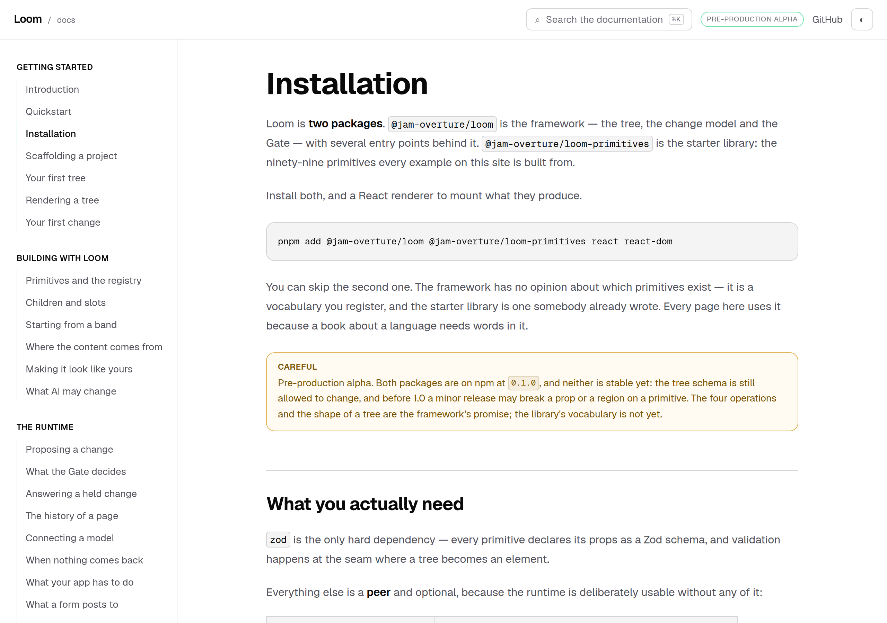
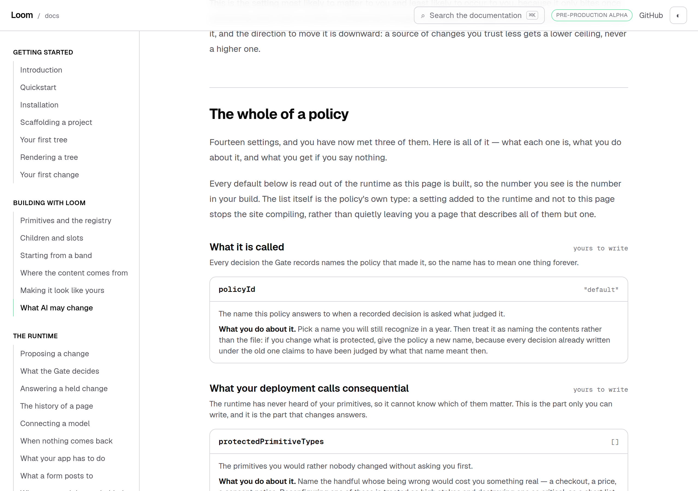
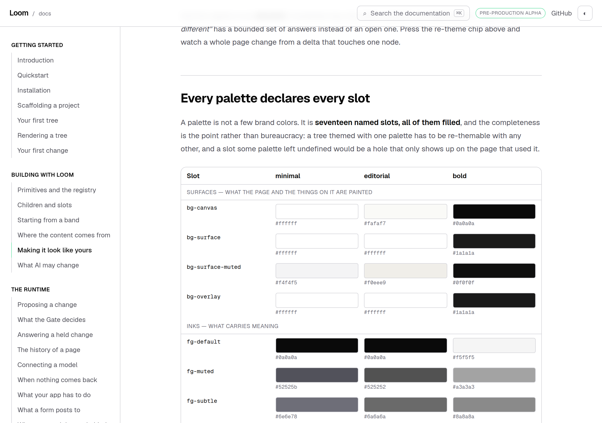
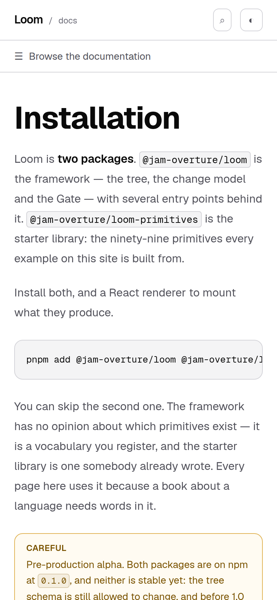

# 1 October 2026 — the numbers nothing counted

**Routine:** `Loom docs` · **Branch:** `docs-42-the-numbers-nothing-counted` ·
**Section:** §4c

No open pull request from this lane at the start of the run, so this is a fresh
branch off `main` at `aca9a6b`. No maintainer comments were outstanding on any
pull request of this lane's.

## What this run was

The installation page — the first page of the one path this site exists to walk
a stranger down — said this:

> *"`@jam-overture/loom-primitives` is the starter library: the **ninety-eight**
> primitives every example on this site is built from."*

**There are ninety-nine.** It had been wrong for as long as it took somebody to
add one, and nothing on this site could have said so. The page rendered, the
suite was green, and the sentence a reader meets before they have typed anything
was false.

That is one word. The unit is the class, and the class was already written down
in this lane's own ledger, on 16 September, filed by this lane against itself:

> **The fix is not a better number. It is that the page may not say the number**:
> produce the count where it is shown, produce the enumeration if the prose
> enumerates, and let the prose make the argument that does not depend on arity.
>
> […] Worth one grep each for a written-out number next to a noun the runtime
> owns — kinds, operations, primitives, levels, dispositions, reasons — rather
> than a rewrite.

The grep was never run here. It is a mechanism now instead.

## The plain version

Some sentences on this site are claims about a **size**: how many primitives the
library has, how many colors a palette names, how many settings a policy has. A
number typed into one of those is right the day it is typed and wrong the week
after somebody adds one — and **nothing breaks when it goes wrong.** That is the
whole problem. A broken link fails a build. A stale sentence renders perfectly.

So each of those numbers is registered in one place, read off the thing it
counts, and put on the page by an element:

| | reads | on |
| --- | --- | --- |
| `starter-primitives` | `STARTER_PRIMITIVES.length` | Installation |
| `palette-slots` | `PALETTE_SLOTS.length` | Making it look like yours |
| `starter-palettes` | `STARTER_PALETTES.length` | Making it look like yours |
| `policy-settings` | `policyKnobs().length` | What AI may change |
| `pricing-band-nodes` | `bandNodesIn("pricing")` | Starting from a band |
| `starter-bands` | `STARTER_COMPOSITIONS.length` | Starting from a band |

And a sweep refuses the rest: **a number standing in front of a counted noun,
anywhere this route group wrote words.** It refuses the *shape* rather than
today's value, so `ninety-eight primitives` is red because the library has
ninety-nine, and `ninety-nine primitives` is red too — it is the same sentence
one week earlier, and nothing would say so when the hundredth lands.

## The two things that were got wrong first, and are the interesting half

**It rendered a digit, and the page already had an argument against that.**
`theming-claims.test.ts`' own note says spelling a figure in words is *"the
cheapest way to let a page speak in words rather than in components without
becoming the copy that rots."* It is right about the voice: documentation prose
spells its numbers, and *17 named slots* in the middle of a paragraph is worse
writing than *seventeen named slots*. The first version of this unit was asking
an author to make the page read worse in exchange for a guarantee, which is how
a mechanism gets worked around.

It was also wrong about the price. The way that file kept the words was to
**require the page to type them** and assert they were the right ones — which
keeps the number true and makes the page a lock. `<Count>` spells it:
`as="word"` gives *seventeen*, `as="Word"` gives *Fourteen* for a sentence that
opens on it. The words are a function of the number, so a page can have both.

**It swept the rendered page, and that refuses the fix.** Reading the produced
caption looks strictly stronger — it is, after all, what a reader sees — and it
is useless: a caption built as `` `${spellOut(bandNodesIn("pricing"), "Word")}
nodes…` `` produces *Forty-four nodes* and is byte-identical to the hand-typed
version it replaced. **The number is allowed to be in the output. It is not
allowed to be in the file.** Both halves of the sweep read what an author wrote.

## Widening it past the pages is what found the second one

The first version swept `page.mdx` and nothing else, which is where the first
defect was and where the second one is not:

> *"The second list you write: which of your primitives matter, how much
> latitude each kind of asker gets, and the **thirteen** settings that decide
> it."*

That is `nav.ts` — the rail's summary for *What AI may change*, which is also
the page's `<meta name="description">`, its pager caption, and its row on the
section landing. **It says thirteen beside a page that says fourteen**, and no
reading of `page.mdx` would ever have looked at it.

So the sweep's second half is **this route group's own string and template
literals**, comments stripped. That reaches the rail's summaries, every
example's title and caption, the words inside every example tree, and every
sentence a knob or a check carries. It found three more, all correct on the day
but all typed:

| where | said | now |
| --- | --- | --- |
| `nav.ts` | *thirteen settings* — **stale** | the number is gone; the sentence did not need it |
| `examples/catalogue.ts` | *Forty-four nodes* in a caption | `spellOut(bandNodesIn("pricing"), "Word")` |
| `examples/catalogue.ts` | *Seventeen slots* inside an example's own prose | `spellOut(PALETTE_SLOTS.length, "Word")` |
| `policy/knobs.ts` | *200 nodes is well past anything a page ought to be* | `defaultGatePolicy.inverseRetentionBudget` |

The last one is worth its own sentence. `knobs.ts` is the file whose doc comment
says **"The defaults are read, never typed. […] A hand-copied `12` would have
been wrong the day somebody tuned it, and the page would have gone on saying
it."** It was right, it built the mechanism, and it typed a default into a
sentence four lines below.

## Two claims tests are rewritten, and this is not a weakening

`policy/claims.test.ts` and `theming-claims.test.ts` held three of the four page
figures to being **correct while typed** — `${wordFor(KNOB_ORDER.length)}
settings`, `${wordFor(PALETTE_SLOTS.length)} named slots`,
`${wordFor(STARTER_PALETTES.length)} others`. Every one of those assertions was
real and passing.

They are also the 16 September finding's subject: a fifteenth knob, or an
eighteenth slot, reds `pnpm verify` for **four surfaces** until somebody retypes
a word on a documentation page. Each now asserts that the page **asks** for the
number. The guarantee moves from *right on the day it ran* to *cannot be wrong*,
and the sweep additionally refuses that number on **every** page rather than the
one the assertion was pointed at — which is where the stale one actually was.

**The one figure left pinned is `RAMP_STEPS`**, and the distinction is the
finding's own: a ramp has eight steps because eight is the shape of a ramp, not
because somebody put eight things in a list. It is a constant the prose may name.

## Decisions taken that were not specified

**No decision record.** Nothing here touches the tree schema, the delta model or
an `Accepted` record. It adds no primitive, sets no prop, and changes what no
page says except by making four sentences produce a number they used to carry.

**The sweep starts at ten, not at one.** `compositions.test.ts` drew that line
first and the reason is its: a single digit turns up as a heading level, a prop
and a confidence of `1`, and a check that flagged those is a check people work
around. The cost is real and is stated — a library that shrank to nine would be
describable in prose.

**Doc comments are out.** The note above `bandCount` says *"Forty-four today"*
on purpose, and a module's own notes are allowed to be of their day. Two stale
ones were fixed in passing anyway, because a comment that rots misleads the next
author even if no reader sees it.

**`compositions.test.ts` was left alone.** Its page-scoped ban on both digits
and words is stronger than the site-wide sweep for that one page, and it holds a
second speller on purpose. Folding the spellers together is filed, with the
reason the obvious fold is the defect.

**Two phrases are exempt, by name, with the reason stored beside them** — and
the test holds each to still being on the page it was written for, so a rewritten
sentence loses its exemption rather than passing one on. They are *"registering
another twenty primitives"*, which is a quantity a reader might choose, and
*"Do it for ten bands"*, where a confidence band is a bucket of proposals and
not a band of a page.

## Tests

`pnpm install && pnpm verify` at the repository root, on a `dist` and a `.next`
deleted first: **green, exit 0**, with the status written to a file as the last
thing on its own line and read in a separate command.

Both sides measured, in the same checkout, `main` at `aca9a6b`:

| | `main` | this branch |
| --- | --- | --- |
| `@jam-overture/loom` | 170 files / 3,387 tests | **170 / 3,387** — `src/` was not opened |
| `@loom/app` | 345 / 5,991 | **347 / 6,013** |
| findings ledger | 908 entries, 0 malformed | **912**, 0 malformed |
| prerender | — | **119 pages / 1,391 text junctions**, 0 run together; 3 metadata conventions, 0 unserved |

**The first gate of this run was red and the notification said it was green.**
`EXIT=$?` was written to a file as the last thing on its own line, exactly as
`docs/routines.md` requires, and the file said `EXIT=2` — a `TS2339` on a
property name in a new test. The harness notification for the same command said
*exit code 0*, because the status of that line is `echo`'s and `echo` succeeded.
That is the section's third spelling of one mistake arriving from the one
direction its remedy cannot close, and it is filed: **the remedy guarantees the
line reports success, so reading anything but the file is guaranteed to
mislead.** It cost nothing because the log was read for test counts and the
error was in it.

Green is not evidence, so **nineteen mutations** were introduced one at a time
against the final committed code, each reverted before the next, with the
baseline measured clean first:

| what was broken | tests that went red |
| --- | --- |
| the installation page types the stale number back | 2 |
| the installation page types the **correct** number | 2 |
| a page types it as a digit instead | 2 |
| the sentence loses the number altogether | 1 |
| the rail's summary types its stale count back | 1 |
| an example's caption types its node count back | 1 |
| an example's own prose types the slot count back | 1 |
| a knob types a runtime default into its sentence | 1 |
| a count reads the wrong length — slots from palettes | 3 |
| the speller is off by one in the tens | 3 |
| the speller drops the hundreds join | 1 |
| the component grows a wrapper element | 1 |
| the `Word` spelling stops capitalising | 2 |
| an exemption outlives the sentence it was written for | 1 |
| comments stop being stripped | 1 |
| the sweep stops reading this group's modules | 1 |
| `moduleFiles` stops recursing into subdirectories | 2 |
| the literal reader stops matching template literals | 1 |
| the page reader loses the pages | 5 |

Nothing survived. Rows two and three are the ones the unit exists for: a
**correct** number typed by hand is as red as a stale one, which is what makes
this a rule rather than a fix.

**Three of those were holes when they were first run, and the tests that catch
them now did not exist.** Each is worth naming, because all three are the same
failure and it is the one in this lane's ledger:

- **the component grows a wrapper** was caught by nothing: the no-markup
  assertion only exercised `as="word"`, so breaking the digit branch was
  invisible. It now runs all three spellings against every registered count.
- **the sweep stops reading this group's modules** was caught by nothing. Every
  other assertion in the file is about what the sweep *finds*, and all of them
  stay green when it stops looking — *a test derived from the list it checks
  cannot see the list shrink*, filed here on 28 September, with the list this
  time being a directory walk. There is a floor on each half now, a required
  file from each place one could be dropped, and canaries.
- **the literal reader stops matching template literals** was caught by nothing
  once the floors were added, which is the sharper version of the same thing: a
  reader that skipped backticks would read every hand-typed sentence on this
  site and none of the fixed ones. Green, and blind to exactly the files this
  unit changed. Two of the canaries are template-literal-only sentences.

**+22 tests in two new files** — eighteen on the registry and the sweep, four on
the component. The two claims tests kept their counts: two assertions were
replaced by two, not removed. Nothing was weakened and nothing was skipped.

## At 390 pixels

`scrollWidth 390 / innerWidth 390`. The sentence wraps where it wraps and the
produced word is an ordinary word to a line-breaker, which is the other half of
why it is spelled: a digit mid-sentence is a different kind of thing for a
phone to break around.

## Scope

`apps/loom/app/(docs)/` only, plus `FINDINGS.md`, this report and its
screenshots. `git diff origin/main -- src/ tools/` is empty, and so is the same
diff against every other route group.

Four files are new — `_lib/counts.ts`, `_lib/counts.test.ts`,
`_components/count.tsx`, `_components/count.test.tsx` — and the rest are
touched: three pages, `nav.ts`, `examples/catalogue.ts`, `policy/knobs.ts`, the
two claims tests, two doc comments, and the generated fence programs, which were
regenerated with `pnpm --filter @loom/app docs:fences` rather than edited.

## Findings

**Closed — the documentation half of one.** The 16 September entry, *a claims
test that pins a correct number is how a docs page blocks the thing it
documents*. It stays open for `Loom marketing`, `Loom lessons` and
`Loom primitives`, with a note that the mechanism is about 300 lines and
transfers: a surface supplies the counts it claims and the nouns it claims them
with. What does not transfer is the component — `<Count>` is MDX's affordance,
and a surface built from trees interpolates `spellOut` into its copy instead,
which is what this lane's own example captions now do.

**Filed — four.**

- *A number whose noun is somewhere else in the sentence is invisible to the one
  check that would find it* — the theming page's **"your brand plus twenty-one
  others"**, which was the most load-bearing figure on the page and the one most
  likely to move. Fixed by rewriting the sentence to name the noun; the class is
  open, with the honest reason the general version is a design decision rather
  than a line.
- *Four sentences in `src/` state the size of the primitive library, and all
  four say ninety-eight* — one for `Loom primitives`, three for
  `Loom daily build`. All doc comments. The interesting one is `audit.ts`, which
  argues *ninety-six of the ninety-eight read no binding*, because an argument
  from arithmetic rots into nonsense rather than into a wrong digit.
- *Three spellers in one route group, and the two that are tests cannot use the
  third* — recorded so the next run does not reach for the obvious fold, which
  is the defect.
- *The merge-gate remedy was followed exactly and the notification still said
  zero* — for `Loom daily build`, which owns `docs/routines.md`.

**Not re-filed:** the preview URL cannot be verified from this sandbox
(15 September); the screenshot harness photographs an address while the theme
lives in `localStorage`, so the pictures are light (14–16 September); the phone
heading break on an entry-point page (23 September); the ten British names in
the published API (27 September).

## What I would write next

- **The `<wbr/>` at each slash in the entry-point heading**, so the four longest
  doors stop breaking mid-word on a phone. It has been the oldest open
  reader-visible thing in this lane since 23 September and was named as next by
  the two reports before this one.
- **`paletteScheme`**, the other export #410 added, still undocumented outside
  the generated reference.
- **A `tone: "surface"` audit of this site's four bands**, against the finding
  `Loom marketing` filed on 28 September. `loom.section` still plates with no
  outline on `main`, so three bands in `_lib/examples/catalogue.ts` and one in
  `_lib/operations/checks.ts` are presumably rendering as thirty-two pixels of
  padding on the house palette.
