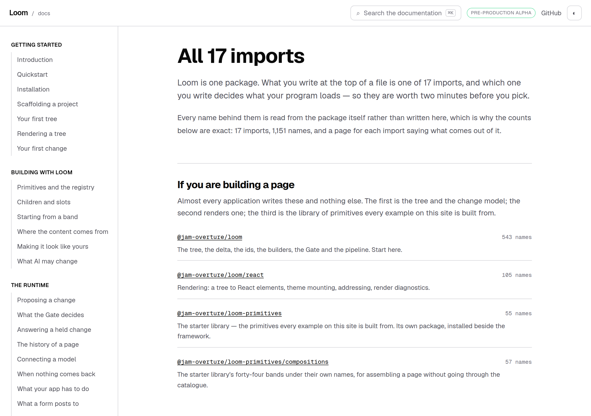
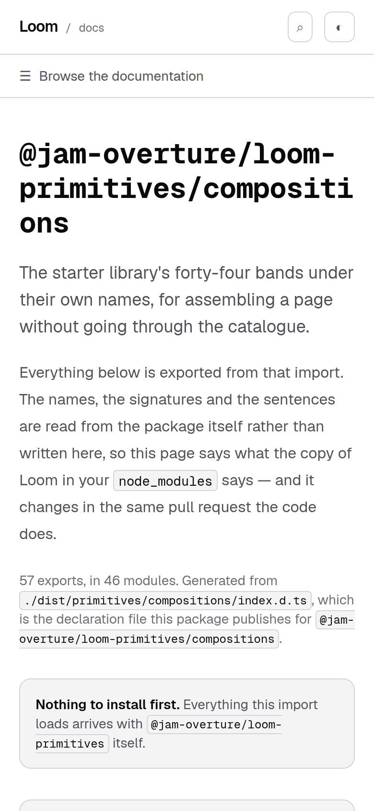

# The door that did not exist — one line in a manifest, and the eight checks derived from it

**Routine:** `Loom daily build` (framework, `src/` except `src/primitives/`, and the application shell)
**Date:** 2026-10-01
**Section:** §4c (the published surface), applying [0194](../decisions/0194-the-framework-is-the-package-and-everything-that-uses-it-ships-separately.md)
**Branch:** `framework-62-the-door-that-did-not-exist`, off `main` at `f1879b5`. **Not stacked** on #462, which is this lane's open pull request from last night and is untouched by this one
**Records added:** none, and the reasoning is below. **None superseded**
**Findings closed:** one. **Filed:** one

*`/docs/api-reference`, 1280×900@2×, built 2026-10-01T09:42:53.221Z. The heading
counted sixteen yesterday. The fourth and fifth rows are the two doors of the
same package — the catalogue, and the forty-four bands under their own names —
and until this morning the second one could not be named on this table, because
a table derived from the framework's `exports` map cannot carry a door the map
does not have.*

## First, the two things a fresh session needs to know

**The migration is done and this run did not touch it.** `apps/loom` holds five
route groups — `(marketing)`, `(docs)`, `(lessons)`, `(portal)`, `(demo)` —
`apps/` holds exactly one package, and there is no `apps/portal` or `apps/docs`.
The brief's "⚠ your next unit" describes work that landed before 30 September.
Nothing is half-migrated and nothing crosses this run boundary in pieces.

**There were no maintainer comments to address.** Four pull requests are open —
#458 `Loom demo`, #462 this lane's, #463 `Loom portal`, #464 `Loom marketing` —
and none carries a review, a review comment or an issue comment from anybody but
the routine that opened it. Nothing was outstanding.

## What was completed, in plain language

`@jam-overture/loom-primitives` publishes two doors. The root one is the
*catalogue* — `compositionById`, `compositionsForPart`, `PAGE_SEQUENCE`. The
second, `./compositions`, is where the forty-four bands live under their own
names: `heroBand`, `pricingBand`, `footerBand`.

This repository had no equivalent door. `@jam-overture/loom/primitives` resolved;
`@jam-overture/loom/primitives/compositions` did not. So the documentation site's
fence pipeline — which rewrites a reader's `@jam-overture/loom-primitives` to
whatever resolves here, so that every code block a reader copies is a block this
repository compiles — had nothing to rewrite the subpath to. The page that
teaches named bands therefore named them **in prose only**, under a callout
saying so, and the one import on that page a reader is most likely to get wrong
was the one nothing checked.

That door now exists. It is in `exports` and not in `publishConfig.exports`,
which is exactly the shape `./primitives` already has: the tarball is unchanged,
because the withheld map is what goes to the registry.

## It was not one line, and that is the part worth reading

The 29 September finding that asked for this called it *"one line elsewhere"*
and offered to take the documentation side the same day. It could not be done
that way, and the reason is a good one.

`packages.test.ts` holds `PUBLISHED_AS` — the map of *what a door here really
ships as* — against the framework's own manifest, and the rule is **exactly the
doors the workspace has and the registry does not**. That is a good rule. It is
also why the manifest line alone turns the gate red: a withheld door with no
entry in that map is a failure by construction. From there it cascaded, and
`pnpm verify` is the merge gate for four surfaces, so all of it had to land
together or none of it could.

| | |
| --- | --- |
| **mine** | the manifest line; `tools/publish/manifest.test.ts`, two assertions; `src/dist.smoke.test.ts`, rewritten |
| **forced, in `(docs)`** | `packages.ts` (the map entry, and a new `packageOf`), `entry-points.ts` (one row), `reference.generated.json` (regenerated), `extract.test.ts` (a count), `teaches.test.ts` (one assertion, one stale comment), `packages.test.ts` (two premises), `api-reference.tsx` (one sentence), one callout deleted from a page |

Every one of those is in the finding filed today, named, with the argument for
it. Two changed what a test *means* rather than what it expects, and those two
are flagged as the owner's to overrule.

## The half of this that is mine and was not asked for

While adding a door I read the check that is supposed to notice one:
`src/dist.smoke.test.ts`, which spawns a real `node` and imports every entry
point the way a consumer would. It is the only check in this repository that
would catch unloadable output, and it has caught that twice.

Its list of entry points was **hand-kept, and five of the sixteen doors were not
on it** — `./anthropic`, `./primitives`, `./signals/postgres`,
`./telemetry/postgres`, and the new one would have been the sixth. Nothing could
say so, because the list was its own authority. The test named *loads every entry
point* was loading the ones somebody had remembered.

This is the defect class this repository has now recorded four times in two
weeks — *a check derived from the list it checks cannot see the list grow* — and
the fix is the one the class asks for. The set of doors is read off
`package.json`. What stays hand-kept is a **lookup**, one export name per door,
so a door with no entry fails a test rather than going unchecked. One door is
exempt, `./testing/contracts`, because `vitest` throws on import outside a test
run by design; the exemption carries its reason as a value, so that skipping a
door is always a sentence somebody wrote.

**Planted defect, because a check that has never failed is a claim.** Adding a
`./marketplace` door pointing at a file the build does not emit: both new
assertions go red — the accounting one by name, the loading one with
`ERR_MODULE_NOT_FOUND`. Before this change, green.

One assertion got weaker and it is worth saying so plainly: the named export used
to have to be a `function`, and now it only has to be defined. `heroBand` is an
object. The thing the check is really buying — a re-export chain that leaves the
module loadable but empty — is unaffected, and five doors that were checked not
at all are now checked somewhat.

## Decisions taken that nothing specified

**No decision record, and this is the reason.** 0194 already decided the shape:
the framework is the package, the starter library ships separately, and a door
the workspace needs but the registry must not have goes in `exports` and is
withheld from `publishConfig.exports`. This adds a second door of exactly that
kind. Writing a record for it would record an instance rather than a decision,
and `decisions/README.md` is explicit that a record is for something expensive to
reverse or definitional. Reversing this is deleting four lines.

**The entry-point summary names no symbol.** The first version read *"heroBand,
pricingBand, footerBand and forty-one more"*, and `search/generated.test.ts`
refused it — correctly, and I did not expect it to. A reference page's searchable
body may not contain published symbol names, because the name index is what
should win when a reader searches by name, and a summary that lists three of them
puts the front door above the three pages that actually document them. It reads
*"The starter library's forty-four bands under their own names"* now.

**One callout deleted from a page I do not own.** `starting-from-a-band` carried a
warning saying *"this repository has no way to compile an import of that second
door yet"*. This pull request makes that false, and a false warning on a published
page is worse than no warning. The paragraph above it, which names the three bands
in prose, is untouched — turning that prose into an executed fence is the
documentation lane's work and is the whole point of the door existing.

## Open questions

**The reference's front door still opens with *"Loom is one package."*** It has
been two since 27 September, and the new row sits four lines beneath that
sentence. Filed, not fixed: it is prose on another lane's page and it is not this
change's fault, only this change's neighbour.

**`@jam-overture/loom-primitives/compositions` is the longest specifier on the
site, and the phone heading breaks it mid-word.** Nothing overflows —
`scrollWidth` 390 against `innerWidth` 390 — it is only ugly. In the finding.

## Test numbers, real

`pnpm install && pnpm verify`, **exit 0**.

| | |
| --- | --- |
| framework (`src/`, `tools/`) | **3,364 passed**, 0 failed, 169 files |
| application (`apps/loom`) | **5,993 passed**, 0 failed, 345 files |
| `pnpm findings:check` | 904 findings, 0 malformed |
| build, typecheck, prerender check | clean |

Nothing was skipped and nothing was weakened to get there. The one assertion that
is narrower than it was — `function` to *defined* — is described above with its
reason, and it buys five doors that had no check at all.

*`/docs/api-reference/primitives-compositions`, 390×844@2×. The install band
reads **"Everything this import loads arrives with `@jam-overture/loom-primitives`
itself"** — yesterday that sentence had the framework's name hardcoded into it,
and this is the first door in the reference where that was wrong.*
