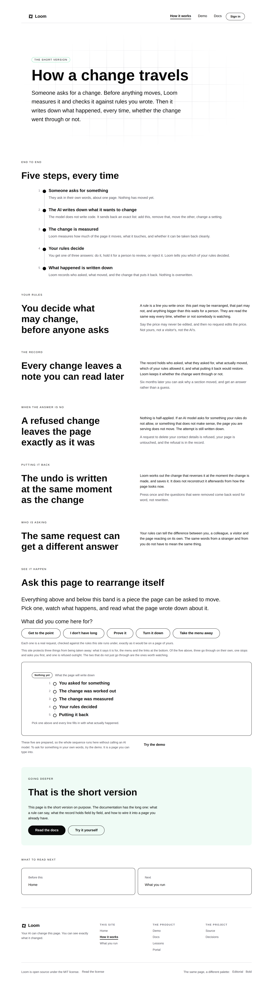
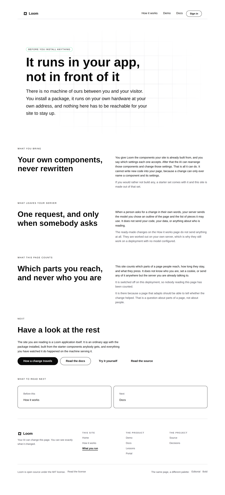

# 2026-10-01 — marketing: the whole site, read out loud

The maintainer, after rewriting four of this lane's sentences himself:

> *"Today I want you to review all the language across the entire marketing
> site. Only active links. And assess the language you chose against our new
> tone; speaking in plain language. Update where you have written weird
> language with plain language."*

Every string on the three live pages, dumped and read one at a time.
**38 of them were rewritten.** One of them was also wrong.

---

## How I read it rather than guessed at it

I rendered each of the three routes in `SITE_ROUTES` and printed every piece of
copy they produce — headings, body text, card titles, captions, link labels,
button text. 321 lines. Then I read the list, not the files.

That matters because the weird sentences do not look weird in source. They look
like deliberate writing, surrounded by a comment explaining why they are
deliberate. Printed in a flat list next to each other, the tic is obvious: the
same move, over and over, on every page.

The pages are `/`, `/how-it-works` and `/what-you-run`. Nothing else is linked
from the site, which is what *only active links* means here.

---

## What the tic actually was

Four shapes, and nearly every rewrite today is one of them.

**The subject goes missing.** *"How much of the page it moves, what it touches,
and whether it can be taken back cleanly."* Who is doing this? The sentence
never says. It is now *"Loom measures how much of the page it moves…"* — six
sentences on `/how-it-works` had no subject at all, because dropping it sounds
weighty. It mostly sounds like a label on a diagram.

**The em dash doing a job a full stop should do.** *"The page you are serving
does not move — and the attempt is still written down."* Two thoughts, one
breath, no reason. Across the whole site there is now **one em dash left in
rendered copy, and it is in the maintainer's own hero lead**, where it belongs.

**Saying it backwards.** *"Not one of these numbers was typed from memory. Each
is checked against the code it describes."* The point is second. Now: *"Every
number here is checked against the code it describes. None of them was typed
from memory."* Same two facts, the important one first.

**Being clever where a plain word exists.** *"Costs you a click."* *"Take a
turn."* *"A starting point, not the deal."* *"The way out of it"*, meaning the
menu. These now read *"Takes one click"*, *"Try the demo"*, *"A starting point,
not a limit"*, and *"the menu"*.

---

## The one that was not a style problem

> *"The ready-made changes **on the front door** do not send anything at all."*

That band moved to `/how-it-works` yesterday, at the maintainer's direction. The
sentence on `/what-you-run` still pointed at the front door, where there is now
nothing to point at. A reader following it would find an ordinary landing page
and conclude the claim was made up.

Nothing caught it. The band's own tests moved with the band; this was a sentence
on a different page naming it in prose. It now says *"on the How it works
page"*, and the finding below is about why no check noticed.

---

## What I did not touch, and why

**The maintainer's own lines.** The hero headline and lead, the governance
definition, and the bodies of steps three and four of *Using it* are his words
from 27 September and 1 October. Rewriting them in a sweep I ran on my own would
be the lane deciding positioning, which is not its call.

That leaves the one open thing from yesterday still open: **the hero argues a
build case while everything under it argues governance.** Three pages now read
in one voice, and the first screen is the exception.

---

## Everything that changed

| file | strings |
| --- | --- |
| `_lib/pages/home.ts` | 7 |
| `_lib/pages/how-it-works.ts` | 7 |
| `_lib/site.ts` | 5 — the demo blurb and all four *Takes…* lines |
| `_lib/pages/what-you-run.ts` | 4 |
| `_lib/questions.ts` | 4 — every answer in the questions band |
| `_lib/journey.ts` | 4 — the five-step panel |
| `_lib/pages/see-it-happen.ts` | 3 |
| `_lib/adapt/answers.ts` | 2 |
| `_lib/adapt/run.ts` | 2 — what the site says it protects |

Three tests moved with the copy: two in `answers.test.ts` that held exact
sentences, and two label assertions in `facts.test.ts`. **None was weakened.**
The `answers.test.ts` pair is the same failure this lane hit on 1 October — a
test pinning phrasing rather than the claim — and the sentence it holds is
built by code, so pinning the literal is the right assertion there. It just has
to be updated when the sentence is.

### A sample, before and after

| was | is |
| --- | --- |
| Letting AI near your interface is the easy part | The hard part is answering for what it changed |
| Each request is weighed on how much it moves and whether it can be taken back, then allowed, held for a person, or refused. | Loom measures how much of the page a change moves and whether it can be undone, then gives one of three answers: go ahead, hold it for a person to approve, or reject it. |
| It is the part a page builder would be built on. | No. It is the layer a page builder would be built on top of. |
| This site protects two things… what it says it is for and the way out of it. | This site protects three things… what it says it is for, the menu and the links at the bottom. |
| Take a turn | Try the demo |

That last pair in the protected sentence is derived from the rules, not typed,
so renaming the two protected pieces changed the count from two to three on its
own and the test that holds page and policy in agreement passed without being
touched. That is the check doing exactly what it was built for.

---

## Tests

`pnpm install && pnpm verify` — **green, exit 0**, on a `.next` and `dist`
deleted first, with the status written to a file by the gate script as its own
command and read separately.

| suite | files | tests |
| --- | --- | --- |
| `@jam-overture/loom` | 170 | 3,387 |
| `@loom/app` | 345 | 5,991 |

908 findings, 0 malformed · 119 prerendered pages, 1,385 text junctions, 0 run
together · 3 metadata conventions, 0 unserved.

`pnpm shoot`, all three pages plus the front door at phone width —
`scrollWidth 1280 / innerWidth 1280` and `390 / 390`, no overflow anywhere.

No decision record. No primitive added, no prop set that was not set before,
nothing under `src/` opened, nothing outside `app/(marketing)/` and `reports/`.

---

## Open for the maintainer

- **The hero.** Still the one part of the site arguing a different case from the
  rest. It is your headline, so it is your call, but it is now the only thing
  standing between this site and one voice.
- **The other three surfaces.** Docs, lessons and the portal have never been
  read against this rule. The marketing site was the instruction; those are the
  same visitor, two clicks later.
