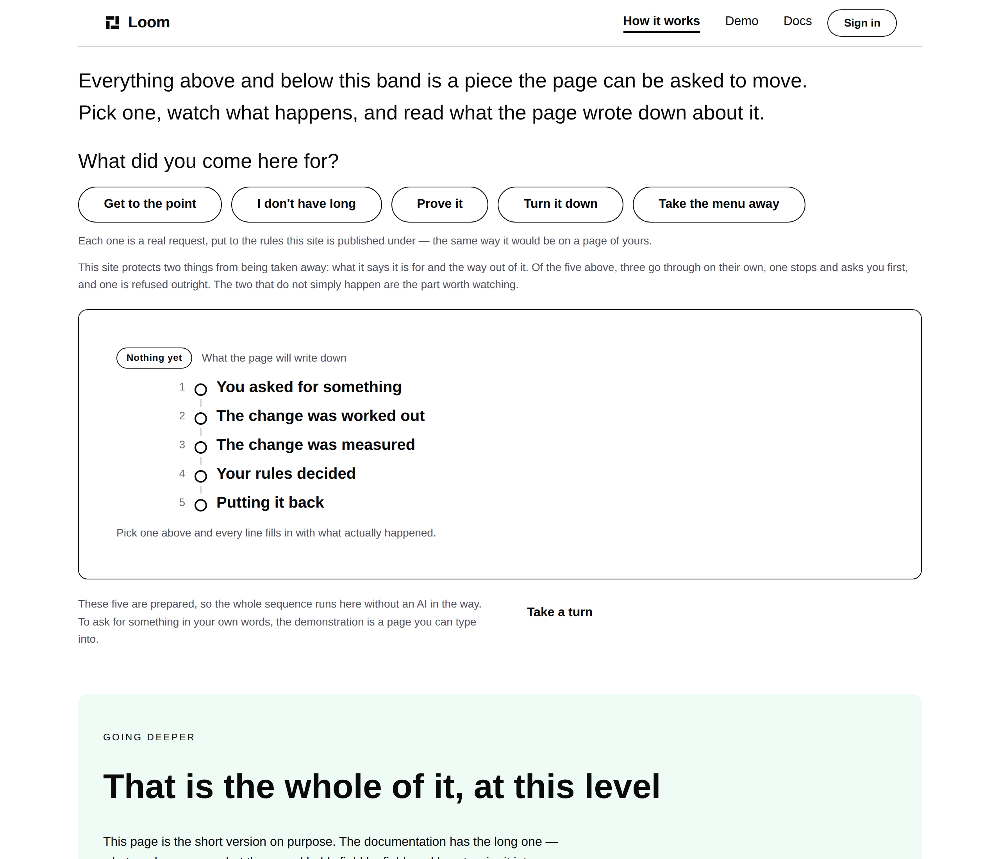
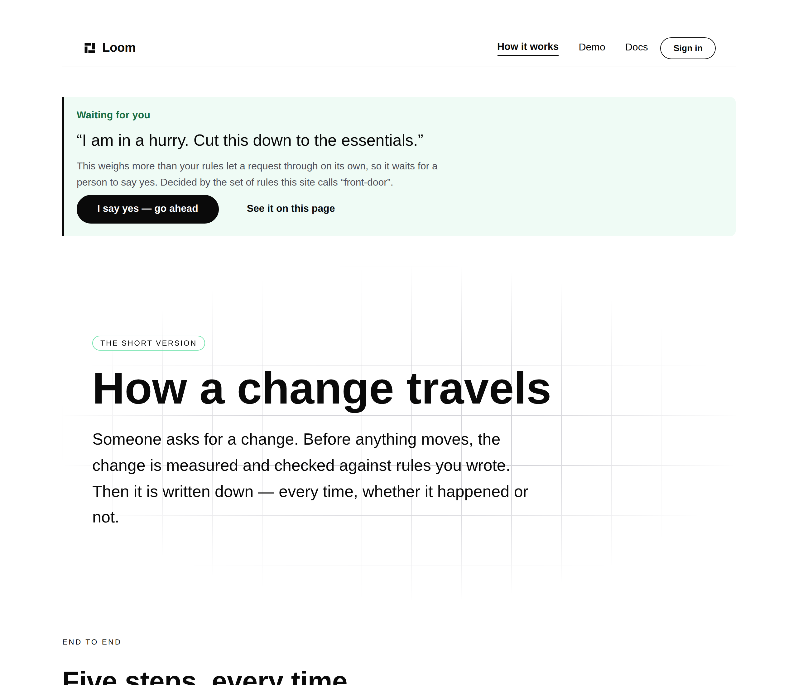

# 2026-10-01 — marketing: the demonstration moves to the page that explains it

The maintainer:

> *"Remove the see it happen section from the main landing page and only let it
> exist in the How it works section."*

Done. The band that offers the five choices, and the notice that reports what
the rules decided, are both on `/how-it-works` now. The front door no longer
runs a request.

---

## I told him this would cost the held verdict. It does not, and that is the first thing worth saying

On 30 September I reported that moving the band would silently drop one of the
three answers, because *Get to the point* comes back **held** only on account of
the band it moves being a `loom.mosaic`, and `/how-it-works` has none.

The first half was right and the conclusion was wrong. A hold does not need a
protected type: `large-removal`, `broad-change` and `shallow-structural-change`
are all stake factors that produce one. Measured by running candidate requests
against the mechanism page before writing any of this:

| request | verdict |
| --- | --- |
| remove *Going deeper* | landed |
| move a band to the top | landed |
| **remove the four short answers together** | **held** |
| **remove the menu** | **refused** |

So all three answers are reachable, and the demonstration moved whole. **This
was the difference between guessing from the policy and running it**, and it is
the reason the first report should have been a measurement rather than a
reading.

---

## What shipped

| file | what changed |
| --- | --- |
| `_lib/bands.ts` | `MECHANISM_BAND`, `MECHANISM_SHORT_ANSWERS` — the mechanism page's bands, named so a request can find one |
| `_lib/adapt/asks.ts` | the five choices retargeted, and two of them re-written |
| `_lib/render.ts` | the request and the paper trail run against `/how-it-works`; the front door is a plain render again |
| `_lib/site.ts` | `askHref` writes a `/how-it-works` address |
| `_lib/chrome.ts` | the palette switcher keeps the request on the page that now carries it |
| `_lib/pages/home.ts` | the band and the notice removed |
| `_lib/pages/how-it-works.ts` | both added |
| `_lib/pages/answer.ts` | *See the whole record* removed — it pointed at the page it is now on |

### The five, as they now read

| | what it does on this page | answer |
| --- | --- | --- |
| **Get to the point** | moves *Putting it back* up under the headline | landed |
| **I don't have long** | takes all four short answers away at once | **held** |
| **Prove it** | adds a band of evidence under the headline | landed |
| **Turn it down** | changes two settings on the opening band | landed |
| **Take the menu away** | would remove the menu | **refused** |

Two needed rewriting rather than re-pointing.

**The refusal is now the menu**, and it is a better demonstration than the one
it replaces. It was *Cut the pitch*, refused because the band saying what the
product is for is a `loom.mosaic` and the rules protect that type. This page has
no such band. What it has, and what every page of this site has, is a menu —
protected on the same terms, with `PROTECTED_IN_PLAIN_WORDS` already calling it
*"the way out of it"*. Everyone understands why you would not let a machine
delete your navigation.

**The held one is now the shortest.** *I don't have long* removed one band and
landed; it now removes four and the rules stop and ask. The request reads the
same to a visitor and does more.

---

## What the move cost, stated rather than buried

**No request on this page produces a held *undo*.** On the front door one did:
the held request moved a protected band, so putting it back moved the same
protected band again. Here the held request removes four bands, and putting four
bands back is an insert, which the rules allow on their own.

`undo.test.ts` asserted the lost property in as many words — *"Nothing here
exempts an undo to make the demonstration tidier, and this is the assertion that
would fail if anything ever did."* Nothing exempted it; the arrangement stopped
producing an example. The assertion is rewritten to what is true here (the undo
is judged by the same rules, carries its own record, and restores the page
exactly) and **the loss is filed** with the measurement behind it. The property
still holds of the system; it is these five requests on this page that cannot
show it.

---

## Three tests that were measuring the wrong thing

All the same shape, and the same one this lane hit on 30 September: **a proxy
that was only ever valid while a page had one of something.**

- `waiting.test.ts` counted `loom.milestone` across the mechanism page to check
  the panel teaches as many steps as the journey. Both runs of milestones are on
  that page now, so it asserted five equals ten. Scoped to the band.
- `answer.test.ts` found the notice's hand-off by its *path*. Every control in
  that band now shares a path with the page it sits on, so it was picking up the
  *I say yes* button, which legitimately carries an approval the visitor has not
  given. Found by its fragment instead.
- `undo.test.ts` asserted every link carried the visitor's yes. The band also
  offers the five choices again, and those are fresh requests — carrying a stale
  approval into one would be the opposite of the property. Scoped to the links
  about the change just made.

None was relaxed. Each now says what it always meant.

---

## The held answer, in place

---

## Tests

`pnpm install && pnpm verify` — **green, exit 0**, status written to a file by
the gate script as its own command and read separately.

| suite | files | tests |
| --- | --- | --- |
| `@jam-overture/loom` | 169 | 3,327 — untouched |
| `@loom/app` | 345 | 5,991 |

904 findings, 0 malformed · 119 prerendered pages, 1,385 text junctions, 0 run
together · no overflow at 1280.

**The marketing suite went from 108 failures to zero**, across eleven files,
with nothing skipped and nothing weakened. Most were mechanical — a test naming
the page the demonstration runs against — and the handful that were not are the
three above plus the undo property, each rewritten to the claim it was
protecting.

No decision record. The bands compose registered primitives, the Gate policy is
unchanged, and nothing here touches the tree schema, the delta model or an
`Accepted` record.

---

## Open for the maintainer

- **The front door no longer demonstrates anything.** That is what was asked
  for, and it is worth seeing on the preview: the page is now an argument and a
  set of destinations, with the proof one click away. If it reads as thin, the
  cheapest answer is a line in the *Keep going* band pointing at what
  `/how-it-works` will do, rather than bringing any of it back.
- **The hero** still argues a build case while the rest argues governance.
- **A full voice sweep** of the copy this lane has not touched.
