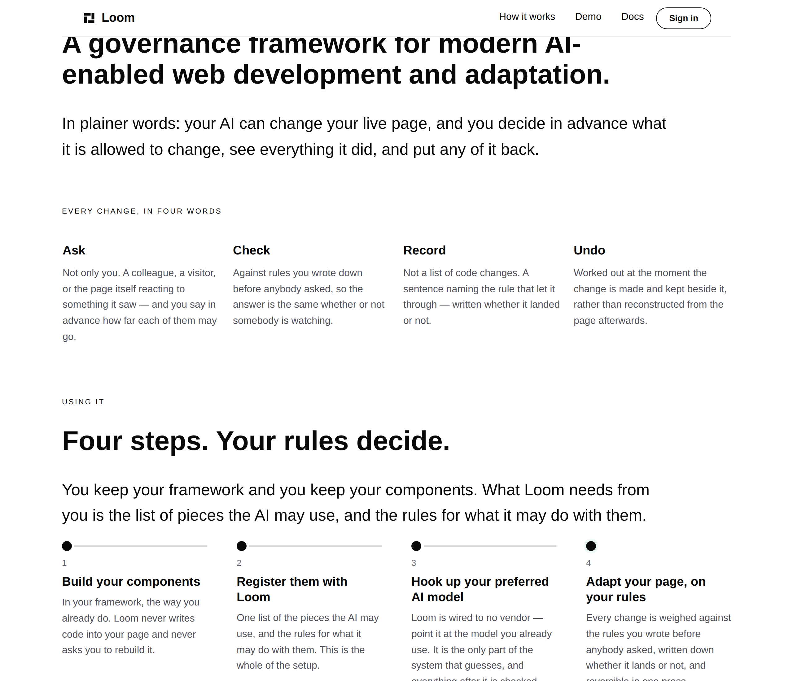

# 2026-10-01 — marketing: what Loom is, and the step that was missing from the four

Two instructions from the maintainer, one day after the *Using it* band landed,
and they turn out to be the same instruction:

> *"I think we need to frame the framework more as a governance framework for
> enabling dynamic AI web applications."*

> *"The 3rd one should say 'Hook up loom to your preferred AI model.' And the
> fourth one should say 'Adapt your page, on your rules.' Does that make more
> sense? Or am I off base?"*

He is not off base. Both changes are right, and the reason they are right is
the same reason.

---

## What shipped

| file | what changed |
| --- | --- |
| `_lib/bands.ts` | `BAND.whatIsIt` — *What is Loom?* |
| `_lib/pages/home.ts` | the definition band, under the opening; steps three and four reworded; the band's heading and lead moved with them |
| `_lib/pages/using-it.test.ts` | the shape assertion follows the new shape; two assertions added |

No primitive added, nothing under `src/` opened, no component written, nothing
outside `app/(marketing)/` and `reports/`.

---

## Why the two instructions are one instruction

The band said **"Two things you do. Then it runs."** That is a good *sell* and
it is the wrong *promise* for a governance framework. Set-it-and-forget-it is
the opposite of governance: the whole claim of this product is that you stay in
control, and a band whose payoff is *the work stops* quietly says you stop
deciding too.

His step four fixes it in three words. *"The page adapts, on your rules"* is
declarative — the page is the subject and the reader is a bystander. **"Adapt
your page, on your rules"** is imperative, the reader is the subject, and the
rules are theirs. It is the governance claim in the grammar rather than in an
adjective.

It also makes the band internally consistent, which it had not been: steps one
and two were imperative (*Build*, *Register*) and steps three and four were
declarative. All four are verbs now — **Build, Register, Hook up, Adapt.**

## Step three was a real gap, not a rewording

This is the part worth recording, because the band was *wrong* and nothing
could have said so.

Wiring a model is setup work. It is a documented page of its own
(`/docs/the-runtime/connecting-a-model`), it is the one seam a host must fill
themselves, and the band left it out — so *"this is the whole of the setup"* in
step two was false. The old step three was *"Your AI sees what readers do"*,
which is a thing that happens rather than a thing you do, and putting it third
made the setup story two steps long when it is three.

So the shape moved from **two and two** to **three you set up, and one that then
runs on every visit**, and the heading moved with it: *"Four steps. Your rules
decide."*

### What step three may claim, checked against the runtime

`modelInterpreter` takes a `ModelClient` — one method, one request, one reply —
and the docs are explicit that *"the Anthropic adapter is the only file in Loom
that knows a specific vendor exists, and it lives behind its own entry point so
a host that brings its own model never loads it."*

So **"Loom is wired to no vendor — point it at the model you already use"** is
literally true rather than a marketing softening, and the second clause is the
governance point: *it is the only part of the system that guesses, and
everything after it is checked.* A test holds the band to naming no vendor.

---

## The definition band

The maintainer's words, as he wrote them:

> *"What is Loom? A governance framework for modern AI enabled web development
> and adaptation."*

It sits directly under the opening because it answers the first question a
stranger has, and the page did not answer it. A manifesto headline, four words
of vocabulary, then a demonstration — somebody could read three screens and
never be told what the thing **is**.

**The gloss under it is not decoration.** *Governance framework* is a boardroom
phrase. It is exactly right for the buyer `docs/rollout.md` records — *"regulated
teams, agencies answering to clients, anyone with a compliance function"* — and
it is a phrase a developer evaluating over lunch can bounce off. So the line
beneath says the same thing in words nobody needs a glossary for:

> *In plainer words: your AI can change your live page, and you decide in
> advance what it is allowed to change, see everything it did, and put any of it
> back.*

The term for the person who came looking for that term, and the plain reading
for everybody else.

---

## What this does not do, and it is the open question

**This frames one band and one definition. It does not reframe the page.**

The opening is still *"The AI age needs a new way to build web apps."* — a
*build* claim, not a governance one. *What this is for* is still four things
that go wrong, which happen to be four governance failures but are not named as
such. If governance is the frame, the hero is where it has to start, and that is
a bigger unit than this one: it is the maintainer's own headline of
27 September, and replacing it is his call rather than a thing to slip into a
copy change.

Said plainly on the pull request rather than done.

---

## Tests

`pnpm install && pnpm verify` — status written to a file by the gate script as
its own command and read separately, on a `dist` and a `.next` deleted first.

| | |
| --- | --- |
| marketing suite | **37 files, 992 tests** |
| `pnpm shoot` | `scrollWidth 1280 / innerWidth 1280`, `390 / 390` — no overflow |

**Two tests added, one rewritten to the new shape, none weakened, none skipped.**

- The shape assertion is now `done, done, done, current` and says in its own
  docstring why it moved, so the next reader does not have to reconstruct it.
- **The last beat's three clauses are each asserted** — the rules were written
  first, the record is kept either way, and it comes back — because *Adapt your
  page, on your rules* is the one line most likely to be tidied back into *the
  page adapts*.
- **No vendor may be named** in the step about choosing one: `Anthropic`,
  `OpenAI`, `Claude`, `GPT`, `Gemini`. The claim is that Loom is wired to none
  of them, and the cheapest way for that claim to rot is for somebody to make
  the example concrete.

No decision record. The bands compose registered primitives, set no new prop,
and touch neither the tree schema, the delta model nor an `Accepted` record.
