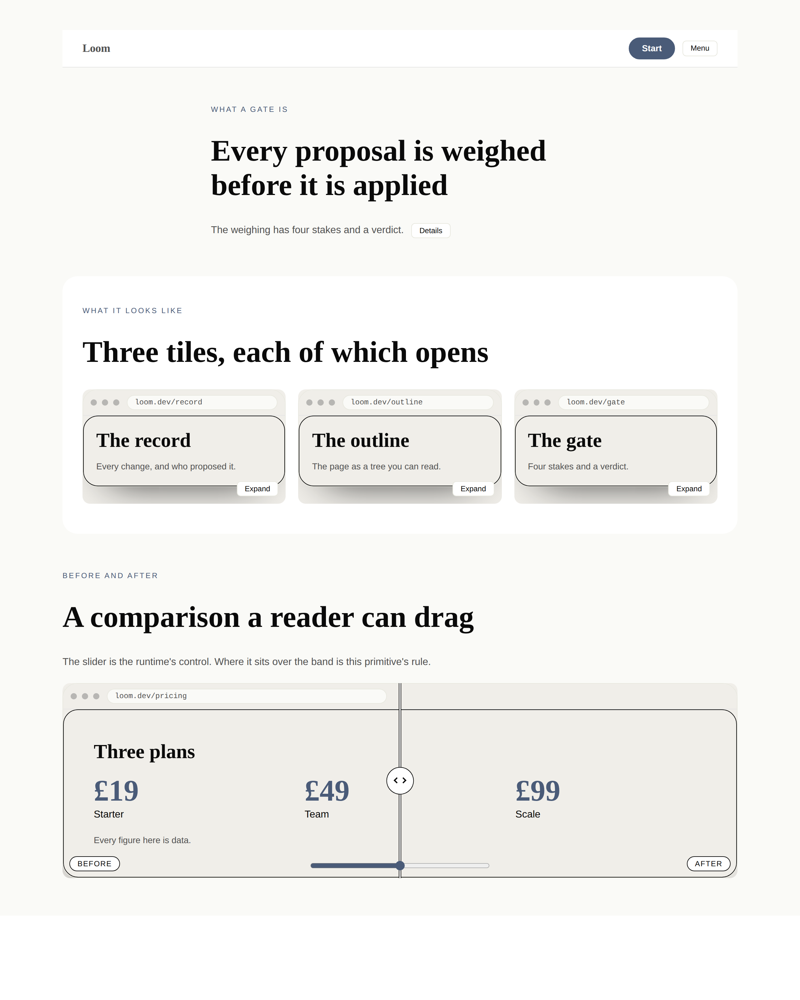
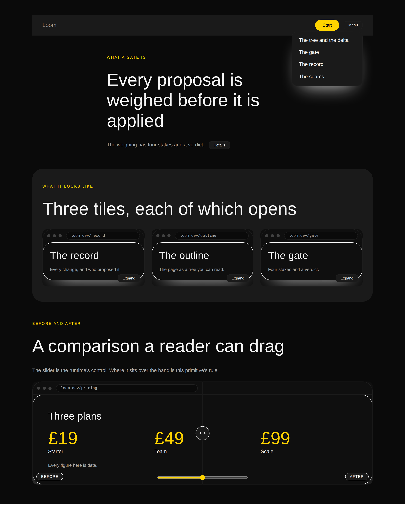
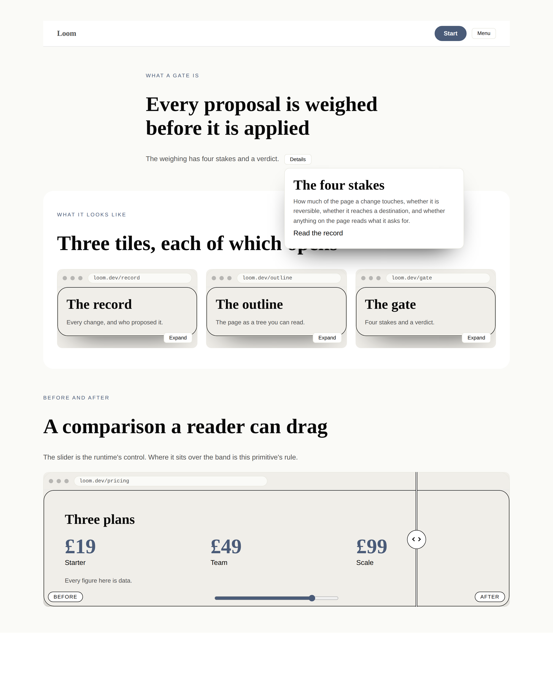
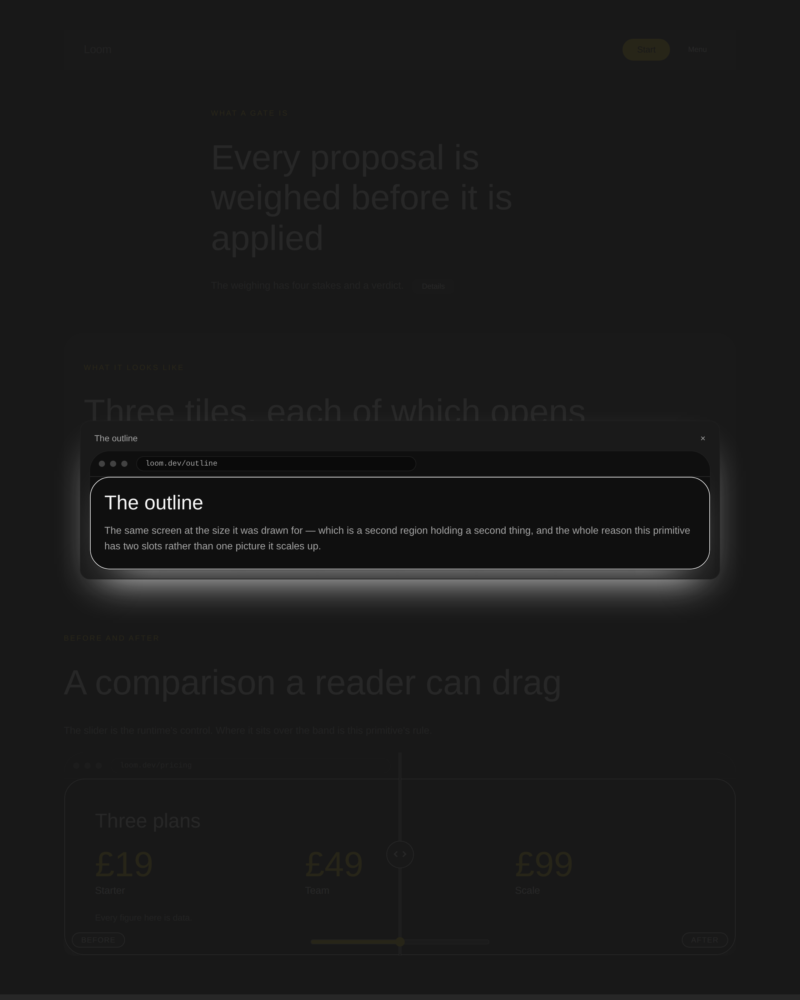
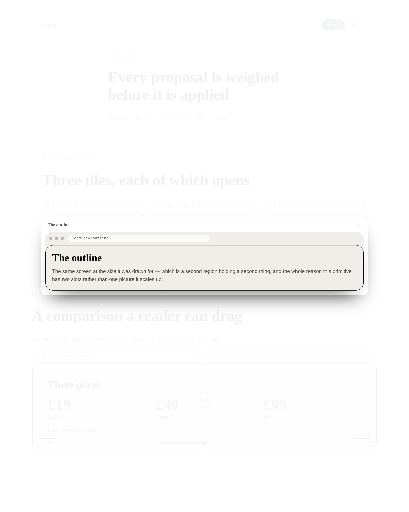
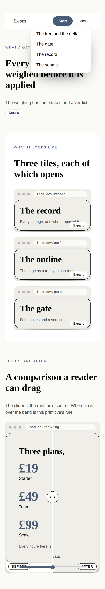
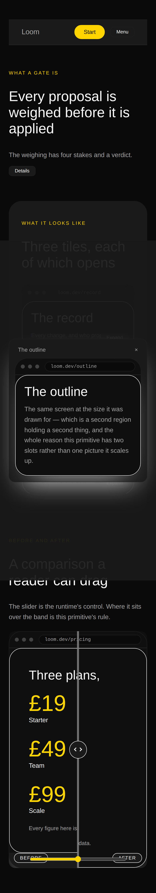

# 2026-10-01 — the three behaviours nothing declared

On 29 September `Loom lessons` ran nine lines against the starter library and
printed this:

```
  behaviours with a declaring primitive in the library:
    copy      loom.code
    disclose  loom.nav
    adjust    nothing declares it
    present   nothing declares it
    dismiss   nothing declares it
```

Three members of the behaviour vocabulary, built, decided, documented and
unplaced. Two findings were open against this lane about it — one twenty-eight
days old, one nine — and the older of them is the plainest specimen lesson 28 has
of a closed finding that was never done.

**All three are declared now.** This run is three new primitives, one rewiring,
and the document that told lanes Tier B was blocked.

---

## What shipped

| | |
| --- | --- |
| `loom.menu` | a run of `loom.link` behind one button, dropped over the page — `present` |
| `loom.popover` | the general presentation: a panel beside the thing it explains — `present` |
| `loom.lightbox` | a tile that opens over the viewport — `present` **and** `dismiss`, the only primitive in the library to declare both |
| `loom.before-after` | now declares `adjust`: the wipe drags |
| `presentation.ts` | the shape the three share, and the three ways to get it wrong |
| [0210](../decisions/0210-a-primitive-may-lock-the-pages-scroll-from-the-stylesheet-and-only-while-its-own-region-is-open.md) | a primitive may lock the page's scroll from the stylesheet, and only while its own region is open |
| `presentation.test.ts` | 25 tests in jsdom, **six of them confirmed to fail** against a trigger placed one box too deep |
| `the-behaviours-nothing-declared.specimen.ts` | the repository's **first live specimen** — four states, two palettes, two viewports |

The library is at **102**. `docs/primitive-gap-inventory.md`'s Tier B is split
the way 0176 splits it, which is what the 29 September finding asked for.

---

## One — why these three, and why not the fourth

The brief's instrument for choosing work is the gap inventory, and read on
30 September it said Tier B was *"roughly nine, and they arrive together or not
at all, because they are one framework decision rather than nine."* **That had
been false for eleven days.** 0176 sorts the nine into three groups and says of
the first — dialog, dropdown, lightbox, tooltip — *"This record settles the
first."* `Loom lessons` filed the correction on 29 September, having measured it
from the other end.

So the work was chosen by believing the decision record over the document, and
the document is corrected in this run.

Of the four that group unblocks, **three shipped and the dialog did not**, and
the reason is worth the paragraph because it is the one thing in this run that
could not be built around.

A behaviour's control is named by strings the *primitive* declares, resolved per
**type**:

```ts
const MENU_TEXT = { present: "Menu" } as const
```

A deployment's dictionary may translate that; a tree may not write it. For an
affordance that is correct — *Expand* over the corner of a thumbnail is the word
a reader wants, and a model inventing one per tile is a page where the same
control is called four things. **A dialog's trigger is not an affordance.** It is
the page's call to action, which is content, and a `loom.dialog` built today
would be a modal opened by a chip reading *Open*. Filed, with the three shapes a
fix could take and what each gives up.

The same constraint is why `loom.popover` is not called a tooltip: an icon-only
`ⓘ` cannot be built, so what ships opens on a press and says *Details*. A
hover-only disclosure is unreachable on every touchscreen ever made anyway, which
is why the pattern libraries that keep tooltips keep a pressable twin.

## Two — which fields became nodes and which stayed props

The brief asks this of every run. No Hermes block was ported — none of these has
one, for the reason the gap inventory gives about Hermes' users being creators —
so the question is answered against the content models themselves.

| | | why |
| --- | --- | --- |
| a menu's items | **nodes** | the plainest case 0052 has. A menu grows and shrinks by `insert` and `remove`, which is the whole argument against `items: MenuItem[]` |
| a popover's contents | **nodes**, and `text` children under them | prose is `text`, and *heading plus body* is one of four shapes somebody will want. A primitive that predicted it makes the other three unsayable to save a node |
| a lightbox's preview and its full region | **two slots** | `loom.before-after`'s `before`/`after` argument unchanged (0051). Two URL props would have made *a tile at one crop, a video at full size* unsayable — and they are two files, which is why a gallery of them does not cost four megabytes to scroll past |
| a lightbox's `caption` | **prop** | 0052's fixed field, the same call `loom.before-after` makes about its corner labels: one per region, it names the region rather than being its content, and changing it is exactly a `configure` |
| `placement`, `align`, `width` | **props** | the near-miss, run out loud below |
| a wipe's `position` | **prop**, unchanged | and the one that turned out to have a defect in it — see *Five* |

**The near-miss, because it is the one `docs/primitive-granularity.md` says to run
out loud.** `placement: "below" | "above"` looks like `move`. Run the sharper
question — *does changing this prop change the set of nodes?* — and it does not:
no operation reorders a panel relative to its trigger, because the panel is not a
sibling of anything in the tree. It is one region the primitive places, and which
side of the button it hangs on is the same kind of fact as `align: "start" |
"center"`, which that document lists as its worked example of a real prop. The
same reading makes `width: "narrow" | "wide"` a prop: it is a ceiling on one
region, not a count of anything.

**And the decomposition that was taken.** `loom.menu` and `loom.popover` are
structurally the same primitive — a trigger and a panel — and shipping one with a
`kind` prop was the live alternative. 0062 is why there are two: the general
arranger and the named band, applied to a presentation rather than an
arrangement. `loom.popover`'s description carries the clause 0062 makes binding —
*prefer a named presentation where one fits* — because a description is all a
model has when it chooses. A menu's rows are a different rendering with different
markup and a different semantic, and *menu* is what a person calls it.

**What was not decomposed**: a gallery. By 0054 a container is its child's name
plus the arrangement, and the arrangement a gallery wants exists twice over —
`loom.mosaic` for an unequal rhythm, `loom.grid` for an even one. A
`loom.lightbox-grid` would be a third name for a layout already registered. The
gap inventory has said *gallery → `loom.mosaic`* since 13 September; this is the
piece that made it true.

## Three — the test that catches what 0176 says nothing can

0176 records a defect and its own non-diagnosis:

> **A primitive can place the pair wrongly and nothing will say so.** If the
> cross is not inside the element the trigger was placed in, the event does not
> arrive and the button does nothing. […] the seam cannot see a primitive's
> layout.

The seam cannot, and neither can `library.test.ts`: `renderToStaticMarkup` never
mounts a control, so every static assertion about a presentation is an assertion
about the page where the region is simply open. A trigger placed one box too deep
publishes `data-loom-presented` on a box the hide rule is not keyed on — the rule
matches nothing, the panel never closes, and **the static markup is byte-identical
to a correct primitive's.**

`presentation.test.ts` mounts the real render in jsdom and runs **the primitive's
own rule against the primitive's own markup**, with the selector read out of the
emitted stylesheet rather than retyped:

| test | against a broken primitive |
| --- | --- |
| publishes the state on the element the rule is keyed on (×3 primitives ×2 palettes) | **fails** — the attribute lands on the wrapper |
| reaches the region with its own hide rule while it is shut (×3 ×2) | **fails** — the selector matches nothing |
| stops reaching it once the reader opens it (×3 ×2) | **fails** both ways: a wrapped trigger, *and* a rule written to reveal on `"true"` |
| closes the lightbox from the cross inside it | the pair agreeing through the DOM, end to end |
| closes it on Escape | the second way out of the one region a press outside cannot dismiss |
| keeps two presentations on one page independent | 0176's rejected module-level store would have closed both |
| locks the page's scroll while the frame is open and releases it when it shuts | 0210, as a selector match on the document element |
| publishes the wipe's number where the clip inherits it from (×2) | **fails** if the slider is placed anywhere but the root — inheritance runs downwards only |

**Confirmed rather than asserted.** Wrapping `loom.popover`'s trigger in one
`<span>` turns six of the twenty-five red and nothing else on the sheet moves.
Inverting the hide rule on the same primitive turns three red, one of them in
`library.test.ts`. Both experiments were run and reverted.

## Four — the first live specimen

`specimen.ts` grew `live` and `states` for this exact subject — *"a picture of a
dialog is two pictures, shut and open, and they are the same page"* — and until
this run nothing had used them. Every specimen in the repository is
`renderToStaticMarkup` served as a file, which is the one subject in which no
control in the vocabulary appears at all.

Four states, two palettes, two viewports.

### `shut` — the control, and the half that is easy to leave out



A sheet of open panels proves three panels can be drawn and says nothing about
whether they ever close; a primitive whose hide rule was written in the wrong
direction photographs identically in the other three states. This is the shot
that would catch it. Four triggers are on the page — *Menu*, *Details*, three
*Expand* chips, and the wipe's slider — and nothing is open.

### `the menu` — the thing `disclose` could never draw



`loom.nav` has collapsed its whole menu behind a button since 25 August, which is
`disclose` doing the one thing `disclose` does: a region laid out beside its own
trigger. What it cannot do is nest. A dropped panel is not its button's sibling —
it is positioned against it and drawn over the band below — and that is the
sentence 0176 exists for.

### `the popover` — and the wipe, dragged



Two things in one shot because the `fill` step takes no pointer press, so it
leaves an open panel open. The wipe is at 80 here and at 50 in every other shot,
which is the first photograph in this repository of a behaviour control being
*used*.

### `the lightbox` — the one region that covers the page



The **second** tile is the one pressed, and the other two are shut: 0176's
rejected module-level store would have opened all three. The page behind is
dimmed, does not scroll, and the way out is the cross — because the scrim is
inside the element the trigger was placed in, so a press on it is an *inside*
press and will not dismiss. That is 0176's fifth clause, and it is why this is
the primitive `dismiss` was described for.

### Both palettes, and the phone



**The editorial shot is the one to look at for what the theme model costs.**
`bg-overlay` is a *surface* — `#ffffff` under the light palettes — so a lightbox
under `editorial` recedes the page by whitening it rather than darkening it. That
is `loom.overlay`'s reasoning applied honestly rather than a hard-coded wash, it
re-themes correctly, and a genuinely dark cinematic scrim wants a palette slot
that does not exist. Already filed by `loom.overlay`'s own author; not re-filed.




Both remaining palette/state pairs are in this folder; ten shots are committed of
sixteen taken.

**Two things the camera taught this run**, both now in doc comments where the
next author meets them:

1. **A fixed region cannot be photographed by a page-sized shot.** A full-page
   capture of a page taller than its viewport shows the scrim stopping partway
   down with the rest of the page bright beside it — the camera being right about
   a fixed element and the picture being wrong about the primitive. The wide
   viewport on this sheet is 1600 rather than the harness's 900 for that reason,
   and it is the one deviation from `DEFAULT_VIEWPORTS` here.
2. **`isolation: isolate` on an overlay's root is a defect, not a tidiness.** It
   makes a stacking context, which confines every `z-index` inside it, so the
   frame's layer stopped being a page layer and the bands *after* the tile in the
   document painted over the scrim. One draft had it. The photograph is what
   found it.

## Five — what placing `adjust` found

The 29 September finding says the wiring is three lines and it is. What it could
not have known is what the fourth line would show.

`ADJUST_RESTING` is **50**, fixed, and `build` receives a node's text and content
but not its props. `behaviour.ts` states that and argues it is harmless, because
the primitive supplies its own position as the `var()` fallback and *"once a
reader has a slider in front of them, where it started is theirs to change."*

The first half is true and is why this shipped safely: a page served without
scripting is still the still comparison at the position the tree asked for, which
`library.test.ts` now asserts as the literal `var(--loom-adjust, 42)`.

The second half does not survive a page. The control writes `--loom-adjust: 50`
in its **mount effect**, so a band authored at 35 renders at 35 in the HTML and
jumps to 50 the instant hydration lands. **On any page a reader visits, the prop
does nothing.** The `shut` shot above declares 35 and photographs 50, under both
palettes. Filed, with three shapes a fix could take.

## Six — the gate

`pnpm verify` — **green, exit 0**, on a `dist` and a `.next` deleted first.

| suite | files | tests |
| --- | --- | --- |
| `@jam-overture/loom` | 170 | **3,393** |
| `@loom/app` | 345 | 5,991 |

908 findings, 0 malformed · 119 prerendered pages, 1,385 text junctions, 0 run
together · 3 metadata conventions, 0 unserved.

**Two cross-lane edits, both forced, both filed as their own entry so they are
reviewed rather than discovered.** One assertion in `src/sdk/pairings.test.ts`
(widened, not loosened — `loom.overlay` is no longer the only primitive painting
`bg-overlay`), and five lesson transcripts that print the size of the starter
library. The fifth is lesson 31, whose exercise G is the exercise that found this
work and whose forty-line section describes the gap it closed; the transcript is
the current output, the section is kept and dated, and a short closing subsection
says what each line reads today. That last judgement is the one that wants the
maintainer's eye and the finding says so.

Nothing was weakened to get here. `reference.generated.json` moved by one line
and was regenerated with the repo's own command.

## What the library still cannot express

- **A dialog**, for the trigger's word rather than its behaviour. The first of
  Tier B's three groups is now *three of four* and the fourth needs a decision
  about what a control may be called.
- **Focus trapping and `inert`.** A reader on a keyboard can tab out of an open
  lightbox into the page behind it. Both are script, both are 0176's *primitive's
  half*, and neither is expressible in a stylesheet. The scroll lock — the third
  of that trio — is done, by 0210.
- **A panel that knows whether it fits.** `placement` and `align` are declared
  because measuring a viewport means opening a client boundary per primitive.
  CSS anchor positioning is the answer and is not available to a library that
  must render everywhere.
- **Tier B's other two groups.** One of *n* children chosen, where the labels are
  in the children — tabs, segmented control, pricing toggle, radio group — which
  0176 filed as `ARCHITECTURAL` and did not build; and `toast`, a region that
  appears on an event nobody pressed.
- **`21st.dev` is still `EGRESS_BLOCKED`**, re-verified — the seventeenth time.
  Not re-filed; the maintainer answered it on 16 August and the standing
  instruction until the allowlist lands is to work to `loom.hero`,
  `loom.feature-grid` and the Hermes content models on disk.
