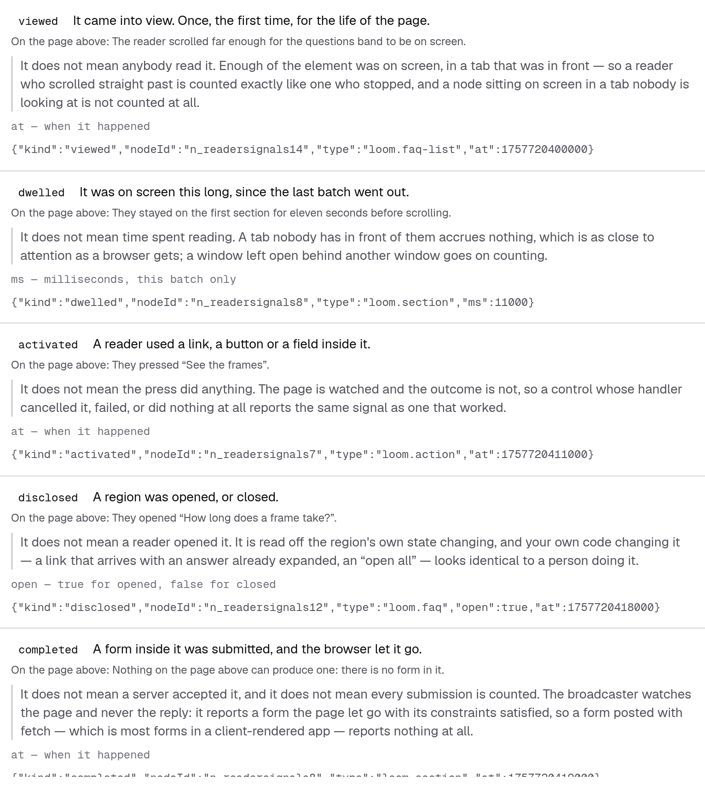
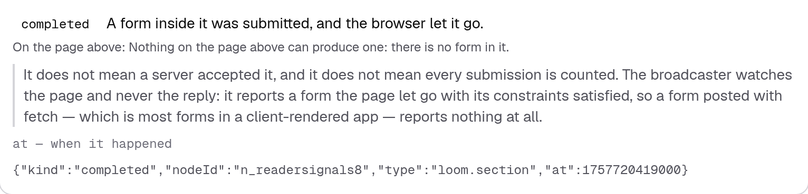
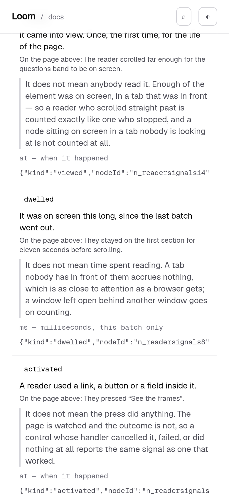

# 2 October 2026 — what these do not mean

**Routine:** `Loom docs` · **Branch:** `docs-43-what-these-do-not-mean` ·
**Section:** §4c

No open pull request from this lane at the start of the run, so this is a fresh
branch off `main` at `440db17`. No maintainer comments were outstanding on any
pull request of this lane's.

The work is the open finding `Loom signals` filed against this lane on
1 October, which is ahead of the plan in the findings queue.

## What this run was

`completed` landed on 1 October. The page that documents reader signals did
exactly what it was built to do: the kind moved out of the *agreed on, not built
yet* block and into the vocabulary table, and the announcement removed itself.
All of that machinery is right.

What went with the announcement was the one sentence that said what `completed`
is **not**:

> *It does not mean a server accepted it. The broadcaster watches the page,
> never the reply…*

It had been printed only beside a kind the runtime did not have, on the
reasoning that once a kind ships, what it does is visible in the signals beside
it. The filing's argument is that the reasoning holds for four of these kinds and
not for the fifth: `viewed` is a node viewed, `disclosed` is a region disclosed —
but a `completed` is **named after something the page cannot observe**, and the
row left behind said only what it does mean, to a reader about to build a
conversion report on it.

## The plain version

Every one of these names is shorter than the fact it stands for. A name has to
be, or it would not be a name. The difference between the two is where a report
built on them goes quietly wrong — quietly, because a page describing a gap that
is not really there renders exactly like a page describing one that is.

So each row now says what it means and, behind a hairline, what it does not:

| | does not mean |
| --- | --- |
| `viewed` | that anybody read it — a reader who scrolled straight past counts like one who stopped |
| `dwelled` | time spent reading — a tab nobody is in front of accrues nothing, a window behind another one goes on counting |
| `activated` | that the press did anything — a cancelled, failed or inert control reports the same signal |
| `disclosed` | that a reader opened it — your own code opening a region looks identical |
| `completed` | that a server accepted it, **and** that every submission is counted |

## The reasoning turned out to hold for all five, so it is a field

This is the one real decision of the run and it is wider than the finding asked
for. The filing's ask was *a `doesNotMean` on the live row as well as the
approved one* — `completed`'s sentence, moved. What the run did instead was make
the caveat a **required field on every documented kind**, which is a different
thing in two ways:

- **A sixth kind cannot ship without one.** `NOT_MEANT` was
  `Partial<Record<DocumentedKind, string>>` holding one entry. The table is a
  required member of `DESCRIPTIONS` now, so a kind arriving in the runtime
  without a caveat is a compile error in this file and a red test in two others
  — in the node half of the suite as well as the DOM half.
- **`produceApproved` reads it off the same table the live rows read**, so the
  two lists say the same amount about the same kind. The defect was never a
  missing sentence; it was that a kind moving between the lists changed what a
  reader was told about it.

The other four earned a sentence on inspection rather than by symmetry. Each of
their gaps is a mechanism in the broadcaster, not a nuance:

- `activated` is a bubbled `click` listener with no `defaultPrevented` check, by
  design — the page is watched and the outcome is not.
- `disclosed` is read off a `toggle` event or a `data-loom-disclosed` mutation.
  Neither carries who caused it.
- `viewed` and `dwelled` are a geometry test gated on the tab being in front,
  which is as close to attention as a browser gets.

## The sentences are made to happen, not asserted

A caveat is the easiest kind of sentence on this site to get wrong, because
**nothing about a page disagrees with it**. A page claiming `completed` misses a
`fetch`-posted form renders identically whether or not that is true.

So `_lib/signals/gaps.test.tsx` drives the **real broadcaster** — imported from
`@jam-overture/loom/signals/broadcast`, the entry point the page tells a reader
to import it from — in a jsdom document, and makes each gap happen:

| the sentence | what the test does |
| --- | --- |
| a cancelled submit reports nothing | submits a form with a `preventDefault` listener on it |
| …and an uncancelled one does | the same form, untouched — the pair is the claim |
| it never waits for a reply | the signal's instant is the submit's |
| a cancelled press still reports | presses a link whose handler cancels it |
| an inert press still reports | presses a button with nothing behind it at all |
| code opening a region is indistinguishable | sets the attribute from script, with no interaction |
| scrolling past counts like stopping | two nodes, one visible 1 ms and one 30 s, compared field by field |
| a hidden tab counts no `viewed` | reports a node on screen with the tab hidden |
| a hidden tab accrues no time | 11 seconds of clock, 5 of them in front, counted as 5,000 ms |
| …including for a node that leaves | the node is removed while the tab is still hidden |

`DEMONSTRATED` quotes a clause out of each page sentence and asserts it is still
in it, so **neither the prose nor the demonstration can drift without taking the
other with it**. It is typed `Record<ReaderSignalKind, string>`, so a sixth kind
is a compile error here too, and a test at the foot of the file catches the other
direction.

This is not a second copy of `broadcast.test.ts`. That file tests the
broadcaster and does it more thoroughly than this one ever should. What is here
is the join: the runtime lane owns whether the behaviour is right, this lane owns
whether the page says so.

## The two things this run got wrong first, which are the interesting half

**Nothing on this site rendered that panel.** Fifteen assertions across
`page.test.ts` and `claims.test.ts` were about what the producer computes, and
every one of them stays green when the component stops printing a row — or stops
printing anything. The caveat could have been produced, asserted, held to the
broadcaster's real behaviour, and simply not on the page, with `pnpm verify`
green throughout. `_components/reader-signals.test.tsx` is this run's answer and
it did not exist until that was noticed. Seven components in this route group are
still never rendered by any test; the list is filed.

**The component test had the defect it was written to fix.** Its first row count
was `expect(rows).toHaveLength(produceKinds().length)` — which is satisfied by a
producer returning nothing, along with every loop below it. *A test derived from
the list it checks cannot see the list shrink*, filed by this lane on
28 September, reached for by the lane that filed it, one file after writing the
sentence about it. It holds against `READER_SIGNAL_KINDS` now, and against being
more than one.

## Decisions taken that were not specified

**No decision record.** Nothing here touches the tree schema, the delta model or
an `Accepted` record. No primitive is added and no prop is set. `src/` was not
opened: `git diff origin/main -- src/ tools/` is empty.

**`viewed`'s sentence is vaguer than it could be, on purpose.** *"Enough of the
element was on screen"* rather than *"half of it, or a third of the window"* —
which is what `isReadable` really tests. Those are two hand-typed numbers about
runtime behaviour standing next to the noun they count, which is the class this
lane spent 1 October building a mechanism to refuse. The thresholds are not
exported, so precision here would have to be bought with typed numbers. Filed
instead, with the one-line remedy.

**The caveat is styled as a counterweight, not a footnote.** Same size as
`means`, muted, behind a hairline. Dimming it further was the first version and
it was wrong: the whole finding is that this is not a footnote.

**The parenthetical separating it from *what a signal does not carry*.** That
section, further down the same page, is about what is deliberately left out of a
signal, and the reason is privacy. This one is about what a browser can see at
all. Two *does not* sections on one page with no sentence distinguishing them is
a page that reads as hedging twice, so there is one, and it is held to being
above the section it points at.

## Tests

`pnpm install && pnpm verify` at the repository root, on a `dist` and a `.next`
deleted first: **green, exit 0**, with the status written to a file as the last
thing on its own line and read in a separate command.

Both sides measured in this checkout, `main` at `440db17` built in a worktree:

| | `main` | this branch |
| --- | --- | --- |
| `@jam-overture/loom` | 172 files / 3,462 tests | **172 / 3,462** — `src/` was not opened |
| `@loom/app` | 356 / 6,262 passed, **1 skipped** | **358 / 6,290 passed, 0 skipped** |
| the signals files | 52 passed, 1 skipped | **79 passed** |
| findings ledger | 937 entries, 0 malformed | **940**, 0 malformed |
| prerender | — | **122 pages / 1,451 text junctions**, 0 run together; 3 metadata conventions, 0 unserved |

**+28 passing tests across two new files and two existing ones. Nothing
weakened, skipped or deleted — and the suite's one skipped test is gone**, which
is this finding's own trace: `it.skipIf(landed)("says what it is not, while it is
still only agreed on")` skipped itself the day `completed` landed, and that skip
was the only thing in the repository that knew the caveat had gone.

The merge gate was red once, read from the file and not from the notification:
`compiled.test.ts` said `the-runtime--what-your-readers-do.tsx is stale` because
the new paragraph moved every fence down fourteen lines. Regenerated with
`pnpm --filter @loom/app docs:fences` rather than edited.

### Green is not evidence — fifteen mutations

Each introduced one at a time against the final committed code and reverted
before the next. The five against `src/` were built, run, and reverted with
`git diff --quiet src/` checked afterwards; `src/` is untouched on the branch.

| what was broken | tests that went red |
| --- | --- |
| the component stops printing the caveat | 2 |
| the caveat loses its data key | 1 |
| one kind's caveat is emptied | 2 |
| `produceApproved` goes back to its own partial table | 1 |
| a caveat merely repeats what the kind means | 2 |
| a sentence is rewritten and loses the clause its test reproduces | 1 |
| the introducing paragraph is deleted | 3 |
| the paragraph is moved below the panel | 1 |
| the parenthetical separating the two *does not* sections goes | 1 |
| **the broadcaster reports a submission the page cancelled** | 1 |
| **`activated` starts skipping a cancelled press** | 1 |
| **the disclosure observer stops watching the attribute** | 1 |
| **the ledger stops gating `viewed` on the tab being in front** | 1 |
| **the ledger keeps counting while the tab is hidden** (`hid`) | 1 — *after* a test was added for it |
| **`drain` accrues while the tab is hidden** | 0 — equivalent, see below |

**Two survived their first run, and they are the reason this section exists.**

`drain`'s `if (!hidden)` guard turned out to be **redundant**: `hid` has already
nulled `since` and the early return fires before the loop, so removing it changes
nothing on any reachable path. An equivalent mutation, not a hole — recorded
because it is half of a pair of guards that are each other's backstop.

The other one is a real hole and it is not this lane's. Deleting the line in
`hid` that nulls `since` leaves **`src/signals/ledger` and `src/signals/broadcast`
green: 54 tests passed**, and makes a node that leaves the page while the tab is
in the background accrue the whole hidden stretch — *and* the pre-hidden stretch
twice. Measured: 3 seconds on screen, 5 hidden, reported as **11,000 ms**. The
docs test that now catches it was written in response; the ledger test that
should is filed for `Loom signals`.

## At 390 pixels

`scrollWidth 390 / innerWidth 390` on all four shots. The caveat's hairline and
indent survive the column; the JSON under each row scrolls inside its own box as
it did before. `built 2026-10-02T14:21:57.518Z`, served by the harness itself.

## Scope

`apps/loom/app/(docs)/` only, plus `FINDINGS.md`, this report, its shot list and
its screenshots. `git diff origin/main -- src/ tools/` is empty, and so is the
same diff against every other route group.

Two files are new — `_lib/signals/gaps.test.tsx` and
`_components/reader-signals.test.tsx`. Five are touched: `_lib/signals/page.ts`,
its two test files, `_components/reader-signals.tsx`, the page itself, and the
generated fence program, regenerated with the repository's own command.

## Findings

**Closed — one, and wider than it was filed.** `Loom signals`' 1 October entry,
*the sentence that stops a reader over-reading `completed` is the one sentence
the page deletes the day the kind ships*. Both halves it asked for are in the
`completed` sentence; the mechanism is a required field rather than a moved
string, so the other four kinds carry theirs too.

**Filed — three.**

- *A node that leaves the page while the tab is in the background is credited
  with the whole time the tab was hidden* — for `Loom signals`. A latent defect
  rather than a live one: the code is right, and nothing would notice if it
  stopped being. One ledger test closes it.
- *"On screen" is two numbers inside an unexported function* — for
  `Loom signals`. Why `viewed`'s sentence on the page is vaguer than it needs to
  be, and the one-line remedy that would let it be precise without typing a
  number.
- *Every assertion about a produced block on this site is about what the producer
  computes, and seven components are never rendered by any test at all* — for
  this lane. One instance closed here; the list is recorded so the next run has
  it. Deliberately not turned into a sweep, with the reason.

**Not re-filed:** the preview URL cannot be verified from this sandbox
(15 September); the screenshot harness photographs an address while the theme
lives in `localStorage`, so the pictures are light (14–16 September); the phone
heading break on an entry-point page (23 September); the ten British names in the
published API (27 September).

## What I would write next

- **The `<wbr/>` at each slash in the entry-point heading.** Still the oldest
  open reader-visible thing in this lane, named as next by the three reports
  before this one. It keeps losing to findings that arrive ahead of it in the
  queue, which is the queue working, but it is now nine days old.
- **`entry-points`' render test**, which is the one instance of this run's third
  finding that matches the class exactly — a produced block whose producer is
  tested and whose printing is not — and is the same page as the `<wbr/>`.
- **`paletteScheme`**, the other export #410 added, still undocumented outside
  the generated reference.
