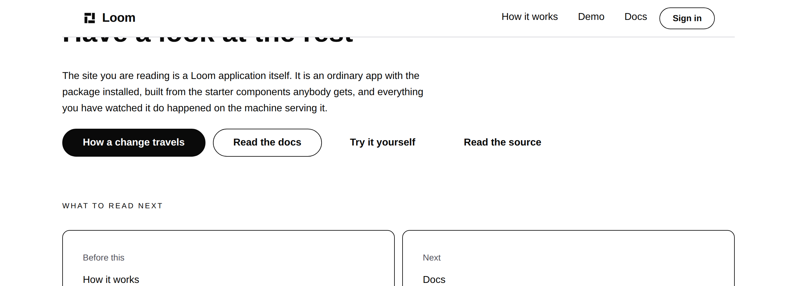
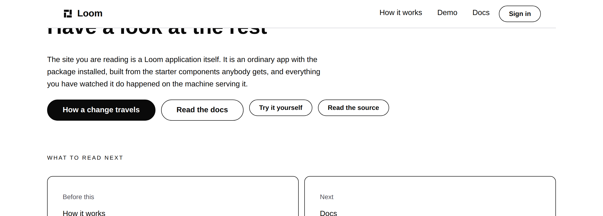
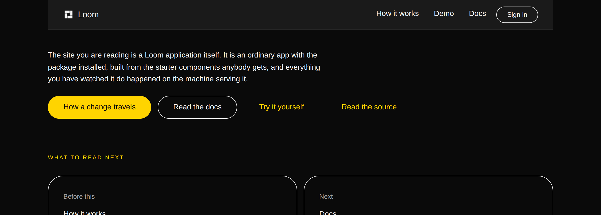
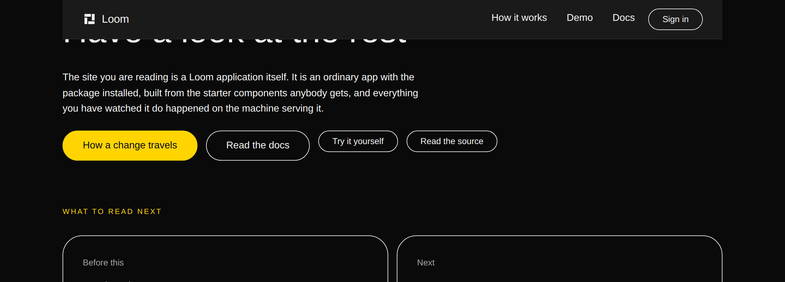
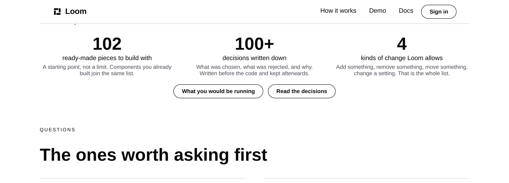
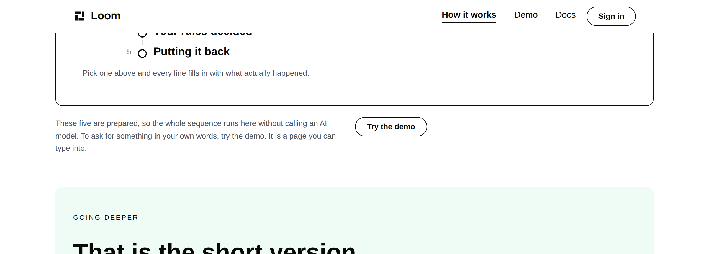
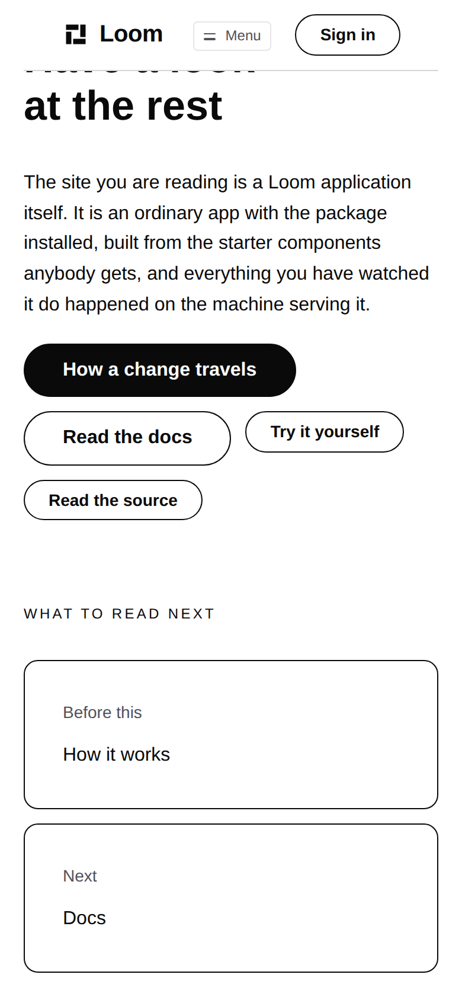

# 2026-10-02 — marketing: the control that was only bold

Six controls on three pages, in the row at the end of every band, that a visitor
had no way of knowing were controls.



*"Try it yourself"* and *"Read the source"* are links. They are bold black words
beside two pills, on a white page, with nothing drawn around them and no
underline. Nobody would press them.



---

## What was wrong, measured rather than eyeballed

`src/primitives/control.ts` paints the library's two controls in three tiers.
Two of them draw something. The third does not:

```ts
quiet: {
  background: "transparent",
  color: colour("accent"),
  border: "1px solid transparent",
},
```

No fill, no edge, no underline. The whole of what a quiet control has to say
with is that its text is `accent` where the text beside it is `fg-default`, and
that it is set in `headingWeight` where the text beside it is `bodyWeight`.

**On the palette this site is served under, the first of those two is nothing.**
`minimal` sets both slots to `#0a0a0a`. Run through the repository's own
instrument:

| palette | `fg-default` | `accent` | difference | just-noticeable |
| --- | --- | --- | --- | --- |
| **minimal** (the default) | `#0a0a0a` | `#0a0a0a` | **0.00** | 2.3 |
| editorial | `#0a0a0a` | `#4a5b78` | 40.15 | 2.3 |
| bold | `#f5f5f5` | `#ffd400` | 87.24 | 2.3 |

So on the house theme a quiet control is **bold text** — the same mark
`loom.emphasis` puts on a stressed word — and nothing else.

### And the palette is right

This is the part worth being clear about, because the obvious conclusion is the
wrong one. `src/theme/library.ts` records that black accent as the maintainer's
own call after seeing it green. The palette is not a mistake to be corrected;
the composition leaning its entire affordance on a colour that palette does not
provide is. Which is why nothing in `src/` is touched by this and the change is
six props and a test.

### The framework had already written it down

`src/theme/separation.ts` declares `fg-default` against `accent` as a
`colour-only` pairing, and the comment above that row calls it **"the row that
fails"**. The measurement existed, the row was correct, and the site was built
on the pair in six places anyway.

Nothing joined the two, and that is the whole defect. A pairing says *these two
may be hard to tell apart*. What it cannot say is *and this variant has nothing
else to fall back on*, which is a fact about `control.ts`. Filed for
`Loom primitives`, with the measurement over all twenty-one starter palettes and
twenty font packs: **3 combinations of 420 leave a quiet control no signal at
all** (`minimal`, `graphite` or `obsidian`, each with `bold-sans`), and every
combination involving one of those three palettes or that one font pack leaves
it exactly one.

---

## What shipped

| file | what changed |
| --- | --- |
| `_lib/nodes.ts` | `TERTIARY_CONTROL` — the props a third control in a row gets, and the reasoning, in one place |
| `_lib/pages/home.ts` | *What you would be running*, *Read the decisions* |
| `_lib/pages/what-you-run.ts` | *Try it yourself*, *Read the source* |
| `_lib/pages/see-it-happen.ts` | *See every line the machinery wrote*, *Try the demo* |
| `_lib/pages/answer.ts` | *See it on this page* |
| `_lib/controls.test.ts` | **new** — the premise, the replacement, and the sweep |

No primitive added, nothing under `src/` opened, no component written, nothing
outside `app/(marketing)/`, `FINDINGS.md` and `reports/`. **No words were added
or removed from the site**, so the copy budget is where it was.

### The hierarchy is carried by size instead of by colour

```ts
export const TERTIARY_CONTROL: JsonObject = { variant: "secondary", scale: "small" }
```

`secondary` draws `border-strong`, which is above the just-noticeable difference
against both `bg-canvas` and `bg-surface` on **all twenty-one** starter
palettes — checked, because this repository has already shipped a hairline
nobody could see, and swapping one invisible mark for another would have been
the easiest mistake available here. `scale: "small"` is the step down that
`quiet` had been spending a colour on.

A length is relative to the thing beside it. A second colour token is not. That
is `tokens.ts`' own lesson of 23 August, written after `loom.emphasis` rendered
a stressed word identically to its sentence under `bold-sans`, and this is the
third instance of the shape.

---

## What it cost, which is not nothing



On `bold` the two quiet controls were **yellow**, and they read perfectly well
as links. That is what the change gives up.



The trade is deliberate and it is the same one the `tone: "surface"` change made
on 28 September: a composition that is right on one palette and wrong on the
default is not a composition this site can keep, and the version that is right
everywhere is worth a little colour on the palette where the broken one happened
to work. The row still has three tiers on `bold`; it carries them with fill and
size rather than with fill and hue.

## The other two places





The sixth is on the notice at the top of `/how-it-works` and only exists once a
visitor has pressed one of the five choices, which is why it needed the sweep
below rather than a look at the three published pages.



---

## The test, and why it is written the way it is

`_lib/controls.test.ts`, four tests in three parts.

**1. The premise is an assertion.** At least one palette this site offers has
`accent` within the just-noticeable difference of `fg-default`, and `minimal` is
one of them. The ban on `quiet` rests on that fact, so the fact is checked. **A
palette change that separates the two slots turns this file red**, and the rule
it justifies can be lifted in the same commit that makes it wrong — rather than
the comment outliving the reason, which is this lane's recorded failure shape
(a comment stating a library limit outlived the limit by a fortnight, 26
September).

**2. The replacement is checked too.** `border-strong` is above the difference
against both grounds on every palette the site offers. Written over
`SITE_THEME_NAMES` rather than over the three palettes there are today.

**3. The sweep is over the tree, in every state.** No `loom.action` **or**
`loom.button` on any page, under any palette, before or after any of the five
requests, carries `variant: "quiet"`. Both primitives, because `control.ts`
paints both and a rule naming only the one this site happens to use today is a
rule with a hole in it the first time a band grows a form.

**And the sweep says how much it looked at.** A test asserting a list is empty
passes just as well when the list was never built, which this lane filed on
27 September as a test whose expected value came from the code under test. So
the second test asserts the state count — routes × palettes, plus one per ask —
and that every one of those states contains at least one control.

### It was run against the broken site

One call site reverted to `variant: "quiet"` on the branch:

```
× every control a visitor can reach > is drawn with something other than a colour the palette collapses
  → expected [ 'loom.action n_how20', …(4) ] to deeply equal []
```

Five, from one reverted prop, because that control is drawn in each of the five
ask states. Restored, and green.

---

## Gate

`pnpm install && pnpm verify` — **exit 0**, on a deleted `dist` and `.next`,
status written to a file as the last thing on its line and read in a separate
command.

| | `main` at `440db17` | this branch |
| --- | --- | --- |
| `@jam-overture/loom` | 172 files / 3,462 | **172 / 3,462** — `src/` untouched |
| `@loom/app` | 356 / 6,262, 1 skipped | **357 / 6,266**, 1 skipped |
| findings | 937 | **938**, 0 malformed |
| `prerender:check` | — | 122 pages, 1,451 junctions, 0 run together |
| `pnpm shoot` | — | `1280 / 1280`, `390 / 390` — no overflow |

**Four tests added, all written. Nothing weakened, skipped or deleted.** The one
skipped test is `(docs)`' and is on `main`.

Red once, caught by reading the log rather than the notification: `palette.slots[slot]`
is `string | undefined` under the application's settings and not under the
root's, so the helper reads both values and refuses rather than measuring
`undefined`. That refusal is worth more than the typecheck that forced it — a
palette that silently stopped being measurable would otherwise turn every rule
in the file green.

No decision record. This sets no new prop, adds no primitive, and touches
neither the tree schema, the delta model nor an `Accepted` record.

---

## Open questions

Both are the maintainer's and both are unchanged from yesterday.

1. **The hero.** It is still the only part of the site arguing a build case
   (*"The AI age needs a new way to build web apps."*) while everything under it
   argues governance. It is his headline of 27 September. Offered again, not
   touched.
2. **The word ceiling.** The site's 3,300-word budget is 25% of the 13,208
   measured on 26 September, the strict end of *"60–75% too much of it"*. The
   site is at 2,512 and this change moved it by zero.
