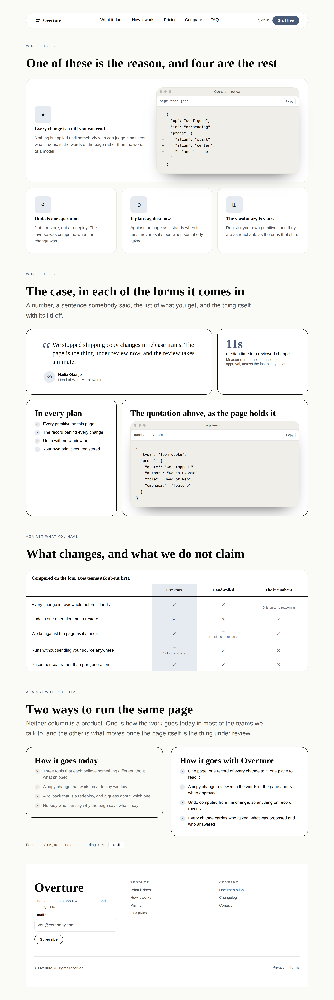
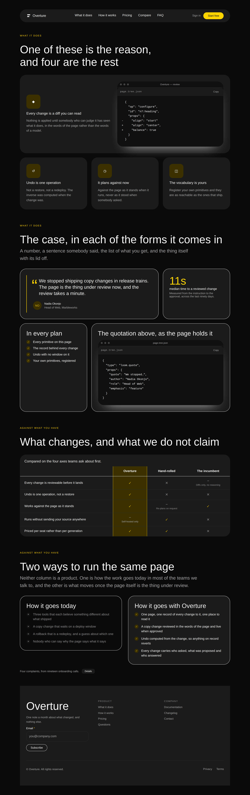
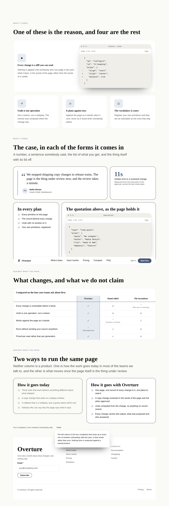
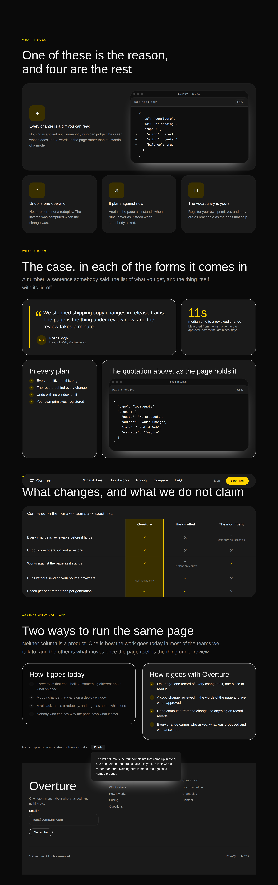





# 2026-10-02 — the parts that offered no choice

The catalogue has 22 page parts and had 44 bands, which reads as two designs of
everything. It was not. **Nine of the twenty-two had exactly one design**, and
two of the nine are the bands no page can be without:

```
1 banner    1 nav    1 bento    1 specs    1 comparison
1 credentials    1 team    1 changelog    1 footer
```

A part with one design is a part where a deployment has no choice at all, and
nothing in this repository could see it. The reach measurement counts primitives
no band builds; the gap inventory counts primitives the library lacks. Both read
clean while the header and the footer of every page a host assembles are decided
for them.

This run is **four second designs**, the instrument that found them, and three
findings — one of which the camera found and only the camera could have.

---

## What shipped

| | |
| --- | --- |
| `nav-centred` | the signed-out header: a pill, five destinations centred in it, a quiet sign-in beside the action |
| `bento-mixed` | four cells holding four *different* primitives — a quotation, a figure, a checklist, a window on the tree |
| `comparison-ways` | two columns against nobody: how it goes today, how it goes instead, and the method in a panel |
| `footer-signup` | the footer for a page rather than for a site: two short columns, and one last thing to do |
| `the-parts-that-offered-no-choice.specimen.ts` | live, two states, two palettes, two viewports |
| `docs/primitive-gap-inventory.md` | **designs per part**, the third instrument, with the five parts still at one |
| 7 tests | each holding the one claim its band rests on, and none of them a count |

The catalogue is at **48 bands over 22 parts**, reach **90 of 102**, and
**150 droppable things**. `pnpm verify` is green: 3473 + 6262 tests.

---

## One — why these four, and the instrument that chose them

The brief's standing question is *which primitives, and why those.* No primitive
shipped this run and the reason is this document's own arithmetic: the gap
inventory puts the honest ceiling at 110–120 against a library of 102, and ends
**"hold the vocabulary near 110 and spend the week on compositions."** That is
the lane's own measured recommendation and this run follows it rather than
re-opening it.

Which left *which* composition, and the two instruments in the repository could
not say. So:

> **Designs per part.** `compositionsForPart` over `COMPOSITION_PARTS`, which is
> one `filter` from any registry and needs no script. On 1 October it answered
> **nine parts with exactly one design**.

Four of the nine closed, and not the four that were easiest. `nav` and `footer`
are the two bands a page cannot be without — a reader sees the header on every
screen and the footer on the way out — so one design there is the catalogue
making a decision on a host's behalf that it does not get to make anywhere else.
`bento` and `comparison` are the two mid-page blocks the reference libraries are
actually known for, and both had exactly one shape.

The five left, in the order the inventory now recommends: `specs`, `team`,
`credentials`, `changelog`, `banner`. None is blocked.

### Why not the obvious one

The second nav design anybody would name first is the bar whose destinations
fold behind a button, and `loom.menu` shipped on 1 October for exactly that.
**It cannot be built today.** `loom.nav` declares `disclose` and names its own
control `Menu`; `loom.menu` names its control `Menu`, because a control's word
belongs to the primitive and resolves per type (0055, 0063). A bar holding both
has two buttons reading *Menu* at 390px, one inside the other.

So `loom.menu` is the one entry on the unreached list that is not waiting for
somebody to write a band — it is waiting on a word. Filed, with the measurement,
and the inventory now says so where the next run will read it.

---

## Two — which fields became nodes and which stayed props

No Hermes block was ported: none of these four has one. `nav` and `footer` are
page chrome Hermes never had as blocks, and the two mid-page bands are
arrangements of content models already in the library. So the question is
answered against the designs themselves.

| | | why |
| --- | --- | --- |
| the bar's fifth destination | **node** | 0052's plainest case. The canonical band stops at four because four is what fits beside a wordmark *in that arrangement*; centred, the fifth is free, and either way a sixth is an `insert` |
| the bar's quiet way in | **node**, a `loom.link` beside the `loom.action` | the whole subject of the design. A `signIn: boolean` would be `insert`/`remove` in a prop bag, and a deployment with no accounts removes a node instead |
| `tone: "floating"`, `align: "center"` | **props** | they change how however-many links are drawn and change the set of nodes not at all. They are *why the band photographs differently* and they are **not** what earns it a catalogue entry — 0162's bar is a different set of nodes, and the two nodes above are it |
| a bento cell's content | **node**, inside a uniform `loom.card` | the cards are the same and the contents are not, so replacing a register is one `insert` into a card that is already there |
| which cell is wide | **neither — the rhythm's** | `alternating` is wide, narrow, narrow, wide, so four children close the cycle. The band chooses the count and the rhythm chooses the widths, which is why there is no `wide: boolean` on a cell |
| a two-ways claim | **node**, a `loom.perk` carrying a `state` | and the state is the band. A row moved between columns keeps the state it was written with, which is the one edit a reader will make and the one the band cannot survive — asserted |
| the method behind the comparison | **a `loom.popover`'s children** | prose is `text` children (0052). The alternative was a `method: string` prop on the section, which would have made *a paragraph and a link* unsayable to save a node |
| `placement`, `align`, `width` on the popover | **props**, unchanged from 1 October | no operation reorders a panel relative to its trigger: it is one region the primitive places, not a sibling of anything |
| the footer's columns | **nodes**; `columns: "two"` is a **prop** | the near-miss, run out loud below |
| the footer's capture | **nodes** in the `brand` region | a `loom.form`, a `loom.field` and a `loom.button`, which is `ctaSignupBand`'s shape in a region described for a wordmark |

### The near-miss, which `docs/primitive-granularity.md` says to run out loud

`columns: "two"` on a footer holding two groups is the prop that looks most like
a count in this whole run, and it is not one. `COLUMN_MINIMUMS` feeds `auto-fit`,
so the name is a **minimum width** — *"columns no narrower than this, which is
two of them at a common page width and one of them on a phone."* Insert a third
group and it appears, at the same minimum. Ask the sharper question — *does
changing this prop change the set of nodes?* — and it does not.

The one that genuinely could have gone either way is **the bar's actions
region**, and it was decomposed. A `loom.nav` with `signIn: string | undefined`
is a perfectly reasonable primitive and it is `insert`/`remove` wearing a label:
a deployment with no accounts cannot remove the link, a deployment with two
products cannot add a second, and neither adaptation is reachable by any
operation. Two nodes in a slot cost one line in a projection and buy both.

---

## Three — the thing the camera found

The sheet is live, because `comparison-ways` ends in a `loom.popover` and a
static photograph of one is a button that does nothing. Shot with an empty step
list, the `shut` state overflowed its viewport:

```
run 1  …-editorial-phone-shut  390x844@2x  scrollWidth 693 / innerWidth 390  ← overflows
run 2  …-bold-phone-shut       390x844@2x  scrollWidth 697 / innerWidth 390  ← overflows
```

Two runs of the same sheet, **one overflowing shot each and a different palette
each time** — which is the signature of a race and not of a defect in a band.

It is 0176 working exactly as specified. `presentation.ts` §2: every control
renders `null` until an effect has proved scripting runs, so the region must be
*"visible by default and hidden by the rule"* — otherwise a page served without
scripting has a panel nothing can open. The consequence nobody had measured is
that **a page with scripting on passes through the no-scripting state on every
load**: between first paint and hydration there is no control, nothing matches
the hide rule, and the panel is laid out at `min(26rem, calc(100vw - 2rem))`
beside a trigger most of the way across the page.

Three hundred pixels of sideways scroll on a phone, on every page that will ever
hold a menu, a popover or a lightbox. Adding `{ wait: 400 }` to that one state
removes it under both palettes, which is the experiment rather than a fix.

Filed with the three shapes a remedy could take and **marked `ARCHITECTURAL`**:
all three touch the direction of a rule an Accepted record chose deliberately,
so nothing here supersedes it and the sheet waits instead.

---

## Four — the two places this run had to leave its lane, said plainly

**`apps/`, which the brief says not to edit.** Four new bands turned the app
suite red in three places: a literal in `_lib/counts.test.ts`, and two doc
comments spelling *forty-four* in `_lib/packages.ts` and `_components/bands.tsx`.
The generated API reference moved too and was regenerated with the repository's
own `pnpm --filter @loom/app docs:api`. All four are on this branch, because a
red `main` is worse than a one-word diff outside a lane — and it is filed, with
the remedy the 1 October `audit.ts` entry already named: a doc comment may state
the claim rather than the arithmetic.

**The interesting half is that `counts.ts` got it right.** `SITE_COUNTS` reads
`STARTER_COMPOSITIONS.length`, so the page a reader sees was never wrong for a
moment. The mechanism worked; what it does not cover is the test's own expected
list, which has to be a literal or it asserts nothing.

---

## Five — what the library still cannot express

1. **A control whose word comes from the tree.** The 1 October filing, now with
   a measured consequence: it is not only why `loom.dialog` is unbuilt, it is why
   `loom.menu` is registered, tested, described in every interpretation request,
   and at reach zero.
2. **A panel that does not exist before hydration.** Above, and architectural.
3. **One of *n* children chosen, where the labels are in the children.** Tier B's
   second group, unchanged: tabs, segmented control, pricing toggle, radio group.
   A two-ways band with a toggle over it is the design this run would have built
   fifth.
4. **An image.** Still. `comparison-ways` wants a face beside each column and
   `bento-mixed` wants a screenshot in its window; both ship with what the
   library can draw for itself, which is `loom.frame` and the palette.
5. **`copy` and `role`, declared by nothing.** Measured again this run: **0 of
   102** for each. The 19 September ask is still the open one, and the 1 October
   entry explains why its payoff stopped being hypothetical.

---

## The pictures

Four bands, two of the canonicals they are now alternates *to*, under both
starter palettes at 1280 and 390. `shut` is the page as it arrives; `the method`
is the popover open.

| | editorial | bold |
| --- | --- | --- |
| wide, shut |  |  |
| wide, the method |  |  |
| phone, shut |  |  |
| phone, the method |  |  |

**Two things in those frames are the camera rather than the page.** The sticky
bar is painted a second time partway down the `the method` shots: a full-page
capture stitches, and `fullPage` is not a choice the harness offers. The portal
lane recorded the same artefact on 9 September. And the popover's panel covers
the top of the footer, which is a panel doing what a panel does — it is in the
frame because the shot is a whole page rather than a band.

The correction the photographs forced is in `bento-mixed`: its window was
captioned *"the cell on the left, as the page holds it"*, which is true at 1280
and false at 390, where the four cells are a column. It reads *"the quotation
above"* now. A caption right at one width and wrong at the other is the class of
defect a sheet shot at one viewport never shows.
