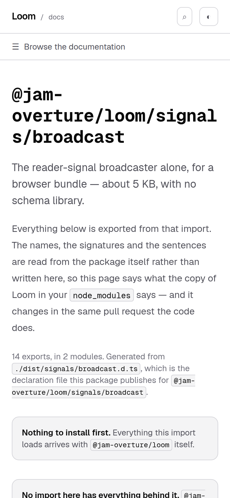
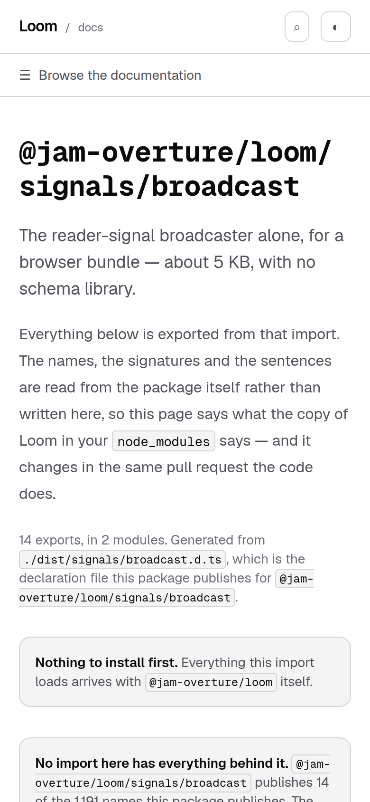
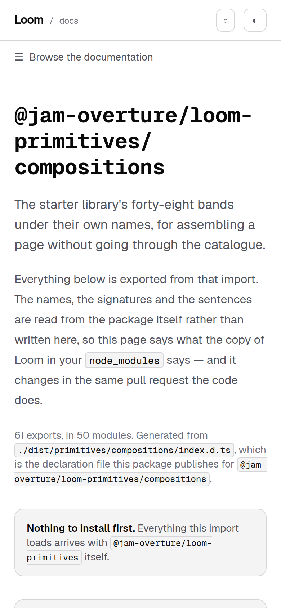
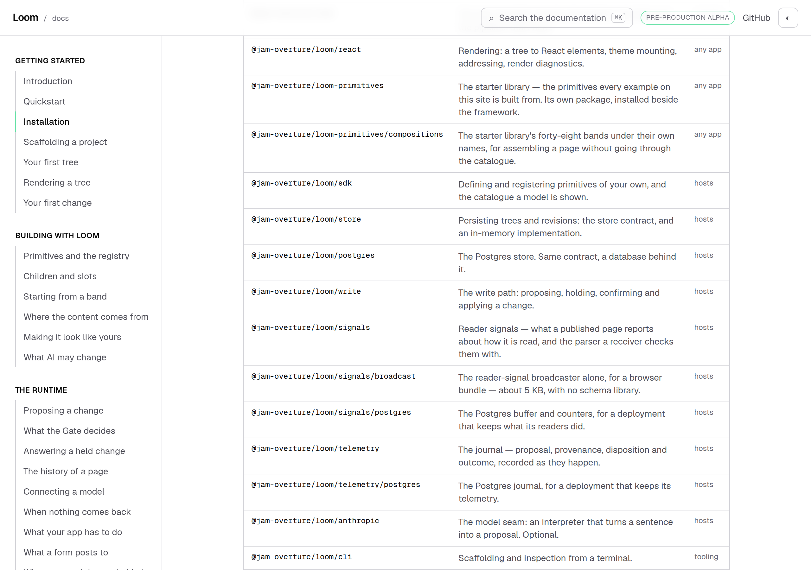

# 3 October 2026 — where a specifier breaks

**Routine:** `Loom docs` · **Branch:** `docs-44-where-a-specifier-breaks` ·
**Section:** §4c

No open pull request from this lane at the start of the run, so this is a fresh
branch off `main` at `f4d2b9c`. No maintainer comments were outstanding on any
pull request of this lane's.

The work is the oldest open reader-visible finding this lane owns — filed
23 September, named as *what I would write next* by the four reports since, and
losing to newer arrivals in the findings queue each time. It is closed.

## What a reader saw, before anything was changed

Every page in the API reference is titled with the import you would type. There
are seventeen of them, and on a phone ten were broken in the middle of a word.



```
@jam-
overture/loom/signal
s/broadcast
```

That is the largest type on the page, and the first thing a reader on a phone
sees. **The finding filed four of them; it is ten.** Nothing regressed — the
package was renamed from `@loom/runtime` to `@jam-overture/loom` on
27 September, every specifier gained five characters, and six more headings
crossed the line on a day when nobody was looking at this page. A cosmetic
finding getting quietly worse while it sits in a queue is worth noticing on its
own.

## The plain version of why a browser does this

A browser breaks a line at a space. An import has no space in it, so as far as
the line-breaker is concerned `@jam-overture/loom/signals/broadcast` is **one
word** — and a word too long for the line is a problem with two bad answers:
let it stick out of the page, or cut it wherever the line ran out.

The page had already taken the second answer. On 22 September the heading gained
`break-words`, because the four longest doors were pushing the whole document
169 pixels wider than the viewport and every page on them scrolled sideways.
That worked and still does. What it could not do is choose **where** the cut
lands, because that is not what it is for: `break-words` is the emergency rule,
the one that applies once nothing else fits.

So the fix is not to stop it cutting. It is to give it somewhere better to cut
first. `<wbr/>` is an element whose entire meaning is *you may break the line
here* — no width, no character, nothing added to the text. One after each slash,
which is where a person would break it themselves.



## Four candidates, measured rather than reasoned about

The first version of this run was going to be one component and a screenshot. It
became a measurement instead, because the obvious markup is not obviously the
best one and two of the three alternatives are things the next author will
reach for.

Chromium, 390 pixels, the real heading in the real font, each candidate injected
into the live page and the rendered line boxes read back character by character:

| | `@jam-overture/loom/signals/broadcast` | `@jam-overture/loom-primitives/compositions` |
| --- | --- | --- |
| today | `@jam-` · `overture/loom/signal` · `s/broadcast` | `@jam-overture/loom-` · `primitives/compositi` · `ons` |
| **`<wbr/>` after each slash** | **`@jam-overture/loom/` · `signals/broadcast`** | **`@jam-overture/loom-` · `primitives/` · `compositions`** |
| `<wbr/>` + `word-break: keep-all` | identical to the row above | identical to the row above |
| `white-space: nowrap` per segment | identical to the row above | `@jam-overture/` · `loom-primitives/` · `compositions` |

Three things came out of that table and only the first was expected.

**`keep-all` buys nothing.** It reads as if it would stop a break inside a
segment, and it does not: Chromium does not treat the break *after a hyphen* as
a break between typographic letter units, so the property has no effect on the
one case where a segment can still break. Byte-identical line boxes on all six
multi-segment doors. Recorded in `FINDINGS.md` because it is the obvious second
thing to try.

**A `<wbr/>` can add a break opportunity and cannot take one away.** A hyphen
**is** a break opportunity, the breaker takes the last one that fits, and
`@jam-overture/loom-` fits. So one door of the seventeen still breaks after
`loom-` rather than at a slash. The orphan is gone and the mid-word break is
gone, which is the whole of what the finding asked for, and the first line still
ends on a hyphen.



**The markup that would fix that last one is the one not to take**, and this is
the run's one real decision. `white-space: nowrap` on each segment breaks at
slashes and nowhere else — measured, it is the only candidate that does. It gets
there by turning wrapping **off** inside a segment, which is turning
`break-words` off, which is removing the floor that stopped these pages being
559 pixels wide a fortnight ago. Today's longest segment is sixteen characters
against a line that holds about twenty. A door published next year with a longer
one would scroll the page sideways again, and nothing in the suite would say so
— it is a defect only a screenshot at one width can see, which is exactly how
the original went unnoticed for a day.

**Trading a floor that holds for every future door against one better line
break on one door today is the wrong direction.** The floor stays, and the limit
is filed rather than hidden.

## The half of this that is not cosmetic

A heading assembled out of pieces can come back wrong in a way a heading printed
from one string cannot: a slash dropped, two segments swapped, a space gained.
On this page that is not a typo — it is **an instruction to type an import that
does not resolve**, on the one page whose entire job is to say what to type.

Nothing in this repository asserted the words of that heading until today.

And it is worse than an ordinary blind spot, because of where this change lands.
`pnpm prerender:check` exists to read the page a reader is actually served, and
[0119](../decisions/0119-the-page-a-reader-gets-is-the-one-pnpm-verify-reads-last.md)
states its one limit in the record and in the module:

> What it does not catch is a space lost across a tag: `16<!-- --><span>of</span>`
> reads `16of` and passes here, because the character after the separator is `<`.

**Every junction this change makes is across a tag.** The instrument built to
catch the last defect of this family cannot see this one, by its own documented
design.

So the assertion is local, and it is made through **`react-dom/server`** as well
as through jsdom — the transform the built file actually comes out of, which is
the thing `hazards.ts` exists because those two renderers disagree about.
`_components/specifier.test.tsx` holds every published specifier through both
and asserts, among other things, that no hydration separator is emitted at all.

That prediction was then checked against the artefact rather than trusted:

```html
<h1 class="font-mono text-3xl! break-words sm:text-4xl!">@jam-overture/<wbr/>loom/<wbr/>signals/<wbr/>broadcast</h1>
```

No `<!-- -->`, because React only writes one between two adjacent **text**
children and a `<wbr/>` between them is why there are none to write. The
23 September finding predicted the opposite — *a `<wbr/>` is a thing
`prerender:check` reads as a junction* — and it is wrong, in the direction that
matters: the check does not see these at all. `1,461` junctions on 124 pages,
0 run together.

**It is deliberately not an argument for widening the check**, and 0119 says why:
the bar for a new hazard class there is *a defect that reached a reader, not a
hazard somebody imagined*. Nothing has reached a reader. Filed as a note saying
that if one ever does, the first place to look is a `<wbr/>`.

## The doors table, which had no witness at all

The second half of the unit is the same subject one page over, and it is this
lane's 2 October finding at its exact shape: **a produced block whose producer is
tested hard and whose printing nothing looked at.**

`/docs/getting-started/installation` shows the map of doors — the first table a
reader meets after `npm install`. `_lib/entry-points.test.ts` holds that list
against the package's own `exports` map in *both* directions, so a door that
opens in `package.json` and is missing from the list is a red test. That is as
hard as a producer is tested anywhere on this site.

**A component printing no rows at all passed every one of those assertions.**



`_components/entry-points.test.tsx` now reads it back out of the document: a row
per door, each specifier **in the order the list gives them** — a shuffled table
passes a membership check — each summary beside its own door, each audience in
words rather than in the key, and the row count held against `entryPoints.length`
*and* against being more than one, because every loop in the file walks the list
it is checking and an empty list satisfies all of them at once.

One small thing came out of writing it. The table gained `data-doors`, because
the page has a second table under this one and `table` resolves to both: the
screenshot harness refuses that outright — *strict mode violation: resolved to 2
elements* — and a test using the same selector would have been quietly asserting
about whichever one came first.

**And one thing that looked like a second defect and was not**, which is in here
because the first draft of this report had it the wrong way round. Photographed
at 390 pixels the table's middle column is cut off at the viewport edge, which
reads — in a picture — as a sentence crushed into a column one character wide.
Measured rather than eyeballed, it is nothing of the kind: the table is 520
pixels in a 350-pixel box with the columns at **326 / 126 / 67**, the box
scrolls on its own, and the page stays at `scrollWidth 390`. A reader swipes the
table sideways, which is the arrangement the component has always had and the
one the render test now holds. The picture was a bad illustration and not a bug
report, and the wide shot above is what the test is about.

A 126-pixel column is still a narrow place to read a sentence, and the rows are
137 pixels tall on a phone because of it. That is a design question rather than
a fault, it is not what this branch is about, and it is not filed — noted here
with the numbers so the next run has them.

## Decisions taken that were not specified

**No decision record.** Nothing here touches the tree schema, the delta model or
an `Accepted` record. No primitive is added, no prop is set, `src/` was not
opened: `git diff origin/main -- src/ tools/` is empty.

**`Specifier` renders text and not a heading.** The `h1` and its classes stay on
the page that owns them. A component that owned the type scale would be the
beginning of a parallel component library, which 0067 forbids this surface, and
the same treatment is wanted in a `<code>` sooner or later.

**The slash goes on the end of the segment before it**, not the start of the one
after. `@jam-overture/` is visibly unfinished where `@jam-overture` reads as a
package name, so a line ending on the slash tells a reader the name continues.
It also makes the property the test holds a simple one: joining the segments
gives back the specifier, character for character, for any string at all —
including `""`, `"/"` and `"//"`, which are asserted because this takes a
*heading*, not a door, and a heading is something somebody types.

**The table of doors was left alone apart from the hook.** Its specifier cells
are `whitespace-nowrap` inside a box that scrolls on its own, which is a
different and correct answer to the same problem: a table cell is not prose, and
a reader comparing seventeen imports wants them in a column. Giving them
`<wbr/>`s would have been consistency for its own sake. The render test now
holds that arrangement so it cannot be lost by accident.

## Tests

`pnpm install && pnpm verify` at the repository root, on a `dist` and a `.next`
deleted first: **green, exit 0**, with the status written to a file as the last
thing on its own line and read in a separate command.

| | `main` at `f4d2b9c` | this branch |
| --- | --- | --- |
| `@jam-overture/loom` | 173 files / 3,560 tests | **173 / 3,560** — `src/` was not opened |
| `@loom/app` | 359 / 6,322 | **362 / 6,352** |
| findings ledger | 949 entries, 0 malformed | **951**, 0 malformed |
| prerender | — | **124 pages / 1,461 text junctions**, 0 run together; 3 metadata conventions, 0 unserved |

**+30 tests in three new files. Nothing weakened, skipped or deleted**, and no
existing test file was edited — the library numbers are identical on both sides
because `src/` is untouched, and the app numbers differ by exactly the three new
files, so `main`'s column is this branch's measurement less a delta that is
known exactly rather than a second full run.

### Green is not evidence — thirteen mutations

Each introduced one at a time against the final committed code and reverted
before the next; every file compared byte for byte against its backup afterwards,
and the 30 passing tests re-confirmed at the end. None touched `src/`. The pass
was run twice — once mid-run and once against the code as committed, because the
`data-doors` hook and its assertion arrived after the first pass and a mutation
table measured against code that is not the code being shipped is worth nothing.

| what was broken | tests that went red |
| --- | --- |
| the component stops emitting any `<wbr/>` | 2 |
| only the first slash gets a break | 3 |
| the break moves to **before** its slash | 3 |
| a segment loses its slash entirely | 10 |
| the segments come back reversed | 7 |
| **a space creeps in between the segments** | 4 |
| **the page stops printing its heading through the component** | 1 |
| the doors table prints no rows | 7 |
| the rows are sorted rather than printed in order | 5 |
| the summary column prints the specifier twice | 1 |
| the audience cell prints the key instead of the label | 2 |
| the specifier cell is allowed to wrap | 1 |
| the table loses the hook that names it | 2 |

The two in bold are the ones the file was written for. *A space creeps in* is the
defect that a screenshot cannot show you and `prerender:check` cannot see — it
is caught four times, in both renderers. *The page stops printing its heading
through the component* is the hole every other assertion in the file leaves open:
all of them stay green if the route stops asking for any of this. It is closed by
reading the route off disk, which is how `_lib/content.test.ts` already holds
each page's metadata call — a thin assertion about the one step nothing else
covers, rather than a thorough one about a step two files already hold.

## At 390 pixels

`scrollWidth 390 / innerWidth 390` on all four phone shots and `1280 / 1280` on
both wide ones. Ten headings broke mid-word before and **none does now**, measured
over all seventeen doors, not inferred from the four that were photographed.
Nine of the seventeen also dropped from three rendered lines to two, so those
pages gain a line of room above the fold; `compositions` is the one that stays
at three. `built 2026-10-03T13:59:11.581Z`,
served by the harness itself.

## Scope

`apps/loom/app/(docs)/` only, plus `FINDINGS.md`, this report, its shot list and
its screenshots. `git diff origin/main -- src/ tools/` is empty, and so is the
same diff against every other route group.

Four files are new — `_lib/api/specifier.ts` and its test,
`_components/specifier.tsx` and its test, plus
`_components/entry-points.test.tsx`. Two are touched:
`docs/api-reference/[entry]/page.tsx` and `_components/entry-points.tsx`.

## Findings

**Closed — one, and it was two and a half times the size it was filed at.** The
23 September entry on the four longest headings breaking mid-word. Ten of
seventeen, re-measured; none now.

**Closed — a second instance of the 2 October class**, and the one that matched
it exactly: `entry-points` is a produced block whose producer is tested in both
directions and whose printing had nothing. Six components in this route group are
still never rendered by any test, all of them chrome, and the list is in the
entry.

**Filed — two.**

- *A break opportunity can be added and the one inside `loom-primitives` cannot
  be taken away* — for this lane. The stated limit of what shipped, with both
  rejected remedies and the measurement that rejected them, so the next author
  does not reach for `keep-all` or pay the floor for one line break.
- *The remedy for the defect `prerender:check` was built to catch lands in the
  one place it says it cannot look* — for this lane, as a note on 0119's open
  question and explicitly **not** a request to widen the check.

**Not re-filed:** the preview URL is not derivable from the branch name, and the
egress policy denies the check that would catch it (27 September, appended to
2 October — the procedure of letting the `vercel[bot]` comment arrive and
correcting the body is followed again here); the screenshot harness photographs
an address while the theme lives in `localStorage`, so these pictures are light
(14–16 September); the ten British names in the published API (27 September);
three spellers in one route group (1 October).

## What I would write next

- **`paletteScheme`**, the other export #410 added, still undocumented outside
  the generated reference. It is now the oldest thing on this list.
- **A render test for `sidebar` and `mobile-nav`**, the two of the six remaining
  untested components that are not decoration: they are how a reader reaches any
  page on this site, and between them they are the only navigation a phone has.
- **The `signals` door's narrower-door saving in kilobytes rather than in files**
  (23 September, open) — still blocked on the same judgement about wording, which
  is the maintainer's and is in the entry.
