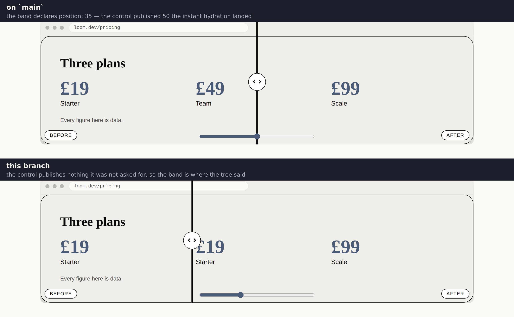

# The position the tree asked for

**Routine:** `Loom daily build` · **Date:** 2026-10-04 · **Section:** §4b
**Record:** [0226](../decisions/0226-a-primitive-declares-where-its-control-rests-and-the-control-publishes-nothing-until-the-reader-moves-it.md)
**Closes:** the 1 October finding from `Loom primitives`

## What was wrong

`loom.before-after` takes a `position` prop — where the wipe divider sits, as a
percentage across. A band declaring `position: 35` rendered at 35 in the server's
markup and sat at **50** the instant hydration landed. On every page a reader
actually visits, the prop did nothing.

The mechanism is three lines and
[0096](../decisions/0096-a-behaviour-publishes-a-value-on-the-element-the-primitive-placed-it-in.md)
contains all three without noticing. `ADJUST_RESTING` is 50, fixed. The control
writes `--loom-adjust: 50` on its parent **in its mount effect**. And a `var()`
fallback can only be read when the property is absent — so a control publishing
its own resting value on mount overwrites the exact thing 0096 built it to
defend.

The error is in one sentence of that record, and it is a specific kind:

> Once a reader has a slider in front of them, where it started is theirs to
> change.

**Appearing is not an instruction.** A control that has just mounted has learned
nothing about what anybody wants; the reader has been given a page, not a
decision. The one number it published was the one number nobody wrote down.

## What it does now

Two sentences, and the second is the one that closes it.

**A primitive declares where its control rests** — `ADJUST_RESTING_PROPERTY`,
`--loom-adjust-resting`, a custom property on the element it places the control
in. Read once at mount, clamped into the runtime's range, rounded to something a
step-1 input can hold. A primitive declaring nothing gets `ADJUST_RESTING`.

**The control publishes `--loom-adjust` only once the reader has moved it.**
Until then the primitive's own fallback is what the page reads — with scripting
off, and with scripting on and nobody having touched it.

`build` still receives a node's text and its content and **not its props**. That
was the obvious fix and it is the one thing this must not do: props are
AI-authored, so a control reading them is a control a model configures, which is
0086's whole shape. The number arrives through the DOM instead — the route 0176
already established for `present` and `dismiss` — off the one element the
primitive chose by deciding where to place the control.

Nothing new is exposed by that, which is the argument the record turns on. A
primitive taking `adjust` **already** renders its declared position into the
page, as the `var()` fallback the still version is built on. This is the same
number written where the control can read it. The control starts where the page
already is.

## Measured, not eyeballed

Both shots are `the-behaviours-nothing-declared.specimen.ts` — the primitives
lane's own specimen, which declares `position: 35` and has a `shut` state,
photographed unchanged on `main` and on this branch. Only the wipe band differs.

| | `main` | this branch |
| --- | --- | --- |
| divider, as a share of the band | **50.0%** (hairlines at 49.9 / 50.1) | **35.0%** (34.8 / 35.1) |
| differing pixels, editorial wide | — | 25,363 in one box, `x 912 y 2186 413×624` |
| that box against the band | 35% and 50% of the panel are x 956 and x 1279 — the box is those two bracketed by the handle's 44px radius | |

Read off the PNGs directly, at three rows each, rather than taken from the
`style` attribute the test already asserts. The slider's thumb moved with it: on
`main` the thumb sits exactly over the divider at the midpoint, which is why the
defect looked plausible in a photograph until somebody declared a position.

The same change, [editorial wide](2026-10-04-framework-the-position-editorial-wide.png) ·
[bold wide](2026-10-04-framework-the-position-bold-wide.png) ·
[editorial phone](2026-10-04-framework-the-position-editorial-phone.png).

## Decisions I made that nobody specified

**Not the finding's option (1), and not (3) alone.** The entry offered three
remedies and said the first was probably enough. It is not: a per-*type* resting
value leaves a **tree's** declared position overridden back, which is the defect
rather than a part of it. What shipped is (1) made per-node — through the DOM, so
the seam is untouched — together with (3). Option (2), handing `build` the node's
props, was not taken and is still `ARCHITECTURAL` if anybody wants it.

**The declared position is now written twice** — once as the `var()` fallback,
once as the resting property — and nothing can check that they agree, because the
fallback lives inside a string a stylesheet consumes and the runtime never parses
it. Written from one local in `loom.before-after` so they cannot drift. Recorded
as a cost in 0226 and filed for the primitives lane.

**An unreadable declaration falls back rather than refusing.** A stylesheet
saying `--loom-adjust-resting: thirty` gets `ADJUST_RESTING` and a working
comparison, because a control that refused to render would be a missing
comparison and the still version is right there in the fallback.

**The input is now its own component.** Reading the parent needs the input
mounted, which needs the capability check to have passed, so the read cannot
share an effect with the check. Splitting it also puts the `useLayoutEffect` that
adopts the position before the first paint in a component that never renders on
the server, so there is no warning about a hook that does nothing there.

## Two tests that were asserting the defect

Both were written against 0096's paragraph, so both agreed with it.

| | asserted | now asserts |
| --- | --- | --- |
| `behaviour-adjust.test.ts` | `published()` is `String(ADJUST_RESTING)` on mount | publishes nothing until the reader moves it; publishes 37 after a drag |
| `presentation.test.ts` | `"50"` on the root, for a band declaring `position: 42` | `""` on mount, `"63"` after a drag — the property still lands on the root, which is what the test is for |

Neither was weakened. The second gained the only end-to-end assertion in the
repository that a declared position survives hydration: **42 travelling from a
node's props to the root's resting property to the slider's own value**, per
palette, through the real registry.

## One test I wrote, deleted, and replaced with the truth

`keeps publishing once moved, including back to the declared position` — a reader
who drags straight to 35 on a band resting at 35. It failed, and the premise was
wrong rather than the code: a press that does not change an input's value fires
no `input` event, in a browser or in React, so there is nothing to publish. The
page is still right, because the fallback already says 35.

It is replaced by two tests that say what actually holds — `needs no publication
to sit at the position it already rests at`, and `publishes the declared position
again once the reader has left it`. The first is the one case where "publishes
only when moved" could have left a page wrong, so it is worth an assertion rather
than an assumption.

I also wrote and deleted `never renders a frame at the midpoint`, which named an
ordering it could not observe: `act` flushes layout and passive effects alike, so
it asserted the same value as the test above it under a name that promised more.
The ordering is written down in the module instead.

## Gate

`pnpm install && pnpm verify` — **exit 0**, on a deleted `dist` and `.next`, with
the status written to a file as the last act of its own line and read separately.

| | `main` at `f79e1d9` | this branch |
| --- | --- | --- |
| `@jam-overture/loom` | 180 files / 3,803 | **180 / 3,818** |
| `@loom/app` | 378 / 6,776 | **378 / 6,776** |
| findings | 996 | **997**, 0 malformed |
| `prerender:check` | — | 124 pages, 1,536 junctions, 0 run together |

**+15 tests**, no test file added. Three existing assertions changed, all three
because they asserted the defect; nothing weakened, skipped or deleted. One
decision record added, **0226**, none superseded — 0096 settled *where* the
property goes and that is untouched; this settles *when* it is written.

`reference.generated.json` regenerated with `pnpm docs:api`, which is the docs
lane's file and the repo's own tooling: 1,285 exports to 1,286, the one new
constant.

## Open questions

**Should `ADJUST_MAXIMUM` and the input's `step` move together?** The control
rounds a declared resting position because a step-1 input cannot hold a fraction.
`loom.before-after`'s `position` is `z.number().int()` so it never bites, but the
property is one any primitive may write. If a wipe ever wants half-percent
precision the `step` is the runtime's to widen, and the rounding should widen
with it. Not worth doing before something asks.

**Nothing checks that a primitive's two numbers agree.** Stated above and in
0226. The only check I can see from here would be the runtime parsing a
primitive's own stylesheet, which is worse than the gap.
