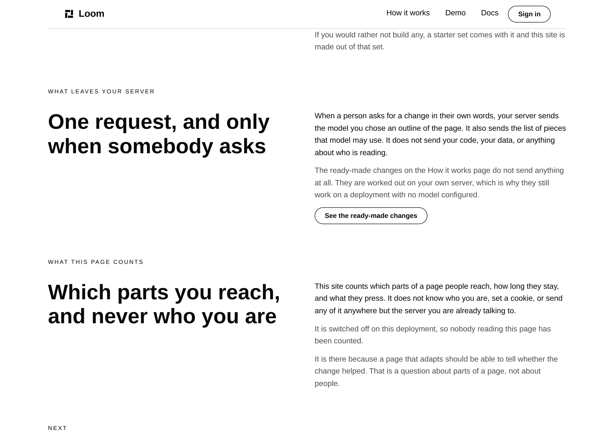
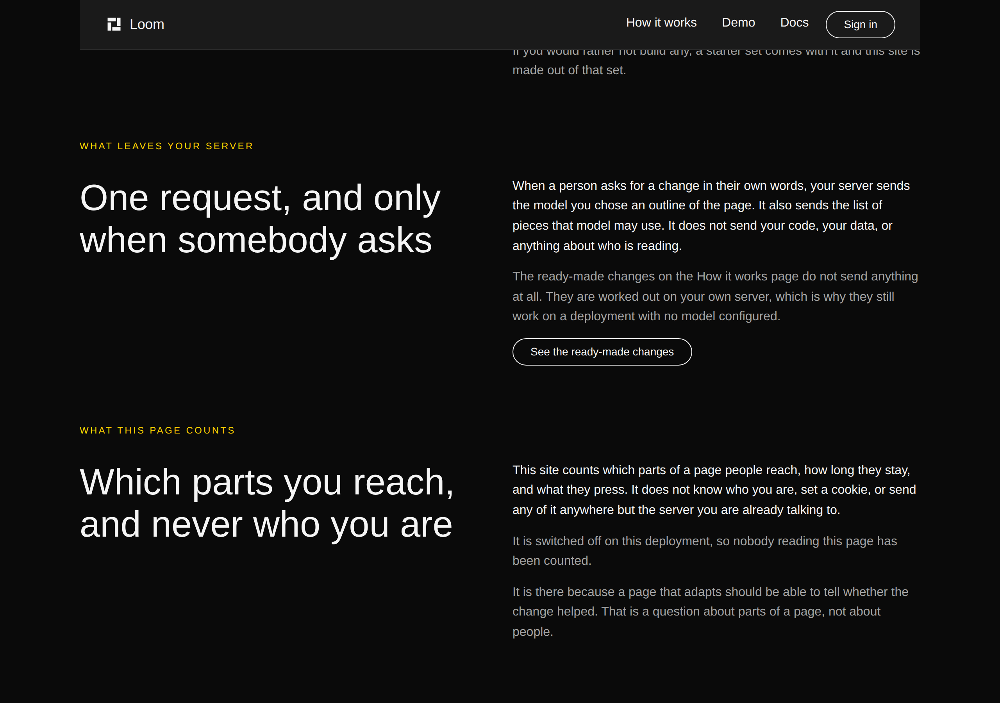
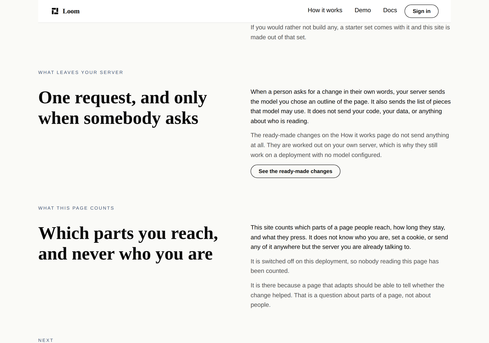
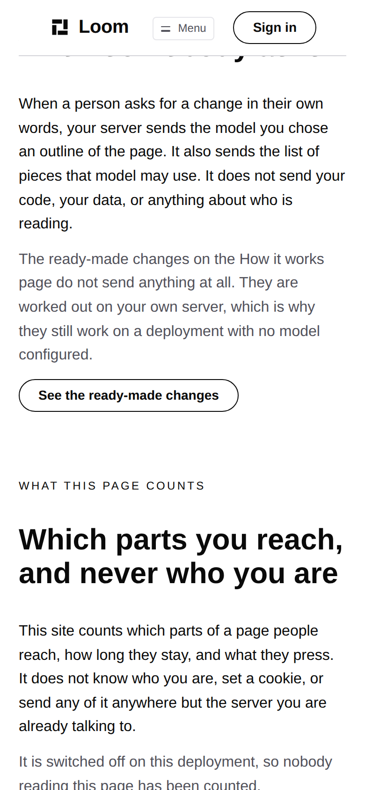
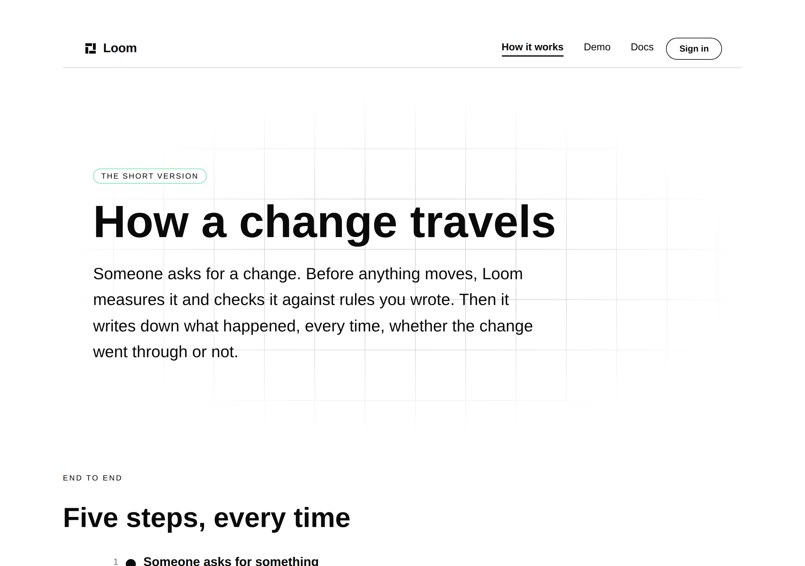

# 2026-10-04 — marketing: the pages it names

One sentence on this site tells a reader that something is on another page of
it, and until today it left them to go and find it. The same sentence named the
wrong page for a day in September, and nothing anywhere could have said so.

`/what-you-run`, 1280×900. The control under the muted paragraph is new, and it
carries the anchor of the band it is about rather than the address of the page.

---

## What went wrong in September, and why nothing caught it

On 30 September the band with the five ready-made changes moved from the front
door to `/how-it-works`. Its own tests moved with it, `pnpm verify` stayed
green, and a paragraph on a third page still read:

> *"The ready-made changes on the front door do not send anything at all."*

A reader following that sentence landed on a page with no such thing on it. It
was corrected by hand a day later.

Nothing in this repository connected those two facts, and no rule in this lane
could have. The register rules in `voice.test.ts` read the sentence and have
nothing to say about it: it is plain, short and well written. It is simply
about somewhere else. The 1 October finding called this *the staleness half*
and proposed reading prose for the site's own page names and looking each one
up.

**That is not what shipped**, and the difference is the branch. A check that
reads a paragraph and resolves the page it names can tell you the page exists.
It cannot tell you the thing is on it, because the sentence does not say which
thing. What a link says is exactly that.

---

## The three rules

`_lib/naming.ts`, swept over all **126 states this site can be served in** —
three routes, both deployments, and every one of the five choices crossed with
both answers a visitor can give.

**A page this site names is a page this site has.** The shape *the Something
page* is a proper name. A proper name that resolves to nothing is a page that
has been retired out from under a sentence. It reads the shape rather than the
vocabulary list, because a sentence naming a page that no longer exists is
exactly a sentence whose name is not in that list any more.

**A band that names a page offers the way there.** Asked of the band and not of
the page, and that is the assertion doing the work: every page here carries a
footer linking to every other page, so the same rule asked of the page would be
satisfied by the footer and would hold nothing. A reader who has just been told
something is elsewhere wants the way there from where they are standing.

**A link into another page of this site lands on something.** This is the one
that catches the September failure. `anchors.test.ts` holds a fragment on
`/how-it-works` pointing at `/how-it-works`, and stops at the page boundary on
purpose — its own comment says a fragment on `/docs` is the documentation
lane's promise rather than this one's. Between those two sits this site
pointing into itself, and nothing held it. The target is checked in **every
state it can be served in**, because the page doing the pointing has no idea
which one the reader will arrive at.

Together they are one property. **If the thing a sentence points at moves, the
link into it breaks, and the build says so.**

### What the sweep reads

| | measured |
| --- | --- |
| served states swept | 126 |
| mentions of a page of this product | **798** |
| of those, said inside a sentence rather than standing as a label | **126** |
| links from one page of this site into another, carrying a fragment | **84** |
| of those 84, held by anything before today | **0** |

The 84 are two links, each in the 42 states of the page it is on: the footer's
*what this deployment counts*, which has pointed at a band on `/what-you-run`
since 26 September, and the new one. Neither had anything behind it.

The floors in the test are well under the measured numbers — 600, 80 and 40 —
because they exist to catch a sweep that read nothing, which is the failure
that passes. A band removed by one of the five choices is allowed to take a
mention with it, and so is an ordinary copy edit.

---

## The link that was built and taken out again

The sentence wants a link on the words *the ready-made changes*. It was built
that way first, with `loom.link` inside the paragraph, and photographed on all
three palettes before being removed.

`loom.link`'s own props docblock says what its accent tone is for: *"the one
link in a paragraph that is the point of the paragraph."* That link cannot
currently be drawn, for three reasons that are each correct for the job the
primitive was written for.

- **No underline at rest.** The underline is a wipe-in on hover. In a nav bar,
  position says the word is a link; inside a sentence nothing does.
- **On `minimal` the accent is `#0a0a0a`**, which is the same black as the body
  text, deliberately. In the muted paragraph the phrase came out darker than
  its sentence and read as bold. This is the trap `nodes.ts` already records
  against `variant: "quiet"` on `loom.action`, one primitive over.
- **`display: "inline-block"`, its own font size and `lineHeight: 1.4`**
  against the paragraph's 1.6. The inline-block is load-bearing for the
  underline animation and its comment says so; the cost is a phrase that cannot
  break and a line set at a different height from the ones above it.

So it is **a finding for `Loom primitives` and not a fix here**, and the site
ships the control the library does have. That control is unambiguous on every
palette, which the inline version was not:

And the band it sends them to, which is the claim being made:

---

## What shipped

| file | what changed |
| --- | --- |
| `_lib/naming.ts` | **new** — the vocabulary, the three readings the rules are asked of, and why the portal is deliberately nameless |
| `_lib/naming.test.ts` | **new** — six tests, the three rules over all 126 served states plus the sweep's own counts |
| `_lib/measure.ts` | `elementsIn`, the walk nine test files in this route group had each written for themselves |
| `_lib/anchors.test.ts` | moved onto `elementsIn` and onto `naming.ts`'s reading of what anchors a tree declares |
| `_lib/pages/what-you-run.ts` | the control under the paragraph, carrying `#see-it-happen` |

No primitive added, nothing under `src/` opened, no component written, nothing
outside `app/(marketing)/`, `FINDINGS.md` and `reports/`.

### Why the vocabulary leaves the portal out

`PAGE_NAMES` carries every destination, and the portal's list of phrases is
empty. *Portal* is a common noun on this site before it is a page: the front
door's answer to *is this a service?* is that **every** Loom site has a portal
of its own, and the FAQ says so in four sentences that are about the reader's
deployment rather than about ours. A rule reading *the portal* as a mention of
`/portal` would fire on all four and be wrong every time. The way into this
site's own portal is the **Sign in** control, which is not a page name at all,
and `chrome.test.ts` already holds it on every page.

The entry is present with no phrases rather than absent, and the test holds the
list against `SITE_ROUTES` and `PRODUCT_SURFACES`, because absent and forgotten
look the same.

---

## Every rule was falsified

Each by putting back the thing it exists to catch, and each failure names the
route, the state, the band and the text.

| what was put back | what failed |
| --- | --- |
| the sentence naming *the Rules page* | *names no page it does not have* — 21 offenders, naming `/what-you-run`, the state, the field and the quote |
| the control removed, leaving the September shape | *offers the way to every page it names* — **42 offenders**, quoting the whole sentence |
| the control pointed at `#the-record` | *lands every link it makes* — `points at /how-it-works#the-record, which 42 of its 42 states do not declare` |
| the target anchor made conditional on the deployment | the same rule — `points at /what-you-run#what-we-count, which 21 of its 42 states do not declare` |
| the portal taken out of `PAGE_NAMES` | *knows every page of this product* — `"/portal"` missing |

The second row is the one that matters: **the rule fails on the site as it
stood this morning**, with the exact sentence the September failure was in. The
fourth is the subtle half of the third — an anchor present in some states and
not others is a link that works for half the people who press it, and the
message says how many.

---

## Gate

`pnpm install && pnpm verify` — **exit 0**, on a deleted `dist` and `.next`,
status written to a file as the last thing on its line and read in a separate
command.

| | `main` at `e1b33d8` | this branch |
| --- | --- | --- |
| `@jam-overture/loom` | 178 files / 3,728 | **178 / 3,728** — `src/` untouched |
| `@loom/app` | 374 / 6,674, 0 skipped | **375 / 6,680**, 0 skipped |
| the marketing suite | 39 / 1,027 | **40 / 1,033** |
| findings | 982 | **985**, 0 malformed |
| `prerender:check` | — | 124 pages, 1,470 junctions, 0 run together |
| `pnpm shoot` | — | `1280 / 1280`, `390 / 390` — no overflow on any of the five |

**Six tests added, all written. Nothing weakened, skipped or deleted.** No
existing assertion was changed: `anchors.test.ts` moved onto two shared
functions and its 105 tests pass unchanged.

No decision record. This sets no new prop, adds no primitive, and touches
neither the tree schema, the delta model nor an `Accepted` record.

---

## Findings

**Closed:** the 1 October entry *the voice check reads props and nothing else*.
Both halves are now done, and the staleness half is noted as closed by
something other than the check that entry proposed.

**Filed, three:**

- *a link inside a sentence is the one kind of link this library cannot draw* —
  for `Loom primitives`, with the three reasons measured and the shape of what
  would close it. Nothing is blocked.
- *a claim about another surface can be held to the link beside it and never to
  what is on the page* — a stated limit. Two sentences on this site make a
  claim about `/docs` and `/demo`; both are true and both were checked by a
  person.
- *nine test files in one route group had each written the same walk over a
  tree* — one is now shared, eight are not, and the eight were left alone
  deliberately.

---

## Open questions

One, and it is the last of the standing ones.

**The word ceiling.** 3,300, against a site that serves 2,972 words. The hero
question closed on 3 October when the maintainer wrote the headline himself.
This branch adds one control label, five words, and the figure is unmoved at 90% of the
ceiling. The question is unchanged from the last two reports: whether 3,300 was
a verdict on the ten-page site it was measured against or a standing limit. It
is one line either way.
