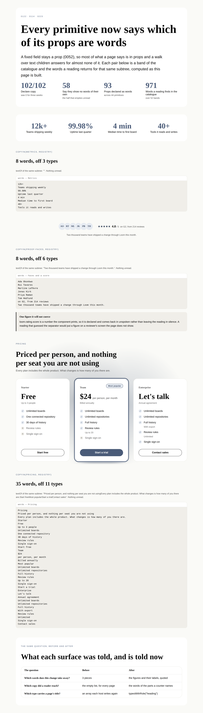
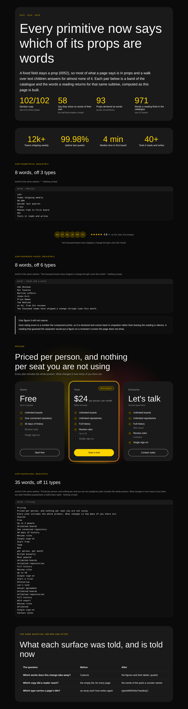



# 2026-10-04 — the words nothing declared

On 10 September the framework gave a primitive a way to say which of its props
hold words a reader reads, and shipped it with nothing declaring one. On 7
September it gave a primitive a way to say what part it plays, and shipped that
with nothing declaring one either. Both records said so in their own
consequences. Both were filed for this lane.

For three weeks the honest answer this library gave about itself was **nobody
has said** — which is [0122](../decisions/0122-a-primitive-says-which-of-its-props-a-reader-reads.md)'s
bargain working exactly as designed, and worth nothing to the three surfaces
that ask. This run is the pass. It adds **no primitive and no pixel**: one
declaration in each of a hundred and two files, the rule they were written to,
and the instrument that stops them drifting.

---

## What shipped

| | |
| --- | --- |
| `copy` on **102 of 102** primitives | 58 declare `[]` — *I show no words of my own* — and 44 declare 93 props between them |
| `role: "heading"` on `loom.heading` | the library's one role, and the array two hosts were hard-coding |
| [`0223`](../decisions/0223-a-prop-is-copy-when-a-reader-could-quote-it.md) | *a prop is copy when a reader could quote it, and a glyph is not a quote* — the six rules the pass was written to |
| `copy.test.ts` | 12 tests, including a probe that renders every primitive with a marker in every prop and refuses the two failures the registry cannot see |
| `the-words-nothing-declared.specimen.ts` | three bands with the words a reading returns for each, computed as the page is built, two palettes, two viewports |
| 4 findings | one each for `Loom lessons`, `Loom daily build`, `Loom portal`, and this lane |

`pnpm verify` is green. The library is still 102 primitives and the catalogue
still 52 bands.

---

## One — why this run is a declaration pass and not four primitives

The brief's standing question is *which primitives, and why those.* None, and
the reason is two measurements this lane already made and one rule in the brief.

**The vocabulary is at its measured ceiling.** The gap inventory has put the
honest ceiling at 110–120 against a library of 102 for three consecutive runs
and ended *"hold the vocabulary near 110 and spend the week on compositions."*
Nothing in this run's reading changed that.

**`FINDINGS.md` before choosing work** is the brief's own instruction, and the
ledger says this, in five entries filed by four lanes over three weeks:

- 19 September, `Loom portal` — *no primitive declares `copy`, and the first
  populated picture of `/portal/readers` shows what that costs a reader*;
- 27 September, `Loom portal`, correcting itself — the recommendation it had
  carried three times named the three primitives that **do not** have the
  problem, and the live one is `loom.stat`, `loom.quote` *and every primitive
  that follows 0052's rule, so the set widens rather than narrows*;
- 30 September, this lane — two declarations backed out of a pull request,
  because *two of a hundred and two is a picture of a library that mostly
  declines to say*, with the conclusion that the pass **is a run and not a side
  effect**;
- 1 October, `Loom signals` — the consumer arrived: `wordsReadIn` answers *which
  copy a reader actually reached* and returns the empty list for every page
  built from this library;
- and `TITLE_BEARING`, hard-coded in two hosts, waiting on one declaration.

Four excellent primitives beats twelve thin ones, and **a library that cannot
say what it says beats neither.**

---

## Two — which props became words, and which stayed silent

The pass is a hundred and two judgements. [0223](../decisions/0223-a-prop-is-copy-when-a-reader-could-quote-it.md)
is the rule it was written to, so that the hundred and third is decided the same
way: **a prop is copy when a reader could quote it from the page, and where its
value lands in the DOM is not the test.**

| | | why |
| --- | --- | --- |
| `loom.stat` `value` `label` `caption` | **words** | the finding's own example: *3,400 · appointments last year* in three props, and `textOf` answers `""` |
| `loom.stat` `magnitude` | silent | it plots a bar and prints nothing. `value` is what a reader reads; the two are not one fact twice |
| `loom.media` `alt` | **words**, and the one to argue with | §5 |
| `loom.icon` `label`, `loom.embed` `title`, `loom.banner` `label` | **words** | an accessible name is prose somebody wrote for a reader. An attribute is where the markup puts it, not evidence that nobody reads it |
| `loom.field` `name`, `loom.option` `value`, `loom.feed` `binding` | silent | a string the page **transmits** rather than shows, read by a machine at the other end |
| every `href`, `src`, `image`, `photo`, `cover`, `artwork`, `anchor`, `mark`, `viewBox` | silent | the same |
| `loom.pin` `marker` (≤3 chars), `loom.feature` `icon` (≤4) | silent | **a glyph is not a quote.** A change that swaps a tick for a cross takes no words away, and a reviewer handed `✦` in a list of removed words is handed noise |
| `loom.milestone` `marker` (≤32) | **words** | *Q1 2025*, *v2.1*, *March* — free text by that primitive's own docstring. **The limit is the argument**, which is what keeps this rule from being a feeling |
| `loom.meter` `value`, `loom.rating` `score` | **words**, though numbers | their components print them — `score.toFixed(1)`, and a meter with no readout prints `${Math.round(percent)}%`. Declared, not coerced: they come back in `unspoken`, which is the field 0122 built for exactly this |
| `loom.heading` `level`, `loom.pin` `x`/`y`, `loom.before-after` `position`, `loom.waiting-state` `lines` | silent | a number that positions, scales or counts |
| `loom.stack`, `loom.grid`, `loom.card`, `loom.page` … (58 of them) | **`[]`** | and this is the half that pays — see §4 |

**The near-miss is the fifth row against the eighth.** `loom.field`'s `name` and
`loom.option`'s `value` are strings a person typed into a tree, and a reader
never meets either: one goes in the form post and the other is the value the
`<option>` submits, while the label a reader reads is child text. A declaration
that swept in every string prop would have put two form keys into *the words
this change takes away*, which is the review queue's failure in the opposite
direction and harder to notice because it looks like thoroughness.

---

## Three — the instrument, and the thing it caught on the day it was written

The registry already refuses a declaration naming a prop the schema does not
have. It cannot see the other two failures, because both are about what the
component draws:

- **a declared prop the component never draws** — a declaration that outlived
  the element it described;
- **a prop the component draws as text that nobody declared** — the silent half,
  and the shape of the original finding.

So `copy.test.ts` renders **every primitive in the library** with a three-
character marker in every prop it will accept, and reads the markup back. It
discovers each prop's type by **trial against the schema** rather than by
reading Zod's messages — a marker, then that prop's own closed options, then a
number, a boolean, and the four formats this library asks for, keeping the first
the schema does not refuse. A primitive added tomorrow is probed with no edit,
and a Zod upgrade that rewords a message changes nothing.

**It failed on `loom.tally` the first time it ran, and it was right to.** The
tally declares `prefix` and `suffix` and draws neither: both wrap a figure that
only exists once a binding has answered, and an unbound tally draws the word
standing in for the figure. The declaration is correct and the probe was
incomplete — it now hands that node a `loom:data` declaration and a resolution
answering it, which is [0058](../decisions/0058-a-binding-is-a-question-the-tree-asks-answered-before-the-walk.md)
seen from outside. Filed as a finding for this lane, because the next bound
primitive needs the same four lines or its declarations are unverified.

The other direction found nothing beyond the two glyphs, which is the result
worth stating: **no primitive in this library draws an undeclared string prop as
text**, and the two that draw one are on a list with a character limit as its
argument.

One more claim, cheap to hold and worth holding: **every primitive says the same
words under both starter palettes.** A palette changes colour, type and spacing
and changes nothing about what a page says — and the way a primitive would break
that is a prop drawn in one theme's branch only, which is exactly the kind of
thing that gets written by accident.

---

## Four — what a reading of the catalogue says now

```
  primitives registered:     102          declaring copy:  102
  declaring any role:        1            typesWithRole("heading"):  ["loom.heading"]
  copyFor("loom.stat"):      ["value","label","caption"]

  across the 52 starting compositions:  971 words   unread: []   unspoken: 3
```

**`unread: []` is the number to read first, and 58 primitives earned it.** A
reading reports every node whose type has not said — so one undeclared
`loom.stack` in a band is a line in the report for a whole page, however many
stats under it have declared. The declarations that say `[]` are the ones that
make the other 44 legible, and they are the half a pass like this is tempted to
skip because each one looks like it says nothing.

The band the original finding was written about, before and after, unchanged in
every other way:

```
  textOf(metrics band):      ""
  copyIn(metrics band, starter registry)
    words:    ["12k+","Teams shipping weekly","99.98%","Uptime last quarter",
               "4 min","Median time to first board","40+","Tools it reads and writes"]
    unread:   none                  (was: six entries naming every node and prop)
    unspoken: none
```

The three `unspoken` rows in the whole catalogue are two meters and a rating,
all of them §2's number rule. `copy.test.ts` holds **the list and not the
count**, so a third printed number arrives in review rather than in a diff.

---

## Five — the judgement to argue with, said out loud

**`loom.media`'s `alt` is declared as copy, and a consumer could reasonably say
it should not be.**

`copy` is one list and two surfaces ask different questions of it. The review
queue asks *which words does this change take away*, and alt text is words a
person wrote: a proposal that rewrites every alt text on a page must not report
that it changes nothing. `wordsReadIn` asks *which copy did a reader reach*, and
a sighted reader who looked at the image did not read it.

The library took the queue's side, because its failure is invisible to the
reviewer it is shown to and the reading's is a rounding error a consumer can
correct for. **Four props in the whole library are only ever an accessible
name** — `loom.media`'s `alt`, `loom.icon`'s `label`, `loom.embed`'s `title` and
`loom.banner`'s `label` — and two more are a drawn word or an image's `alt`
depending on the node: `loom.logo`'s and `loom.avatar`'s `name`. So the measured
size of the disagreement is four, and six at the outside. Filed for
`Loom daily build` with the shape that would settle it — an entry form carrying
a qualifier, so `copyIn` can be asked for all of it or for the shown half — and
explicitly not proposed as urgent.

---

## Six — what this closes, and what it makes stale

**Closes the declaration half of three open entries**, which is why the pass was
worth a run of its own: `TITLE_BEARING` and `TITLE_TYPES` can be deleted in
favour of `typesWithRole("heading")`; `part-name.ts` can stop naming a
props-only part *the stat*; and `wordsReadIn` returns words for a page built
from this library. All three are filed for their lanes with the numbers.

**Turned lesson 24 red**, as predicted — by this lane, on 30 September, in the
entry that argued the pass had to be a run rather than a side effect.
`transcripts.test.ts` runs every lesson's exercises and compares them to the
markdown, so `declaring copy: 0` was a failing assertion within minutes of the
first declaration landing. **Six lines in Exercise F and one in Exercise H are
updated on this branch**, which is the remedy that test names; **no prose was
touched**, and three paragraphs of that lesson still rest on the zeros — one of
them reads *"Zero and zero"* directly under a transcript that now says 102 and
1. Filed for `Loom lessons` with the passages named: a number changed from
outside a lane is a courtesy, a paragraph changed from outside a lane is
somebody else's argument rewritten by a stranger.

---

## Seven — what the library still cannot express

Unchanged from 3 October except for the one row this run closes:

1. **A control whose word comes from the tree.** Still why `loom.dialog` is
   unbuilt and `loom.menu` is at reach zero.
2. **A panel that does not exist before hydration.** Architectural, filed, and
   not exercised by this run.
3. **One of *n* children chosen, where the labels are in the children** — tabs,
   segmented control, pricing toggle, radio group.
4. **An image.** Every band that wants one ships a monogram or a glyph.
5. ~~**`copy` and `role`, declared by nothing.** 0 of 102 for each.~~ **Closed
   by this run** — 102 of 102 and 1 of 102, the second by design.
6. **A fixed decoration with no floor.** `loom.credential`'s mark is a square at
   every width; filed with the measurement on 3 October and still the
   maintainer's call.
7. **New: a prop whose words only exist once a binding has answered.** §3. It is
   a limit of what any probe over a tree alone can verify, not of the library.

---

## The pictures

Three bands of the catalogue, each with the words a reading returns **for that
same subtree**, computed while the page is built rather than typed. The right
half of every pair is the library being asked about itself: if a declaration
were wrong, the panel under the band would say so.

| | editorial | bold |
| --- | --- | --- |
| wide |  |  |
| phone |  |  |

```
…-editorial-wide   1280x3600@2x  scrollWidth 1280 / innerWidth 1280
…-editorial-phone   390x844@2x   scrollWidth  390 / innerWidth  390
…-bold-wide        1280x3600@2x  scrollWidth 1280 / innerWidth 1280
…-bold-phone        390x844@2x   scrollWidth  390 / innerWidth  390
```

The pricing pair is the one to read at size: **35 words off eleven types**, and
the `textOf` line above the panel shows what a walk over text children gets for
the same subtree — the heading and the lede, and not one tier name, price,
period or perk. That gap is the whole finding, and it was there in every
proposal anybody has reviewed against this catalogue.
