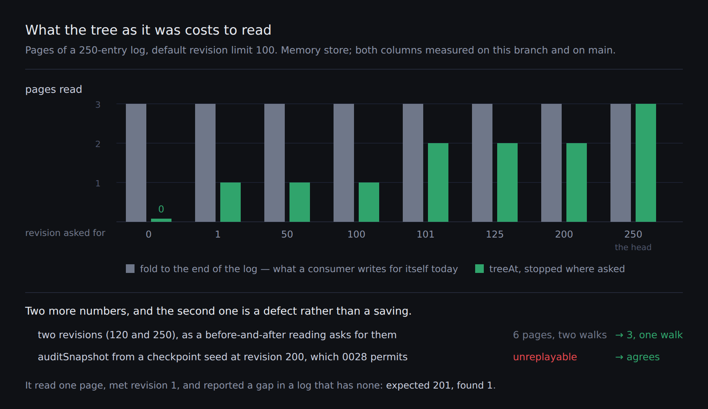

# The fold, bounded at both ends

**Date:** 2026-10-05 · **Section:** §2 (the store) · **Lane:** `Loom daily build`
**Branch:** `framework-the-fold-bounded-at-both-ends`, cut from `main` at `f79e1d9`. Not stacked.
**Records:** [0228](../decisions/0228-the-tree-as-it-was-is-a-fold-bounded-at-both-ends-and-the-head-is-answered-from-the-log.md). **None superseded.**

*Measured here, both columns. The grey bar is what a consumer has to do today:
page `revisions()` to the end and fold the prefix, because a page cannot be asked
to stop. The [source of the figure](2026-10-05-framework-the-fold-bounded-at-both-ends.svg) is beside it.*

---

## What this run did, in plain language

**A store can now be asked what a page looked like at any revision it still has
the log for.** Before today it could answer for exactly one — the current one —
and every earlier version of a page existed only as a recipe nobody was allowed
to cook.

`treeAt(reader, { treeId, revision, seed })` folds the log forward and stops at
the revision you named. `treesAt` does it for several in one walk, because the
question that needs this is *what changed between these two versions* and that
needs two of them.

**And one thing that was broken is fixed.** `auditSnapshot` has accepted a
checkpoint seed since August and has never once been able to use it: it read the
log from the beginning, met an entry the checkpoint already contained, and
reported the log as gapped. For a checkpoint at revision 200 it said *expected
201, found 1* — which is a true sentence about a walk that should never have
started there. The fold now opens at the seed's own position, so it never meets
an entry the seed has already applied.

## Why it was the thing to build

Three findings asked for it, from three lanes, in five days:

| filed | by | what it said |
| --- | --- | --- |
| 1 Oct | `Loom signals` | reader counters are keyed by tree **and** revision, so reading them needs the tree *of that revision*. Filed as not urgent |
| 2 Oct | `Loom portal` | it is urgent now: `/portal/readers` shipped, and one of two sections on each card is a notice instead of a reading |
| 4 Oct | `Loom portal` | `readingChangeOf` compares two readings and needs a tree per side; a consumer holding a `TreeReader` can get one |

The first two are closed by this branch. **The third is not in `FINDINGS.md` on
`main`** — it was filed on #513's branch and arrives when that merges — so I have
left it alone rather than reaching into another branch's entry. It is closed in
substance by `treesAt`, and whoever next touches it should say so.

The machinery was already here and was private twice over. `auditSnapshot` folds
the whole log; `planRevert` folds to a named revision and inverts there. Both are
the same walk with a different stopping condition. A consumer writing the third
copy and getting that condition slightly wrong lays one revision's counters over
another revision's tree — **the one failure this reading can have that looks
exactly like success**, because every number stays plausible and most parts come
back as *nobody got there*.

## The decision worth your eye

**The head is answered from the log, not from the snapshot.** Returning the
snapshot for the newest revision is one map lookup and it was the shape I started
with. It is wrong, and the reason is the whole point of the unit: a
before-and-after reading compares two revisions, so a head answered from the
snapshot beside a predecessor answered from the log compares **two sources of
truth this repository already knows can disagree**. `auditSnapshot` exists
because they can. A comparison whose two sides come from two places is the defect
the findings were about, arriving by a different door.

The cost is visible in the figure: `treeAt` at the head reads three pages where a
`head()` call reads none. A caller that wants the snapshot still has `head()` and
always did.

## Three things I decided that nothing specified

**The seed stays a parameter, and both findings suggested it should not.** They
proposed `treeAt(reader, treeId, revision)`. I spent the first part of this run
trying to earn that signature by **folding backwards from the head**, which needs
no seed at all — and it is not available. `invertOperations` inverts a delta
against the tree it applied *to*: the inverse of a removal is an insert carrying
the whole subtree, which only the pre-state holds. Computing the tree at revision
N backwards would need the tree at revision N. The seed is not a design choice
here; it is the only direction a fold runs. That is the first alternative in 0228
and it is recorded as unavailable rather than rejected, because the difference
matters to whoever reads it next.

**`earliest` is the seed's own revision, not one past it.** This is the one place
the span differs from a revert's, and it took a moment to see: you cannot *undo*
a revision the seed already contains, but the tree *at* the seed is the seed. So
`treeAt` at the seed's revision costs **zero reads of the log**, which the figure
records as the only zero on it.

**The id history comes back with the tree.** `ReplayedTree` already carries it
and the fold already produces it. A consumer reading reader counters **by node
id** needs it: an id that returned between the two revisions names two different
nodes either side of the comparison (0038). Handing back the bare tree would have
made every by-id comparison silently unsound at exactly the moment a page was
rebuilt — and the finding that asked for this is about a reading keyed by node id.

## Measured, not asserted

Both columns run here, on a 250-entry log with the default revision limit of 100.

| | `main` at `f79e1d9` | this branch |
| --- | --- | --- |
| the tree at revision 1 | 3 pages, hand-walked in the consumer | **1 page** |
| the tree at revision 200 | 3 pages, hand-walked | **2 pages** |
| the tree at revision 250 (the head) | 3 pages | 3 pages |
| the tree at revision 0 (the seed) | 3 pages | **0 pages** |
| revisions 120 and 250, as a comparison asks | 6 pages, two walks | **3 pages, one walk** |
| `auditSnapshot` from revision 0 | 3 pages, `agrees` | 3 pages, `agrees` |
| `auditSnapshot` from a checkpoint at 200 | 1 page, **`unreplayable`** | **1 page, `agrees`** |

The `main` figures for a past revision are what a consumer has to do today:
page `revisions()` to the end and fold the prefix, because a page cannot be
asked to stop. The checkpoint audit read one page before this and still got the
answer wrong — it failed fast and it failed in the wrong direction.

## The defect matrix

Twelve defects planted in `replay.ts`, one at a time, each reverted before the
next. **Eleven went red.** The two that did not are both worth the sentence:

| planted | |
| --- | --- |
| the seed is not a stop | 1 red |
| the fold opens at the log's oldest entry | 4 red |
| a reached revision is not retired from the set | 2 red |
| an empty seeking set is not settled | 3 red |
| the head is treated as past the span | 4 red |
| `earliest` is one past the seed, as a revert's is | 3 red |
| the stop keeps the tree from before the entry | 4 red |
| a fractional revision is sought | **green, then red** |
| revisions are not de-duplicated | **green, and it stays green** |
| the log is opened with nothing to seek | 2 red |
| the walk does not stop between pages | 1 red |
| a truncated log's gap is named one off | 1 red |

**The fractional one is a real gap I had left.** Removing `Number.isInteger` from
the *seeking* filter changed no answer, because the guard in `answerFrom` catches
it — but it changes the *cost*: a revision no entry can retire means the walk
reads every page of the log before answering what it already knew. The test that
asserts an unreachable revision opens no page was asserting it with integers
only. It now asks for `1.5` alongside, and the defect goes red.

**The de-duplication one is behaviourally inert and the line stays.** `new Map`
collapses duplicate keys on its own, so removing the `new Set` cannot change the
answer; what it changes is that `answerFrom` is called twice for a revision named
twice. The test *"answers a revision named twice once"* asserts the contract,
which is true either way, and not that line. `planReverts` carries the same line
for the same reason.

## Gate

`pnpm install && pnpm verify` on a deleted `dist` and `.next` — **exit 0**, with
the status written to a file as the last act of its own line and read in a
separate command.

| | `main` at `f79e1d9` | this branch |
| --- | --- | --- |
| `@jam-overture/loom` | 180 files / 3,803 tests | **180 / 3,828** |
| `@loom/app` | 378 / 6,776 | 378 / 6,776 |
| `findings:check` | 996 | **997**, 0 malformed |
| `prerender:check` | — | 124 pages, 1,536 junctions, 0 run together |
| published exports | 1,286 | **1,291** |

**+25 tests, no test file added.** Four assertions in the tests I wrote were
corrected before anything was committed — `findNode` returns `null` rather than
`undefined`, and the tree error for a missing node is `node-not-found` rather
than `no-such-node`. **No existing test was changed, weakened, skipped or
deleted**, which is worth stating given that the `auditSnapshot` fix changes how
it reads the log: the only line removed from `replay.test.ts` is its import of
`./replay.js`, and all sixteen tests already in it pass untouched — including the
one that asserts which cursors the fold asks for across a paged log.

**Lesson 16 prints a page count and it does not move.** Exercise C audits a
250-entry log from revision 0 and its transcript says `pages read: 3  entries
folded: 250`. The transcript suite checks the prose and does not execute the
code, so I measured that exact scenario myself rather than assuming: three pages,
250 entries, `agrees`, unchanged. Nothing in `lessons/` was edited.

**Cross-lane diffs: one, and it is mechanical.**
`app/(docs)/_lib/api/reference.generated.json`, regenerated with the repository's
own `pnpm --filter @loom/app docs:api` for the five new published exports. No
file under any route group was edited by hand. Nothing in `src/primitives/` or
`src/signals/` was touched.

## Findings

**Closed, two:** the 1 October entry from `Loom signals` and the 2 October entry
from `Loom portal`, both naming this branch and both saying what departed from
the shape they suggested.

**Measured onto one, after the pull request was opened:** the 23 September
URL-mangling entry. Its closing advice is to read the body back from the API
after posting and look, which I did — the report link (111 characters) and the
figure (121) came back byte-clean and **the record link (155) came back wrapped
in backticks**. The record is now cited by number with its path in a code span,
which is what that entry already says to do, and the re-read is clean. Three
measurements appended; no new theory, because three points cannot move a number
nineteen could not pin down.

**Filed, one:** the record-number collision, fourth filed occurrence. `#515` and
`#516` both write `0226` and both were correct by the procedure — `main` was at
`0225`, both re-read it, `0226` was free in both. It is evidence under the
2 October entry rather than a new question, and that entry's recommendation
(a band of numbers per lane) is unchanged and still the maintainer's call. What is
new is that this is the first occurrence seen **before** either branch merged,
by a third routine reading the open pull request list — which cost nothing and
only works for whoever reads last. This run took `0228`.

## Open questions

**Nothing blocking.** Three things recorded rather than asked:

- **A read of a past revision costs the log up to that revision**, which is
  bounded and public but not cheap: near the head of a 10,000-entry log it is a
  hundred pages. That is affordable in a scheduled job and is not a request path.
  The answer the seed parameter has always implied is that **a host that wants it
  cheap checkpoints**, and nothing in Loom helps a host do that — there is no
  published way to say *keep this tree as a checkpoint*. I have not proposed one,
  because no consumer has met the cost yet and a checkpoint store is a schema.
- **`/portal/readers` and `readingChangeOf` are unblocked and untouched.** The
  seam is published; the words on those screens and the shape of that comparison
  belong to `Loom portal` and `Loom signals` (0018). Nothing under a route group
  changed in this unit, deliberately.
- **Still open from earlier runs and unchanged by this one:** the `ModelEffort`
  scale borrowed from one vendor that three adapters will each have to map, and
  whether Grok is a third adapter at all. Both are yours to call and neither
  blocks anything.
