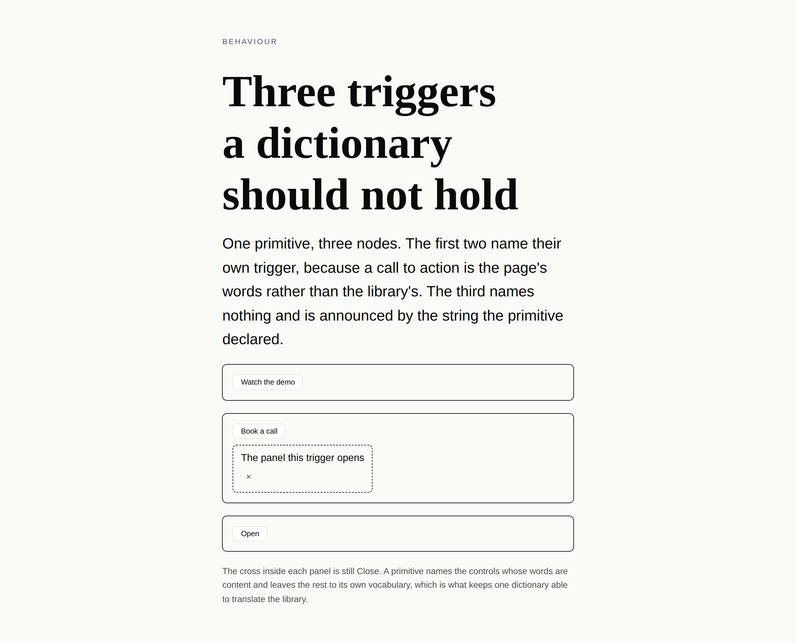

# The word the tree wrote

**Date:** 2026-10-05 · **Section:** §4h (the behaviour seam) · **Lane:** `Loom daily build`
**Branch:** `framework-55-the-word-the-tree-wrote`, cut from `main` at `6686895`. Not stacked.
**Records:** [0231](../decisions/0231-a-primitive-may-name-a-control-from-the-tree-and-its-declared-string-is-the-floor.md). **None superseded.**

*One primitive, three nodes, hydrated and photographed by the harness. The first
two triggers carry the words their nodes carry. The third node names nothing and
is announced by the string the primitive declared. The cross inside the open
panel is still `Close`, because this primitive did not say its cross was named
from the page. The arrival shot is
[beside it](2026-10-05-framework-the-word-the-tree-wrote-settled.png).*

---

## What this run did, in plain language

**A primitive can now say that one of its controls is called whatever its node
says it is called.**

Every control in the behaviour vocabulary has been named *per type* since the
seam was built. One `Copy` on every code panel in a deployment, one `Menu` on
every bar — which is exactly right for an affordance, and is why a deployment in
German is a JSON file rather than a fork. It is also why the dialog that
[0176](../decisions/0176-a-control-may-be-answerable-to-another-control-and-they-agree-through-the-dom.md)
unblocked a month ago was never built. A dialog's trigger is the page's call to
action — *Watch the demo*, *Book a call* — and the seam had nowhere to put one,
so the best a `loom.dialog` could have done was a modal opened by a chip reading
*Open*.

A primitive now declares `names: { present: "label" }` beside its behaviours. The
runtime reads that one prop off each node and hands the behaviour a **string**;
the string the primitive declared stays underneath as the floor, so a node that
writes nothing is announced by the library's word rather than by none.

Two things the same change fixes, both measured in the finding that asked for it:

- A header with a *Product* menu and an *Account* menu used to be two buttons a
  screen reader announced identically. Each now names itself.
- `aria-label` on a panel never helped, because the trigger is what a reader
  reaches first. It is the trigger that is named.

## Why it was the thing to build

It was the oldest open finding owned by this lane that something else was waiting
on. `Loom primitives` filed it on 1 October after shipping three of 0176's four
primitives and stopping at the fourth, and the gap inventory's first Tier B group
has read *three of four* ever since. That is another routine blocked on this one.

The finding offered three shapes and took the third, which was to ship nothing.
This takes the second, and the reason it turned out cheaper than the finding
judged is worth saying: **no props cross the seam.** `build` still cannot see a
node's props. It receives the node's text, the primitive's strings, and one word
the runtime resolved from the one prop the primitive named. The `ARCHITECTURAL`
half of that finding — hand `build` the props — is still untaken and still
`ARCHITECTURAL`.

There is a five-day-old precedent for the move.
[0226](../decisions/0226-a-primitive-declares-where-its-control-rests-and-the-control-publishes-nothing-until-the-reader-moves-it.md)
had the same problem about a *number* and solved it by letting the primitive
declare, through a channel the runtime owns, rather than by opening props to a
control. The difference is that where a slider rests is a fact about the
primitive and a call to action is a fact about the node, so this one had to be
per node — and what may carry it there is the whole of what 0231 decides.

## Decisions I took that nothing specified

**The source is a prop the primitive names, not the node's text.** Reading the
node's text is the channel `copy` already uses and would have needed no new
declaration. It does not work for the primitive this exists for: a dialog's text
is its *panel's*, so `textOf` the node returns the prose inside the thing the
trigger opens. A seam that cannot tell a trigger's label from its panel's words
is not usable by a dialog.

**The floor is checked before the node's word.** A primitive whose declared string
is blank still loses its control, even when the node carried a usable name. One
node happening to say something does not make a control translatable, and a tree
that could talk a nameless control onto a page is the failure the text seam
exists to prevent.

**A node that said nothing is not a diagnostic.** Absent, `null`, a number,
whitespace — each falls back to a real name in the deployment's language, so
there is nothing a render could usefully report. That is quieter than the frame
seam on purpose: a frame that will not render is something the tree asked for and
did not get, while a name that was not written is a tree declining an option.

**Each behaviour decides which of its strings is reachable.** `copy` declares two
and only one is a name — a tree may rename the button and may not change what it
says *after* it has copied.

**I judged this Accepted rather than `ARCHITECTURAL`.** It contradicts no accepted
record that I can find: declared strings are still outside the model-facing
catalogue (0060's clause 8), the registration check that guarantees a control has
a name is untouched, and the primitive is the gate exactly as it already is for
`frames` and `interactive`. It is still a new path from a prop to a word a reader
is announced, so it is the first thing to overrule if you disagree — the field is
one line in `definition.ts` and one check in `registry.ts`.

## What was built

| | |
| --- | --- |
| `src/render/control-name.ts` | new. The declaration, the resolved map, and `resolveControlNames`, which reads the named props off one node |
| `src/render/behaviour.ts` | `build` takes a third argument; `resolveBehaviours` takes the resolved names; `BehaviourResolver` grows an optional `controlNamePropsFor` |
| `src/render/render.ts` | reads the names at the one point in the walk where a node's props are in hand |
| `src/sdk/definition.ts` | `names` on a definition, typed by the behaviours that primitive declared, copied and frozen |
| `src/sdk/registry.ts` | two refusals — a behaviour this primitive does not take, and a prop its schema does not declare |
| `tools/specimen/control-name.specimen.ts` | the picture at the top |

## Cross-lane edits, both forced, one of them a judgement

**`apps/loom/app/(docs)/_lib/api/reference.generated.json`** — regenerated with
`pnpm --filter @loom/app docs:api`, because the published surface moved. Three
new exports and one changed signature. Mechanical.

**`lessons/31-behaviour.md`** — the fence of the `Behaviour` type is held against
the source character for character, and the paragraph under it ended on *"There
is no third argument, and the absence is the design."* The count is now wrong and
the sentence is the interesting half: what was impossible was **props**, and the
lesson spent its last line teaching that **three** was. I rewrote it to say what
the third argument is and why keeping it a string keeps the rest true. **Filed for
`Loom lessons`** — it is accurate and it is not necessarily how the author of a
lesson on this seam would want to teach it.

## Findings

**Closed:** 1 October, *a presentation's trigger cannot carry a word the tree
wrote* — the first two of its three rows, by #527. **The third stays open**: an
icon-only trigger is a question about what a control *renders* rather than what
it is called, and nothing here touches it.

**Filed:** the lesson paragraph above, for `Loom lessons`.

## Open questions

- **Whether a dialog is now `Loom primitives`' next unit.** Nothing here builds
  one, and nothing should — `src/primitives/` is that lane's. The gap inventory
  still says *three of four* and the thing that made it three is gone.
- **Whether `dismiss` should be nameable at all.** It is, because the primitive
  is the gate and refusing a member would have been a special case with no
  argument behind it. No primitive has reason to name one today.
- **The icon-only trigger.** A control renders its name as a child, so `ⓘ` beside
  a term still cannot be built. The shape that would settle it is letting a
  primitive supply the trigger's *children* while the name comes from here, which
  is a larger change and is not asked for by anything yet.

## Test numbers

`pnpm verify` green, end to end, on the final tree.

| | |
| --- | --- |
| package | **184 files, 3930 tests passed**, 0 failed (3906 on `main` — 24 new) |
| application | **384 files, 6917 tests passed**, 0 failed |
| typecheck, build, findings check, prerender check | clean |

**Nothing was skipped and nothing was weakened.** The first run of the gate was
red in three places — the generated API reference, the lesson fence, and the
docs-site check that every published export is reachable from a page — and all
three were the same fact arriving three ways: the published surface moved.
Regenerating the reference closed two of them and the lesson closed the third.

`*.vercel.app` is still denied from this sandbox, so the pictures are the
specimen harness against a local build rather than the preview deployment.
