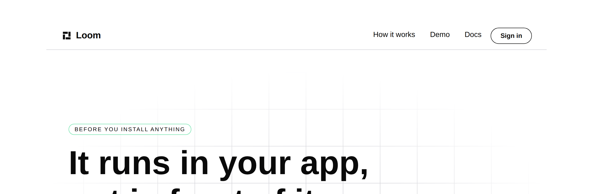

# 2026-10-05 — marketing: the paths nothing held

Every way out of this site into the rest of the product is a path. There are
seven of them, they are on every page, and until today a build in which all of
them pointed at nothing finished at **exit 0**.


`/`, 1280×820. Four cards, four addresses, four other lanes. Nothing on this
page changed today; what changed is that the four are now held to pages this
application has.

---

## The sentence that sent me looking

Yesterday's run wrote this in `anchors.test.ts`, as the stated reason for
checking same-page fragments and leaving every other link alone:

> *"Every other control on this site is a path, and a path that has gone wrong
> announces itself: the route is missing, the build says so, `pnpm verify` goes
> red."*

It is not true. Nothing in a Next build reads an `href`.

**Measured rather than argued.** I moved `LESSONS.path` from `/lessons` to
`/the-course` — one line, which is what any lane renaming a route does — so that
the top bar's menu, the footer's map, the front door's four cards and the
closing band all pointed somewhere that does not exist, and ran the build:

```
pnpm --filter @loom/app build   →  EXIT=0
```

No error, no warning naming it, 124 pages prerendered. The site shipped. This is
the page a visitor pressing **Take the course** would have got:


Times New Roman, an unstyled `h1`, a blue underlined link, and nothing anywhere
on it to tell a reader they are still on the same site. That screen is a second
finding and it is `Loom daily build`'s; see the bottom of this report.

---

## What the lane did have, which is the part I got wrong first

`site.test.ts` has held *a surface this site points at is a page that exists on
this deployment* since August, and it caught the falsification above alongside
the new rule. My first draft of this module said nothing held it. That was
wrong, and the correction is in the module's docblock rather than only here.

What it reads is `app/(group)/<path>/page.tsx`. That is true of the four paths it
was written against and of no other shape this application serves:

| | what it would do |
| --- | --- |
| `/docs/getting-started/quickstart` | looks for a `page.tsx`; the page is a **`page.mdx`** — §4c's decision that prose is the page — so it reads as served by nothing |
| `/docs/the-runtime/what-the-gate-decides` | three segments; it looks for a route group named for the whole of it |
| a path typed into a band | never read — it checks `PRODUCT_SURFACES`, which is a list, not the site |

So the gap was not that nobody thought of it. **The check was shaped to the four
paths in front of whoever wrote it** — which is exactly what `served.ts` records
about four rules written against the page as authored rather than as served, and
is the second instance of that shape in this route group in a week.

---

## What shipped

| file | what changed |
| --- | --- |
| `_lib/routes.ts` | **new** — the addresses this application serves, read off the application |
| `_lib/routes.test.ts` | **new** — 36 tests: the sweep, the floor under it, and nine rules on the reader itself |
| `_lib/site.test.ts` | the surface check moved onto `routes.ts`; its four assertions are unchanged |

No primitive added, nothing under `src/` opened, no component written, **no copy
added or removed** — the word count is untouched at 2,946. Nothing outside
`app/(marketing)/`, `FINDINGS.md` and `reports/`.

### The rule

**Every address this site sends a visitor to is an address this application
serves**, swept over all **126 states** — three routes, both deployments, and
every one of the five choices crossed with both answers a visitor can give.

| | measured |
| --- | --- |
| `href` props read across the sweep | **3,633** |
| of those, off-site and out of scope | 508 |
| distinct addresses inside the product | **7** — this site's three pages and the four surfaces |
| addresses this application serves | **72** |
| of those 72, held by anything before today | **4** |

The 72 is the number worth looking at twice: it is **exactly** the number of rows
in `next build`'s own route table once that table's five file conventions
(`_not-found`, `icon.svg`, `robots.txt`, `sitemap.xml`, the demo's opengraph
image) are set aside. The reader and the build agree on the whole application,
not on a corner of it.

### It reads directories, and it reads `pageExtensions`

`tools/prerender` asks a question of this shape about `.next`, which is the right
instrument for *what came out* and the wrong one here: it needs a build to exist,
and a check that quietly passes when the artefact is missing is the failure
`docs/routines.md` has a section about. Route conventions are a naming scheme on
a directory tree, so this reads the directory tree.

**The serving filenames are read off `next.config.ts` rather than typed**, and
that line is the one that would have been wrong on the day it was written. A
guessed list of `page.tsx` and `page.js` reports every address under
`/docs/getting-started` as served by nothing. The four-line version of this check
did exactly that, which is how the line got written.

**A segment shape it does not recognise throws.** Next has conventions this
application does not use — `@slot`, `(.)` and `(..)` interception — and each
changes what an address means. The argument is the documentation lane's, from
yesterday's DDL grammar: a grammar that guesses wrong is worse than one that
refuses, because the refusal is a failing build and the guess is a link this file
reports as fine. A check that invents routes cannot find the one that has gone,
which is the only thing it was written to do.

### Two readings of one question, made one

`site.test.ts` now asks `servedBy` instead of looking for the file itself. Its
four assertions read the same and fail the same; what is gone is the second copy
of *does this application serve that*. It is the move `measure.ts` and
`naming.ts` made yesterday for the tree walk and for the anchor list, for the
same reason: two readings disagree eventually, and the one that disagrees is
whichever was not looked at.

---

## Every rule was falsified

Each by putting back the thing it exists to catch.

| what was put back | what failed |
| --- | --- |
| `LESSONS.path` moved to `/the-course` | *sends nobody to an address this application does not serve*, and the floor, and `site.test.ts`'s surface row — **3 failures, and `next build` at exit 0** |
| the serving list typed as `page.tsx`/`page.ts` | *reads a page written in the extension another lane's pages are written in* |
| the refusal removed, so a convention is guessed | *refuses `@panel` …* — all 5 |
| a private folder read as an address | *serves nothing out of a private folder* |
| a route group spelled into the address | 14 failures, including every surface and every page of this site |
| `servedBy` made to answer with something always | 8 failures, including all 6 addresses it must refuse |

The first row is the one that matters. **It is a real rename, of the kind another
lane does without ever opening this route group**, and the build is green through
all of it.

---

## Gate

`pnpm install && pnpm verify` — **exit 0**, on a deleted `dist` and `.next`,
status written to a file as the last thing on its line and read in a separate
command.

| | `main` at `f79e1d9` | this branch |
| --- | --- | --- |
| `@jam-overture/loom` | 180 files / 3,803 | **180 / 3,803** — `src/` untouched |
| `@loom/app` | 378 / 6,776 | **379 / 6,812**, 0 skipped |
| the marketing suite | 40 / 1,033 | **41 / 1,069** |
| findings | 996 | **998**, 0 malformed |
| `prerender:check` | — | 124 pages, 1,536 junctions, 0 run together |
| `pnpm shoot` | — | `1280 / 1280`, `390 / 390` — no overflow |

The `main` column is this branch's figures less what this branch adds, rather
than a second full run: the only tests added are the 36 in one new file, and
`site.test.ts` keeps the four it had. The marketing figure checks out against
yesterday's report, which measured 1,033 on the branch that became `main`.

**36 tests added, all written. Nothing weakened, skipped or deleted.** No
existing assertion was changed: `site.test.ts`'s four rows assert the same thing
through a different reader.

No decision record. This sets no prop, adds no primitive, and touches neither the
tree schema, the delta model nor an `Accepted` record.

---

## What it does not read, stated so nobody assumes it does

**An off-site link.** 508 of the 3,633 `href`s are `github.com`, and nothing
offline can say whether one resolves. `license.test.ts` holds the one that maps
back to a file in this repository; the rest are checked by a person.

**A fragment.** Whether `/docs#something` lands is the documentation lane's
promise. This reads the path and drops the hash — so a surface link is now held
to the page and never to the place on it. That is the limit this lane filed on
4 October, narrowed from *all link classes* to *one*.

**What happens when this file goes red in another lane's run.** It means that
lane moved a page the front door sends people to. The 19 August finding is about
exactly this blast radius, so the failure names the address, the state it was
found in, and the file that used to serve it — and **nothing outside
`app/(marketing)/` has to be edited to get green.** The fix is the link, and the
link is this lane's.





---

## Findings

**Filed, two:**

- *the one page of this product that looks like nothing was built* — for
  `Loom daily build`, with the photograph above. `app/not-found.tsx` is the
  application shell and outside all four route groups. Its own reasoning for
  carrying its own document is right; what is filed is that nobody had looked at
  the result. A marketing lane cannot say what it should look like without
  editing it, so it is a photograph and a question.
- *the props vocabulary is wired at all three of this lane's roots* — closing
  the two marketing rows of the 21 September entry, which were done on
  23 September and never recorded. The portal's and the documentation's rows are
  still open.

**Nothing closed by this change** that was not already closed in code.

---

## Open questions

One, and it is the standing one.

**The word ceiling.** 3,300, against a site serving 2,946 — 89%. This change
adds no copy and moves it by zero, which is now true of three runs in a row. The
question is unchanged: whether 3,300 was a verdict on the ten-page
site it was measured against or a standing limit. It is one line either way, and
it is the thing most likely to decide whether the next piece of work on this site
can be a page.
