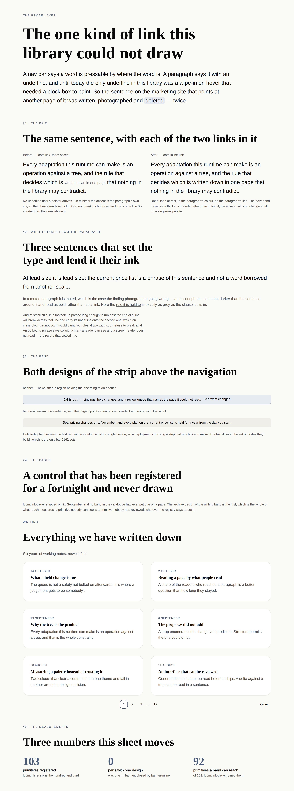
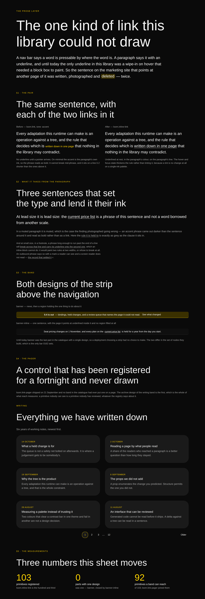
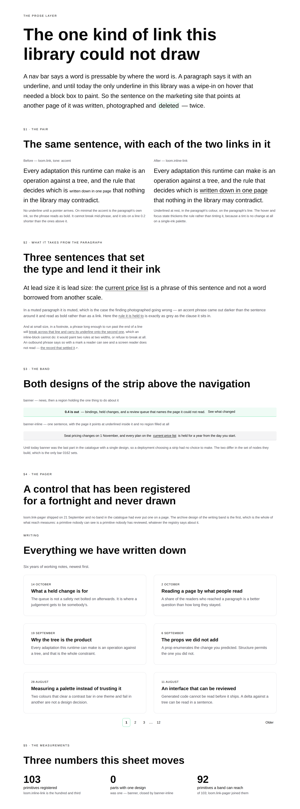




# 2026-10-05 — the link inside a sentence

On 4 October `Loom marketing` wrote the one sentence on that site that names
another page of it, built the inline link it needed, photographed it on all three
palettes, and **deleted it**. The finding they filed says why in three
paragraphs, and all three are properties of `loom.link` working as designed
rather than mistakes in it.

This run is that link, the band it made possible, and the control nobody had ever
put on a page.

---

## What shipped

| | |
| --- | --- |
| **`loom.inline-link`** | the hundred and third primitive. No colour prop, no size prop, no inline style at all |
| **[0227](../decisions/0227-an-inline-link-is-its-own-primitive-and-its-colour-is-the-paragraphs.md)** | *an inline link is its own primitive, and its colour is the paragraph's* — and the general rule three primitives had each found separately |
| **`banner-inline`** | the second design of the one part that had a single one. Designs-per-part: **1 → 0** |
| **`articles-index`** | the archive design of the writing band, which brings `loom.link-pager` into reach after a fortnight registered and never drawn |
| **`libraryStylesheetText()`** | the portal's 3 October filing, closed. One export, and `libraryStylesheet()` is its caller |
| `inline-link.test.ts` | 17 tests, three palettes, most of them asserting an **absence** |
| 4 findings | `Loom lessons`, `Loom marketing`, `Loom portal`, `Loom daily build` |

`pnpm verify` is green. **103 primitives, 54 bands, reach 92 of 103.**

---

## One — which primitives, and why this one

The brief's standing question. The answer is one primitive, and it was not chosen
off a gap list.

**`FINDINGS.md` before choosing work** is the brief's instruction, and the ledger
had a filing from a consuming lane that had *built the thing and taken it out
again*. That is a stronger signal than any taxonomy this lane has written: the
gap inventory's own arithmetic has put the ceiling at 110–120 against a library
of 102 for three runs and ended *"hold the vocabulary near 110 and spend the week
on compositions"* — and a primitive a lane has already written, photographed and
deleted is exactly the kind of addition that recommendation leaves room for.

Everything else in the run is a composition, which is the other half of the same
recommendation.

**What was not built, and why.** Two further primitives were considered and
dropped as padding: a footnote marker and an `abbr`. Both are thin, both are
*things with no interesting interior* under the granularity doc, and four
excellent primitives beats twelve thin ones in both directions — a run of one
excellent primitive beats a run of three if the other two are filler.

---

## Two — why a primitive and not a fourth `tone`, counted rather than felt

0052's closed-set clause keeps renderings on one enum, so `tone: "inline"` is the
first answer to reach for, and it is the wrong one. The argument is `loom.code-span`'s
and it transfers without a change of a word: the clause is a rule about
renderings of **one content model**, and a flag that switches other props off is
a schema saying two things and hoping the author reads the right half.

The count is three of five:

| `loom.link` prop | inside a sentence |
| --- | --- |
| `scale: "small" \| "medium"` | **off** — the phrase is the size of the sentence, whatever that is |
| `tone: "default" \| "muted" \| "accent"` | **off** — §3 |
| `current` | **off** — it works by pinning the underline open, and this underline is already open |
| `href` | shared |
| `external` | shared |

0061 is the precedent and the shape is identical to `loom.perk` / `loom.perk-list-item`:
the element a primitive *is* can be what separates it from its twin. **`loom.link`
is the `inline-block`; this is the `inline`.**

**The name breaks `loom.code-span`'s suffix on purpose.** `loom.link-list`,
`loom.link-trail` and `loom.link-pager` are a three-member family in which
`loom.link-*` means *a container of links*. A `loom.link-span` would be the only
member that is not one — read by a model choosing from 103 descriptions with
nothing but a name and a sentence. A mild inconsistency with one primitive beats
a collision with three.

---

## Three — the colour inherits, and that is the whole design

**There is no `tone`.** `color: inherit`, always, and the underline is the
affordance. This is not three tones simplified into none; it is the only spelling
that is correct everywhere the primitive is allowed to go.

The finding's second defect is the one that cannot be fixed with a token:
`minimal`'s `accent` slot and its `fg-default` hold **the same hex**,
deliberately, because a single-ink palette has nothing else to be. So an accent
phrase on the palette every visitor sees first is the colour of the words either
side of it — legible, and not distinguishable from the sentence as anything but
emphasis. **A defect that renders cleanly**, which is the kind this library has
learned to test for rather than look at.

A token could not have fixed it because *the right colour is not a slot*. It is
the colour of the words either side of the phrase, and `inherit` is the only
thing that knows. The same reasoning pays twice more: inside a muted paragraph
the phrase is muted, and inside a hero painted on an accent ground it is that
ground's ink, with no prop and no palette having an opinion.

**The hover moves a thickness and not a hue** — 1px to 2px, with the offset
dropping a hair — for the same reason. An accent hover is no hover at all on a
single-ink palette, and two pixels is visible in greyscale, under forced colours,
and to a reader who cannot tell the two hues apart. All of it is in the
stylesheet (0055) and **nothing is on the element**, which is the stronger form:
there is no declaration on the node for a paragraph to lose an argument with.

0227 states the general rule the library had found three times without writing
down:

> **A primitive that lives inside a sentence states no property the sentence
> states.**

`loom.emphasis` found it on weight (`bolder`, not `weight("heading")`, which
renders nothing under a pack declaring `headingWeight: 400`). `loom.code-span`
and `loom.kbd` found it on size (`em`, not a ramp step, because a span in a lede
and a span in a footnote are the same span). This is the colour axis, and the
fourth inline primitive now does not have to rediscover it.

---

## Four — which fields became nodes and which stayed props

The brief asks this of every run. This one is unusual in that the interesting
judgement is about **props that were deleted rather than fields that were
promoted**, because the content model was already settled by `loom.link`.

| | | why |
| --- | --- | --- |
| the words | **child text** | 0059 — one string is the whole of what the node says, so re-wording it is a `configure` on a text node the analysis reports as a change to that string alone. It also means *which words carry the link* is a `move` against text nodes rather than a prop nobody predicted |
| `href` | **prop** | content, no operation impersonated |
| `external` | **prop** | it does not change the set of nodes; it changes what the one node emits. The `↗` is drawn by the primitive and is not a child, because it is not content — see below |
| `tone` | **deleted** | §3. A prop whose every member would have to inherit is a prop with nothing to say |
| `scale` | **deleted** | the sentence states it |
| `current` | **deleted** | it works by pinning an underline that is already open. A link in prose to the page you are reading is a sentence to rewrite, not a prop |

**The near-miss worth naming is `external`.** It reads like a `showArrow`
boolean, which the granularity doc's table would call an `insert`/`remove` in
disguise. It is not: the arrow is not addressable content and never should be —
it is `aria-hidden`, it is a glyph rather than a quote (0223), and the fact it
draws is the same fact as `rel="noreferrer noopener"`. One prop emitting two
expressions of one fact is a real prop; a prop that decided whether a *node*
existed would not be.

**For the bands**, 0052 was applied as usual and the one call worth stating is
`articles-index`'s pager: each page number is a `loom.link` **node**, and the gap
between 3 and 12 is a `text` child reading `…` rather than a link to nowhere. A
run that grows is an `insert`; a `pageCount: number` prop would have been
`insert`/`remove` smuggled into a prop bag, and the ellipsis would have been
unsayable.

---

## Five — the band, and a bar that could not have been met

`banner` was the last part in the catalogue with one design, and the gap
inventory left the row open on purpose with an instruction attached:

> The next run reading this list should decide that question rather than assume
> the number should reach zero — and if it does build one, the bar is a *region*
> of the strip the canonical does not have, not a swapped leaf.

**The bar as written cannot be cleared by anything**, and that is a fact about
`loom.banner` rather than about any band: the strip declares exactly one region,
`action`, and the canonical fills it. There is no second region to find. Phrased
that way the bar says `banner` may never have a second design, which is a
stronger claim than the document meant and not one 0162 supports.

So it is answered the other way, narrowly: **a part whose content is one sentence
earns a second design when the sentence can be built a way the canonical closed
off.** Until today it could not be — news-then-a-button is the only shape a
library with no inline link can draw. A second design that required a primitive
to be written is not a swapped leaf by any reading.

The difference lands in the tree, not the paint: the canonical is a `loom.banner`
with a filled `action` region holding a `loom.link`; `banner-inline` fills **no
region at all** and has three children, the middle one being the link. And it is
a different reader's job — one strip is scanned for a control, the other is read
as a sentence whose destination is one of its phrases.

The inventory's caution was still right about the two designs it named. *A
`loom.button` where a `loom.link` was* and *a badge in front of the sentence* are
both still too thin, and neither is what shipped.

---

## Six — the control that had never been drawn

`loom.link-pager` was written on 21 September. It is registered, it is rendered
by `library.test.ts`, its props are described in every interpretation request a
deployment sends — and **no band in the catalogue had ever put one on a page.**

Its own doc comment names the four surfaces that end at it: *"an archive, a blog,
a catalogue and a search result all end at the same missing band."*
`articles-index` is the first of the four. The writing band had four designs and
every one of them shows a **selection**; none of them says there is more.

One choice in it is the reader's rather than the paint's: a reader on page one
has nothing before them, so the pager's `previous` region is **left unfilled**
rather than given a disabled word. A dead control that looks like a control is a
press that does nothing.

This is why reach is the instrument that replaces designs-per-part: **a primitive
nobody can see is a primitive nobody has reviewed**, whatever the registry says
about it.

---

## Seven — what turned red outside this lane, said plainly

Adding a primitive and two bands turned the app suite red in four places, none of
them in `src/primitives/`. This is the 2 October entry's hazard firing again and
it was fixed on this branch, because a red build is the only thing you can do
with one.

| | what | how |
| --- | --- | --- |
| `apps/…/(docs)/_lib/api/reference.generated.json` | three new published exports | regenerated with the repository's own `pnpm --filter @loom/app docs:api` |
| `apps/…/(docs)/_lib/counts.test.ts` | `"starter-primitives: one hundred and two"`, `"starter-bands: fifty-two"` | two literals, which that test's job is to be |
| `lessons/22,23,24,30,31` | five transcripts printing `102` | **numbers only**, plus one word — filed below |
| `src/primitives/loom.link.ts` | its docblock claimed `accent` was *"for the one link in a paragraph"* | corrected; the prop is unchanged |

**The one to look at is lesson 22.** Its prose reads *"Sixteen, out of whatever
the line above it printed"* directly under a transcript that now prints
seventeen, so leaving it would have made the sentence false about the block it
points at. It now reads *Seventeen*, **and nothing else in any of the five
lessons was touched** — including the paragraph after it, whose argument the new
entry does not change. Filed for `Loom lessons` with every passage named, on
4 October's rule: a number changed from outside a lane is a courtesy, a paragraph
changed from outside a lane is somebody else's argument rewritten by a stranger.

---

## Eight — what the library still cannot express

1. **An image.** Unchanged, and now with the number on it: **seven of the eleven
   unreached primitives are this one blocker** — `loom.media`, `loom.embed`,
   `loom.lightbox`, `loom.carousel`, `loom.before-after`, `loom.overlay`,
   `loom.pin`. No band can solve it. `mediaUrlSchema` excludes `data:` for sound
   reasons and a same-origin path is a broken image on every deployment that does
   not host the file. Filed for `Loom daily build` with two shapes and a
   recommendation (a binding, 0058).
2. **A control whose word comes from the tree.** Still why `loom.dialog` is
   unbuilt and `loom.menu` is at reach zero.
3. **A panel that does not exist before hydration.** Architectural, filed.
4. **One of *n* children chosen, where the labels are in the children** — tabs,
   segmented control, pricing toggle, radio group.
5. **A fixed decoration with no floor.** `loom.credential`'s mark. Still the
   maintainer's call, measured on 3 October, unchanged on purpose.
6. **A page that is not a landing page.** New, and it is what the last three
   unreached primitives are waiting for: `loom.link-trail` belongs above an
   interior document and `loom.waiting-state` belongs to a band waiting on an
   answer. The catalogue is a phrasebook of **bands**, and neither of those is a
   band. Whether it should also be a phrasebook of *pages* is a larger question
   than a run, and it is the first thing this lane has met that reach cannot
   close by writing one more composition.
7. ~~**`libraryStylesheet()` reachable only as an element.**~~ **Closed** by
   `libraryStylesheetText()`.

---

## The pictures

Three palettes rather than the usual two, because `minimal` is what the finding
was about: its `accent` slot and its `fg-default` hold one hex, so it is the
palette on which the old spelling fails and the only one that shows it.

**§1 is the pair to read at size** — the same sentence, same size, same ink, with
each of the two links in it.

| | editorial | bold | minimal |
| --- | --- | --- | --- |
| wide |  |  |  |
| phone |  |  |  |

```
…-editorial-wide    1280x3400@2x  scrollWidth 1280 / innerWidth 1280
…-editorial-phone    390x844@2x   scrollWidth  390 / innerWidth  390
…-bold-wide         1280x3400@2x  scrollWidth 1280 / innerWidth 1280
…-bold-phone         390x844@2x   scrollWidth  390 / innerWidth  390
…-minimal-wide      1280x3400@2x  scrollWidth 1280 / innerWidth 1280
…-minimal-phone      390x844@2x   scrollWidth  390 / innerWidth  390
```

**The phone shot is where §2's third sentence earns its place.** A phrase long
enough to run past the end of a line breaks across it and carries its underline
onto the second — which an inline-block cannot do: it would paint two rules at
two widths, or refuse to break at all. That is the finding's third defect,
photographed at 390px rather than argued about.
