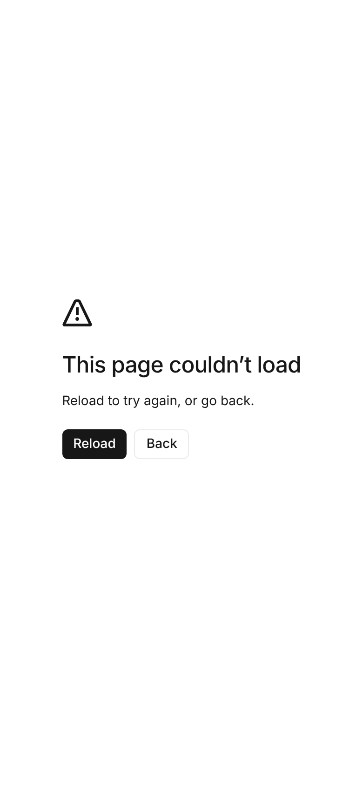
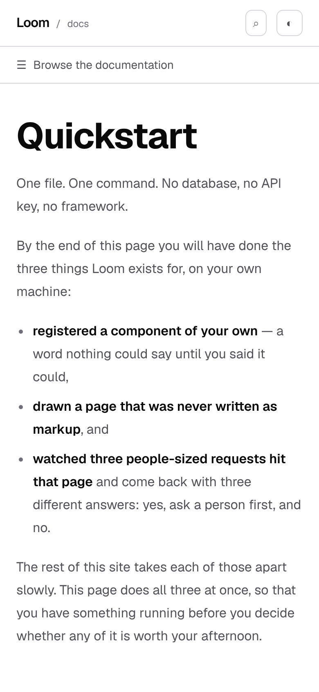
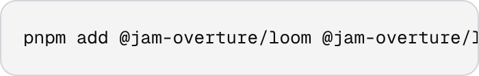

# 6 October 2026 — the two controls nobody had rendered, and what a reader who blocks cookies was getting

**Routine:** `Loom docs` · **Branch:** `docs-47-the-controls-nothing-rendered` ·
**Section:** §4c

No open pull request from this lane at the start of the run, so this is a fresh
branch off `main` at `6686895`. No maintainer comments were outstanding on any
pull request of this lane's. The work is the last four rows of this lane's
2 October class finding, which the 5 October run left open.

## What this was meant to be, and what it turned into

The job was bookkeeping: four components in this route group that no test had
ever rendered, closing a class finding. The 2 October entry that filed them said
all four were **decoration**, and on that basis this was the small job on the
list.

Two of the four are the only controls on this site that are not navigation — the
**copy button** on every fenced block, and the **theme toggle** in the header —
and both were broken. One of them was replacing every page of the documentation
site with an error screen for a particular reader, and had been for as long as
the toggle has existed.



That is `/docs/getting-started/quickstart` at 390 pixels on `main`, in a browser
where the reader has blocked site data. It is the same picture at 1280. It is
the same picture on every page of the site.



## The first defect: a read that throws, inside an effect

`window.localStorage` is not a store that comes back empty where a reader has
turned site data off. **It is a property whose getter throws a `SecurityError`.**
This repository already knows that — `tools/specimen/start-state.ts` blocks
storage for a screenshot by replacing the accessor with one that throws, because
that is what the browser does ([0195](../decisions/0195-a-shot-may-say-what-the-browser-started-with-and-it-says-it-as-data.md)).

Two things made this expensive rather than annoying:

- **The inline script beside it had always been guarded.** `ThemeScript` reads
  the same key, in the same document, and has had `try { … } catch` around it
  since it was written, with a docblock saying why. The toggle read it bare.
- **The read was in an effect.** An exception in an effect is not a control that
  does nothing. It reaches the route's error boundary, and `ThemeToggle` is
  mounted by the documentation layout — so it took every page with it. Next's
  default boundary is the picture above.

Nothing on this site could have caught it. jsdom's `localStorage` works, so any
render test passes; the shot harness can produce the state and no shot had asked
for it; and the reader it fails for does not file a bug, because what they are
looking at is a broken site rather than a preference that was not kept.

The fix is to read inside `try`, treat a refusal as *nothing stored*, and let the
write fail the same way. **A reader who blocked storage now gets the theme they
ask for and does not get it remembered**, which is the most any page can offer
somewhere it may not write.

## The second defect: `system` stopped following the system

The component's own docblock says `system` *"follows the operating system"*, and
that there are three states rather than two because collapsing it to a boolean
*"loses the difference between 'I want light' and 'my machine is light this
morning'"*. It resolved the preference once, at load, and then never looked
again. A reader on `system` whose machine went dark at sunset kept a light page
until they reloaded — which is the one state whose whole meaning is that they do
not have to.

It now subscribes to the media query **for as long as `system` is the choice, and
only then**. A reader who has chosen light is not asking to be overruled at
sunset, and the three tests that say so are the three states read back.

## The third defect: a copy button no phone has ever been able to see

`group-hover:opacity-100` does not compile to a plain `:hover` rule. Given the
button's four classes, `tailwindcss@4.3.3` — the version this repository installs
— emits:

```css
.opacity-0 { opacity: 0% }
@media (hover: hover) {
  .group-hover\:opacity-100:is(:where(.group):hover *) { opacity: 100% }
}
.focus-visible\:opacity-100:focus-visible { opacity: 100% }
```

**The reveal is inside the media query and the hiding is not.** On a phone or a
tablet the rule that would show the button is never evaluated and the one that
hides it always is — while the button keeps its box, its size and its hit area.
What a reader on a phone had was not a missing control. It was an invisible one,
100% clickable, sitting on the first line of every code block on the site.

This is new in Tailwind 4; under 3.x the pattern worked on touch by accident of
sticky hover. Nothing warns and nothing fails.

The fix gates the **hiding** instead of the reveal, so the base state is visible
and only a device that can hover hides it:

```
transition-opacity [@media(hover:hover)]:opacity-0 group-hover:opacity-100 focus-visible:opacity-100
```

**Specificity decides this and not source order**, which is the part worth
copying. The gate compiles to `0,1,0` and both reveals to `0,2,0`, so the reveals
win wherever they apply whichever rule Tailwind emits first — and it emits the
gate *last*, so the obvious spelling with `opacity-100` as a base class would
have been a coin toss between two `0,1,0` rules. Checked against the compiler
rather than assumed.

## The fourth: a second press cut the confirmation short

`copied` was cleared by a timer started on the *first* press. A reader who
pressed twice — which is what a reader does when they are not sure the first one
took — watched the confirmation vanish a few hundred milliseconds after the
second press. The signal that the button works disappeared fastest for exactly
the reader who doubted it. The answer now carries which press made it, so a
second press restarts the clock, and the timer is put down on unmount.

## The fifth, and the worst kind: a refused copy said nothing

`await navigator.clipboard.writeText(text)` was unguarded. A browser refuses that
write in more ordinary situations than it sounds: a page served over plain http
has no `navigator.clipboard` at all, Safari refuses a write outside a gesture it
recognises, a reader may have denied the permission. What happened then was
**nothing** — no confirmation, no message, an unhandled rejection only we would
ever see — and the reader went and pasted whatever had been on their clipboard
before, believing it was the snippet.

There is no second way to copy, so what the button owes them is the news. It says
`copy failed`, and goes back to offering after the same 1600 milliseconds so a
second try is not blocked by the first.

## What the four files hold

| file | tests | what it is about |
| --- | --- | --- |
| `_components/theme-toggle.test.tsx` | 16 | three states and that there are three, what a choice writes and paints, what `system` follows, and a reader who blocked storage |
| `_components/code-block.test.tsx` | 13 | what reaches the clipboard, what the button says back, a clipboard that refuses, and the button being findable at all |
| `_components/submit-seam.test.tsx` | 18 | the seven produced blocks on *What a form posts to*, each held against the producer it reads |
| `_components/callout.test.tsx` | 10 | two kinds and no third, the markdown inside one, and what the pages actually write |

Two of them are worth a sentence.

**The toggle is also held on the server.** `renderToStaticMarkup` with `dark`
stored still renders the *System* label, which is the stated reason the stored
value is read in an effect rather than at render: the server cannot read storage,
so a toggle that read it at render would produce different markup on the two
sides of hydration — and the reader it would be wrong for is exactly the reader
who chose something.

**The callout's half that a render test cannot reach is read off the pages.**
`TONE` is a lookup, so `kind="danger"` on a page does not fail to compile and
does not fail to render: it renders an aside with no label and no colour. MDX
props are not typechecked, so the twenty-eight page sources are the only place
the answer is. They ask for `note` and `warning` and nothing else, across
seventy-nine callouts.

## Decisions taken that were not specified

**No decision record.** Nothing here touches the tree schema, the delta model or
an `Accepted` record. `git diff origin/main -- src/ tools/ decisions/` is empty,
and so is the same diff against every other route group.

**Fixes rather than findings, because all three files are this lane's.**
`theme-toggle.tsx`, `code-block.tsx` and the four new tests are all inside
`apps/loom/app/(docs)/`. The *classes* the two defects belong to are filed, with
the one instance outside this lane named for its owner to judge rather than
changed from here — the portal's icon rail, below.

**`copy failed` rather than an explanation.** The button is 44 pixels wide. The
reader needs to know the press did not work so that they select the block
themselves, and two words is what fits. A longer sentence belongs in a toast this
site does not have, and adding one for this would be a component rather than a
fix.

**The visible state of the copy button changed on touch devices and did not
change on desktop.** A reader with a mouse sees exactly what they saw before:
nothing, until they hover the block. This was the narrower of the two available
fixes — the other is to show the button always, which is more discoverable and
puts a control permanently over the first line of every block. Narrower was
chosen because the defect is *unreachable on touch*, not *undiscoverable on
desktop*, and the second is a design question nobody has asked.

## Tests

`pnpm install && pnpm verify` at the repository root, on a `dist` and a `.next`
deleted first: **green, exit 0**, with the status written to a file as the last
thing on its own line and read in a separate command.

| | `main` at `6686895` | this branch |
| --- | --- | --- |
| `@jam-overture/loom` | 183 files / 3,906 tests | **183 / 3,906** — `src/` was not opened |
| `@loom/app` | 384 / 6,917 | **388 / 6,974** |
| findings ledger | 1,013 entries, 0 malformed | **1,016**, 0 malformed |
| `prerender:check` | 126 pages / 1,539 text junctions | **126 / 1,539**, 0 run together |

**+57 tests, +4 files. Nothing weakened, skipped or deleted**, and no existing
assertion was changed: the diff adds four test files and rewrites two components.

**Which figures in the `main` column were measured, because the distinction
matters.** The app row is a real run: a full `pnpm --filter @loom/app test` on a
stashed tree, 384 files and 6,917 tests, not arithmetic. The findings row is the
ledger's own count before and after. The library row and the prerender row are
**carried from this branch's run and asserted to be `main`'s on the grounds that
the diff cannot move them** — `git diff origin/main -- src/ tools/` is empty, and
no page, no prose and no MDX file is touched. That is a strong argument and it is
still an argument; a second full build of `main` was not run for them.

**The junction count did not move**, which is right: both components are client
controls and the prerendered HTML is the same markup either way.

## Green is not evidence — forty-six mutations, and none survived

Each introduced one at a time against the committed code and reverted before the
next, with the matching test file run each time.

| what was broken | tests that went red |
| --- | --- |
| the cycle runs backwards | 9 |
| the toggle is a switch rather than three states | 7 |
| the label reports the state and does not say where next | 6 |
| the document is never painted | 6 |
| every table prints one row and stops | 6 |
| a callout carries no label | 3 |
| the children are never printed | 3 |
| system resolves to light instead of asking the machine | 3 |
| **the machine is never listened to** | **3** — the second defect |
| **a refused write says nothing** | **3** — the fifth defect |
| a refused write is reported as a copy | 3 |
| the connected form is described instead of rendered | 2 |
| authored markdown loses the region that gives a link its underline back | 2 |
| the label is printed inside the content | 2 |
| the confirmation never goes away | 2 |
| the timer is never put down | 2 |
| the listener is never let go of | 2 |
| **a blocked read takes the page down** | **2** — the first defect |
| **the reveal is hidden on every device** | **1** — the third defect |
| **the second press does not restart the clock** | **1** — the fourth defect |
| the two kinds are two shades of one colour | 1 |
| a warning is labelled as a note | 1 |
| the default kind is the warning | 1 |
| the prose barrier is dropped | 1 |
| the glyph is read aloud | 1 |
| system is stored as the word rather than forgotten | 1 |
| the stored choice is never read back | 1 |
| the stored choice is read at render instead of in an effect | 1 |
| the machine is listened to whatever the reader chose | 1 |
| a blocked write takes the press down | 1 |
| the clipboard is handed the markup rather than the text | 1 |
| an empty block claims it copied | 1 |
| a keyboard cannot reveal it | 1 |
| a pointer cannot reveal it | 1 |
| the block is no longer a scroller | 1 |
| the highlighter's class is dropped | 1 |
| the props the page passed are dropped | 1 |
| no table prints a header | 1 |
| the deployment's hidden fields are left off the page | 1 |
| the ways a form has nowhere to post lose their sentence | 1 |
| the empty action renders as a blank cell | 1 |
| the caption counts the candidates that were refused | 1 |
| the Gate's verdict loses its detail | 1 |
| the model is shown destinations with no description | 1 |
| the shared-plan sentence names no endpoint | 1 |
| the refused declaration is not marked with what the planner did | 1 |

**One mutation survived the first pass and the test was rewritten.** *The empty
action renders as a blank cell* came back `0`. One of the candidates
`WhatAnActionMayBe` prints is the empty string, which is a legal `action` meaning
*post back to this address*, and it is rendered as a non-breaking space so the
cell is not blank. The assertion asked whether the **row** had any text in it —
and the row has two other cells, so it passed against a component printing the
candidate as nothing at all. It asks about the address cell now, and does not
trim, because `String.trim` removes a non-breaking space and would put the hole
straight back. The mutation kills one test on the second pass and that number is
in the table.

One more was reported as `NOT APPLIED (0 matches)` rather than running, because
the anchor had been written with a plain space where the source has ` `. The
script says so instead of silently mutating nothing, which is the only reason it
was noticed; it was re-run against the real characters.

## The visual, and the one this run could not take



**That picture is identical on this branch and on `main`, and that is the
finding.** `VIEWPORTS.phone` is `390x844` at `deviceScaleFactor: 2` and nothing
else: there is no `hasTouch`, no `isMobile` and no pointer emulation anywhere in
either harness. So Chromium reports a fine, hovering pointer in a 390-pixel
window, `@media (hover: hover)` is true, and the button is `opacity: 0` in both
builds — hidden-pending-hover on this branch, hidden-forever on `main`. The two
states the harness can produce are the two that agree.

Every phone shot in this repository has been taken that way. For most subjects it
changes nothing, which is why it has not come up; it changes everything for
anything gated on the pointer, and Tailwind 4 gates a great deal on it by
default. Filed for `Loom daily build` with the two things that would close it.

So the evidence for the copy button is the compiled CSS above and a class-name
assertion, and the report says that rather than claiming a picture of a button
appearing.

### What was photographed

`built 2026-10-06T14:05:38.795Z` and `2026-10-06T14:26:04.619Z`, both served by
the harness itself, from two production builds of the same tree with
`theme-toggle.tsx` and `code-block.tsx` restored from `origin/main` for the
second. `scrollWidth 390 / innerWidth 390` on every phone shot and `1280 / 1280`
on every wide one.

```
      the shipped build, storage blocked        this branch, storage blocked
  header                        no match    header     x 0 y 0  390x57
  pre                           no match    pre        x 21 y 1644  348x6475
  nav[aria-label='Documentation'] no match  nav[…]     x 0 y 57  255x1730
  button[title]                 no match    h1         x 20 y 142  350x48
  h1          x 67 y 376  257x32
```

Four of the five selectors that make up a page of this site report `no match` on
the shipped build. The `h1` that is there is 257 pixels wide and centred, and it
says *This page couldn't load*.

**The fixed page is byte-identical with storage blocked and with storage
working** — same `md5` on both phone shots and both wide ones. That is what the
fix is supposed to produce, and it is worth stating as a measurement rather than
as an intention.

## Scope

`apps/loom/app/(docs)/` only, plus `FINDINGS.md`, this report, its shot list and
its screenshots. `git diff origin/main -- src/ tools/ decisions/` is empty, and so
is the same diff against every other route group. Two components changed, four
test files added, nothing else.

## Findings

**Closed — one, the whole class.** The 2 October entry, *every assertion about a
produced block on this site is about what the producer computes*. Its last four
rows are done, and the dated note on it records that the entry's own judgement —
that all four were decoration — was wrong about two of them, for the same reason
the entry exists: it was made from the outside, about components nobody had
rendered.

**Filed — three.**

1. *Tailwind 4 compiles every hover variant inside `@media (hover: hover)`.* For
   `Loom portal`, which has the one other instance: the icon rail's width and
   every label in it (`hover:w-[275px]`, `group-hover:opacity-100`). It renders
   at 390 pixels with no breakpoint prefix, and `group-focus-within` is **not**
   gated, so the labels do come back once something in the rail has focus — which
   is to say after the reader has already navigated somewhere. Whether that
   matters depends on whether the portal means to be used on a phone, which is
   its owner's call and not this lane's.
2. *An effect that reads `localStorage` is a page that fails for a reader who
   blocked it.* Filed as a pattern rather than as work owed: the sweep is done
   and there is nothing to assign. `(lessons)/_lib/reading.ts` had already got
   this right, thoroughly, and is the model. `(docs)` is the one that had not.
3. *The screenshot harness's `phone` is a width and not a device.* For
   `Loom daily build`, above.

**Not re-filed:** the preview URL is not derivable from the branch name and the
egress policy denies the check that would catch it (27 September); the screenshot
harness photographs an address while the theme lives in `localStorage`, so these
pictures are light (14–16 September); a `do` list pins the page against anchor
clicks (5 October); the ten British names in the published API (27 September).

## What I would write next

- **A worked `<meta name="theme-color">`**, which the theming page names as a
  case and does not show. Carried from the 4 October and 5 October reports, and
  now with a reason to do it: today's run is the second in a row where the theme
  machinery turned out to be the thing nobody had looked at.
- **`search`'s own keyboard contract against the rail's.** Carried from
  5 October. `search.test.tsx` is the most thorough file in this route group and
  the one thing it does not cover is what a result press does to the chrome
  around it.
- **The `signals` door's narrower-door saving in kilobytes rather than in files**
  (23 September, open) — still blocked on the same judgement about wording, which
  is the maintainer's and is in the entry.
