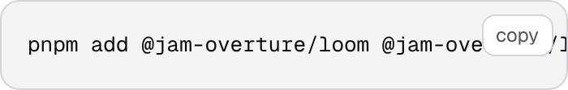

# A phone shot taken with a mouse

**Date:** 2026-10-06 · **Section:** §1 (process — the screenshot harness) · **Lane:** `Loom daily build`
**Branch:** `framework-57-a-phone-shot-taken-with-a-mouse`, cut from `main` at `41c65e9`. Not stacked.
**Records:** [0236](../decisions/0236-a-viewport-names-a-device-and-the-pointer-is-part-of-it.md). **None superseded.**

| before — every phone shot ever taken here | after — this branch |
| --- | --- |
|  |  |

*One documentation code block, clipped, at 390×844. Same build, same page, same
selector, same run — the only variable between them is the pointer. The left one
came back **byte-identical to `Loom docs`' own committed
`2026-10-06-docs-copy-button-phone.png`**, which is the control: it is not my
reconstruction of the old behaviour, it is the old behaviour.*

---

## What this run did, in plain language

**`VIEWPORTS.phone` was a size and not a device, so Chromium reported a mouse in
it, and every phone screenshot in this repository was taken by a browser that
hovers.** `@media (hover: hover)` and `@media (pointer: fine)` have been true in
all of them. A viewport now carries a required `touch`, `PHONE` sets it, and the
harness emulates it — so a shot named `phone` is taken by something with a
finger, and the line a report pastes says which device took it:

```
2026-10-06-framework-copy-button-phone-touch  390x844@2x touch  scrollWidth 390 / innerWidth 390
```

`Loom docs` filed it this morning, from the other end: it had just made the copy
button on every code block visible to touch readers, and found the fix
**unphotographable** — the same picture comes back from the fixed build and the
broken one, because at a hover-capable 390 pixels both are `opacity: 0`. Its
report fell back to compiled CSS and a class-name assertion and said plainly
that both are weaker than a picture. The picture is above.

The irony is in the file this changes. `PHONE`'s own comment has argued since it
was written that a **true** 390-pixel viewport matters because *a media query
reads the viewport*, and a desktop window scaled down is still 1280 wide to CSS.
A media query reads the pointer too. The comment had one half of its own
argument.

## Why it was the thing to build

It is the newest open finding owned by this lane, it came from another routine
with evidence attached, and it is the only one of them that is about the
instrument four other routines take their evidence with. A defect invisible to
the instrument is a defect that gets reported as *fixed, photograph attached*.

The migration this lane's brief still leads with is **done** and was done before
this run started: `apps/loom` holds the route groups, `apps/portal` and
`apps/docs` are retired, `apps/` is one package. Nothing is half-migrated.

## The three answers the filing left open

The filing named two shapes and asked for a judgement on the second. All three
answers below are measured, and all three are in 0236.

### 1. The pointer belongs to the viewport, not to the shot

The filing offered `touch: true` **on a shot**, beside `start`, reasoning that
it is a context property. It is — and so is the size, which has never been a
shot's to decide. A pointer on a shot lets one lane photograph `phone` with a
finger and another photograph `phone` with a mouse, in one repository, with both
reports calling the result *the phone*. That is precisely the drift
[0117](../decisions/0117-one-harness-two-subjects-a-tree-it-renders-and-an-address-you-serve.md)
folded six private scripts into one harness to prevent, reintroduced one field
lower down.

### 2. `hasTouch`, and `isMobile` deliberately not — the filing's mapping is half wrong

The filing says the field "maps to Playwright's `hasTouch` **and** `isMobile`",
which is how Playwright's own device descriptors are written. Measured at
390×844 in this container, reading `matchMedia` in the page:

| context | `hover` | `pointer` | `innerWidth` |
| --- | --- | --- | --- |
| neither — every shot until today | `hover` | `fine` | 390 |
| `hasTouch` | **`none`** | **`coarse`** | 390 |
| `isMobile` | `hover` | `fine` | **980** |
| both | `none` | `coarse` | 390 |

`hasTouch` is the whole of what moves the pointer. `isMobile` moves none of it,
and what it *does* move is the meta viewport: on a document with no
`<meta name="viewport">`, Chromium falls back to a 980-pixel layout width and
the picture becomes a desktop page scaled down — the exact failure `PHONE`'s
comment warns about. Every page the application serves declares the tag, so
there it is inert; a specimen's rendered page is the case it would silently
break. A field that buys nothing and can cost the whole picture is left off, and
the table is in the code so nobody has to take it again.

### 3. How many existing phone shots move: one, and it is the one the filing is about

The filing asked for this to be a judgement rather than an addition, "worth
knowing how many of the repository's phone shots move before choosing". It was
measured two ways.

**The mechanism first, because it is the reason the number is small.** A rule
inside `@media (hover: hover)` still needs `:hover` on the element to match, and
a screenshot never hovers — so every ordinary `hover:` utility is inert in both
modes. A picture can only move where a rule is gated on the pointer **and
applies at rest**.

**Swept**, over the compiled stylesheets:

| | pointer-gated at-rules | of those, rules that apply at rest |
| --- | --- | --- |
| the library stylesheet (46,590 bytes) | **0** | **0** |
| the application's compiled CSS (6 files) | 12 | **1** |

The one is `[@media(hover:hover)]:opacity-0` — the copy button, compiled into
three route groups' chunks. Zero in the library means **no specimen sheet in
this repository can move**, which is 34 sheets.

**Photographed**, six whole-page phone shots, both ways, same build, same run:

| page | |
| --- | --- |
| `/` — marketing | byte-identical |
| `/what-you-run` — marketing | byte-identical |
| `/lessons` | byte-identical |
| `/demo` | byte-identical |
| `/portal` | byte-identical |
| `/docs/getting-started/installation` | **differs** — 1,123,655 → 1,128,334 bytes |

And one specimen sheet, `the-link-inside-a-sentence`, run both ways across all
three of its themes: **three phone shots, three byte-identical**, which is the
library row above confirmed with a camera rather than a regex.

So the default moved. Five of six pages and every specimen sheet are unchanged,
and the sixth is the picture that was lying.

## Three things I decided that nothing specified

**`touch` is required, not optional.** An optional field with a `false` default
would have shipped this fix and left six of the thirty-four specimen sheets
still photographing phones with a mouse — silently, because those six write
their viewports out as literals instead of taking `DEFAULT_VIEWPORTS`. Required
makes the compiler ask each of them once, and the answer is one word. The
alternative I weighed and rejected was a **sweep test** in this lane asserting
that every viewport labelled `phone` anywhere declares `touch: true`: that is
this lane's rule failing inside another lane's pull request, which is a worse
trade than a type the compiler raises where the value is written.

**The line says `touch`, and only when it is true.** The reading beside it —
`scrollWidth` against `innerWidth` — is quoted in every report here and reads as
*this is what a phone gets*. For seven weeks it was taken with a mouse and no
reader could have told from the number. Printed only when true, so every `wide`
line this harness has ever written is byte-identical.

**A size written into a shot list is a window with a mouse.** `touch` defaults
to `false` in the shot schema, which is the one place the schema and the type
disagree. A lane writing `{ width, height }` is reaching past the two named
viewports, and `"phone"` is how it asks for a phone. `"touch": true` is there
for the lane that wants a hand-sized device at some other size.

## The thing that is now worse, and it is filed

**CSS is honest and a script is not.** `navigator.maxTouchPoints` becomes 1
under `hasTouch`; `"ontouchstart" in window` stays `false`, in both modes.
Chromium defines `window.TouchEvent` and `window.Touch` either way and
`ontouchstart` in neither. So a component branching on the oldest and still
common sniff gets its **desktop** branch photographed under a picture the
harness now labels `touch` — which is a worse failure than the one closed today,
where the label and the picture were wrong together.

Nothing in this repository sniffs it: swept `src/`, `apps/` and `tools/`, zero
occurrences. So it is recorded as a stated limit rather than fixed, with the
line that would close it written down — an `addInitScript` defining the property,
which is
[0195](../decisions/0195-a-shot-may-say-what-the-browser-started-with-and-it-says-it-as-data.md)'s
`start` territory and not the viewport's. A harness that fakes a signal nothing
reads is telling a story about a browser rather than photographing one.

## The recipe, because a capability not in it does not exist

The 3 October finding this lane closed on `measure` says it plainly: *to a
routine with no memory of the last run, a capability that exists and is not in
the recipe is a capability that does not exist* — it cost six runs a private
Playwright script before anyone found `measure`. So the same run that added the
field wrote it into the two files a lane reads first:

- **`docs/routines.md`**, *Taking the screenshot* — what `phone` now reports,
  the `390x844@2x touch` line, that an explicit `{ width, height }` is a window,
  and the `ontouchstart` limit above.
- **`tools/specimen/README.md`** — the same for a sheet that writes its own
  viewports, and its two sample output lines corrected.

## The defect matrix

Thirteen defects planted, one at a time, each reverted before the next.
**Twelve went red. One went green, and it is the one this run's own record
predicted would.**

| planted | |
| --- | --- |
| `PHONE.touch` is false | **8 red** |
| `WIDE.touch` is true | 5 red |
| `contextOptionsFor` hard-codes `hasTouch: true` | 1 red |
| `contextOptionsFor` hard-codes `hasTouch: false` | 2 red |
| `hasTouch` is dropped from `ContextOptions` | **4 `tsc` errors** |
| `isMobile: true` is added to the context | 2 red |
| `describeShot` prints the pointer on every shot | 2 red |
| `describeShot` prints the pointer on none | 4 red |
| `describeShot` prints the pointer after the overflow reading | 4 red |
| the shot schema's `touch` defaults to `true` | 2 red |
| the shot schema drops `touch` | 1 `tsc` error |
| `touch` is made optional on `SpecimenViewport` | 1 `tsc` error |
| a specimen sheet's `phone` literal is set to `touch: false` | **green — nothing caught it** |

**The green row is the honest limit of what a required field buys**, and it is
worth stating precisely because 0236 argues the field is the right instrument.
The field makes *forgetting* impossible — the compiler asks every author, which
is the whole reason twelve literals were corrected rather than six left silent.
It does not make *saying the wrong thing* impossible. If a sheet writes
`touch: false` on a viewport it calls `phone`, the repository is green and the
picture is a desktop again.

The check that would catch it is the source sweep this record rejects: a test in
this lane asserting that every viewport labelled `phone` anywhere declares
`touch: true`. The rejection stands and the reason is unchanged — it is this
lane's rule failing inside another lane's pull request — but the cost of it is
now measured rather than asserted, which is why the row is in the table rather
than left out of it.

**Two rows need a sentence.** `touch` made optional was planted expecting green
and came back **red**, which is better than designed: `contextOptionsFor`'s
`hasTouch: viewport.touch` then hands `boolean | undefined` to a field typed
`boolean`, so the seam refuses the looser type without anyone having written an
assertion about it. And `PHONE.touch is false` is the loudest row at 8 red
because it is the defect this branch exists to remove: it trips the viewport
tests, the plan tests and every `describeShot` line at once.

## Measured, not asserted

| | `main` at `41c65e9` | this branch |
| --- | --- | --- |
| `@media (hover: hover)` in a `phone` shot | **true** | **false** |
| `@media (pointer: coarse)` in a `phone` shot | false | **true** |
| `navigator.maxTouchPoints` in a `phone` shot | 0 | **1** |
| `innerWidth` in a `phone` shot | 390 | 390 — unchanged |
| `scrollWidth / innerWidth` on all six pages above | 390 / 390 | 390 / 390 — unchanged |
| whole-page phone shots that change | — | **1 of 6** |
| specimen phone shots that change | — | **0 of 3 measured, 0 possible** |
| viewports in the repository that declare a pointer | **0 of 14** | **14 of 14** |

The `innerWidth` row is there because it is what `isMobile` would have broken,
and the `scrollWidth` row because it is the number every report quotes: the
change is visible in the pictures and in none of the measurements, which is what
makes it safe to make the default.

## Cross-lane diffs

Three files' worth, all mechanical, all filed:

- **Six specimen sheets in `src/primitives/`** — twelve one-word edits, forced
  by the required field. No behaviour changed; `the-link-inside-a-sentence` was
  photographed both ways to prove it. Filed with every file and line named,
  including the tidy-up that would stop it happening again (those six copy
  `PHONE`'s numbers instead of importing `PHONE`), offered and not taken.
- **Four sample output lines in `lessons/32-layout.md`** — three of them are
  captured output of Exercise F, which builds its shots with `viewport: PHONE`,
  so a learner running it today got three lines the transcript said they would
  not. No prose touched, no number changed. Filed, with the one sentence that
  lane might want to write.
- **Nothing under `(marketing)`, `(docs)`, `(lessons)`, `(portal)`, `(demo)` or
  `(preview)` was opened at all.** The one thing I wanted to change in another
  lane's file and did not is the `[@media(hover:hover)]:opacity-0` class on the
  copy button — it is correct, it is now photographable, and it is theirs.

## Gate

`pnpm verify` on a deleted `dist` and `.next` — **exit 0**, with the status
written to a file as the last act of its own line and read in a separate
command.

| | this branch |
| --- | --- |
| `@jam-overture/loom` | **186 files / 4,029 tests**, 0 failed, 0 skipped |
| `@loom/app` | **398 / 7,087**, 0 failed, 0 skipped |
| `findings:check` | **1,039**, 0 malformed |
| `prerender:check` | 126 pages, 1,542 junctions, 0 run together; 3 metadata conventions, 0 unserved |

**+7 tests, in the two test files that already covered these seams**, and no new
test file. **No existing test was deleted, skipped or weakened.** Four
assertions were *edited* and all four for the same reason: they pin
`describeShot`'s exact output for a `phone` shot, and that line now carries the
word `touch`. Each is still an exact-string assertion on the whole line — the
change is the expected string, not the strictness.

The application's 398/7,087 is `main`'s: nothing under any route group was
opened, and the only application-adjacent file touched in the whole branch is
none.

**One thing cost this run time and is worth recording.** Two `pnpm verify`
processes were left running at once, racing over one log file, which made a
green run look like it was hanging and an exit code from a *previous* run look
like this one's. The number above is a single run, started from a deleted `dist`
and `.next` with nothing else running, and its exit code was read from the file
it wrote.

One warning in the build is pre-existing and belongs to `Loom lessons` — the NFT
trace on `next.config.ts` through `(lessons)/_lib/run.ts`. It is on `main` and
is untouched here.

## Findings

**Closed, one:** the 6 October entry from `Loom docs`, naming this branch, with
its original status preserved below the closure — it is another lane's entry and
only the status line is mine to write. All three of the questions it left open
are answered in it with the measurement attached.

**Filed, three:**

- **Twelve one-word edits in six of `Loom primitives`' specimen sheets**, forced
  and harmless, with the duplication that caused them named.
- **A phone shot is honest in CSS and still dishonest in a script** —
  `ontouchstart`, owned by this lane, recorded as a stated limit with the fix
  deliberately not built.
- **Four corrected sample lines in `lessons/32-layout.md`**, owned by
  `Loom lessons`.

## Open questions

**Nothing blocking.** Two for you, and a recommendation on each:

- **Is a coarse pointer enough, or should a viewport be able to name a real
  device?** What shipped is a 390-pixel window that reports a finger. It is not
  an iPhone: no user-agent string, no platform, no software keyboard, no address
  bar eating the bottom of the screen. My recommendation is to stop here — every
  one of those is a claim the harness would be making on a page's behalf, and
  the pointer is the only one anything has actually needed. Worth a word if you
  want the harness to go further.
- **Should `ontouchstart` be defined in a phone shot?** My recommendation is no,
  until something reads it, for the reason in the finding: faking a signal
  nothing reads makes the instrument a story. The sweep that says nothing reads
  it is two greps and is in the finding, so the next run can re-take it.
- **Still open from earlier runs and unchanged by this one:** the `ModelEffort`
  scale borrowed from one vendor that three adapters will each have to map, and
  whether Grok is a third adapter at all. Both are yours and neither blocks
  anything.

`*.vercel.app` is denied from this sandbox (27 September finding, unchanged), so
every photograph here is a local **production** build served by
`pnpm shoot --serve`, not the preview.
