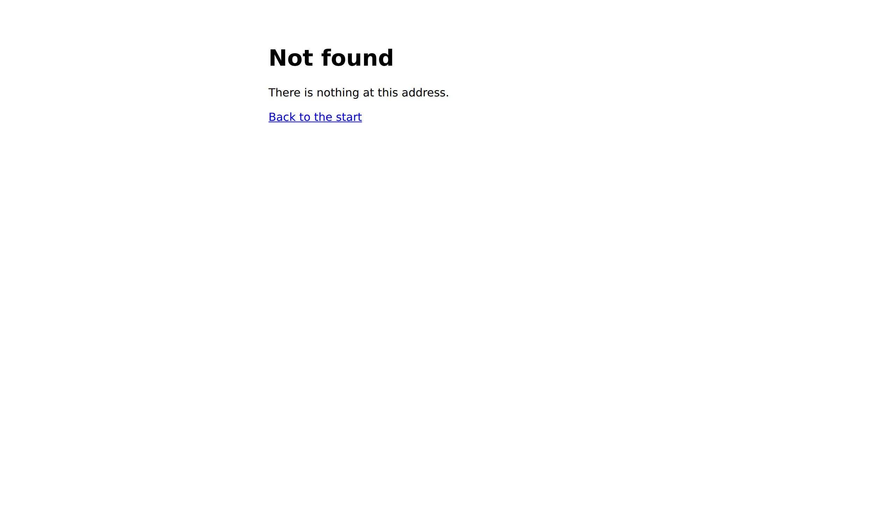

# The page that belongs to no surface

**Date:** 2026-10-06 · **Section:** §4 (the application shell) · **Lane:** `Loom daily build`
**Branch:** `framework-56-the-page-that-belongs-to-no-surface`, cut from `main` at `6686895`. Not stacked.
**Records:** [0232](../decisions/0232-the-shell-mounts-a-theme-and-registers-no-primitives.md). **None superseded.**

| before — `Loom marketing`, 5 October | after — this branch |
| --- | --- |
|  |  |

*Both at 1280×760, both real photographs of this application serving an address
it has no route for. The phone is [beside them](2026-10-06-framework-not-found-phone.png);
the shot list is committed next to this report.*

---

## What this run did, in plain language

**The one page of this product that looked like nothing was built now wears the
product's own theme.** It is the page a mistyped address, a stale external link
and a search result for a page that moved all land on, and until today it was
the only page of Loom served in the browser's defaults: Times New through
`system-ui`, an unstyled `h1`, a blue underlined `a`.

It now carries the house palette, the house type and the house spacing, and the
mark — so a reader who got there by accident can tell they are still on the same
site.

**The words did not change.** *Not found*, *There is nothing at this address.*,
*Back to the start* are the three sentences that were there before, byte for
byte. The filing was explicit that what followed from it was *styled like the
product*, **not** *says more*, and a test now goes red if a future run adds a
surface's name to this page. The only text added is the product's own.

## Why it was the thing to build

`Loom marketing` filed it on 5 October with a photograph, found on the way to
something else: the lane spent that day holding every address the marketing site
points at to an address this application serves, and the falsification for the
headline rule is to move a surface out from under its links and see what a
reader gets. What a reader gets was the picture on the left.

The migration this lane's brief leads with is **already done** — `apps/loom`
exists with its five route groups, `apps/portal` and `apps/docs` are retired,
and `apps/` holds one package. So the brief's next queue applies, and its first
item is open findings owned by this lane. This was the newest of them, it came
from another routine with evidence attached, and it is the only one squarely in
the shell: `not-found.tsx` is outside all four route groups and belongs to no
surface's owner.

## The decision worth your eye

**A theme registry and no primitive registry.** That is the question the filing
asked — *which registry is a decision about the shell rather than about any one
lane* — and 0232 answers it.

A surface composes registered primitives into a tree and lets the root primitive
mount the theme for it. The shell has no tree. It draws its own markup and
mounts the theme the way any host drawing its own frame does, through
`resolveTheme`, `themeStyle` and `themeGround` — the published path 0197 exists
for. So the shell borrows the product's **vocabulary of appearance** and
composes none of its **content**.

The alternative — build the page out of real bands, with
`createStarterPrimitiveRegistry` — is the stronger-looking version and is
rejected in the record rather than ignored. It makes the 404 a fifth surface
with composed content of its own, which this file's docblock has refused since
it was written. And [0018](../decisions/0018-the-portal-is-a-consumer-not-an-insider.md)
settled the general form for the portal three months ago: an application's
**chrome** is not a Loom tree. A 404 is the shell's chrome. It is the mildest
possible case — three static lines, nothing a tree could not hold — which is
exactly why it is where the line is worth drawing on principle rather than on
capability.

## The defect this run shipped and then caught

**The first build of this page put a second `<html>` inside Next's.** This is
the part worth your time, because every test passed while it was wrong.

A surface's layout mounts a theme as `<html style={themeStyle(theme)}>`, so that
is what this page did. A page outside every route group has no layout, and Next
supplies the document for it — so the production output was:

```
<body><div hidden=""><!--$--><!--/$--></div><html lang="en" style="--loom-…">
```

The variables reached the page **only through the HTML parser's error
recovery**, which merges a stray `<html>`'s attributes onto the real element. It
renders correctly. It is invalid markup arriving at the right answer by
accident.

**Six tests passed over it, including the one written to catch it.**
`expect(container.querySelector("html")).toBeNull()` was green with an `<html>`
in the component, because React 19 hoists a rendered `<html>`, `<head>` and
`<body>` onto the real document before any query runs. jsdom showed the outcome
the browser only reaches by mistake, so the guard confirmed the defect was
absent while it was present.

It was found by looking at the built HTML, and the **guard** was found to be
useless by the defect matrix — which planted *renders its own `<html>` again*,
expected red, and got green. That row is the reason anyone looked.

Both are fixed. The theme is serialised onto `:root`, which *is* the document
element, so the declarations are where they are actually true and the canvas
reaches the overscroll area a phone exposes past the end of a short page. The
guard now walks what `NotFound()` returns for intrinsic element types instead of
asking a rendered DOM: **a rendered tree is the wrong instrument for a question
about what was rendered.** Filed as a finding in its general form, because it
applies to any assertion about where a `<title>`, `<link>` or `<style>` was
placed.

## Three things I decided that nothing specified

**The house theme is named by the shell, not imported from the marketing site.**
`src/theme/library.ts` registers `minimal` / `minimal-sans` / `precise` in the
library rather than in a surface precisely so every host with an argumentless
registry can reach it, and the shell is such a host. Importing
`(marketing)/_lib` would make the application's own error page depend on a room
inside it. The cost is real and is in 0232's consequences: **if the front door
ever moves off the house theme, this page will not follow and nothing will say
so.** A test holding the shell to another lane's constant would fail inside that
lane's pull request the first time they re-themed, which is a worse trade — so
it is an open question below rather than a gate on somebody else's work.

**The stylesheet is held as text rather than as a `.css` file, and that was
forced before it was preferred.** A component that imports CSS cannot be
rendered under Vitest at all here: the import reaches `vite:css`, which loads
the application's PostCSS config, and `@tailwindcss/postcss` is not a plugin
Vite's PostCSS runner accepts. No component in this repository had met it,
because every stylesheet is imported by a layout and a layout is never rendered
— and the shell has no layout. Two things follow that a real stylesheet does not
give: the rules **cannot fail to be emitted**, which on the page that exists
because something already went wrong is worth more than the convenience; and
every `var(--loom-*)` in them is now held **mechanically** against the
properties the mounted theme carries, so a declaration naming a property nothing
supplies fails the build instead of silently dropping.

**The layout is one centred group rather than a bar and a body.** The first
version put the mark in a bar at the top and centred the message below it, which
is the shape a page *with content on it* has. Photographed, it was most of a
screen of white with two small things at opposite ends. This page is three short
lines; there is no body for a bar to sit above. Stacking them is also the
stronger version of the page's one job — a reader who arrived from a stale link
reads the mark and the message together.

## The defect matrix

Twelve defects planted, one at a time, each reverted before the next. **Twelve
went red — eleven on the first attempt, and the twelfth is the story above.**

| planted | |
| --- | --- |
| the page renders its own `<html>` again | **green, then 1 red** |
| the theme is a style attribute, not a `:root` rule | 2 red |
| a camelCase ground key reaches the CSS unconverted | 3 red |
| the stylesheet reads a property no theme supplies | 1 red |
| the shell selects a theme the registry does not hold | **3 files red** |
| the ground is dropped from the `:root` rule | 2 red |
| a literal colour is written into the stylesheet | 1 red |
| a spacing step is replaced by a literal length | 1 red |
| the reduced-motion stand-down is removed | 1 red |
| the mark loses an arm | 3 red |
| an arm drifts from the icon file by one unit | 1 red |
| the mark is given a fill of its own | 2 red |
| the mark stops being `aria-hidden` | 1 red |
| the page starts naming the four surfaces | 1 red |
| the way out is dropped, leaving a dead end | 1 red |
| the words change | 1 red |

Two rows need a sentence. **The unresolvable theme fails at module load**, so it
takes down three test *files* rather than failing a test — which my counting
harness read as zero before I looked at the output. It is caught, and loudly; the
number is just in a different column. **The `<html>` row is the one that matters
and is written up above.**

## Measured, not asserted

Counted on the built output rather than claimed:

| | `main` at `6686895` | this branch |
| --- | --- | --- |
| `<html>` elements in the served `_not-found.html` | **2** | **1** |
| the theme reaches the page by | parser error recovery | a `:root` rule in `<head>` |
| `--loom-*` properties mounted | 0 — nothing read them | **52** |
| what the stylesheet reads that the theme does not carry | — | **0**, checked mechanically |
| literal colours in the page's own markup | 1 (`#…` via the browser) | **0** |
| horizontal scroll at 390px | none | none (`scrollWidth 390 / innerWidth 390`) |

The three sentences on the page are unchanged, and the only text added is
*Loom*.

## Cross-lane diffs

**None.** Nothing under `(marketing)`, `(docs)`, `(lessons)`, `(portal)`,
`(demo)` or `(preview)` was opened for writing, and `src/` was not opened at all
— the package's test count is identical to `main`'s for that reason. Everything
written is `app/not-found.tsx`, the new `app/_lib/shell/`, their tests,
`FINDINGS.md`, `decisions/` and `reports/`.

The one thing I wanted to change in another lane's file and did not is the
stale sentence in `src/theme/font-packs.ts` — it says four surfaces link Geist
and two of them do. That file *is* in this lane, and it is filed rather than
corrected because nothing failed and the brief puts refinement inside finished
sections as reactive.

## Gate

`pnpm install && pnpm verify` on a deleted `dist` and `.next` — **exit 0**, with
the status written to a file as the last act of its own line and read in a
separate command.

| | `main` at `6686895` | this branch |
| --- | --- | --- |
| `@jam-overture/loom` | 183 files / 3,906 tests | 183 / 3,906 — **`src/` was not opened** |
| `@loom/app` | 384 / 6,917 | **PLACEHOLDER_APP** |
| `findings:check` | 1,013 | **1,016**, 0 malformed |
| `prerender:check` | — | **PLACEHOLDER_PRERENDER** |

**PLACEHOLDER_DELTA** No existing test was changed, weakened, skipped or
deleted, and no test file was removed. Four assertions in the tests I wrote were
corrected before anything was committed: the property-name sweep missed every
token with a digit in it (`--loom-scale-7`, `--loom-spacing-1`), and the three
assertions that read a rendered `<html>` were replaced with ones that read what
the component returns.

One warning in the build is pre-existing and belongs to `Loom lessons` — the NFT
trace on `next.config.ts` through `(lessons)/_lib/run.ts`. It is on `main` and
is untouched here.

## Findings

**Closed, one:** the 5 October entry from `Loom marketing`, naming this branch,
with its original status preserved below the closure and its reasoning
untouched — it is another lane's entry and only the status line is mine to
write.

**Filed, three**, all owned by this lane:

- **A component that imports a stylesheet cannot be rendered in a test at all.**
  Worked around rather than fixed, with the line that would close it written
  down. Not taken here because `vitest.config.ts` configures all four surfaces'
  suites and changing how they see CSS to serve one shell page is the wrong
  trade unattended.
- **A test that renders cannot see whether a page rendered a document**, in its
  general form: React's hoisting silently normalises `<html>`, `<head>`,
  `<body>`, `<title>`, `<link>` and `<style>` out of where they were written, so
  any assertion about *where* one was placed is one jsdom cannot make.
- **`font-packs.ts` says four surfaces link Geist and two of them do.** A stale
  premise in a comment, found by needing the answer.

## Open questions

**Nothing blocking.** Three for you, and a recommendation on each:

- **Should the shell follow the front door's theme, or hold the house theme?**
  Today both name `minimal` independently and nothing holds them together. My
  recommendation is to leave it: the divergence only matters if the marketing
  site re-themes permanently, and the alternative couples the shell to a room.
  Worth one word from you if you disagree.
- **Geist is now supplied three ways across five consumers** — two `<link>`s to
  one URL, two `geist` package imports under a different family name, and the
  shell's. My recommendation is that this is not worth four cross-lane edits
  today, and that it becomes worth it the first time a lane changes the weights.
- **Still open from earlier runs and unchanged by this one:** the `ModelEffort`
  scale borrowed from one vendor that three adapters will each have to map, and
  whether Grok is a third adapter at all. Both are yours to call and neither
  blocks anything.

`*.vercel.app` is denied from this sandbox (27 September finding, unchanged), so
both photographs are a local **production** build served by `pnpm shoot --serve`
rather than the preview.
