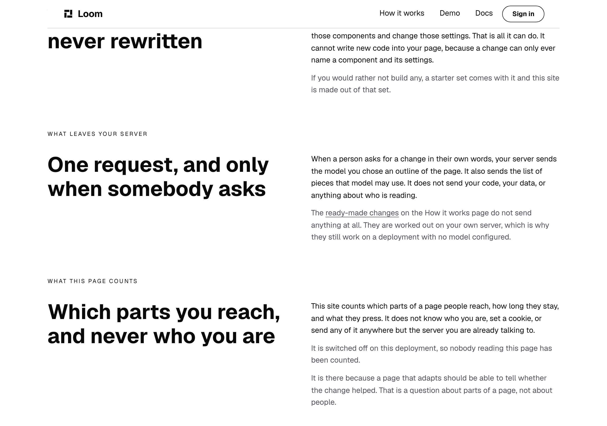
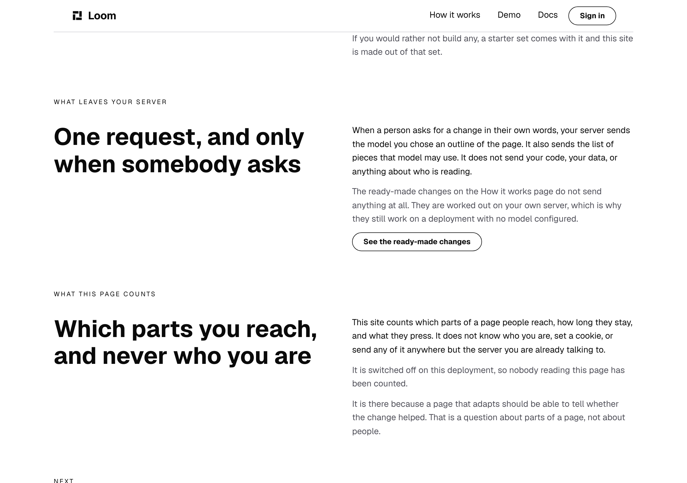
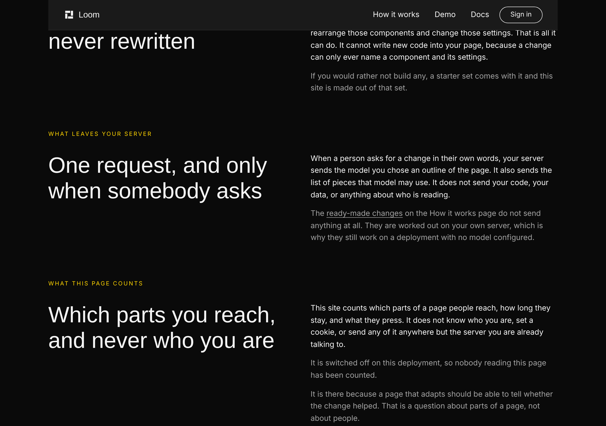
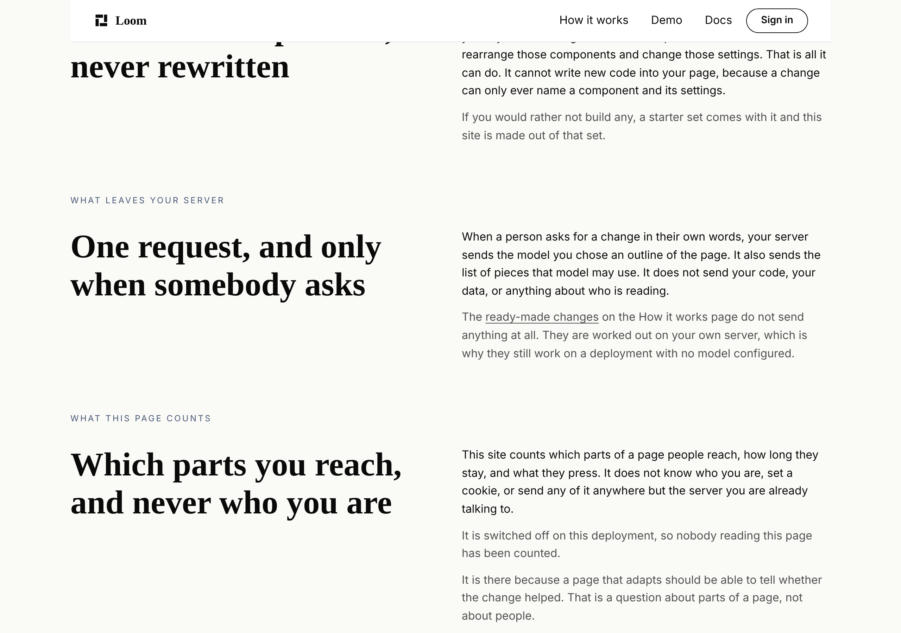
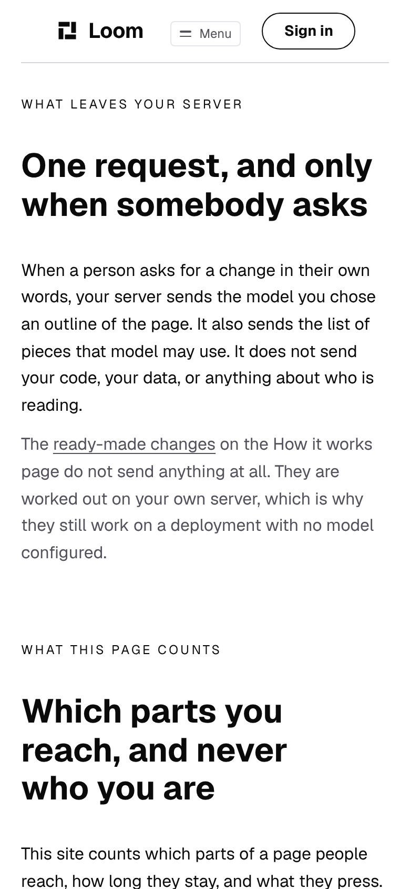

# 2026-10-06 — marketing: the link inside the sentence

`/what-you-run` has the only sentence on this site that names another page of
it. Until today it carried a button underneath repeating its own words. It now
carries the link in the sentence, and the words a reader would press are the
words that go there.

`/what-you-run`, 1280×900, scrolled to the band.

---

## What changed on the page

| | before | after |
| --- | --- | --- |
| the way there | a `loom.action` under the paragraph | the phrase *ready-made changes*, in it |
| what it measures | **242 × 35** | **155 × 21** |
| the words | *See the ready-made changes*, four of them, said twice on one band | none added, four removed |

Both pictures are the same band at the same width on a local production build.
Nothing else on the page moved.

**This is the 4 October finding closing.** That entry recorded the inline link
being built out of `loom.link`, photographed on all three palettes and taken
out again, for three reasons that were each correct about the primitive it was
asking: no underline until hover, so inside a sentence nothing says the words
can be pressed; `color: accent`, which on `minimal` is the same `#0a0a0a` as the
body text around it; and `display: inline-block`, which cannot break mid-phrase.
#517 landed `loom.inline-link`, which answers all three — `color: inherit`, an
underline at rest, and a real inline box. The entry is closed and the closing
names this branch.

The phrase is the paragraph's own muted grey on both, with a rule under it. That
is the primitive's design rather than this lane's: there is no `tone`, because
the right colour is the colour of the words either side of it and `inherit` is
the only thing that knows.

---

## The part that would have gone quietly wrong

**Every paragraph on this site was one text node until today.** So a rule
reading one text node at a time was reading one whole sentence at a time, and
nothing anywhere said that was an assumption rather than a fact.

A link in the middle of a paragraph makes it three children. The reading in
`words.ts` yesterday pushed one string per text node, so `voice.test.ts` would
have been handed three fragments where a reader sees one sentence:

| | words |
| --- | --- |
| the sentence a reader reads | **45** |
| *It is worth saying once, slowly and without any hurry at all, that* | 13 |
| *the ready-made changes* | 3 |
| *are worked out on your own server rather than… no model configured at all.* | 29 |

The ceiling is 30. Every fragment is inside it, the sentence is half as long
again as it, and **the sweep stays green**. The 30-word rule would simply have
stopped applying to any sentence with a link in it, starting with the first page
that used the primitive — not four weeks later, and with nothing to notice.

That is the same shape as the failure recorded at the top of `words.ts` itself:
copy a check cannot see reads exactly like copy with nothing wrong with it.

### The fix, and what it is careful about

`readerCopy` joins a maximal run of inline children back into the one string a
reader reads.

- **No separator.** The parts carry their own spaces, so a joiner inserting one
  puts a space in front of every comma that follows a link.
- **A block ends the run.** Two paragraphs in a band stay two strings; a control
  between them keeps its own `loom.action#text` label, which is a different
  register from a paragraph's and the module already said so.
- **A type nobody listed breaks a sentence rather than joining one.** That is the
  safe direction: the sentence is measured in halves, so it crosses the ceiling
  sooner and never later.
- **An inline element's own prose props are still read**, so a fourth inline type
  that carried one would not be copy nothing can see.

**On every tree this site served before today it changes nothing**, because a run
of one text node joins to itself. The site's reader strings are identical in
count and in content.

### `words.ts` had no test file

It is the oldest shared module in this route group and the first one every rule
about copy goes through — `voice.test.ts`, `naming.test.ts`, `facts.test.ts` and
`budget.test.ts` all ask it what a reader reads. Everything holding it was a
site-wide sweep, and a sweep over a site whose paragraphs are all one text node
**passes identically whether the reading joins them or not**. It has one now.

---

## What shipped

| file | what changed |
| --- | --- |
| `_lib/nodes.ts` | `inlineLink` and `proseParts` — the two constructors a split sentence needs |
| `_lib/words.ts` | `INLINE_TYPES`, and the inline run joined into one string |
| `_lib/words.test.ts` | **new** — 11 tests on the reading itself |
| `_lib/inline.test.ts` | **new** — 7 tests on where a phrase may be, over all 126 served states |
| `_lib/pages/what-you-run.ts` | the link in the sentence, the control gone |

Nothing outside `app/(marketing)/`, `FINDINGS.md` and `reports/`. **`src/` was not
opened**, which is why the package's figures are identical to `main`'s.

### The three rules about placement

Held over every state the site can be served in, because a rule checked on
arrival is not a rule about the site.

- **A phrase lives in a paragraph**, and nowhere else on this site may hold one.
  Outside a sentence the primitive borrows the colour of whatever block it landed
  in, underlined, at that block's font size, with no words either side to say
  what it is part of.
- **A phrase is part of its sentence and never the whole of it**, measured against
  the paragraph rather than against a number. A link that is the entire paragraph
  is a control built out of the wrong primitive.
- **A paragraph holds no `loom.link` and no `loom.action`.** Both were tried on
  this site before the primitive existed. Now that the right one is in the
  library, reaching for either of the two wrong ones is what goes red.

### The copy

**Four words fewer, and none added.** Measured as the sum over the three routes
in one state: **2,416 → 2,412**. The four are the button's label. *See the
ready-made changes* was a label for a button, not a phrase the sentence contains,
so nothing moved into the link.

---

## Every rule was falsified

Ten planted, ten red, each by putting back the thing it exists to catch.

| what was put back | what failed |
| --- | --- |
| the reading goes back to one string per text node | 7, including *still measures a sentence that is over the ceiling and split under it* |
| the run is joined with a space | 5, including the comma rule and the real page's sentence |
| every child counts as inline, so the run crosses a block | 10, including `naming.test.ts`'s *offers the way to every page it names* |
| `loom.inline-link` left off the inline list | 7 |
| an inline element's prose props dropped with its text | 1 |
| the phrase put beside the paragraph instead of inside it | 2 — *is only ever inside a paragraph* |
| the button put back beside the sentence | 2 — the band's own two rules |
| the link swallows the whole paragraph | 2 |
| `loom.link` used inside the sentence, the way it was before #517 | 4 — *is not a nav item and not a button* |
| the band's anchor dropped, so the link lands on the page | 2, one of them `naming.test.ts`'s |

The last row is the one that was already there: the link carries the band's own
anchor rather than the page's address, so the paragraph goes red the day the band
moves again instead of going quietly wrong. That rule is `naming.ts`'s, from
30 September, and this change keeps it rather than replacing it.

**The seventh row was planted wrong the first time** and the first result is not
in the table. The patch matched the closing brace of the band above, so the button
went into *What you bring* and turned 21 tests red — red, but not for the reason
the row claims. Re-planted against the right band it is two, and both are the two
this change added.

---

## Gate

`pnpm install && pnpm verify` — **exit 0**, on a deleted `dist` and `.next`,
status written to a file as the last thing on its own line and read in a separate
command.

| | `main` at `6686895` | this branch |
| --- | --- | --- |
| `@jam-overture/loom` | 183 files / 3,906 | **183 / 3,906** — `src/` untouched |
| `@loom/app` | 384 / 6,917 | **386 / 6,935**, 0 skipped |
| findings | 1,013 | **1,014**, 0 malformed |
| `prerender:check` | 126 pages, 1,539 junctions | 126 pages, **1,539 junctions, 0 run together** |
| `pnpm shoot` | — | `1280 / 1280`, `390 / 390` — no overflow |

**+18 tests in 2 new files. Nothing weakened, skipped or deleted, and no existing
assertion changed.**

The junction row is worth a second look: splitting a sentence into three children
is exactly what would produce a *run together* junction, and the build's own
reader says there are none. The spaces are the caller's, which is why
`proseParts` does not insert any.

### The first full run was red

`tsc` rejected one line of my own test file — a helper typed
`Record<string, unknown>` where `buildElement` wants `JsonObject`. **Eleven tests
were green on top of it**, because Vitest does not typecheck. It is the second
time in two days a lane has reported this exact shape, and it is the reason the
gate is `build && typecheck && test` rather than `test`. Fixed in its own commit
and verify re-run from clean; the figures above are that run's.

No decision record. This sets no prop, adds no primitive, and touches neither
the tree schema, the delta model nor an `Accepted` record.

At 390 the phrase is 155 × 21 on one line and the paragraph does not reflow
around it. `scrollWidth 390 / innerWidth 390`.

---

## Findings

**Closed, one:** the 4 October entry, *a link inside a sentence is the one kind of
link this library cannot draw*. Closed by the lane that filed it rather than by
its owner, because the primitive landing is half the remedy and the page it was
filed about using it is the other half.

**Filed, one**, for `Loom primitives`: *nothing in the library says a primitive
renders inside a sentence.* Two halves, one missing declaration.

- The register has to know which types sit inside a sentence and nothing can tell
  it, so `words.ts` carries a list of three type strings. `PrimitiveRole` has
  exactly one member, and 0114's own reasoning is that a consumer should ask the
  registry a categorical question rather than keep a list of names. A second role
  would let this read the registry, and would let the next surface that composes a
  sentence read it too.
- The primitive's own docblock says a paragraph is the only place it is allowed to
  be. Nothing in `src/` refuses anything else. `inline.test.ts` holds it for this
  route group in 126 states; that is one surface, and the rule is the library's.

Neither is this lane's: a role is a member of a closed set in `src/`, and a
placement refusal is the registry's.

---

## Open questions

One, and it is the standing one, unchanged for a fourth run.

**The word ceiling.** 3,300 was measured against a ten-page site that is now
three pages. This change takes four words off rather than adding any, so it is
not pressing against it — but it is the question that decides whether the next
piece of work on this site can be **a page** rather than another rule, and three
runs in a row have now added no copy partly because there is not much room to. It
is one line either way, and a standing limit is a fine answer.
