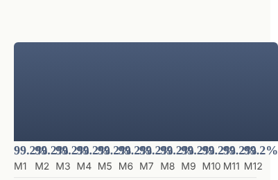
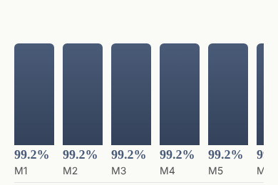





# 2026-10-06 — three things a page is given rather than told

A hundred and three primitives, and **two of them could be handed data**.

The binding seam ([0058](../decisions/0058-a-binding-is-a-question-the-tree-asks-answered-before-the-walk.md))
has been built and published since 15 August. `loom.feed` read a list,
`loom.tally` read a figure, and the authoring half stopped there — while
`loom.media`'s own docblock went on arguing that a binding was impossible
*because "Loom has no resolution layer"*, seven weeks after the resolution layer
shipped.

This run is the rule for which content models get to be read, the three that
pass it, and the half of 0206 this lane has owed since 30 September.

---

## What shipped

| | |
| --- | --- |
| **[0233](../decisions/0233-a-bound-twin-is-earned-by-a-system-of-record-and-a-row-shape-the-primitive-can-declare.md)** | *a bound twin is earned by a system of record and a row shape the primitive can declare* — three clauses, and it refuses more than it admits |
| **`loom.plate`** | a picture, and the alt text that came with it |
| **`loom.trend`** | a series, plotted |
| **`loom.voices`** | testimonials, from where they were collected |
| **`unshown` on all five** | the 30 September finding, closed. Nothing in the library declared it before today |
| `quote-content.ts` | the quote card, shared, so the authored and the bound one cannot drift |
| 3 bands | `hero-shot`, `metrics-trend`, `testimonials-collected` |
| `bound.test.ts` | 47 tests, both palettes — and a helper that had been asserting nothing |
| 4 findings | three against myself |

`pnpm verify` is green: **3,939 root tests, 6,917 app tests, 126 prerendered
pages.** **106 primitives, 57 bands, reach 95 of 106.**

---

## One — which primitives, and why these three

The brief's standing question, and this run did not choose from a gap list.

**`FINDINGS.md` before choosing work** turned up this lane's own entry from
yesterday: *seven of the eleven primitives no band can reach are blocked on one
thing, and it is an image*. Four consecutive reports had led with it. Its
recommendation was **a binding**, and it filed that as *"neither of them this
lane's to take."*

That was wrong, and finding out how it was wrong is this run.

**It was this lane's to take.** Making a primitive read a binding is `reads:` on
the definition, a `binding` prop, and `loom.data[name]` in the component. Three
things, all of them in `src/primitives/`, with two worked precedents sitting
beside them. Nothing was waiting on anybody.

**And it closes one of the seven, not seven** — see §6, because that correction
is the more useful half.

What the attempt turned up instead is that the library had an unexamined
*tier*: 101 primitives that can only be told things, and no written rule about
which of them should be able to be given things instead. Both existing twins had
argued for their own existence from scratch, and `loom.tally`'s argument is
general and was written as though it were local. Turning it into a rule, and
then running the rule over the library, is what produced the three.

### What the rule refuses, which is the part that matters

A bound twin for every container would double the vocabulary and put every
interpretation request past the [0014](../decisions/0014-the-reply-schema-must-fit-a-grammar-budget.md)
grammar budget. So 0233's three clauses are a filter, and the ones they reject
are named in the record:

- **A feature tile.** *"Ships with audit logs"* is the page's argument about the
  product, not a row anywhere. Fails clause one.
- **A FAQ.** Same.
- **A pricing tier** — the interesting near-miss. The *price* is in the billing
  system; the plan's name, its ordering and which perks it lists are editorial.
  The bound shape would be one field read and five authored, which is a
  `loom.tier` with a `loom.tally` beside it and is already expressible.
- **A general bound table**, which is the most wanted thing on the list and
  fails clause **two**. Rows from a query with arbitrary columns need either
  headings from the source — a database writing the page's words — or a
  `columns: string[]` prop, which is prose in an array no `configure` can
  address. Both readings are defensible, `docs/primitive-granularity.md` says
  decompose when they are, and decomposing is blocked: a container receives its
  children as one rendered node and cannot read a prop off one
  ([0008](../decisions/0008-the-renderer-is-a-total-pure-projection.md)). **That
  is the same wall [0176](../decisions/0176-a-control-may-be-answerable-to-another-control-and-they-agree-through-the-dom.md)
  hit for tabs and the radio group**, and it is recorded as `ARCHITECTURAL`
  rather than worked around.

The three that pass are the three a marketing page stands on, and one of them
passes harder than anything else in the library — see §3.

---

## Two — which Hermes fields became nodes, and which stayed props

The brief asks this directly. The honest answer for this run is that **none of
the three took a Hermes field, and the reason is the finding.**

Hermes had five bound blocks; `loom.feed` took four of them, because all four
bind *a list*. Hermes' image field is the one `loom.media`'s docblock names —
*"this is also where a Hermes binding would have been"* — and Hermes had nothing
resembling a bound chart or a bound testimonial wall, because Hermes' users are
creators rather than companies with a reviews table.

So the split that matters here is a different one, and it is the same question
asked of an *answer* rather than of a Hermes schema: **which fields belong to
the row, and which belong to the page.**

| primitive | the row carries | the node carries | why the line is there |
| --- | --- | --- | --- |
| `loom.plate` | `src`, **`alt`**, `caption` | `binding`, `decorative`, `aspect`, `fit`, `corners` | §4 |
| `loom.trend` | `label`, `value` | `binding`, `max`, `plot`, `prefix`, `suffix` | the `%` is how *this band* puts it; a source baking it in is unusable in two places — `loom.tally`'s rule |
| `loom.voices` | `quote`, `author`, `role`, `avatar` | `binding`, `columns`, `density`, `limit` | everything the row carries is somebody's words about you; everything the node carries is how many of them fit on a line |

**Nothing became a node**, and that is 0052 working rather than being set aside.
`loom.feed`'s header already settled why, and the three inherit it: no `move`
addresses the third review, no `configure` re-words it, nobody is attributed for
it, and its inverse is not a change to this page. The delta model has nothing to
say about a row from a database, so nodes would buy none of what nodes are for —
and the tree would become a cache of somebody's database, which is what 0058
refused when it refused to put answers in props.

**The prop that looks most like a delta in disguise, and is not.**
`loom.voices`' `limit`. The granularity document's sharper question is *does
changing this prop change the set of nodes?* — and under every value the answer
is no, because none of these rows is a node under any configuration. A `limit`
on an authored band would be `remove` smuggled into a prop bag and would be
refused. Here the alternative is a page that draws nine hundred reviews, which is
not a wall of testimonials but a database dump with a quotation mark on it.

---

## Three — `loom.voices` is the one that is not a convenience

The other two twins make an authored band easier to keep current. This one makes
a band **possible that was not**, and the evidence was already in the library,
in `loom.quote`'s own prop documentation:

> A catalogue band needs it. **A starting composition may not ship a fabricated
> endorsement attributed to a person who does not exist**, so `testimonials`
> attributes its quotes to roles — *Head of Platform*, *Founder* — and a role has
> no initials.

That is the `anonymous` prop explaining itself, and it is a confession about the
part. A testimonial is the one kind of content on a marketing page that **nobody
may author**: praise in a tree is praise somebody wrote on a customer's behalf,
and a model writing it is a model inventing it. Both existing designs of this
band ship real-looking quotes attributed to nobody, because that is the most
honest thing available when the words have to come from a file.

Every real testimonial was collected with consent, somewhere. `loom.voices` is
the one design of this part whose social proof is true by construction rather
than by somebody having checked — and re-wording a customer is not discouraged,
it is **unreachable**, because the words are not in the tree.

It is also the library's first primitive that is **a container and a leaf at
once**: it arranges n cards and holds no child nodes, because the cards are rows.
[0054](../decisions/0054-a-container-is-its-childs-name-plus-the-arrangement.md)
names a container after its child's type plus the arrangement and there is no
child type to name this after, so 0233 works the exception and bounds it to
exactly this case.

---

## Four — the alt text comes with the picture, and that is `loom.plate`'s whole design

`loom.media` requires `alt` as a prop, and its reasoning is one of the best
sentences in the library: *"the model usually remembers alt text" is not an
accessibility strategy.*

Carrying that forward literally would have put one `alt` prop over whatever
picture a source happens to return today — a description that is wrong the
moment the answer changes, and worse than none, because nothing can tell that it
has gone stale.

So **`alt` is a required field of the row**, and a row without one does not read.
The consequence is the point:

> **This primitive cannot put an undescribed image on a page.**

A media library that stores alt text beside the file gets a picture. One that
does not gets a designed placeholder, a `data-unshown` diagnostic saying one row
of one arrived and none was drawn, and an author who finds out immediately
instead of never. It is asserted rather than claimed —
*refuses a row with no alt text rather than drawing an undescribed picture*.

`decorative` stays a prop, and the split is not arbitrary: whether an image needs
describing is a fact about **the role it plays on this page**, not about the
file. The same photograph is decoration behind a headline and content in a
product listing. A tree saying *nothing here needs describing* stays true when
the answer changes.

### And the frame, which is why this primitive has one where its twin has none

An authored image is always there, so it is its own box. A bound one is four
pages, so the frame is drawn in every state at the declared aspect — picture,
placeholder and failure line all in the same box. **Connecting a source changes
what is in the frame and never where the frame is**, which is asserted
(`holds the declared aspect whether or not a picture arrived`) and is what lets
`hero-shot` exist at all: a hero whose media region reflowed the moment somebody
connected a media library would be a hero nobody could lay out.

---

## Five — what each of them could not show, which is 0206's other half

The 30 September entry from `Loom daily build` closed this lane's 22 September
filing and handed back the half that was ours:

> `readAnswer` in `loom.feed.ts` already computes this… **Declare the function
> the component calls**, which is the whole construction the record argues for:
> written that way the count in the log and the sentence on the page cannot
> disagree.

Done, on **all five** bound primitives — and each one declares `readAnswer`
itself, handed the same two objects the component gets. Before today, nothing in
the starter library declared `unshown` at all; `unshownBy("loom.feed")` answered
`undefined`.

What it buys is the class of failure that is **invisible from both ends**. Every
case below resolves cleanly. There is no error, no unavailable source, and
nothing a reader would read as broken:

| what happened | what the reader gets | what the author now gets |
| --- | --- | --- |
| a feed's source renamed a column | *"Some entries could not be shown."*, countless | `12 given, 1 shown` |
| a reviews table renamed `author` | a wall that is simply **shorter than it was** | `5 given, 4 shown` |
| a figure arrived in the wrong shape | *Unavailable*, at display size — indistinguishable from a source being down | `1 given, 0 shown` |
| a media row with an empty `alt` column | a placeholder | `1 given, 0 shown` |

The second row is the sharpest and it is why this was worth doing in the same
run as the primitives: **a bound band that quietly gets shorter has no symptom
at all.** Nothing on the page says so and nobody is looking.

Taken end to end by the specimen harness, which prints what the walk reported:

```
node n_25 was answered 12 rows under "series" and "loom.trend" showed 10 of them,
  so the rest arrived and were not drawn
node n_83 was answered 5 rows under "voices" and "loom.voices" showed 4 of them,
  so the rest arrived and were not drawn
node n_106 was answered 1 row under "image" and "loom.plate" showed 0 of them,
  so the rest arrived and were not drawn
```

**The count that is not reported is the one worth naming.** `loom.voices` has a
cap, and `shown` is the rows that **read**, never the rows the cap drew. A wall
showing six of forty good reviews is working exactly as asked, and reporting
thirty-four as unshown would send an author hunting a defect that does not
exist. It is asserted by name — *counts the reviews a wall could not read, and
not the ones its cap left out* — and the declaration passes `"all"` rather than
the node's own `limit` so that a future edit cannot quietly make it otherwise.

---

## Six — two things this run got wrong, both filed against myself

### The recommendation that named the wrong lane

Covered in §1. Yesterday's entry recommended a binding and filed it as another
lane's. It was this lane's, and it closes **one** of the seven rather than seven
— a binding is read by a primitive that *declares* `reads`, so reaching
`loom.embed`, `loom.lightbox`, `loom.carousel`, `loom.overlay`, `loom.pin` and
`loom.before-after` means six more twins, and none of the six passes 0233's first
clause. An embedded document, a tile that opens and a draggable wipe are
*arrangements of* a picture, not records a deployment holds.

**So the top line of four consecutive reports moves by one and stays.** The other
six still want an asset the framework owns, which is still not this lane's.

### Two palette assertions that had been comparing one character to itself

`bound.test.ts` held this, twice:

```ts
const bodyOf = (markup: string): string => markup.slice(markup.indexOf("<main"))
```

**`loom.page` renders a `div`.** There is no `<main>` in that output, `indexOf`
returns `-1`, and `slice(-1)` is `">"`. So *renders every state identically under
both starter palettes, with no colour of its own* was asserting that `">"` equals
`">"` and that `">"` contains no hex — for every state of `loom.feed` and
`loom.tally`, green since the day it was written.

It was found by writing a third copy for three new primitives and then asking it
to assert something **positive**. `toContain("loom-scroll-x")` is the only kind
of assertion that could have failed, and it did.

The general shape is filed: **a helper that narrows a subject before asserting on
it is a silent `true` whenever the narrowing finds nothing**, and this library's
negative assertions are mostly *X is absent from the narrowed thing* — because
*no literal colour below the root* and *no inline style* are the two standing
rules. `grep -n 'indexOf(' src/primitives/*.test.ts` is a five-second audit. I
have not run it over the other files and the finding says so.

---

## Seven — the one rule `loom.trend` adds, and the photograph that forced it

`loom.trend` emits `loom.stat-chart`'s markup and changes nothing in
`stylesheet.ts`, so the two cannot come to disagree about what a bar's height
means. It **adds** one rule, and the exception generalises.

`.loom-stat-chart` sets `grid-auto-columns: minmax(0, 1fr)`. That is right for
the primitive it was written for: an author writes four or six children and looks
at the result. A bound chart's column count is the **database's**.

Twelve months on a 390-pixel page:



*A twelve-point `loom.trend` at 390px under the shared rule, photographed at 1x
and cropped to the plot. The frame is 401 pixels wide because the document was.*

Nineteen pixels a column, the figures overlapping, and the last one hanging off
the right of the document — `scrollWidth 401 / innerWidth 390`. **Caught by the
specimen harness's own overflow check**, not by any test, which is the second
time in this run that a picture found what a suite did not.



*The same series, same width, after. The sixth column peeking at the edge is the
scroll region; the frame is 390 pixels because the document now is.*

Fixed with a floor under a column and the library's existing `loom-scroll-x`
region — the focus stop, the snap, the contained overscroll and the thin
scrollbar are all `loom.table`'s and `loom.comparison-table`'s, and none of it is
new. A year of months is a chart you swipe.

The rule 0233 now states: **share what decides the meaning, add only what the
difference in situation forces.**

`loom.stat-chart` has the same latent behaviour and is deliberately left alone —
nobody writes twelve authored stats, and changing a shared rule changes every
chart in every lane's committed screenshots. Filed, with the argument for moving
the floor up if a second taker appears.

---

## Eight — the cross-lane edits, and the one that is not a number

Adding three primitives turned the app suite red in four places, which is the
2 October hazard firing for the third run running.

| | what | how |
| --- | --- | --- |
| `reference.generated.json` | three new published exports | regenerated with `pnpm --filter @loom/app docs:api` |
| `counts.test.ts` | two literals | `one hundred and six`, `fifty-seven` |
| `lessons/22, 23, 24, 30, 31` | transcripts printing `103` | **numbers only** |
| `lessons/29` | the sweep's rows | **numbers only**, under a mark that named this change |
| `lessons/33` | — | **not only a number.** Below |

**Every lesson touched was covered by its own `moves:` mark**, which is the
convention working: lesson 29's reads *"when a primitive in `src/primitives/`
gains a prop that nothing reads unless an answer arrives… a new member of that
set is news rather than drift"*, and all three new primitives are exactly that.
Its counts went 5 primitives / 8 props → 8 / 16, and the ordinals in its prose
moved with them (*seven of the eight* → *fifteen of the sixteen*). **No argument
in it was rewritten.**

**Lesson 33 is the one to look at.** Its mark predicted this run by name —
*"when `Loom primitives` gives `loom.feed` the `unshown` declaration 0206
names"* — and said **re-run G and paste in what it prints**. What it prints is:

```
what the registry answers for loom.feed: (props_,data)=>{const name=bindingNameOf(props_);…
```

`String(fn)` on a declaration is the **whole minified function body**. Pasting
that in would have put a copy of `loom.feed`'s bookkeeping in a lesson
transcript — a second copy of exactly the kind lesson 28 costs, going red on
every future edit to a primitive that lesson is not about.

So one word of that lane's exercise changed: `String(...)` → `typeof`. It
preserves the teaching contrast exactly — the line still moves from `undefined`
to something, and `undefined` is still *nobody has said* — and keeps the
transcript a short stable string. **That is an edit to another lane's code, not a
number**, and it is filed for `Loom lessons` with the reasoning and the three
paragraphs underneath it that were rewritten to match. Reverting the `typeof` is
one character; if that lane would rather have the function, the transcript needs
a different shape and that is their call.

---

## Nine — what the library still cannot express

1. **An image the catalogue may name.** Still first, now with the correction on
   it: **six of the seven**, not seven, and `loom.plate` took the one. The other
   six want an asset the framework owns. Not this lane's.
2. **A general bound table.** New, and it is the most-wanted thing 0233 refuses:
   rows from a query with columns nobody declared. Blocked by 0008, the same wall
   as tabs and the radio group. `ARCHITECTURAL`.
3. **A control whose word comes from the tree.** Unchanged, and `#528` appears to
   be landing it — which would close `loom.menu`, the one unreached primitive
   waiting on a word rather than on a band.
4. **A panel that does not exist before hydration.** Architectural, filed.
5. **One of *n* children chosen, where the labels are in the children.**
   Unchanged.
6. **A fixed decoration with no floor.** Still the maintainer's call.
7. **A page that is not a landing page.** Unchanged, and still the one thing
   reach cannot close by writing another band.

**Reach is 95 of 106.** The eleven unreached are the same eleven as yesterday:
`loom.plate`, `loom.trend` and `loom.voices` all arrive reached, through the
three bands.

---

## The pictures

Two palettes, two widths. **§2 of the sheet is the pair to read at size** — the
same primitive answered, answered short, answered with nothing and not answered
at all, in one frame, which is the thing no bound primitive in this library could
be photographed doing before `answers` existed.

| | editorial | bold |
| --- | --- | --- |
| wide |  |  |
| phone |  |  |

```
…-editorial-wide    1280x4600@2x  scrollWidth 1280 / innerWidth 1280
…-editorial-phone    390x844@2x   scrollWidth  390 / innerWidth  390
…-bold-wide         1280x4600@2x  scrollWidth 1280 / innerWidth 1280
…-bold-phone         390x844@2x   scrollWidth  390 / innerWidth  390
```

**One state in that sheet has no photograph and it is not an oversight.**
`loom.plate` answered needs a file at an `http(s)` address; `mediaUrlSchema`
refuses `data:` for reasons this run does not argue with, and a photograph that
depended on a network would differ on a bad afternoon. So the plate is shot in
the three states it can be, and the fourth is the standing blocker §6 says this
run moves by one and does not close. That absence is the honest picture of where
the library is.
