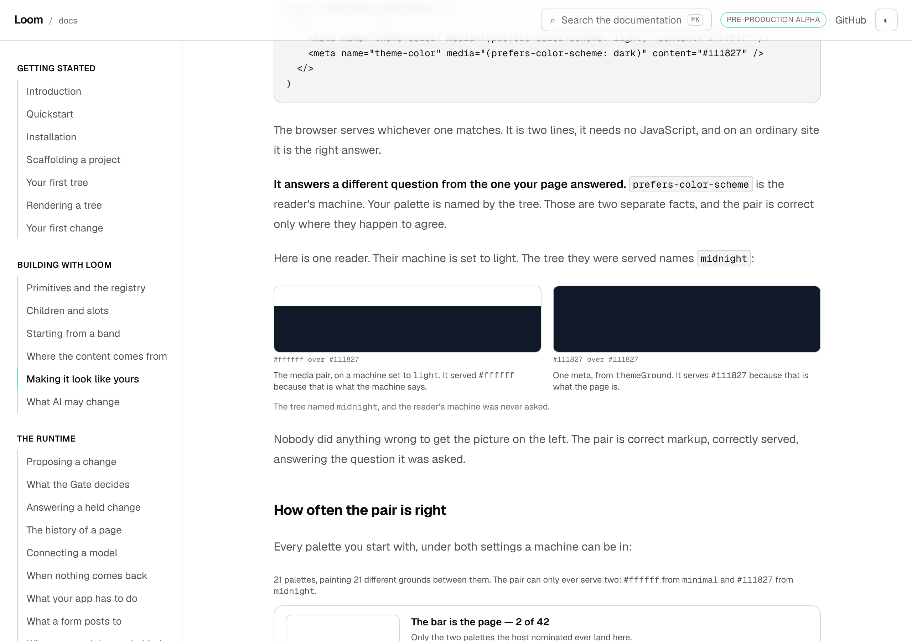
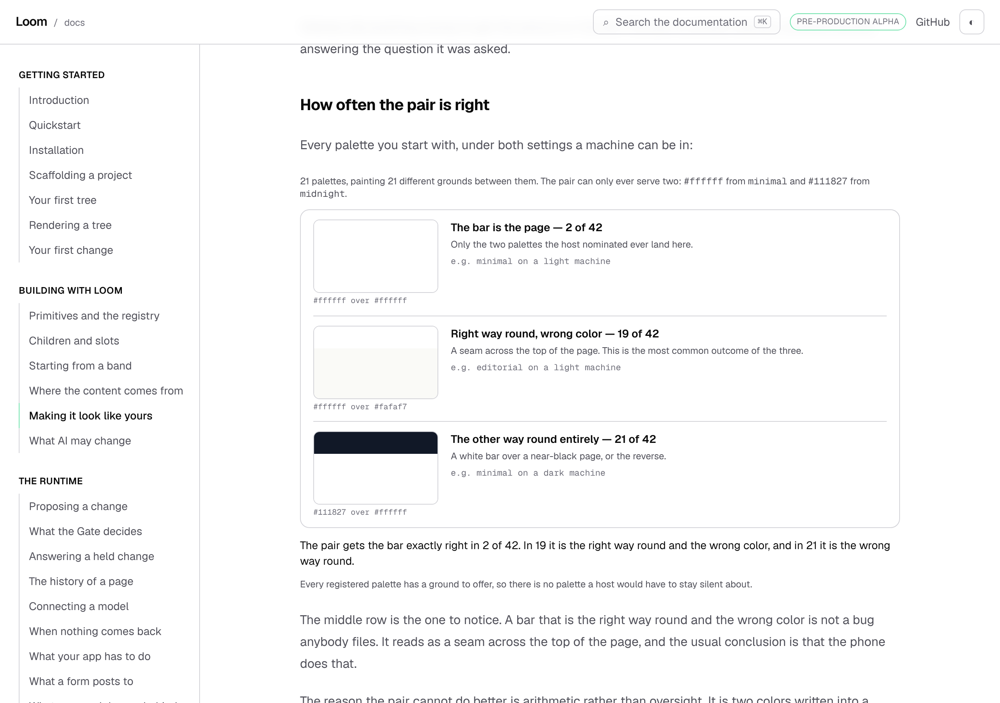
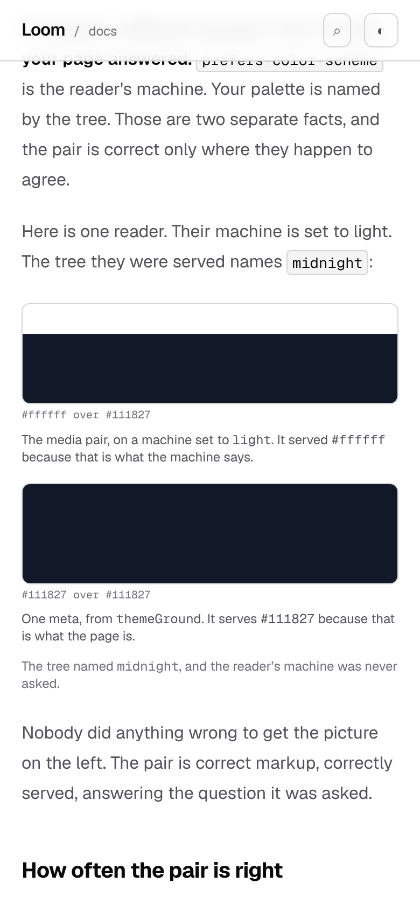
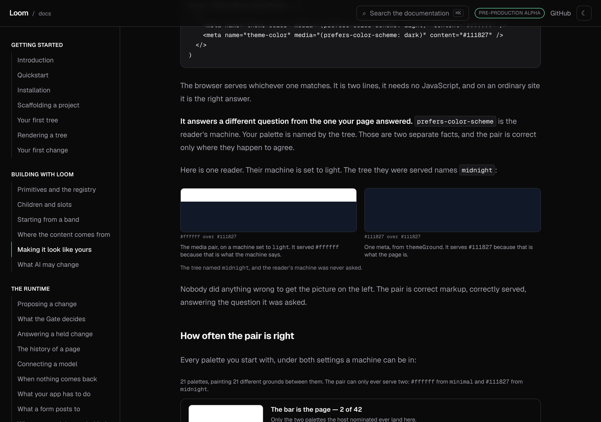

# 7 October 2026 — the bar above the page, and the one case the page had in the wrong list

**Routine:** `Loom docs` · **Branch:** `docs-48-the-bar-above-the-page` ·
**Section:** §4c

No open pull request from this lane at the start of the run, so this is a fresh
branch off `main` at `41c65e9`. No maintainer comments were outstanding on any
pull request of this lane's. The work is the first item on the 6 October
report's *what I would write next*, carried there from the 4 and 5 October
reports as well: **a worked `<meta name="theme-color">`, which the theming page
names as a case and does not show.**

## What it turned into, which is why it was worth three carries

The job was to work an example the page already named. Going to write it turned
up that the page had the case **in the wrong list, saying the opposite of what
is true about it** — and that the site it is published on had the defect the
example is about.

*Making it look like yours* draws a distinction it cares about:

> - **`themeGround(theme)` hands you three colors.** They are what you *paint*
>   the frame with.
> - **`paletteScheme(theme.palette)` hands you one word.** It is what you
>   *choose* between two things of your own with.

It then listed three examples of the second kind, under a heading giving what
they have in common: *"they take the word, and there is nowhere to put a hex."*
The third was `<meta name="theme-color">`.

**Its `content` is a CSS color. There is nowhere in it to put a word.** It is a
`themeGround` case and always was. The same clause sat in `_lib/scheme.ts`'s
docblock, which is where the bullet came from.

## Why that is more than a corrected bullet

Moving one item would have fixed the categorisation and left the interesting
half unsaid, because the meta has a **second form** that genuinely does deal in
light and dark, and it is the form every article on the subject recommends:

```html
<meta name="theme-color" media="(prefers-color-scheme: light)" content="#ffffff">
<meta name="theme-color" media="(prefers-color-scheme: dark)"  content="#111827">
```

That form is wrong for a Loom host, and the reason is the sentence the section
now turns on: **`prefers-color-scheme` is the reader's machine, and a Loom
page's palette is named by the tree.** Two different facts. The pair is right
only where they coincide.

How often they coincide is measurable, and `_lib/browser-bar.ts` measures it
against the registry a reader actually has:

| | |
| --- | --- |
| palettes a reader starts with | **21** |
| different grounds they paint between them | **21** |
| colors the media pair can ever serve | **2** |
| tree-and-machine pairings | **42** |
| the bar is exactly the page | **2** |
| right way round, wrong color | **19** |
| the other way round entirely | **21** |

**The middle row is the one worth the section.** A bar that is the right way
round and a different off-white is not a bug anybody files — it reads as a seam
across the top of the page, and the usual conclusion is that the phone does
that. It is also the most common of the three outcomes.

The 2 is not a coincidence and the page says so: a nominated color is one
palette's canvas, every canvas in the registry is different, so each half of the
pair is exact for exactly one tree under exactly one machine. There is no third.



## The site had the defect the example is about

This site has had a dark theme for as long as it has had a toggle, and has never
emitted a `theme-color`. A reader on a phone who pressed Dark got a `#0a0a0a`
page under a white address bar. The toggle worked everywhere except the one part
of the screen that is not the page.

It now follows the recipe the page publishes:

- the layout renders `<meta name="theme-color" content={SITE_BAR.light} />`,
  which is what the server can know and what a reader with no JavaScript should
  keep;
- `ThemeScript` overwrites it **before paint**, inside the same `try` and
  alongside `data-theme`, so a stored dark preference never shows as a corrected
  bar;
- `ThemeToggle`'s `paint` moves it, which also covers the sunset case — a
  machine changing its mind under `system` goes through the same function.

Measured on this branch's production build:

```
docs html files:                 46
docs html with the meta:         46
non-docs html with the meta:      0
total prerendered html:         126
```

Every page of this route group, nothing outside it. The other four surfaces
emit none, which is filed for their owners.

## Two things I got wrong first, both found by looking at the photograph

**The swatch was legible exactly where the defect was.** The first version drew
each hex *inside* its own band in the other band's color. That works when the
two colors differ and produces nothing when they do not — so the `exact` row
came out as an empty white box and `off-by-a-shade` as a ghost. Both were
photographed before they were noticed. The hexes are printed underneath now and
the bands are pure color.

**And it drew a seam where the browser draws none.** The bands had a divider
between them, which puts a line on the screen in the one case whose entire
meaning is that there is no line. A reader would have been looking at a border
of mine and reading it as the thing being described. There is one outline around
the pair now and nothing between.



Row one is one uniform block, which is correct. Row two is where the real seam
is visible and subtle, which is the argument. Row three needs no explaining.

**A third, found the same way:** the prose said *"the picture on the left"*, and
at 390 pixels the two stack. Nothing on this site checks for a reference to a
position that a narrower screen does not have. Fixed by naming the thing
instead of its position; not filed, because one instance is not yet a class and
the sweep that would find them is a worse idea than the habit.



## The first dark screenshot this lane has taken

Four reports have carried the line that these pictures are light, because the
harness photographs an address and the theme lives in `localStorage`. **`start`
closes that**, and has since 0195:

```json
{ "path": "/docs/building-with-loom/theming", "start": { "storage": { "loom-docs-theme": "dark" } } }
```



Worth a line because the limitation was being carried forward rather than
retried, and the mechanism that ends it was added three weeks ago.

## Decisions taken that were not specified

**No decision record.** Nothing here touches the tree schema, the delta model or
an `Accepted` record. `git diff origin/main -- src/ tools/ decisions/` is empty,
and so is the same diff against every other route group. **No cross-lane diff at
all this run** — not even `mdx-components.tsx`, because the page imports its own
two components directly the way the other theming blocks do.

**`minimal` and `midnight` as the nominated pair**, which is the same two
`mounting.ts` stages its contrast demonstration out of. A host picking any other
two gets the same shape of answer with two different rows exempted, and the
table says which two were nominated rather than leaving it implied.

**The site's bar colors are transcribed, not resolved**, and that is the one
place this site cannot do what it tells a reader to do. Its chrome is
application furniture with no theme mounted on it (0067), so there is no
`ResolvedTheme` near the header to read a ground off. `SITE_BAR` is
`--surface-page` copied out of `globals.css`, and `browser-bar-chrome.test.ts`
reads the stylesheet back to hold the two together — `house-theme.test.ts`'s
method, applied to two more values. Filed, because it is 0197's shape in a new
place and the question of whether chrome should be resolvable is not this lane's
to answer.

**The catch's own write is kept although it is a no-op today**, and the test for
it was written to hold the guarantee rather than the line. See the mutation
section.

## Tests

`pnpm install && pnpm verify` at the repository root, on a `dist` and a `.next`
deleted first: **green, exit 0**, with the status written to a file as the last
thing on its own line and read in a separate command.

| | `main` at `41c65e9` | this branch |
| --- | --- | --- |
| `@jam-overture/loom` | 186 files / 4,022 tests | **186 / 4,022** — `src/` was not opened |
| `@loom/app` | 398 / 7,087 | **401 / 7,140** |
| findings ledger | 1,036 entries, 0 malformed | **1,039**, 0 malformed |
| `prerender:check` | 126 pages / 1,542 text junctions | **126 / 1,582**, 0 run together |
| pages emitting a `theme-color` | **0** of 126 | **46** of 126 |

**+53 tests, +3 files. Nothing weakened, skipped or deleted**, and no existing
assertion was changed: the diff adds three test files, extends two, adds a
module and a component, and rewrites three files that were already this lane's.

**Every figure in the `main` column was measured except one.** The app row, the
findings row, the prerender row and the `theme-color` row are all a real run on
a clean checkout of `41c65e9` — `npx vitest run` for the first, and a fresh
`next build` followed by `findings:check` and `prerender:check` for the rest.
The library row is **carried from this branch and asserted to be `main`'s on
the grounds that the diff cannot move it**: `git diff origin/main -- src/ tools/`
is empty. That is a strong argument and it is still an argument; a second
library run on `main` was not made.

**The junction count moved by 40**, which is this section's prose and is the
only reason it should have moved. **The last row is the defect, measured on
`main` rather than described**: no page on the deployment told the browser
anything about its own bar.

### What the five files hold

| file | tests | what it is about |
| --- | --- | --- |
| `_lib/browser-bar.test.ts` | 21 | every figure the section states, recomputed from the palette's own slot and a luminance comparison written in the test rather than through `themeGround` |
| `_components/browser-bar.test.tsx` | 14 | the two colors being two colors, which is the only assertion a picture of this cannot make |
| `_lib/browser-bar-chrome.test.ts` | 4 | the site's two bar colors against `--surface-page` under each selector in `globals.css` |
| `_components/theme-script.test.tsx` | 2 → 10 | the inline script **run** rather than read, under four storage states |
| `_components/theme-toggle.test.tsx` | 16 → 22 | a press, the machine changing its mind, and a document with no meta in it |

Two of them are worth a sentence.

**The inline script is now executed, not just grepped.** It is a string, so
nothing typechecks it and nothing parses it: a stray bracket is a `SyntaxError`
at the top of every document on the site, which takes the theme attribute and
the bar with it and leaves a page that merely looks like one nobody had set a
preference on. Five of the ten assertions read a result out of a document the
script was run against, and every one of them is also an assertion that the
thing parses. That was not true before this run and the script has been shipping
since August.

**The chrome test is the only one that can see the transcription drift.** The
script and toggle tests compare against `SITE_BAR`, so they follow a bad value
wherever it goes. Mutating `SITE_BAR.dark` to the muted surface reddens exactly
one test, and it is the one that reads the stylesheet — which is the right
answer and worth knowing, because it means that file is load-bearing on its own
rather than one of three saying the same thing.

## Green is not evidence — twenty-seven mutations, and one survives

Each introduced one at a time against the committed code and reverted before the
next, with the matching test files run each time.

| what was broken | tests that went red |
| --- | --- |
| the table prints one palette and stops | 14 |
| every row is resolved as the house palette | 12 |
| the bar is painted the ink instead of the paper | 11 |
| exact and not-exact are swapped | 9 |
| the pair serves the dark color to a light machine | 9 |
| the machine is never asked about dark | 6 |
| off-by-a-shade and inverted are swapped | 5 |
| a press moves the page and not the bar | 4 |
| the bar is always light however the page is painted | 4 |
| the bar never goes dark | 2 |
| a blocked read darkens the bar over a light page | 2 |
| the bar is painted the choice rather than what it resolves to | 2 |
| the verdict always reports the failure | 2 |
| the unpaintable list is every paintable palette | 2 |
| every canvas is assumed to be different | 2 |
| the no-gap sentence is printed whatever the list says | 1 |
| a blocked read leaves the bar wherever it was | 1 |
| the script looks for a meta by the wrong name | 1 |
| the pair's stack is drawn from the tree, so the defect vanishes | 1 |
| the fixed stack's page is drawn from the machine | 1 |
| every outcome row prints the whole count | 1 |
| every outcome row illustrates the first pairing of all | 1 |
| the verdict is typed beside the data instead of read from it | 1 |
| the dark bar is the muted surface rather than the page | 1 |
| the light bar is off-white rather than the page | 1 |
| the meta goes out under a name no browser reads | 1 |
| **the count of distinct grounds is the count of palettes** | **0 — survives** |

**Four survived the first pass and three were closed by rewriting the code, not
the test.** All three were the same shape, and it is this lane's own 28
September entry: *a test derived from the list it checks cannot see the list
shrink.*

- *every canvas is assumed to be different* — `distinctCanvases` became
  `BAR_ROWS.length`, and both are `21`. The count is now
  `distinctCanvasesIn(rows)`, and a test hands it a list with a repeat in it,
  where the two stop agreeing.
- *the no-gap sentence is printed whatever the list says* — the conditional was
  in the component, the real list is empty, so a component that always printed
  the no-gap sentence was indistinguishable from one that looked. Pulled into
  `noSilentPaletteLine(rows)`, which is exactly what `scheme.ts` did to
  `noGapsLine` for the same reason, in the same week.
- *a blocked read leaves the bar wherever it was* — this one is the
  interesting one. Deleting `bar(light)` from the script's `catch` reddened
  nothing, because the layout already serves the meta carrying the light color,
  so not writing it leaves the right answer behind. The line is not dead, it is
  a no-op in the only state the real document is ever in. It is kept, because
  the guarantee it makes is *put the bar on light* rather than *leave the bar
  alone*, and the new test starts the bar on the dark color and watches it come
  back. That holds the contract rather than the coincidence.

**The one that survives is honest and is reported rather than engineered
around.** In the component, `{distinctCanvases}` and `{BAR_ROWS.length}` both
print `21`, and no assertion against the real registry can tell them apart. It
becomes killable the day two registered palettes share a canvas, which is also
the day the number stops being interesting. The module's own version of the same
mutation is dead, which is where the claim is actually made.

## The visual, and what the harness could and could not show

Four shots, all from one production build served by the harness itself,
`built 2026-10-07T14:22:25.874Z`. `scrollWidth 1280 / innerWidth 1280` on every
wide shot and `390 / 390` on the phone, so nothing added here overflows.

**The one thing no picture in this report shows is a browser bar.** The subject
of the whole section is a strip of chrome outside the viewport, and a screenshot
is of the viewport. What the pictures show is the *demonstration* of it, and
what stands behind the claim that the site now emits one is the grep of the
prerendered HTML above and `theme-script.test.tsx` running the script against a
document. The report says that rather than implying the photograph is evidence
it is not.

## Scope

`apps/loom/app/(docs)/` only, plus `FINDINGS.md`, this report, its shot list and
its four screenshots. **Five files added and nine changed**, all inside the
route group; one of the nine is the generated fence module, regenerated by
`pnpm --filter @loom/app docs:fences` rather than edited.

`git diff origin/main` touches nothing in `src/`, `tools/`, `decisions/`,
`packages/` or any other route group, and — unusually for this lane — nothing at
the application root either. The three consecutive runs that crossed the lane
boundary at `next.config.ts` and `mdx-components.tsx` did so because a page
needed a new MDX global; this page imports its own two components directly, the
way the other three theming blocks already do.

## Findings

**Filed — three.**

1. *A worked example is the only thing that reads a list of examples.* For this
   lane, closed in the instance and open as a class with nothing asked. Three
   blocks on that page are produced and cannot drift; the prose is swept for
   numbers; a list naming things **outside** this system is held by nothing, and
   the items most likely to be wrong are the ones nobody has worked, because
   working one is how you find out.
2. *46 of 126 prerendered pages tell the browser what color to paint its own
   bar, and all 46 are this site's.* For `Loom marketing`, `Loom lessons`,
   `Loom demo` and `Loom portal`, with the measurement, the recipe and the
   warning not to reach for the media pair.
3. *The documentation site cannot follow the recipe it publishes.* For this lane
   and worth a judgement from `Loom daily build`: chrome has no theme mounted on
   it, so the bar's colors are transcribed and held by a test rather than read.
   0197's shape in a new place, filed as a question rather than a request.

**Not re-filed:** `nextjs.org` is still `EGRESS_BLOCKED` from both `WebFetch`
and `curl` although `.claude/settings.json` lists it in both allowlists
(19 August and 24 September, both open) — it cost this run nothing, because the
fact needed was about the web platform rather than about Next; the preview URL
is not derivable from the branch name (27 September); the harness's `phone` is a
width and not a device (6 October, and `Loom daily build` has #538 open on it).

## What I would write next

- **`search`'s own keyboard contract against the rail's.** Carried from
  5 and 6 October, and now the only item left on that list.
  `search.test.tsx` is the most thorough file in this route group and the one
  thing it does not cover is what a result press does to the chrome around it.
- **The `signals` door's narrower-door saving in kilobytes rather than in
  files** (23 September, open) — still blocked on the same judgement about
  wording, which is the maintainer's and is in the entry.
- **A second look at the `undefined` half of the new section.** It is argued and
  not demonstrated: no registered palette has an unreadable pair, so the branch
  that emits no meta is prose with a test behind it rather than a row a reader
  can see. `ColourForms` solves the same problem one section up by building
  palettes in six spellings, and the same trick would work here.
