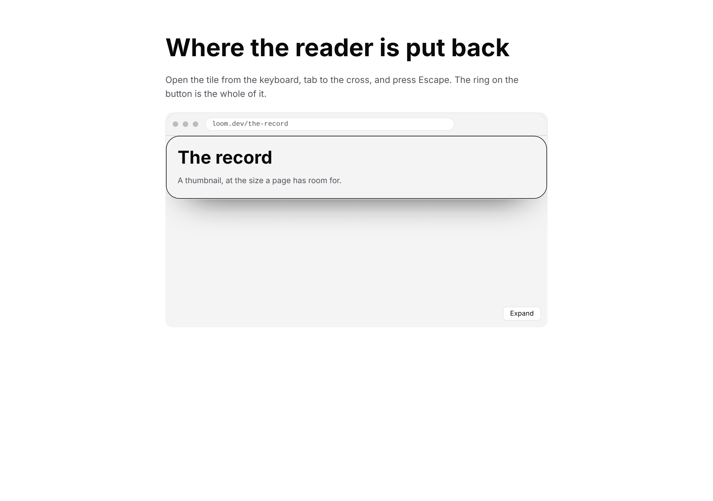
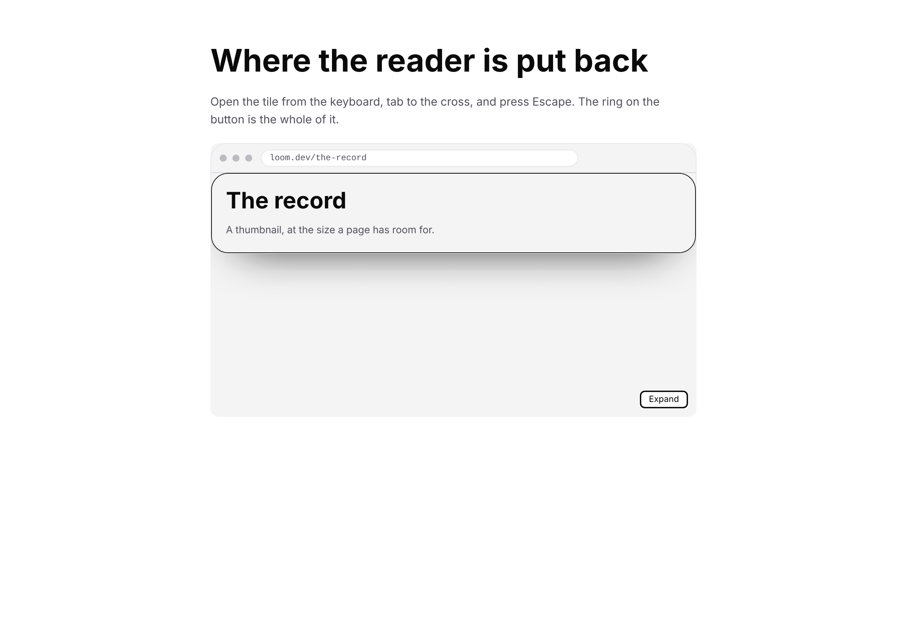

# The button they came from

**Routine:** `Loom daily build` (framework core) · **Date:** 7 October 2026
**Branch:** `framework-57-a-phone-shot-taken-with-a-mouse` · **Section:** §4h — the behaviour seam

## What was completed, in plain language

**Every overlay this library can draw was unusable from a keyboard, and all three
shipped that way.**

A dialog, a dropdown and a lightbox are built on `present`, which opens a region
and closes it again on Escape, on a press outside, or on the cross inside it. The
primitive hides the closed region with `display: none`. A browser does not leave
focus on an element inside a subtree it has just hidden — it blurs it, and focus
falls to `<body>`. So a reader who opened the lightbox with the keyboard, tabbed
to its cross and pressed it **lost their place in the document entirely**: the
next Tab started again from the top of the page. Same on Escape.

A presentation now returns the reader to its trigger, and *which* of the three
ways out closed the region decides whether it does:

| closed by | returns focus | why |
| --- | --- | --- |
| the cross inside the region | **always** | the cross is inside the region by construction |
| Escape | **only if the reader is inside the box** | Escape is heard on the document; the reader may have left |
| a press outside | **never** | the press is itself a destination |

No primitive prop changed, no stylesheet rule changed, and nothing in
`src/primitives/` is in the diff. The three primitives get this from the control
they already declare.

## The picture, and the control that makes it one

One lightbox, opened and closed **entirely from the keyboard** — Tab to the
trigger, Enter, Tab to the cross, Escape — photographed on `main` and on this
branch. Left: the reader is nowhere. Right: the ring is back on the button they
came from.

**What makes the right-hand picture evidence rather than decoration** is the pair
either side of it. The sheet takes three shots, and against `main`:

| state | against `main` |
| --- | --- |
| `arrived` — the ring a first Tab puts on the trigger | **byte-identical** |
| `inside` — the lightbox open, the ring on its cross | **byte-identical** |
| `back on the trigger` — after Escape | **the only one that differs** |

So the reader was demonstrably *elsewhere* in the middle shot, nothing before the
close moved at all, and the third picture is not a page that never opened. On
this branch `arrived` and `back on the trigger` are byte-identical **to each
other**, which is the claim stated as a file comparison: the reader is exactly
where they started.

## The second half: the harness could not take this picture

Before this run it could not be photographed at all. A browser paints a focus
ring on the strength of the **last input having been a keyboard**, so a `click`
journey reaches the same closed lightbox and comes back as a picture of no focus
state anywhere — which reads as evidence and is not.

`ShotStep` grew a fifth member, `{ "key": "Escape" }`. It presses at whatever
holds focus and is the one step that **names no element**, because a keypress has
none. It is on 0159's near side with the other four: it presses and never reports.
A key the driver does not know fails the shot rather than typing three literal
letters.

Both recipes carry it, for the 3 October `measure` finding's reason — to a
routine with no memory, a capability that is not in `docs/routines.md` is a
capability that does not exist. `tools/specimen/README.md` has it too.

## Decisions taken that were not specified, and why

**The dismiss path does not read where focus is; the Escape path does.** The
asymmetry looks like an inconsistency and is the opposite. Browsers disagree
about whether a mouse press focuses a button — Safari does not, everything else
does — while a keyboard press focuses it everywhere. A dismiss rule that read
focus would be right for the keyboard and silently wrong for one engine's mouse,
and it does not need to: the cross is inside the region by construction. Escape
is heard on the document and the reader really may be elsewhere, so it has to
ask.

**An outside press never returns focus, and that is forced rather than
preferred.** `pointerdown` fires *before* the browser moves focus to what was
pressed, so at that instant focus is still inside the region being closed. A
control that read `activeElement` there would conclude the reader was inside and
pull them off the thing they had just clicked.

**The guard on the Escape path is the same fact as the limit above it.** Because
nothing traps focus, a reader can tab out of an open region into the page behind
it. Escape then closes a region they have already left, and dragging them back
would take away the place they moved to.

**Nothing moves when the region opens.** Moving a reader *into* the region means
naming the region, which this control has never been able to do.

**`disclose` needs none of this and did not get it.** A disclosure is closed only
by its own button, so a reader closing one is already standing on it.

**The specimen is the first in this repository outside `src/primitives/`.** It is
a sheet about the behaviour seam, which is `src/render/`'s, and it composes
registered primitives rather than adding one. Worth saying because it also puts a
specimen inside the scope of `documentation.test.ts` for the first time — which
caught two citation-shape offences in this branch before the gate did.

**The phone viewport is left out of that sheet**, and it is the first use of the
distinction `PHONE` grew a `touch` field for yesterday: a phone reports a coarse
pointer and no keyboard, so a Tab-and-Escape journey photographed at 390 pixels
is a picture of something that does not happen there. The driver would still send
the keys and the shot would still come back.

## Records

**Added, one:** `0237 — A presentation returns the reader to its trigger, and
only from inside the region it closed`. Accepted. Index regenerated.

**Superseded: none.** 0176 is untouched, and the record says why at length. Its
clause 6 allocates focus trapping, `inert` and a scroll lock to the primitive;
*where a reader is left when the region closes* is none of those three. It is a
fact about the trigger's own button, which is this control's under 0092's split,
and it had no owner only because the question does not arise until something
other than the trigger can close the region — which is what 0176 added.

**The number.** 0237 is the next free one after re-reading `main` (0235) and this
branch (0236). `0236` is **claimed twice** right now — by this branch and by #539
— which is the fourth instance of the standing collision entry. Flagged for
`Loom merge` rather than worked around.

## Findings

**Updated, one, and it stays open:** the 1 October entry *what a presented region
still cannot do*, filed by `Loom primitives` and owned jointly. A dated note says
what shipped and, more usefully, what the gap now is: **one thing rather than
three**, and more urgent than it was, because a control that returns focus
correctly reads from the outside like a control that manages focus, and the next
author will assume the trap is there. Only the note is mine; the entry's own
reasoning is untouched.

**Filed, one, owned by this lane:** proving a picture moved means building the
tree twice by hand. Two consecutive framework runs have now written the same six
shell commands — copy the source aside, `git show origin/main:` over it, re-shoot
into a scratch directory, copy back, `cmp`. #538 did it to prove a phone shot was
the old behaviour; this run did it to prove a focus ring arrives. The entry names
what would close it (`--against <ref>`, printing and never failing) and why that
is a run with nothing else in it.

**Closed, none.** The one this run is about is not closeable by it.

## Open questions

**One, and it is the only thing in this run I would rather the maintainer
overruled now than in a month.**

**Focus trapping and `inert` are the half that is left, and taking them reverses
clause 6 of an Accepted record.** The framework brief calls that
`ARCHITECTURAL — needs review`, so it is not taken here. The shape 0176 itself
names is a `modal: true` on `present`, in the sentence *"if the seam ever grows a
sixth member or a `modal: true`"*. **My recommendation is to take it**, because
the finding's own owner has reported that the primitive half cannot: both are
script, and both are facts about elements the primitive did not render. Writing it
as a `Proposed` record in this branch would have held this fix behind that review,
which is the opposite of what three keyboard-inaccessible primitives need.

**Still open from earlier runs and unchanged by this one:** the `ModelEffort`
scale borrowed from one vendor that three adapters will each have to map, and
whether Grok is a third adapter at all.

## The gate

`pnpm verify` from a deleted `dist` and `.next` — **exit 0**.

| | files | tests | failed | skipped |
| --- | --- | --- | --- | --- |
| package | 186 | **4,039** | 0 | 0 |
| application | 398 | **7,087** | 0 | 0 |

1,040 findings, 0 malformed. **+10 tests in four existing files**; no test was
deleted, skipped or weakened. One existing test was *strengthened* rather than
added — the open-state guard focuses a different element first, so a defect that
moved focus on open now trips it.

One warning in the build is pre-existing and belongs to `Loom lessons` — the NFT
trace on `next.config.ts`. It is on `main` and untouched here.

**The first run was red and is reported rather than buried.**
`documentation.test.ts` refused two citations: `(0176, clause 6)` in a published
comment and a markdown link to 0237 in the specimen's first paragraph. The rule
permits exactly one shape — a bare parenthetical the site can lift out — and both
were rewritten to it. Nothing was weakened; the check is right and this branch was
the first to put a specimen inside its scope.

### Defect matrix

Nine planted, **nine red**, each caught by the test written for it.

| # | defect | caught by |
| --- | --- | --- |
| 1 | the return effect does nothing | all three return tests |
| 2 | dismiss reads `activeElement` instead of answering always | *…even if the cross never took focus* |
| 3 | Escape returns unconditionally | *leaves a reader who has already tabbed out…* |
| 4 | an outside press returns too | *never takes focus off whatever a press outside…* |
| 5 | the return fires on open as well as close | *does not move the reader anywhere when the region opens* |
| 6 | the driver drops the `key` branch | *presses a key at the page rather than at any element* |
| 7 | the driver aims the key at an element | *presses a key at the page rather than at any element* |
| 8 | the plan stops refusing a key that also names a selector | *refuses a misspelled key, an empty key…* |
| 9 | the plan accepts an empty key | *refuses a misspelled key, an empty key…* |

**Three of the six new tests pass on `main` as well**, and that is stated rather
than hidden: they are guards against the fix overreaching, not evidence of the
defect. On `main` nothing moves focus at all, so *"leaves a reader where they
are"* is true for the wrong reason. Rows 3, 4 and 5 are what give them teeth —
each is a plausible simpler version of this change, and each one is red.

## Not in this run

`*.vercel.app` is denied from this sandbox (27 September finding, unchanged), so
every photograph above is a local build taken by `pnpm specimen`, not the preview.
