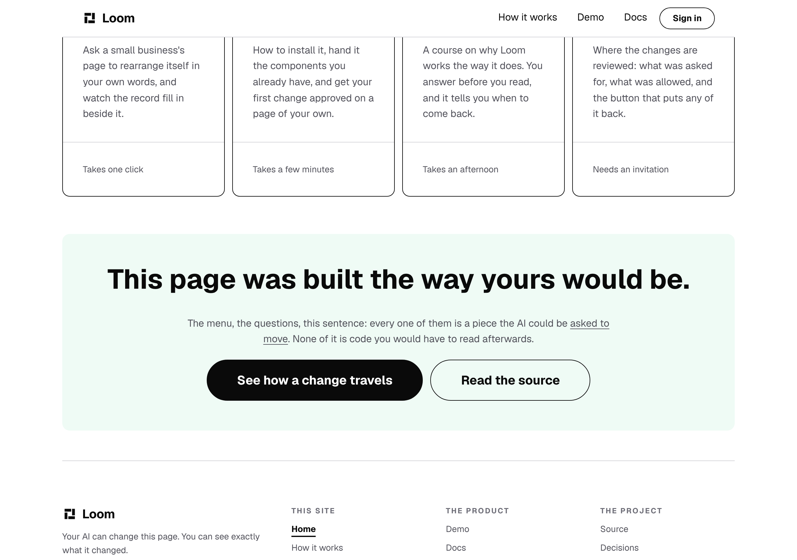
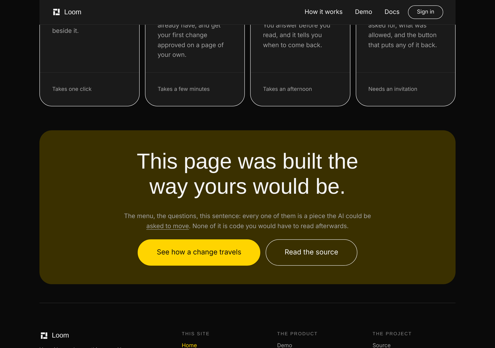
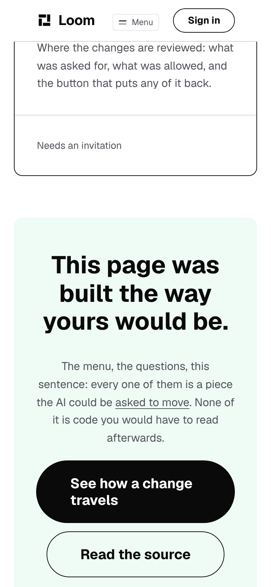

# The claim links to the proof

**Lane:** `Loom marketing` · `apps/loom/app/(marketing)/` · **Branch:**
`marketing-62-the-claim-links-to-the-proof` · **Section:** §4d

## What this run did

The front door now reaches the one band on this site that is the product
working rather than an argument for it, and a test holds that it keeps
reaching it.

Exactly one thing on this site is Loom running: the five choices on
`/how-it-works`, with the record filling in beside them. A visitor picks one,
the page rearranges itself, and the panel says what was asked, what it was
worked out to be, how much moved, which rule allowed it and what putting it
back would restore. Everything else on the site is a claim about that band.

**The page a stranger arrives at had no way to it.** Not a link, not a card in
the band of ways in, not a control. `/what-you-run` has named it in a sentence
since 6 October; the front door had nothing. Its two closing controls go to the
*top* of `/how-it-works`, which is the journey band, so a visitor who pressed
the obvious thing met five steps and a scroll.

The change is one link, on words that were already there:

> The menu, the questions, this sentence: every one of them is a piece the AI
> could be **asked to move**. None of it is code you would have to read
> afterwards.

*asked to move* now goes to `/how-it-works#see-it-happen`. **No copy was added
and none was moved into the link** — the phrase the sentence already ended on
is the phrase a reader would press. The site's word count is unchanged.

It is the second sentence on this site to carry its own link, following the one
`/what-you-run` gained on 6 October, and it composes the same primitive
(`loom.inline-link`, #517). No component was added and nothing in `src/` was
touched.

## Why it is a rule and not just a link

Nothing that existed could have reported the gap. Three checks in this route
group are about links, and all three are about a link that **exists**:

| check | what it holds | why it was silent |
| --- | --- | --- |
| `naming.test.ts` | a sentence that names a page offers the way there | the front door names no page in that sentence |
| `routes.test.ts` | every address this site points at is served | an address nobody points at is not an address |
| `anchors.test.ts` | a fragment lands on a declared anchor | scoped within `/how-it-works`, and there was no link to check |

**A missing link is not a broken one.** `reaching.test.ts` is that gap written
as something a test can read: from the page a stranger arrives at, the thing
this site exists to show is one press away, and the press lands on it.

It is written with its own limit attached, and that is deliberate. The band is
`/how-it-works`'s and **the maintainer put it there on 1 October**, so the file
also asserts that the front door does *not* declare that anchor. A later run
reading *the front door should reach it* as *the front door should have one*
would be this lane moving a band its owner placed.

### The test was checked against its own absence

Three of the five assertions fail on `main` and pass on this branch:

```
× the front door reaches the demonstration > offers it on minimal
× the front door reaches the demonstration > offers it on editorial
× the front door reaches the demonstration > offers it on bold
✓ lands on the band rather than on the page
✓ does not grow a second copy of the band's anchor
```

The two that pass either way are the ones that hold the *limit* rather than the
link, which is what they are for. The sweep is over all three palettes because
`internalHref` carries the visitor's palette across a link, so the href is built
per theme and a link correct on `minimal` says nothing about `bold`.

## What it looks like



The link is on the words the sentence already ended on. It wraps across the
line break the way a phrase in a paragraph should, which is the property
`loom.inline-link` exists for and the reason this is not a control under the
paragraph.



**No hard-coded colour.** On `bold` the phrase takes that palette's muted
foreground over its accent band, and the underline comes with it. Measured at
`110x20` on both `editorial` and `bold`, against `107x21` at 390.



| | |
| --- | --- |
| the link at 1280 | `x 378 y 537  110x20` (editorial), `x 378 y 574  110x20` (bold) |
| the link at 390 | `x 166 y 568  107x21` |
| overflow | `1280 / 1280` and `390 / 390` on every shot |

## The numbers

Read off `verify.exit` in its own command, per `docs/routines.md`.

| | before | after |
| --- | --- | --- |
| `@jam-overture/loom` | 186 files / 4,022 | **186 / 4,022** — `src/` untouched |
| `@loom/app` | 398 / 7,087 | **399 / 7,092**, 0 skipped |
| `prerender:check` | 126 pages, 1,539 junctions | 126 pages, **1,542 junctions, 0 run together** |
| findings | 1,036 | **1,038**, 0 malformed |
| `pnpm shoot` | — | `1280 / 1280`, `390 / 390` — no overflow |

**+5 tests in 1 new file. Nothing weakened, skipped or deleted, and no existing
assertion changed.** The copy is byte-identical: the site's word count did not
move, so no ceiling in `budget.test.ts` was approached, let alone raised.

The three extra text junctions are the one sentence becoming three children, and
the build's own reader reports **0 run together** — which is the check that would
catch a split sentence losing its spaces.

No decision record. This sets no prop, adds no primitive, and touches neither
the tree schema, the delta model nor an `Accepted` record.

## Findings

**Filed, two.** Both are owned by this lane.

- *The front door could not reach the one band that is the product working* —
  **closed by this branch**, and recorded because the class outlives the link:
  three checks about links were all about links that exist, and a missing link
  is not a broken one.
- *The doc comment on `SITE_ROUTES` argues an order for seven pages this site
  does not have* — **open**. It reasons at length about `/who-can-ask`,
  `/putting-it-back`, `/what-readers-do` and three pages that are now bands,
  all retired on 26 September. Left out of this branch deliberately: it shares a
  subject with the link and nothing else, and a PR that both adds a link and
  rewrites fifty lines of reasoning in a second file is harder to review than
  either half.

**Re-measured, one**, and this is the one that matters most. The 28 September
entry — *the front door's first control is below the fold on a phone, and
nothing a composition can set moves it* — is **nine days open** and owned by
`Loom primitives`. It has not moved:

| | 28 September | 7 October |
| --- | --- | --- |
| the headline | 5 lines | `y 330`, 247px tall, still 5 lines |
| the first control | 270px past the fold | **286px past the fold** |

`loom.hero` still exposes no prop that reaches it: `paddingBlock: space(8)` is a
constant and `stature` is the only prop touching height. It is the one screen
this whole surface exists to win, and it is the oldest open thing in front of
this lane.

## Open questions

**The word ceiling, and I am standing it down rather than asking a fifth time.**

Four runs have asked whether 3,300 is a standing limit. Nothing came back, and
asking again would spend the maintainer's attention on a question his own
numbers already answer: `budget.test.ts` records that the site sits at 76% of
the ceiling and that the headroom is *"a fourth page... deliberate"*, with the
per-page and per-band ceilings as the ones meant to bind on an ordinary edit.
That is an answer. This run added no copy at all, so it did not need it, and the
next run can take a fourth page inside the existing ceiling without raising
anything.

**What I would rather have than an answer about words** is the hero finding
taken, or a line saying it is not worth taking.
