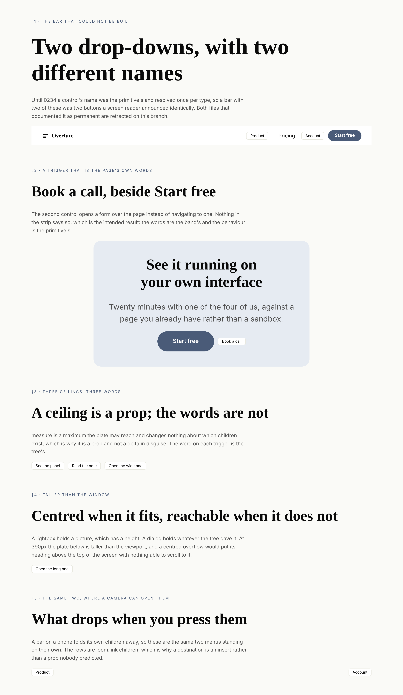
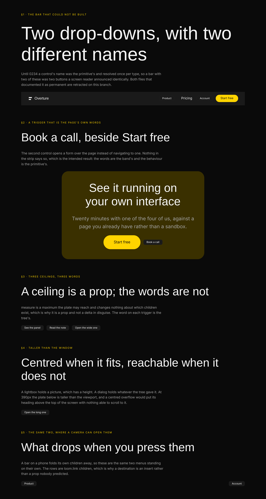
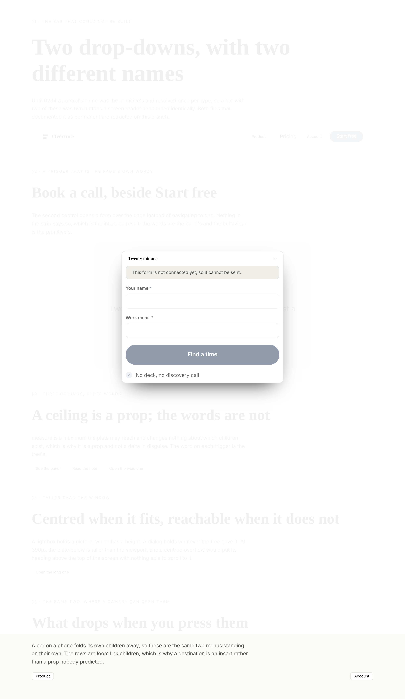
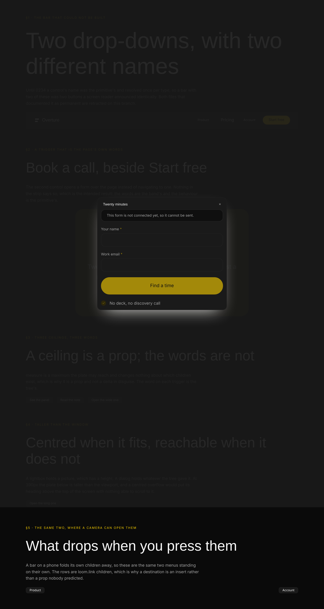
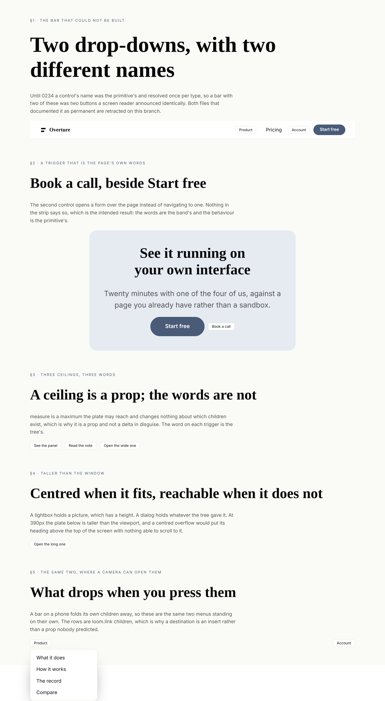
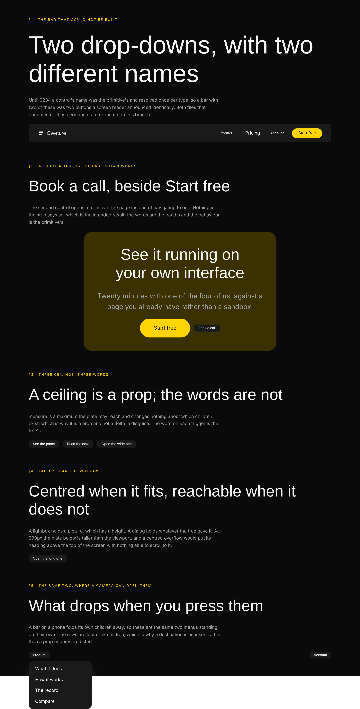
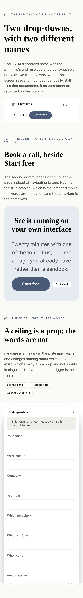
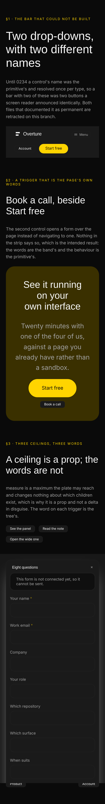

# 2026-10-07 — the word the page writes

A seam shipped on 5 October with **no consumer**, and the record that shipped it
named this lane as the builder in its own `Consequences`:

> **A dialog can be built.** The gap inventory's first Tier B group reads *three
> of four* because of this and is now unblocked; so is the header with two menus.
> Building either is `Loom primitives`' work and not this record's.

This run built both. It is one unit rather than two because they are the same
sentence from two ends: a control whose words belong to the page rather than to
the library.

---

## What shipped

| | |
| --- | --- |
| **`loom.dialog`** | the fourth of the four presentations 0176 unblocked, and the one that did not ship with the other three |
| **`label` on `loom.menu`** | the limit its own doc comment called permanent, lifted |
| **`nav-menus`** | a bar with two named drop-downs — **closes `loom.menu`'s reach**, which four consecutive reports have carried |
| **`cta-booking`** | a closing band whose second control opens a form over the page |
| `named-controls.test.ts` | 18 tests, both palettes — the first exercise of 0234's seam by a real declaration |
| `loom.dialog` in `presentation.test.ts` | joins the parametrised placement invariants, both palettes |
| 3 findings | two against the framework, one against myself |
| 2 retractions | both in files that stated the old limit as permanent |

`pnpm verify` is green: **4,049 root tests, 7,087 app tests, 126 prerendered
pages.** **107 primitives, 59 bands, reach 97 of 107.**

---

## One — which primitives, and why these two

The brief's standing question. This run did not choose from a gap list, and it
did not choose on breadth either — the library passed the point where another
card grid is the most useful thing it could gain some weeks ago.

**`FINDINGS.md` before choosing work** turned up this lane's own entry from
6 October, whose last paragraph is the whole of this run's premise:

> **Worth noting for whoever resolves it:** #528's record is about *a primitive
> naming a control from the tree*, which is the filing `loom.menu` has been
> unreachable behind since 2 October. That one lands in this lane's territory,
> and this entry is also the note that this lane is watching for it.

#528 merged on 6 October as **0234**, renumbered off 0231. So the thing this lane
said it was watching for landed, and the work it unblocks is named in three
separate places that all pre-date this run:

- **0234's `Consequences`** — *"a dialog can be built… so is the header with two
  menus"*.
- **`docs/primitive-gap-inventory.md`** — *"until it moves, a dialog here would
  be a modal opened by a chip reading Open."*
- **`loom.menu`'s own doc comment** — *"a header with two of these has two
  buttons reading Menu… A finding is filed."*

Three files predicting the same run is a stronger argument than any gap list, and
it is why this is two primitives' worth of work rather than four thin ones.

### The second half of the answer: what makes a dialog worth the vocabulary

A dialog is the one band-level thing a marketing page has that this library could
not express at all. Not *expressed awkwardly* — **not expressed**. Every
*Watch the demo*, *Book a call*, *See the whole changelog* on every page of this
kind is a region opened from the page's own sentence, and the catalogue's answer
until today was a link to another page.

That is also why it is not a fat primitive. Its body is **children**, so what
opens is a `loom.form` with its own fields, its own submit region and its own
reply promise — four kinds of node, none of which a `body: string` prop could
have carried.

---

## Two — which fields became nodes, and which stayed props

The brief asks this directly, and this run has a Hermes answer and a sharper one.

**Hermes' `contactform` and `cta` are the content models**, and `cta-booking` is
the first band to hold both at once. Neither contributed a field that became a
node here, because `contactBand` already took that decomposition in September —
a question is a `loom.field` node, which is why this band asks **two** where the
contact page asks five and needed no `fields: "short"` prop to do it.

The split that matters for the new primitive is a different one:

| | stays a prop | and why |
| --- | --- | --- |
| `label` | **prop** | §3 — it is one string, it names the control rather than being its content, and no delta addresses it |
| `title` | **prop** | one per dialog, names the region rather than being in it, drawn in a bar the primitive places. The call `loom.lightbox` makes about `caption`, unchanged |
| `measure` | **prop** | the near-miss, below |
| the body | **children** | 0051: one region placed, so children. A form, an embed, prose and an action under it — none predicted here |

**`measure` is the prop worth defending, because it looks like the trap.**
`docs/primitive-granularity.md` warns that *a prop that decides how many children
exist is `insert`/`remove` in disguise*, and the sharper question is **does
changing this prop change the set of nodes?** Under `panel`, `prose` and `media`
the answer is no under every value: the same children are in the plate and the
plate is allowed to get wider. It is `loom.feature-grid`'s `columns` exactly — a
ceiling rather than a count.

**Nothing became a node**, and that is 0052 working rather than being set aside.
A dialog has no repeated content at all: its trigger is a control the runtime
builds, its title is one string, and everything that repeats is already in the
subtree a tree put inside it.

---

## Three — why `label` is a prop and not a slot, which is the question 0234 spent a record on

The obvious objection to a `label` prop is that a trigger's words are content and
content is usually children. The record considered it and the answer is worth
restating from the building end, because it is the one thing about this primitive
somebody will want to change later:

**A control is not a node.** The runtime builds it and the primitive only places
it (0086), so there is nowhere for a child to go. What 0234 added is not *a child
for the trigger* but a channel: the primitive names one of its own props, the
runtime reads that prop off the node and hands the behaviour a string.

The declared text stays underneath, and the two clauses that make that more than
a formality are the ones this run exercised first:

- **The floor is checked first.** A deployment whose dictionary answers `present`
  with whitespace has a control it cannot translate, and one node happening to
  carry a usable word does not make it translatable. So a tree cannot talk a
  nameless control onto a page.
- **A node that says nothing gets a real name.** Not a hole, not a diagnostic —
  *More* in the deployment's language.

`DIALOG_TEXT` is `{ present: "More", dismiss: "Close" }`, and only the first is in
`names`. That is 0234's seventh clause taken literally: **each member decides
which of its strings is reachable.** A tree may rename the thing that opens a
region; it may not rename the cross that closes one, because a cross that shuts
differently from the next cross is a page a reader has to learn twice.

---

## Four — the one rule the dialog adds, and the picture that is the argument for it

`loom.dialog` emits the lightbox's shape almost unchanged — scrim, plate,
`panelPaint()`, the `fg-default` title beside the cross, `FRAME_LAYER`, the 0210
scroll lock. Sharing it is deliberate: the two cannot come to disagree about what
a modal looks like.

It **departs in one rule**, and the reason generalises.

```css
.loom-lightbox-frame { place-items: center; }
```

is right for a lightbox, which holds a picture, and a picture has a height. A
dialog holds whatever the tree gave it. A plate taller than the window, centred
in a grid, has its **top above the viewport** — and a centred overflow scrolls
both ways from the middle while a region has one scroll position, so the heading
and the first field are unreachable with nothing able to get to them.

So the frame starts the block axis and the plate re-centres itself with
`margin-block: auto`, which does exactly nothing once it no longer fits:

```css
.loom-dialog-frame { justify-items: center; align-items: start; overflow: auto; }
.loom-dialog-panel { margin-block: auto; }
```

§4 of the sheet is that pair photographed: an eight-field form at 390px, which is
deliberately more than a dialog should hold, because the arrangement is only
interesting past the point where it stops fitting.

**This is the same shape as the rule `loom.trend` added yesterday**, and the
generalisation 0233 stated then holds again: *share what decides the meaning, add
only what the difference in situation forces.* Both times the difference was that
a primitive's content stopped being something the author chose the size of.

---

## Five — the two retractions, which are the part I would want a reviewer to read

Two files in this repository asserted, as a settled limit, the thing this run
built. Both were right when written and both would have been believed.

**`loom.menu`'s own doc comment:**

> *"The button's name, which is this primitive's and not the tree's (0055). It is
> the one real limit on this primitive and it is stated here rather than
> discovered: a header with two of these has two buttons reading Menu, because
> nothing in the behaviour seam lets a node name a control. A finding is filed."*

**`navCentredBand`'s**, under a heading called *"Why there is no drop-down in it,
which is the honest version"*:

> *"**It cannot be built today** and the reason is not this band's to fix… A bar
> holding both has two buttons reading Menu at 390px, one inside the other.
> Filed, with the measurement, rather than shipped with a defect a photograph
> would have caught anyway."*

Both are rewritten where they sit rather than deleted. The replacement in each
says what the sentence used to claim, that 0234 took the finding, and what the
situation is now — because a doc comment is what the next author reads, and the
failure mode of a lifted limit is a file that goes on describing the old world
with nothing red.

The gap inventory's Tier B row and its paragraph are the third, and that one now
reads **four of four** with the narrower thing 0234 left open named in its place:
a trigger that renders an icon still has no accessible name, because a control
renders its name as a child.

**This is the second run running where a stale docstring was the most useful
thing found.** Yesterday it was `loom.media`'s, still arguing a binding was
impossible seven weeks after the binding seam shipped. The pattern is specific
enough to name: **a file that documents a limit should be edited by whoever
removes it**, and the way to find them is to grep for the finding's own words
rather than for the primitive's name.

---

## Six — three findings, and the first one is the one to read

### A slot nobody declared is dropped with its whole subtree, silently

Found by writing an assertion that turned out to be wrong. A tree that puts a
dialog's body in a `loom.slot` instead of in children renders the dialog, the
plate, the bar and the cross, and draws nothing where the paragraph was —
`diagnostics: []`.

Every other *something arrived and was not drawn* in the render seam has a code
for exactly this: `data-unread`, `data-unshown`, `frame-refused`,
`anchor-unusable`, `submit-unresolved`. A dropped slot has none. So it is the one
way to lose authored content in a Loom page that is **invisible from both ends**
— the reader sees a page that looks finished and the author sees no error.

It is general: every primitive declaring `slots: []` does it, which is most of
the arrangements. A primitive cannot see its own dropped slots, so it is filed
against the render seam rather than worked around.

The test characterises it carefully. It asserts the **measurable** half — the
words do not reach the page — and deliberately not that `diagnostics` is empty,
so the day the seam starts reporting it that test still passes. The silence is
the defect, and a test of mine should not assert it as correct.

### The one string 0234 made content is the one string `copy` cannot describe

0234's whole argument is that a trigger's word is **content**. `copy` is the
library's declaration of which props are words a reader reads. They cannot be
joined, and it is not an oversight in either — measured both ways on this branch:

- Adding `"label"` to `copy` fails *draws every prop it declared as copy*, because
  a control renders `null` until an effect has proved scripting runs.
- Leaving it out passes *draws no undeclared string prop as text* only because
  the word is invisible to that assertion too.

**What it costs is not hypothetical.** The marketing lane's word sweeps, the
reading-time measurement and `textOf` all read a page's words. A band closing with
*Book a call* has that sentence counted nowhere: to every instrument in this
repository, the closing control of the page is not words at all. The 6 October
entry about inline children is this same seam from the other side.

Not fixed here, because the remedy is a third state — *words a reader reads that
the static render does not contain* — and inventing one in a primitive's
declaration would put a convention in `src/primitives/` that the seam reading it
has never agreed to.

### Four of 0234's five "said nothing" shapes are unreachable, and that is better

The record enumerates five shapes of *this node said nothing* and says each falls
back to the declared string. Through a prop declared `z.string().min(1)`, only
**two** are reachable: absent and whitespace. `null`, a number, an object and a
blank string are refused at the schema, and the primitive draws nothing at all.

**The refusing half is the one to keep**, which is why this is filed as an
observation rather than as a defect. A dialog whose `label` arrived as an object
is a tree something generated wrongly, and drawing it with a button reading *More*
would be a page that works with a defect nobody is told about. The note is that
the clause reads as a *runtime* guarantee and is mostly a *schema* outcome, so a
future named control declaring `z.string().optional()` without the `min(1)` would
quietly get the other behaviour. Both halves are asserted.

---

## Seven — the cross-lane edits, and the one that is not a number

Adding a primitive and two bands turned the app suite red in four places, which
is the 2 October hazard firing for the fourth run running.

| | what | how |
| --- | --- | --- |
| `reference.generated.json` | three new published exports | regenerated with `pnpm --filter @loom/app docs:api`, which also cleared `offered.test.ts` |
| `counts.test.ts` | two literals | `one hundred and seven`, `fifty-nine` |
| `lessons/22, 23, 24, 30, 31` | transcripts printing `106` | **numbers only** — plus one row in 22's list, because that exercise prints the interactive primitives by name and `loom.dialog` is one |
| `pairings.test.ts` | two lists | `loom.dialog` paints `bg-overlay` and draws `fg-default` on it. The test's **own comment** says the list is *"widened rather than loosened, so a fifth primitive quietly starting to paint the page's overlay surface still fails here"* — it went red as designed and was widened as instructed |
| `lessons/29` | — | **not only a number.** Below |

**Lesson 29 is the one to look at**, and it is the same shape as lesson 33 last
run. Its mark predicted a move of this fence, but not *this* move:

> `moves:` **when a primitive in src/primitives/ gains a prop that nothing reads
> unless an answer arrives.**

`loom.dialog.label` and `loom.menu.label` are new members of that fence's set —
props the component never reads — but **not for the reason the mark gives**.
Nothing about an answer is involved: the *runtime* reads them off the node, which
is a channel that did not exist when the mark was written. By the mark's own
instruction (*"if they are not, this is ordinary drift and the mark does not cover
it"*), that makes this more than a transcript refresh.

What was done, and the split is deliberate:

- **The fence is the truth**: 8 → 10, two rows added in registration order. There
  were **two copies** of it in that lesson and the first edit caught one, which
  the suite found.
- **The arithmetic moved with it and no argument was rewritten.** Sixteen → eighteen,
  *seven of these eight* → *of these ten*, *fifteen of the sixteen* → *seventeen
  of the eighteen*, *the sixteenth is real* → *the eighteenth*. `loom.embed.src` is
  still the one genuine row and still the section's whole point; the two new ones
  join the *measurement, not the code* group, which is where they belong because
  the component genuinely does not read them.
- **The mark was extended** to name the second kind, and to say that a *third*
  kind would be news the prose has to answer rather than arithmetic.

That is an edit to another lane's teaching material beyond a number, it is filed,
and reverting the mark is one paragraph if `Loom lessons` would rather state it
differently.

---

## Eight — what the library still cannot express

1. **An image the catalogue may name.** Still first, unchanged at **six**:
   `loom.embed`, `loom.lightbox`, `loom.carousel`, `loom.overlay`, `loom.pin`,
   `loom.before-after`. `loom.embed` is the one this run looked at hardest and
   put down: a band holding one would need an origin the deployment's frame
   registry has resolved (0095), so a catalogue embed is a band shipping a
   refusal. Not this lane's.
2. **A general bound table.** Unchanged, `ARCHITECTURAL`, blocked by 0008.
3. **One of *n* children chosen, where the labels are in the children.** Tabs,
   the segmented control, the pricing toggle, the radio group. Unchanged and the
   largest remaining group — and now the *only* Tier B group left, since the
   presentations closed today.
4. **An icon-only trigger.** 0234's own leftover: a control renders its name as a
   child, so `ⓘ` beside a term has no accessible name. Narrower than it was and
   still open.
5. **A panel that does not exist before hydration**, and **focus trapped inside an
   open modal**. Both script, both named in 0176 as the primitive's half, neither
   reachable from a stylesheet. `loom.dialog` inherits `loom.lightbox`' honest
   limit exactly, which is the point: it is a property of every modal this library
   can build rather than of either primitive.
6. **A fixed decoration with no floor.** Still the maintainer's call.
7. **A page that is not a landing page.** Unchanged, and still the one thing reach
   cannot close by writing another band — `loom.page`, `loom.link-trail` and
   `loom.waiting-state` are three of the ten unreached and all three want a second
   kind of page rather than a band.

**Reach is 97 of 107.** `loom.menu` left the unreached list after five days on it
and `loom.dialog` arrives reached.

---

## The pictures

Two palettes, two widths, six states. The sheet is **live** — a static render of
any of this photographs the page the control never reached, because a control
returns `null` until an effect has run.

| | editorial | bold |
| --- | --- | --- |
| the bar, shut |  |  |
| the booking dialog |  |  |
| the product menu |  |  |
| §4 on a phone |  |  |

**The two to read at size are the first and the last.** The bar is the whole
retraction in one strip — *Product* and *Account* at opposite ends of it, at the
weight of the links beside them — and it is the picture that says the fix is a
header rather than a demonstration that two drop-downs are possible. §4 on a
phone is the stylesheet rule: the plate's title and cross are at the top of the
frame and its first field is reachable, which is what `align-items: start` bought
and what `place-items: center` would have cost.

```
…-editorial-wide-*    1280x2000@2x  scrollWidth 1280 / innerWidth 1280
…-editorial-phone-*    390x844@2x   scrollWidth  390 / innerWidth  390
…-bold-wide-*         1280x2000@2x  scrollWidth 1280 / innerWidth 1280
…-bold-phone-*         390x844@2x   scrollWidth  390 / innerWidth  390
```

No horizontal overflow in any of the twenty-four.

**One thing in the dialog shots is a camera artifact rather than a page defect**,
and it is worth naming so nobody reads it as one: the scrim covers the viewport
and these are full-page captures, so §5 below the fold is undimmed in a frame
where everything above it is. A reader of the page never sees that, because the
frame is `position: fixed` and the viewport is all there is.

**And one state is deliberately not photographed.** There is no picture of a
trigger that named nothing. The floor — *More* — is a correct page with a weak
word on it, and a frame of it would say nothing the sentence does not. The states
worth a photograph are the ones where the word on the control came out of the
tree, which is the whole of what this run is about.
