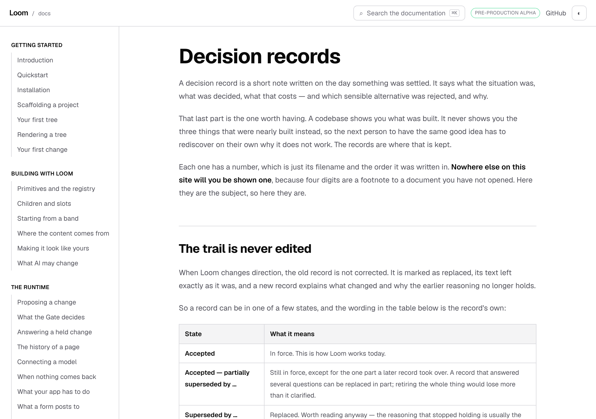
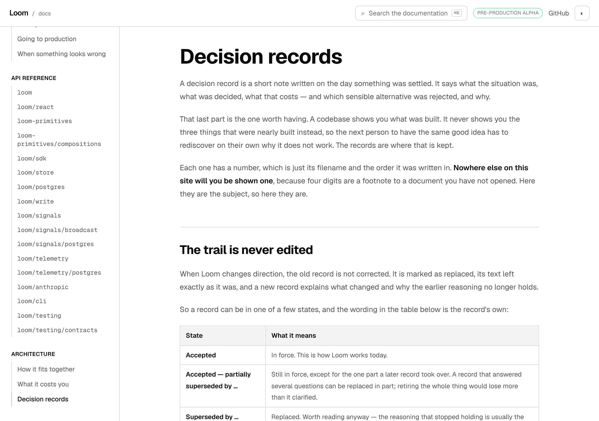
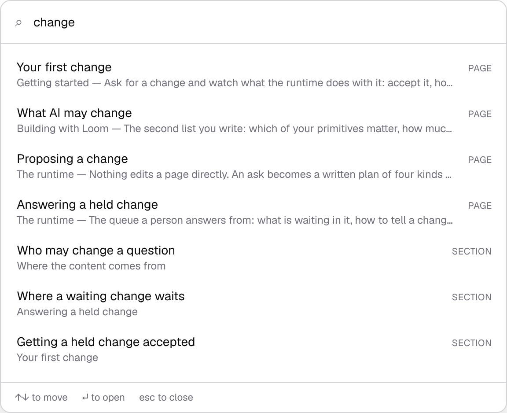
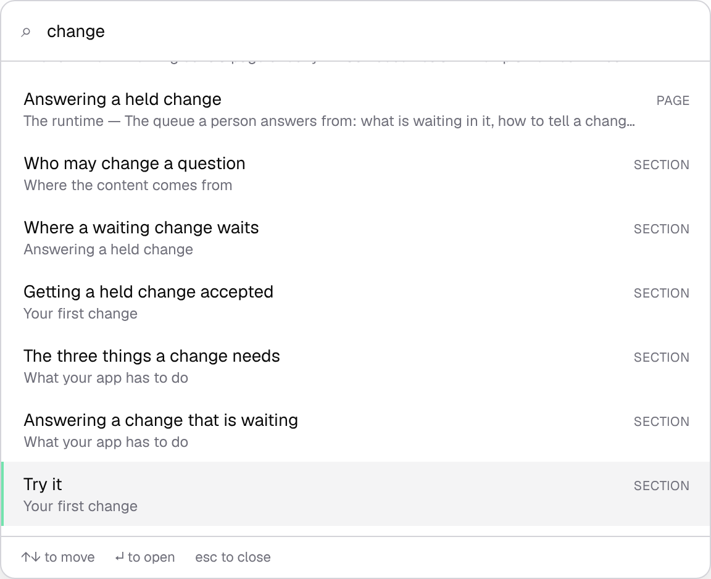
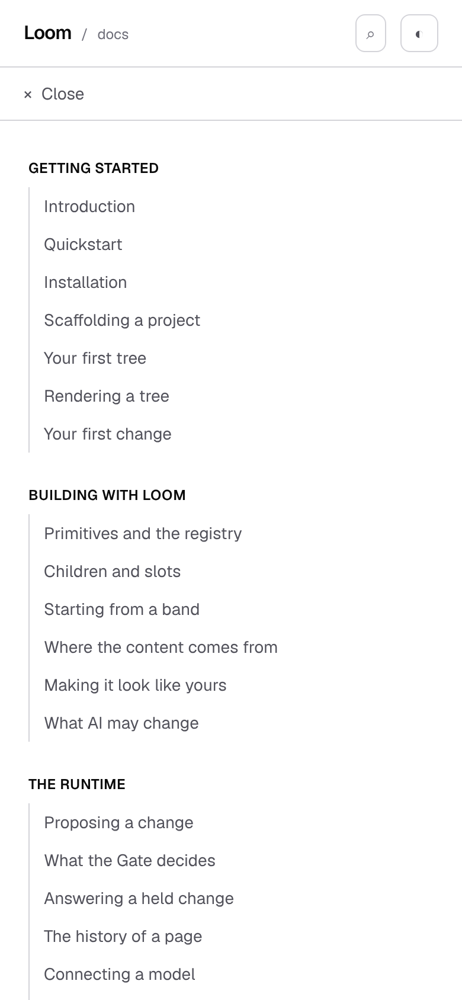
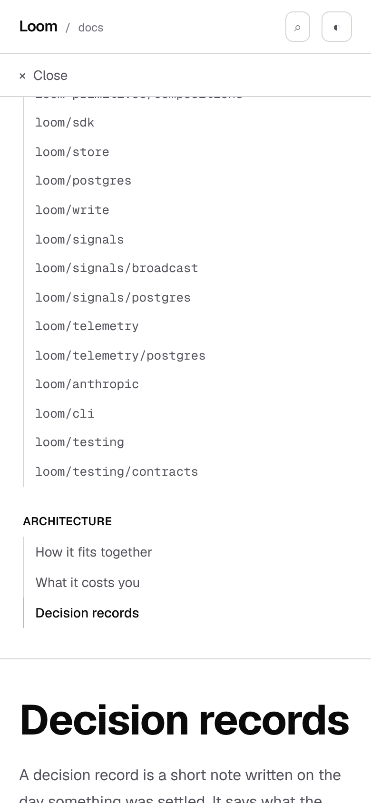

# 8 October 2026 — the mark nobody could see, and the page a result press leaves you in

**Routine:** `Loom docs` · **Branch:** `docs-49-the-mark-nobody-could-see` ·
**Section:** §4c

No open pull request from this lane at the start of the run, so this is a fresh
branch off `main` at `bd0af3d`. No maintainer comments were outstanding on any
pull request of this lane's. The work is the only item left on the 7 October
report's *what I would write next*, carried there from 5 and 6 October as well:

> **`search`'s own keyboard contract against the rail's.** `search.test.tsx` is
> the most thorough file in this route group and the one thing it does not
> cover is what a result press does to the chrome around it.

## What it turned into

Going to write that turned up **one defect in three places**, and the three are
the reason this is a single change rather than a fix in the search box.

A list marks something — the page you are on, the result you have selected —
and then shows it in a box smaller than the list. In all three the mark was
drawn correctly and was **outside the box**. Measured with `pnpm shoot`'s
`measure` on a production build, before anything was written:

| the list | shows | holds | where the mark was |
| --- | --- | --- | --- |
| the rail, 1280×900 | 844 | 1,730 | **855 past the bottom** on the last page of the site |
| the menu panel, 390×844 | the whole page | 1,712 | **938 past the bottom** |
| the search results | 384 | 536 | **92 past the bottom** after nine presses of ArrowDown |

The rail's 855 is the *last* page rather than the worst case, and the worst
case is how many pages it happens on. Measured one page at a time, the rail
shows 844 pixels and the row for **what every ask leaves behind** is the first
one it clips, at y 889 against a bottom edge of 901; **what your readers do**,
at y 921, is the first that is wholly outside. Everything after those two is
worse, which is **24 of the 45 pages** — the last four of *The runtime*, all 17
of the reference and all 3 of *Architecture*. So for more than half of this
site, a reader who arrived by any means other than the rail itself got a rail
showing *Getting started* with nothing highlighted anywhere on it.

**Why nothing caught it.** Everything a screen reader is told was right, and
still is: `aria-current="page"` on the rail, `aria-selected` and
`aria-activedescendant` in the list. `sidebar.test.tsx` already held the mark in
two ways and `search.test.tsx` already had thirty-one tests. None of them can
see this, and nor can any test that renders into jsdom, **because jsdom lays
nothing out**. The instrument that finds it is `measure`, and the question is
whether the marked row's box is inside the scroller's.

## The search box, which is where the question came from

Nine presses of ArrowDown and nothing on the screen is highlighted. The footer
of the dialog says *↑↓ to move*.

This is the worst of the three, because the other two leave a reader
uninformed and this one leaves them wrong: `Enter` opens a page they never saw.
It is also the one where the fix needed a condition the others do not, which is
below.

## The rule, and the two properties worth more than the code

`app/(docs)/_lib/in-view.ts` is a pure function of four numbers — what the
scroller shows, where it is, how much it holds, and the row's box — with two
callers. The arithmetic is not interesting. These two are:

**It moves only when the mark is off screen.** Not when the margin around it is
untidy. The first version treated *in view with 48 pixels of context either
side* as the test, which nudges a rail whose current row is visible with ten
pixels above it. A reader who scrolled the list themselves and pressed a row in
it is looking at that row, and nothing may move under them. That property is
also what makes the effect safe to run on **every** navigation rather than only
the ones the rail did not cause, which it has no way to tell apart.

**In the one list whose selection also follows the mouse, it may run only when
the last input was a key.** A list that scrolled on hover would pull a
different row under a stationary cursor, which fires another hover, which
scrolls it again. Typing counts as a key: a new query selects the first row and
the list has to come back to the top to show it. Same reasoning as the
browser's own focus ring, which it paints on the strength of the last input
having been a keyboard.

The 48 pixels of context are given when it moves and are never a reason to
move. Minimal movement rather than centring, because centring the first page of
the site scrolls *Getting started*'s own heading off the top, which hides the
one piece of context the reader has.

## The phone, where the remedy was a height rather than a scroll

On a phone the rail lives in a panel under a menu button, and the panel had no
height: 1,712 pixels of links laid into the document, pushing the page the
reader had been reading that far down, with the mark 938 below the fold.

The rail scrolls **a scroller**, and does nothing where there is none, so the
fix was to give the panel one — `max-h-[70vh] overflow-y-auto` — rather than to
teach the rail to scroll the document. A version that scrolled the document
would answer the same question by throwing a reader who had just pressed a
button into the middle of a list with the button off-screen.

| before | after |
| --- | --- |
|  |  |

The reader is on *Decision records* in both.

## Where a result press leaves the reader, which is the other half

The dialog has three ways out and had **one** answer for all of them: return
the reader to the button they opened it with.

That is right for Escape and for a press on the scrim. It is wrong for a press
on a result. A reader who pressed one was put back in the header of a page they
had never seen, with the skip link behind them in the tab order and the rail's
own mark reachable only by tabbing backwards.

[0237](../decisions/0237-a-presentation-returns-the-reader-to-its-trigger-and-only-from-inside-the-region-it-closed.md)
settles this question for a presented region and gives three ways out three
answers. It has no row for this one, because a presented region does not
navigate — but **its reasoning decides it**: its third row is *a press outside
never returns focus, because the press is itself a destination*. A result press
is that sentence applied to a press inside the region.

So the dialog now has three functions where it had two: `dismiss` shuts it and
says nothing about the reader, `close` shuts it and hands them the button, and
`go` shuts it and hands them the page. The page is `#article`, which is the
site's own answer to where the page begins rather than a second one — the skip
link has pointed at it since the site had a header.

Two details that are load-bearing and look like noise:

- **`focus({ preventScroll: true })`.** A result can be a heading on the page
  the reader is already on, so the router is the thing that knows whether the
  destination is a page or a position on one. Moving focus and leaving every
  scroll to the router is the only way the two do not fight.
- **No waiting for the navigation to commit.** `#article` is rendered by the
  layout, so it is the same element before and after. Focusing it now and
  letting the new page render inside it needs no timer and nothing to clean up.

**No picture in this report shows this half.** `main` carries
`focus-visible:outline-none`, deliberately, so there is no ring to photograph —
a focus ring around the whole article column would be worse than the problem.
The evidence is the tests, and the report says so rather than implying one of
the pictures above proves it.

## The transcription it closed on the way

`#article` was a string literal in the skip link and `id="article"` was a
string literal in the layout that answers it. Two copies, nothing holding them
together, and the symptom of their disagreeing is a skip link that silently
does nothing — which is the hardest thing in this repository to notice, because
`prerender:check` reads addresses and a fragment is the one broken link nothing
here can report (this lane, 26 September, still open).

Both now come from `_lib/chrome.ts`, along with the attribute that says which
element scrolls the rail. `chrome.test.ts` reads the two layouts back off disk
and fails if either spells a name itself.

## Decisions taken that were not specified

**No decision record.** Nothing here touches the tree schema, the delta model
or an `Accepted` record. 0237 is cited and not contradicted: the two ways out
it has rows for behave exactly as they did.

**The scroller is declared, not sniffed.** `data-rail-scroller` on the element
that scrolls, rather than script walking up looking for a computed
`overflow-y`. It is what lets one rail serve a sticky `aside` on a wide screen
and a panel under a button on a phone with no prop, no width and no media query
in script — and on a phone with no panel it finds nothing and does nothing,
which is the correct answer rather than a special case.

**The judgement is separated from the reading.** `in-view.ts` is four numbers
in and one out, and the components read boxes and assign a `scrollTop`. That is
what makes the arithmetic testable without a browser, which matters here
because the browser is exactly what nothing in this suite has.

**70% of the viewport for the phone panel**, which is a number chosen rather
than derived. It leaves the page's own heading visible under the menu at
390×844, which is the property it was chosen for and which the photograph
shows.

## Tests

`pnpm install && pnpm verify` at the repository root: **green, exit 0**, with
the status written to a file as the last thing on its own line and read in a
separate command.

| | `main` at `bd0af3d` | this branch |
| --- | --- | --- |
| `@jam-overture/loom` | 188 files / 4,112 tests | **188 / 4,112** — `src/` was not opened |
| `@loom/app` | **407 / 7,221** | **409 / 7,257** |
| findings ledger | 1,056 entries, 0 malformed | **1,059**, 0 malformed |
| `prerender:check` | — | **126 pages / 1,584 text junctions**, 0 run together |

**+36 tests, +2 files. Nothing weakened, skipped or deleted.** No existing
assertion was changed except one, which was made stronger and is described
under the mutations.

**The `main` column is a real run on a clean checkout**, not a carry: the app
row is `pnpm --filter @loom/app test` with this branch stashed. The library row
is asserted to be `main`'s on the grounds that `git diff origin/main -- src/
tools/ packages/` is empty, which is an argument rather than a second run, and
is the same licence the 7 October report took. The junction count is the
branch's and is expected to be `main`'s, because **the diff contains no prose**:
nothing a reader reads changed on any page.

### Where the 36 are

| file | tests | what it is about |
| --- | --- | --- |
| `_lib/in-view.test.ts` | 11 | the arithmetic, against the deployment's real numbers |
| `_lib/chrome.test.ts` | 5 | the two layouts read back off disk for the names they are supposed to import |
| `_components/sidebar.test.tsx` | 16 → 23 | the rail finding its scroller, and answering an address rather than a mount |
| `_components/mobile-nav.test.tsx` | 9 → 12 | the panel being a bounded scroller that says so |
| `_components/search.test.tsx` | 31 → 41 | where a press leaves the reader, and the selection staying on screen |

Two of them need a sentence about their fixtures.

**jsdom lays nothing out, so two files lay the lists out by hand.** Rows of a
fixed height in document order, in a box showing a fixed number of them, by
stubbing `getBoundingClientRect` on `HTMLAnchorElement` and `HTMLLIElement` and
the two height getters on the scroller. The shapes are the real ones and the
numbers are a round version of them: what is being checked is which numbers
reach the rule and when it is allowed to run, not what it does with them, which
is `in-view.test.ts`'s job against the measured ones.

**The one existing assertion that changed** was the sidebar's own
`railScrollerAttr`-free world: nothing changed about what it asserts, only the
`nav` it queries now carries a `ref`. The genuinely rewritten test is in
`search.test.tsx` and is described below.

## Green is not evidence — twenty-two mutations, and one survives

Each introduced one at a time against the committed code and reverted before
the next, with the five test files above run each time.

| what was broken | tests that went red |
| --- | --- |
| every row counts as already in view | 11 |
| the list is scrolled past its own end | 8 |
| the scroller is read but never moved | 5 |
| no context is kept either side of the row | 4 |
| the rail marks the page it is not on | 4 |
| the rail never looks for the page it marked | 3 |
| nothing counts as in view, so the rail moves on every navigation | 3 |
| a row below the fold is put at the top instead | 3 |
| a row is measured from the screen rather than from the list | 3 |
| the reader is left wherever the browser put them | 2 |
| the result list never scrolls to its selection | 2 |
| the result list scrolls on a hover as well | 1 |
| the rail answers a first load and no navigation | 1 |
| the phone's panel does not say it scrolls | 1 |
| the phone's panel stretches the page again | 1 |
| a row above the fold is put at the bottom instead | 1 |
| a row too tall to fit shows its bottom | 1 |
| the dialog hands a result press back to the button | 1 |
| a new query leaves the list where it was | 1 |
| the wide rail does not say it scrolls | 1 |
| the landmark the skip link points at is renamed | 1 |
| **focus is moved and the page is scrolled with it** | **0 — survives** |

**Five survived the first pass and four were closed by rewriting tests.** Three
of the four were the same mistake twice over and are worth more than the fix.

**A test that reads another file for a name must assert on the use.**
`chrome.test.ts` asserted that each layout *mentioned* `ARTICLE_ID` and
`railScrollerAttr` — which the import line satisfies. So a layout that kept the
import and dropped the attribute passed, and both spellings of that mistake
survived. It now asks for `id={ARTICLE_ID}` and `{...railScrollerAttr}`.

**The end state cannot tell a correction from a right answer.** The headline
mutation — make `go` call `close`, so the reader is handed back to the search
button — reddened **nothing**, because `go` then moves focus to the article
anyway and `document.activeElement` is identical either way. The assertion that
holds it listens for a `focus` event on the trigger and asserts it never fires.

**A test of typing had a keyboard already in it.** The test that a new query
returns the list to the top arrowed down first, which had already said *the
last input was a key* — so removing that from the typing path changed nothing.
It now hovers a row in between, which is the only way to make the assertion be
about typing.

**The one that survives is honest.** `preventScroll` is unobservable in jsdom,
which does not scroll. It is load-bearing in a browser for the reason given
above, and removing it reddens nothing anywhere in this suite. Reported rather
than engineered around; the only instrument that could see it is a shot of a
page scrolled to a heading, and the harness cannot read a scroll position back
out of a page by design.

## The visual, and what it does and does not show

Six shots, three before and three after, each from a production build served by
the harness itself. The shot list beside this report is the **after** three;
the before three are the same list with `after` read as `before` in each `out`,
run against a checkout of `main`, which is why they are not reproducible from
this branch and are named rather than listed. `scrollWidth 1280 / innerWidth 1280` on every wide shot and
`390 / 390` on the phone, so nothing here overflows. The before three were
taken against a checkout of `main` built on purpose for them, which is why they
are a measurement and not a reconstruction.

The measured numbers either side, which are what the pictures are of:

| | before | after |
| --- | --- | --- |
| rail mark, last page | y 1723, **855 past the fold** | y 837, inside |
| menu mark, last page | y 1750, **938 past the fold** | y 628, inside |
| selected result, ninth press | y 590, **92 past the fold** | y 438, inside |

The rail's after sits 32 pixels from the bottom edge rather than the 48 it asks
for, and the result list's sits 8 from its own: both are the clamp at the end of
a list, which is a correct answer rather than a near miss.

## Scope

`apps/loom/app/(docs)/` only, plus `FINDINGS.md`, this report, its shot list and
its six screenshots. **Four files added and eight changed**, all inside the
route group: two modules and their two test files, two layouts, and three
components with their tests. `git diff origin/main` touches nothing in `src/`, `tools/`, `decisions/`,
`packages/` or any other route group, and nothing at the application root —
no cross-lane diff at all this run, for the second run running.

The three components involved are site chrome in 0067's sense — the rail, the
menu and the search box are the stated exception to composing this site from
registered primitives, because they are how a reader reaches the content rather
than content.

## Findings

**Filed — three.**

1. *A mark the reader cannot see is not a mark, and three lists on this site
   were drawing one.* For `Loom portal`, `Loom lessons`, `Loom demo` and
   `Loom marketing`, as a class with all three of this lane's instances closed.
   It carries the measurement, the two properties of the rule, and where to
   look: any bounded `overflow-y-auto` holding something the page marks as
   current or selected. The portal is the one most likely to have it — a review
   queue with a highlighted row is the same shape.
2. *The search dialog had one answer for three ways out, and 0237 had already
   decided two of them.* For this lane, closed, and filed because the reasoning
   belongs to the primitives seam and the next surface to build a dialog will
   need it.
3. *`#article` is a fragment two files spelled.* For this lane, closed in the
   instance, filed as the smallest instance of the 26 September entry about
   fragments being the one broken link nothing here can report.

**Not re-filed:** `nextjs.org` is still `EGRESS_BLOCKED` from both `WebFetch`
and `curl` although `.claude/settings.json` lists it in both allowlists
(19 August and 24 September, both open) — it cost this run nothing; the preview
URL is not derivable from the branch name (27 September).

## What I would write next

The 7 October list is now empty, so these are new.

- **The `undefined` half of *The bar above your page*.** Carried from the
  7 October report, where it was the second of two open judgements: no
  registered palette has an unreadable pair, so the branch that emits no meta
  is prose with a test behind it rather than a row a reader can see.
  `ColourForms` solves the same problem one section up by building palettes in
  six spellings.
- **The pager's own arrival.** The rail now brings the reader's page into view
  and the pager is the control most likely to be pressed from the bottom of a
  long page — which means the reader arrives at the top of the next one with
  the browser having restored a scroll position or not, and nothing in this
  repository has measured which. It is the same class of question as this run
  and the instrument already exists.
- **The `signals` door's narrower-door saving in kilobytes rather than in
  files** (23 September, open) — still blocked on the same judgement about
  wording, which is the maintainer's and is in the entry.
