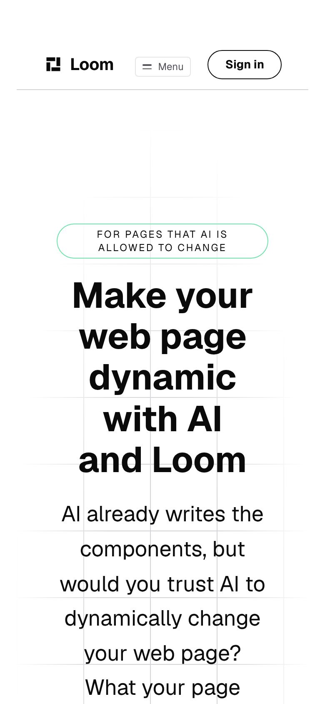
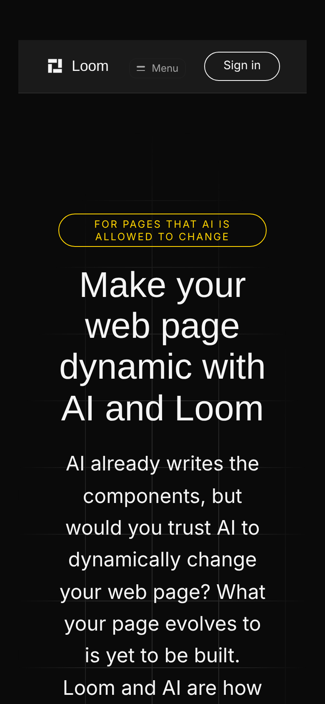

# The strip above the page

**Lane:** `Loom marketing` · `apps/loom/app/(marketing)/` · **Branch:**
`marketing-63-the-strip-above-the-page` · **Section:** §4d

## What this run did

Open this site on a phone, switch it to `bold`, and look at the strip above the
page — Chrome's address bar on Android, the area around the page on an iPhone.
Until today it was **white, over a page that is `#0a0a0a`**. It had been for as
long as this site has had a palette switcher.

Every page of the site now tells the browser what colour to paint it, read off
the palette the visitor actually asked for.

This closes the marketing quarter of the finding `Loom docs` filed on 7
October: *46 of the 126 prerendered pages on this deployment tell the browser
what color to paint its own bar, and all 46 are the documentation site's.* Four
surfaces owed one. Three still do.

## Measured on the served page, not on a function

```
url                               in <head>   content
/                                 yes         #ffffff     minimal, the default
/?theme=editorial                 yes         #fafaf7
/?theme=bold                      yes         #0a0a0a
/how-it-works?theme=bold          yes         #0a0a0a
/what-you-run?theme=bold          yes         #0a0a0a
/?theme=nonsense                  yes         #ffffff     a mangled palette is a page, not a 400
```

A production build, served over HTTP, with the position of the tag checked
against `</head>` rather than against the whole document — React 19 hoists a
`<meta>` rendered deep in a page, and *hoisted* is a claim worth checking rather
than assuming.

## It is the recipe, not a copy of it

`/docs/building-with-loom/theming#the-bar-above-your-page` publishes this, and
publishes it as one line:

```tsx
<meta name="theme-color" content={themeGround(resolved).backgroundColor} />
```

**The documentation site cannot follow its own recipe.** A sidebar and a header
are application furniture with no theme mounted on them (0067), so it has
nothing to resolve: `(docs)/_lib/theme.ts` transcribes two hex values out of its
stylesheet and holds the copies together with a test, and says so in its own
header. It is 0197's hazard, correctly recorded rather than hidden.

**This surface has the thing the recipe asks for.** Every pixel of it is a tree,
so the render that drew the page hands back what the root is wearing, and the
colour comes off that:

```tsx
const rendered = await renderSitePage(HOME, { … })
…
<BrowserBar theme={rendered.theme} />
```

There is no constant, no script, no stylesheet read and **no second reading of
the palette**. The prop is typed `RenderOutput["theme"]` — the field itself,
not a type restated — so the only palette this component can report is the one
that was served. That is the whole difference between this and the version the
documentation site had to settle for, and it is why the three lanes that still
owe a bar should not copy the transcription.

**Not the `media="(prefers-color-scheme: …)"` pair**, which is what every
article on the subject recommends and what the theming page spends a section
refusing. It reads the reader's machine; this site's palette is in the address.
Two constants also cannot cover three palettes.

## The one colour this site is allowed to name

Everything else on this surface is forbidden a colour — `globals.test.ts`
refuses the stylesheet one, and `pages.test.ts` refuses the markup one. This is
a colour, in the head of every page.

It is not an exception and the distinction is worth stating precisely:
**nothing here names a colour.** `bg-canvas` is named and the palette answers.
`content` is a colour attribute with nowhere in it to put a word, so the hex is
the only form available — the theming page's own sentence is *you are painting
something, so you need the hex.* A test strips the component's comments and
then refuses any hex, `rgb`, `hsl`, `oklch`, `white` or `black` in what is left,
because the reasoning has to be allowed to quote `bold`'s canvas and the code
must not.

## What it looks like

The bar itself cannot be photographed — no desktop browser draws one and no
screenshot this lane takes contains one. What can be photographed is the thing
the bar is now the same colour as.

| minimal, 390 | bold, 390 |
| --- | --- |
|  |  |
| `#ffffff` | `#0a0a0a` |

**The strip above both of these used to be `#ffffff`.** Over the left-hand page
that is invisible and correct by accident, which is the reason this survived:
the default palette is light, so a reader who never touches the switcher is the
one reader the old behaviour was right for. Over the right-hand page it is a
white band across the top of a black screen.

[editorial at 390](2026-10-08-marketing-strip-editorial-phone.png) ·
[bold at 1280](2026-10-08-marketing-strip-bold-wide.png)

`390 / 390` and `1280 / 1280` on every shot — no overflow. The `h1` is at
`y 330` on minimal and `y 318` on bold, unmoved: this change adds no element
the visitor can see and moves nothing.

**The honest way to check it is the preview link on a phone.** Open the preview
with `?theme=bold` on a handset and look at the top of the screen. That is the
one instrument that sees this, and it is the maintainer's eye rather than a
test.

## Tests

`browser-bar.test.tsx`, **23 tests, one new file.** They are all one shape —
*the strip and the top of the page are the same colour* — asked three ways:

| | what it holds |
| --- | --- |
| against the registry | the content is the palette's `bg-canvas`, resolved through `siteThemes` |
| against the page | the content is the `--loom-bg-canvas` the root element carries in its own markup |
| against the site | all three routes emit one, in all three palettes |

The middle one is the only independent one and it is the point. Asking
`themeGround` what the colour should be is asking the component's own function a
second time; asking the **rendered markup** is asking the page. If the strip and
the ground ever diverge, that is the seam, and this is the only thing here that
would say so.

Three more hold why two constants could not have done this, measured rather than
asserted: the palettes are not all one appearance (`bold` resolves `dark`), they
do not all paint the same canvas, and the default is light.

### Five planted defects, and the fourth one is why this section is here

| plant | tests red |
| --- | --- |
| a page stops rendering the tag | 1 |
| the colour is written in (`#ffffff`) rather than read | 8 |
| the ink (`ground.color`) instead of the ground | 9 |
| **the tag goes out under a misspelled name** | **0 → 4** |
| an unthemed page is given a guess instead of nothing | 2 |

**The fourth plant was green, and it should not have been.** The assertion read
``toContain(`name="${BROWSER_BAR_META}"`)`` — the component's own constant on
both sides of the comparison — so misspelling it to `themecolor` left all
twenty-two tests passing while every page emitted a tag no browser reads.

That is the shape `Loom primitives` filed on 6 October: *two palette assertions
comparing one character to itself.* Three days, two lanes, two route groups. The
fix is one literal: `theme-color` is the web platform's spelling, not ours, so
it is written out exactly once and pinned there. Filed as a finding, because the
rule generalises and because of how it surfaced — nothing found it by reading,
and it was the one plant written out of habit rather than suspicion.

The second plant is also worth a line: `minimal` stayed green under it, because
`minimal`'s canvas really is `#ffffff`. A hard-coded white is correct on one of
three palettes, which is exactly how the original defect lasted this long.

## The numbers

Read off `verify.exit` in its own command, per `docs/routines.md`. `pnpm install
&& pnpm verify` from a deleted `dist` and `.next` — **exit 0**.

| | `main` at `bd0af3d` | this branch |
| --- | --- | --- |
| `@jam-overture/loom` | 188 files / 4,112 | **188 / 4,112** — `src/` untouched |
| `@loom/app` | 407 / 7,221 | **408 / 7,244**, 0 skipped |
| `prerender:check` | 126 pages, 1,584 junctions | 126 pages, **1,584 junctions, 0 run together** |
| findings | 1,056 | **1,060**, 0 malformed |
| `pnpm shoot` | — | `390 / 390`, `1280 / 1280` — no overflow |

**+23 tests in 1 new file. Nothing weakened, skipped or deleted, and no existing
assertion changed.** The junction count does not move and the word count does not
move, because **no copy was added**: this change is invisible on the page and
adds no sentence to it. No ceiling in `budget.test.ts` was approached.

`main`'s two test totals are the figures #544 and #545 measured on the same
commit; the package total came back byte-identical on this branch, which is the
check that `src/` was not opened.

Scope: four files under `apps/loom/app/(marketing)/` — one new component, one
new test file, and three pages each gaining an import, a line and a corrected
comment — plus `FINDINGS.md`, this report, a shot list and four photographs.

No decision record. This sets no prop, adds no primitive, and touches neither
the tree schema, the delta model nor an `Accepted` record.

## Findings

**Filed, four.**

- *The marketing site now tells the browser what colour to paint its bar, and
  the instrument that found the gap could not see this surface at all* — owned
  by the **three lanes that still owe one**. The 7 October entry counted
  *prerendered* HTML; this surface's three pages read `searchParams` and
  `headers()`, so `next build` marks all three `ƒ` and **not one of them was in
  either column of that count**. A lane that greps `.next` and finds its pages
  absent has measured nothing, not zero. The before-state here was taken the way
  that works for a surface rendered on request: zero occurrences of
  `theme-color` anywhere under `(marketing)/` on `main`.
- *A test that interpolates the constant it is meant to pin is green on any
  misspelling* — the plant above, and the second instance of the class in three
  days.
- *`new URL(…, import.meta.url)` is wrong two different ways in a `.test.tsx`* —
  owned by `Loom daily build`. A literal is rewritten into an asset URL and
  throws `The URL must be of scheme file` under `jsdom`; an interpolation is
  read as a glob and the module is **refused at transform time**, so the suite
  reports *no tests* rather than a failure. Cost this run about fifteen minutes.
  `(docs)/_components/callout.test.tsx` already dodges the first without saying
  why. Not proposed as a fix — every config change is worse than the trap, and
  the remedy is a sentence in the owning lane's own header.
- *The strip above the page is answered and the furniture around it is not* —
  owned by `Loom primitives`. `themeGround` returns `colorScheme` beside the
  ground and **nothing in a rendered Loom page applies it**: zero `color-scheme`
  declarations in the served document on `bold`, the library's own `<style>` in
  the head included. So the page is black and the scrollbars, the default
  form-control rendering and the area past the end of the page are not told. It
  is the same class as the bar and it is the half a composition cannot answer —
  the declaration has to land on the root primitive or on `<html>`, and both are
  somebody else's.

**Re-measured, one**, and it is still the oldest thing in front of this lane.
The 28 September entry — *the front door's first control is below the fold on a
phone, and nothing a composition can set moves it* — is **ten days open**, owned
by `Loom primitives`:

| | 28 September | 7 October | today |
| --- | --- | --- | --- |
| the headline | 5 lines, 247px | `y 330`, 247px | `y 330`, **247px, 5 lines** |

Unmoved. It is the one screen this whole surface exists to win.

## Open questions

Positioning, audience, pricing and licensing are the maintainer's and this run
needed none of them: **it added no copy at all.** The only question it raises is
the hero finding above — taken, or declared not worth taking.
